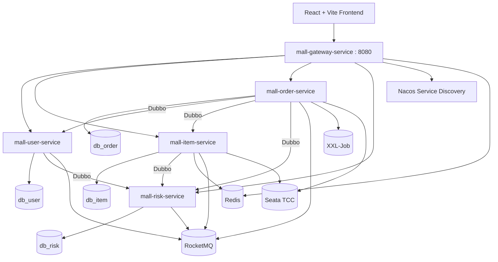

# 悦购商城 · 虚拟资产担保交易平台

> 一个 C2C 虚拟资产交易平台，重点不是“能买买买”，而是把担保交易、资金账本、交付证据、售后仲裁、规则风控和异步补偿这些平台级问题做扎实。

项目当前已落地统一网关、用户、商品、担保订单、Mock 支付、资金账户、交付确认、结算提现、售后仲裁和初步风控能力；Agent 能力已有完整设计，尚未开始实现。

## 项目边界

这是一个学习项目，外部能力全部使用 Mock 或本地可运行方案：

| 真实平台能力 | 本项目实现 |
|---|---|
| 微信 / 支付宝支付 | Mock 支付单、支付页、回调、退款 |
| 银行卡提现 | 提现申请、审核、模拟打款流水 |
| 短信验证码 | 邮箱验证码 + Redis 限流 |
| 资金托管 | 平台内部账户 + 冻结 / 待结算 / 可用余额 |
| KYC | 资料提交 + 后台审核状态 |
| 风控模型 | 规则引擎、风险指标、案件闭环 |
| Agent | 阶段三设计，默认 Mock 模型，可选 OpenAI 兼容接口 |

外部服务可以是假的，但状态机、幂等、一致性、审计和权限必须按真实平台标准实现。

## 核心业务闭环

```text
商家申请与审核
  -> 缴纳保证金
  -> 发布虚拟资产
  -> 商品审核
  -> 买家创建订单
  -> Mock 支付
  -> 资金冻结
  -> 卖家交付
  -> 买家确认 / 自动确认
  -> 手续费计算
  -> 冷却期结算
  -> 卖家提现
  -> 评价与信用沉淀
  -> 售后证据提交
  -> 管理员仲裁
```

关键工程能力：

- 担保订单多维状态机：交易、支付、交付、托管、售后、风控状态分离。
- 资金账本：每笔冻结、结算、退款、提现都有流水和幂等键。
- 交付证据：卡密、交付记录、查看记录、确认记录可追溯。
- 主动与被动关单：XXL-Job 定时扫描支付超时，支付动作前也会二次校验过期时间。
- 自动确认与超时退款：避免买家不确认导致订单永久悬挂。
- 审计日志：支持同步落库与 RocketMQ 异步投递两种模式。
- 对账任务：订单、支付、资金流水差异落表，供后续人工处理。
- 风控闭环：事件采集、指标计算、规则命中、风险决策、案件创建、命令下发、死信补偿。
- 统一接入层：Spring Cloud Gateway 负责路由、JWT 认证、角色粗粒度鉴权、CORS、Redis 令牌桶限流、访问日志和统一错误响应。

## 架构总览



## 技术栈

| 层级 | 技术 |
|---|---|
| 后端语言 | Java 21 |
| 应用框架 | Spring Boot 3.2.5 |
| 微服务体系 | Spring Cloud 2023.0.1、Spring Cloud Alibaba 2023.0.1.0 |
| RPC 与注册中心 | Dubbo 3.2.11、Nacos |
| 统一接入层 | Spring Cloud Gateway、LoadBalancer |
| 分布式事务 | Seata TCC |
| 消息队列 | RocketMQ 5.3.0 |
| 数据访问 | MyBatis Plus 3.5.6、MySQL 8 |
| 缓存 | Redis、Caffeine |
| 任务调度 | XXL-Job 2.4.0 |
| 前端 | React 19、Vite 8 |
| 代码检查 | Maven Test、Oxlint |

## 模块说明

| 模块 | 职责 |
|---|---|
| [mall-api](mall-api) | 跨服务 Dubbo 接口、DTO、JWT 工具、用户上下文、风控公共模型 |
| [mall-gateway-service](mall-gateway-service) | 统一 HTTP 入口、服务路由、JWT 认证、角色粗粒度鉴权、CORS、Redis 限流、访问日志 |
| [mall-user-service](mall-user-service) | 注册登录、邮箱验证码、用户账户、商家审核、保证金、资金流水、提现、积分 |
| [mall-item-service](mall-item-service) | 商品与秒杀、虚拟资产发布、商品审核、卡密库存、资产预留、敏感信息处理 |
| [mall-order-service](mall-order-service) | 担保订单、Mock 支付、交付、确认、结算、评价、售后、仲裁、审计日志、对账 |
| [mall-risk-service](mall-risk-service) | 风险事件、指标、规则引擎、风险决策、关系图谱、风控案件、命令下发与死信 |
| [mall-frontend](mall-frontend) | 首页、秒杀、商品目录、登录注册、担保交易工作台、资金提现、运营审核 |
| [doc](doc) | 业务架构、数据库设计、状态机设计、三阶段路线与实施方案 |

## 服务与端口

| 服务 | HTTP 端口 | Dubbo 端口 |
|---|---:|---:|
| mall-gateway-service | 8080 | - |
| mall-user-service | 8081 | 20881 |
| mall-item-service | 8082 | 20882 |
| mall-order-service | 8083 | - |
| mall-risk-service | 8084 | 20884 |
| mall-frontend | 3000 | - |

## 代表性接口

完整接口设计见 `doc/stage1_virtual_asset_trading_design.md` 和 `doc/stage2_risk_control_design.md`。

| 能力 | 接口 |
|---|---|
| 用户信息 | `GET /api/user/info` |
| 首页概览 | `GET /api/home/overview` |
| 发布资产 | `POST /api/asset/item` |
| 创建担保订单 | `POST /api/trade/orders` |
| 发起 Mock 支付 | `POST /api/payment/{paymentNo}/start` |
| 模拟支付成功 | `POST /api/payment/{paymentNo}/mock-pay` |
| 卖家交付 | `POST /api/trade/orders/{orderNo}/deliver` |
| 买家确认 | `POST /api/trade/orders/{orderNo}/confirm` |
| 查看卡密 | `GET /api/trade/orders/{orderNo}/secrets` |
| 发起售后 | `POST /api/trade/disputes` |
| 仲裁售后 | `POST /api/trade/admin/disputes/{disputeNo}/arbitrate` |
| 申请提现 | `POST /api/withdraw/apply` |
| 风控案件列表 | `GET /api/admin/risk/cases` |

## 三阶段路线

| 阶段 | 状态 | 目标 | 主要交付 |
|---|---|---|---|
| 阶段一：业务闭环 | 已完成 | 跑通可信担保交易主链路 | 商家、商品、订单、Mock 支付、资金托管、交付、结算、提现、售后仲裁 |
| 阶段二：风控体系 | 初步完成 | 让交易链路具备平台级风险处理能力 | 风险事件、指标、规则引擎、决策、关系图谱、案件、命令补偿 |
| 阶段三：Agent 能力 | 设计中 | 让 Agent 成为受控业务能力 | 仲裁助手、风控调查助手、智能客服、RAG、Tool Calling、Trace、评估 |

阶段三的原则是：Agent 只读业务数据、只生成建议和草稿；资金、处罚、仲裁结论仍由业务服务和人工流程确认。规划主线采用 Spring AI Alibaba，业务代码面向 Spring AI 标准抽象，实现前需确认其与 Spring Boot 3.2.5 的版本兼容；AgentScope 2.0 只作为后续可选实验，不进入当前主线。

## 本地运行

### 环境要求

- JDK 21
- Maven 3.8+
- Node.js 20+
- MySQL 8
- Redis
- Nacos 2.x
- RocketMQ 5.x
- Seata Server
- XXL-Job Admin

### 1. 初始化数据库

先执行基础库，再执行阶段增量脚本：

```bash
mysql -u <username> -p < db.sql
mysql -u <username> -p < doc/stage1_schema.sql
mysql -u <username> -p < doc/stage2_schema.sql
```

### 2. 配置基础设施

修改各服务的 `src/main/resources/application.yml`，将 MySQL、Redis、Nacos、RocketMQ、Seata、XXL-Job、邮箱服务地址替换为自己的本地环境。

网关支持通过环境变量覆盖关键配置：

| 环境变量 | 说明 |
|---|---|
| `NACOS_SERVER_ADDR` | Nacos 地址 |
| `REDIS_HOST` / `REDIS_PORT` / `REDIS_PASSWORD` | Redis 地址与密码 |
| `JWT_SECRET` | JWT 密钥，必须与用户服务一致 |
| `FRONTEND_ORIGIN` | 允许的前端来源，默认 `http://localhost:3000` |

不要把真实 IP、账号、密码和模型密钥提交到公开仓库。生产化配置应通过环境变量、启动参数或配置中心注入。

如 RocketMQ 未开启 Topic 自动创建，需要提前创建：

- `seckill-order-topic`
- `order-paid-topic`
- `audit-log-topic`
- `risk-command-topic`

### 3. 配置 XXL-Job

在 XXL-Job Admin 中注册执行器 `mall-order-executor`，并创建以下任务：

| JobHandler | 说明 |
|---|---|
| `tradeCloseExpiredPaymentJob` | 主动关闭支付超时订单 |
| `tradeDeliveryTimeoutJob` | 处理交付超时订单 |
| `tradeAutoConfirmJob` | 自动确认已交付订单 |
| `tradeSettlementJob` | 结算冷却期结束订单 |
| `tradeFundReconciliationJob` | 订单与资金流水对账 |

### 4. 构建后端

```bash
mvn clean package -DskipTests
```

### 5. 启动后端服务

网关模块已声明 `spring-boot-maven-plugin`，可直接打包运行。业务服务模块暂未声明该插件，因此启动时使用完整插件坐标。先构建项目：

```bash
mvn clean package -DskipTests
```

启动网关：

```bash
java -jar mall-gateway-service/target/mall-gateway-service-0.0.1-SNAPSHOT.jar
```

再在不同终端启动业务服务：

```bash
cd mall-user-service
mvn org.springframework.boot:spring-boot-maven-plugin:3.2.5:run
```

```bash
cd mall-item-service
mvn org.springframework.boot:spring-boot-maven-plugin:3.2.5:run
```

```bash
cd mall-order-service
mvn org.springframework.boot:spring-boot-maven-plugin:3.2.5:run
```

```bash
cd mall-risk-service
mvn org.springframework.boot:spring-boot-maven-plugin:3.2.5:run
```

生产部署时，`mall-user-service`、`mall-item-service`、`mall-order-service`、`mall-risk-service` 不应对公网暴露，外部请求统一进入网关。

### 6. 启动前端

```bash
cd mall-frontend
npm install
npm run dev
```

访问 `http://localhost:3000`。Vite 开发服务器默认将 `/api/**` 代理到 `http://localhost:8080`，如需修改，可设置 `VITE_GATEWAY_URL`。

## 验证

后端单元测试：

```bash
mvn test
```

前端检查与构建：

```bash
cd mall-frontend
npm run lint
npm run build
```

## 文档索引

- [三阶段演进规划](doc/virtual_asset_market_three_phase_roadmap.md)
- [Spring Cloud Gateway 接入层设计](doc/spring_cloud_gateway_design.md)
- [阶段一：担保交易闭环设计](doc/stage1_virtual_asset_trading_design.md)
- [阶段二：风控与反黑产设计](doc/stage2_risk_control_design.md)
- [阶段三：Agent 能力设计](doc/stage3_agent_development_design.md)
- [企业级认证与用户上下文设计](doc/enterprise_auth_and_user_context_design.md)
- [React 前端工程化设计](doc/react_frontend_architecture_design.md)
- [秒杀与积分系统设计](doc/seckill_mall_points_system_design.md)

## 免责声明

本项目用于学习后端架构、交易系统、风控体系和 Agent 工程实践，不接入真实支付渠道、真实银行提现和真实 KYC，不能直接作为生产交易系统使用。
