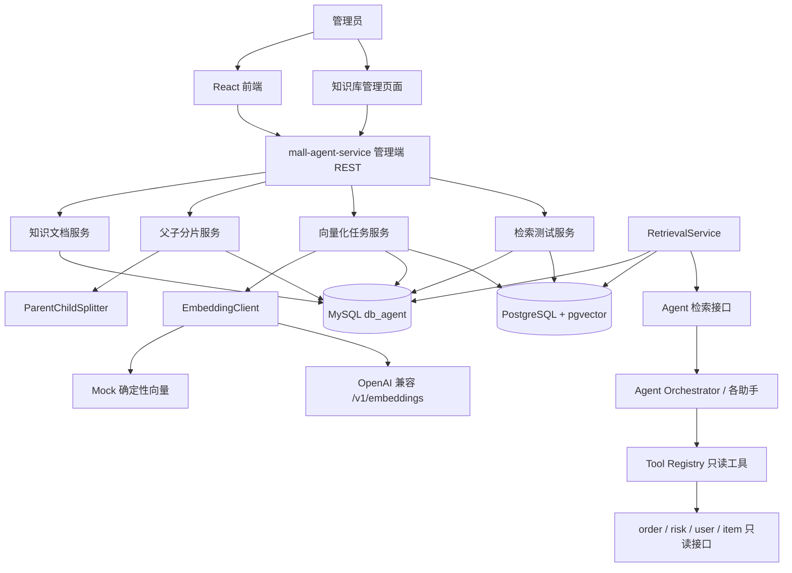
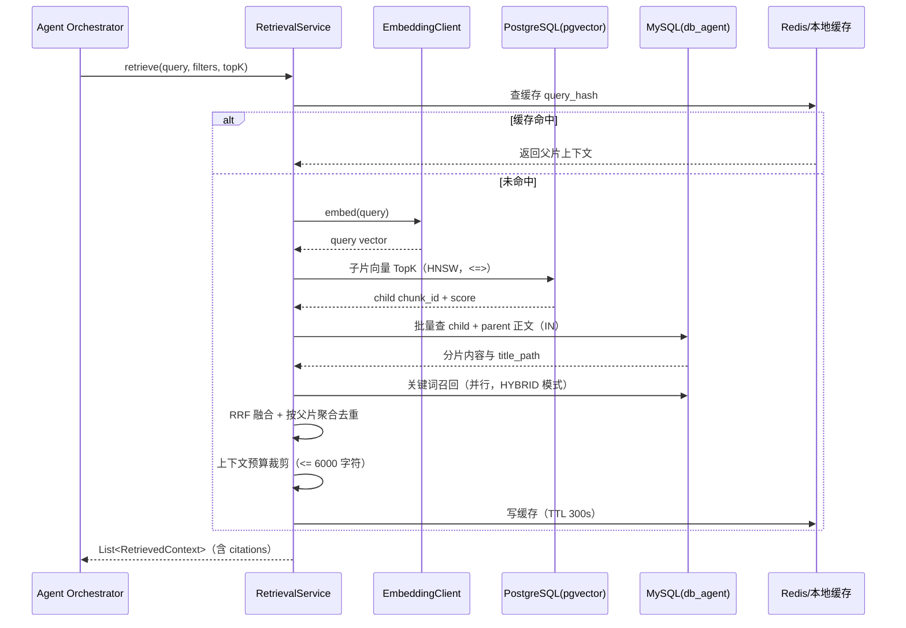
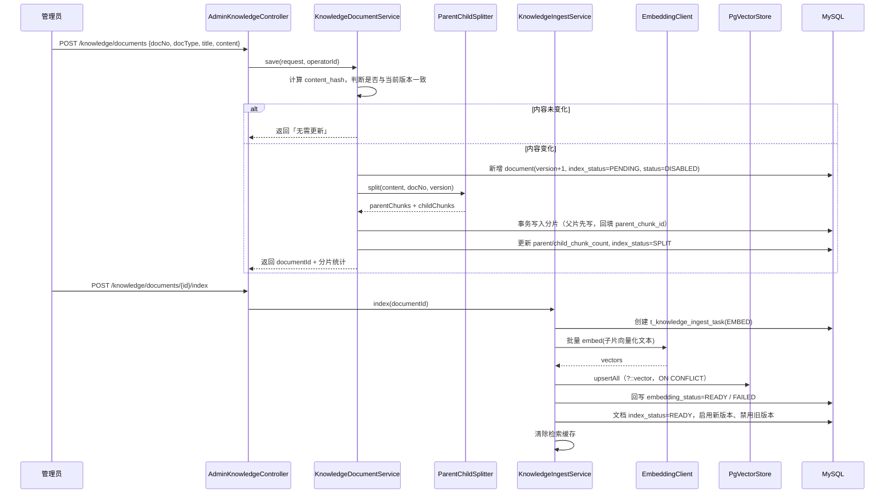

# 虚拟资产商城阶段三 RAG 知识库开发设计与实施方案

> 文档状态：设计稿；**后端与前端增量 v1.3 已实现**（`mall-agent-service` + `mall-frontend` 知识库管理页，见第 17 章实现记录），混合检索与检索日志待实现。
> 前置条件：阶段三 `stage3_agent_development_design.md` 已评审；阶段一担保交易闭环、阶段二规则风控与案件闭环已完成。
> 本文档定位：`stage3_agent_development_design.md` 第 6 章「知识库 RAG 设计」的**增量落地设计**，把「本地向量 / 关键词检索二选一」升级为 **MySQL 元数据 + PostgreSQL(pgvector) 向量检索 + 父子分片（small-to-big）**，并补齐**管理端知识库页面**。
> 与阶段三文档冲突时，以本文档为准；未覆盖部分继续遵循阶段三文档。

---

## 0. 变更摘要（相对阶段三原设计）

| 项 | 阶段三原设计 | 本方案 | 理由 |
|---|---|---|---|
| 检索 | 关键词为主，本地向量可选 | 关键词 + pgvector 向量 + 混合检索（RRF） | 用户要求引入 pgvector，且需要真实向量召回能力 |
| 向量存储 | `t_knowledge_chunk.embedding_json` | PostgreSQL + pgvector 独立表 `rag_chunk_embedding` | 向量交给专用库，MySQL 只保留元数据，避免大 JSON 拖慢主库 |
| 分片 | 单层 300–600 字符 | **父子两层**：父片按小节、子片按段落 | 子片命中更准、父片上下文更全（small-to-big） |
| 管理页面 | 只有 `/knowledge/documents` 接口，无页面 | 新增**知识库管理页面**（文档 CRUD + 分片预览 + 重建索引 + 检索测试 + 任务监控） | 管理员需要可视化治理 RAG 语料 |
| 语料来源 | 仅平台规则类 | 平台规则类 + **`doc/data/RAG` 18 篇商品文档** | 复用已有初始语料，形成完整知识库 |
| 运行模式 | `KEYWORD` / `VECTOR` / `HYBRID` | 增加 `DEGRADED`（pgvector 不可用时自动回落关键词） | 保持「业务系统优先」原则 |

**保持不变的红线**：Agent 仍然只读业务数据、不直连业务库、不执行资金与处罚动作、回答必须带引用。

---

## 1. 目标与范围

### 1.1 目标

1. **可治理**：管理员能在后台完成知识文档的增删改查、版本管理、启停与删除。
2. **可解释**：每份文档能查看切片结果（父片 / 子片层级与内容），回答能引用到「文档 → 小节 → 版本」。
3. **可召回**：基于 pgvector 的向量检索 + 关键词检索混合，支持按 `doc_type`、状态、版本过滤。
4. **可降级**：pgvector 或 Embedding 服务不可用时，自动回落到关键词检索，Agent 主链路不中断。
5. **可落地**：本地无向量库时仍可用 Mock Embedding 跑通全流程，便于开发与演示。

### 1.2 设计原则

1. **MySQL 是元数据与权威源**：文档、分片、任务、审计全部落在 `db_agent`，pgvector 只负责「相似度计算」。
2. **父子分片，子检索父返回**：向量只对子片生成，检索命中子片后回溯父片，减少语义割裂。
3. **版本不可变**：文档更新生成新版本，旧版本保留，检索只使用最新 `ENABLED` 版本。
4. **先切片、再向量化、可重放**：切片是纯函数（同输入同输出），向量化是异步任务，可重跑。
5. **幂等**：`chunk_hash` 唯一约束 + `ON CONFLICT` upsert，重复导入不产生脏数据。
6. **权限最小化**：管理页面仅 `ADMIN` 可访问；Embedding、pgvector 只由 `mall-agent-service` 访问。
7. **不过度设计**：不引入向量数据库集群、不引入 ES、不做在线学习与自动扩写。

### 1.3 本方案不做

| 不做项 | 原因 |
|---|---|
| 引入 Elasticsearch / Milvus / Qdrant | 知识库规模为千级分片，pgvector + MySQL ngram 足够；检索已抽象 `KeywordRetriever` 接口，量级或分词需求上来后再接（见 6.4.1） |
| 多模态向量（图片、音频） | 阶段三语料均为文本 |
| 自动知识抽取 / 网页爬虫 | 语料必须经过管理员审核后入库 |
| 在线学习、自动调参 | 只提供固定评估集与人工复核 |
| 历史订单、风控事件自动灌库 | 涉及隐私，且错误结论被二次检索风险高 |
| Agent 直接读写知识库 | 知识库管理只走管理端 REST，Agent 只读检索接口 |

---

## 2. 总体架构

### 2.1 组件拓扑



### 2.2 存储职责划分

| 存储 | 内容 | 权威性 | 说明 |
|---|---|---|---|
| MySQL `db_agent` | `t_knowledge_document`、`t_knowledge_chunk`、`t_knowledge_ingest_task`、`t_knowledge_retrieval_log` | **权威源** | 文档内容、父子分片正文、版本、状态、审计 |
| PostgreSQL `pgvector` | `rag_chunk_embedding`（`chunk_id` + `embedding vector(1536)` + 过滤列） | 派生数据 | 可随时由 MySQL 重建，不存正文 |
| Redis | 检索结果缓存、热点文档缓存 | 缓存 | 复用现有实例，键前缀 `rag:` |
| 本地内存 | 关键词倒排、文档热缓存 | 缓存 | 与阶段三一致，`Caffeine` |

**关键约束**：pgvector 中不存在业务真相。只要 MySQL 文档与分片还在，就可以 `reindex` 重建全部向量。

### 2.3 运行模式

| 模式 | 触发条件 | 检索行为 |
|---|---|---|
| `KEYWORD` | 默认 / 未配置 Embedding | 关键词加权，MySQL 检索 |
| `VECTOR` | Embedding 与 pgvector 均可用 | 子片向量 TopK → 父片回溯 |
| `HYBRID` | 关键词与向量均可用（**推荐**） | 双路召回 + RRF 融合重排 |
| `DEGRADED` | pgvector 或 Embedding 异常 | 自动回落 `KEYWORD`，`t_agent_run.retrieval_mode` 记录实际模式 |

配置：

```yaml
rag:
  retrieval:
    default-mode: HYBRID
    fallback-enabled: true
    child-top-k: 20
    parent-top-n: 5
    rrf-k: 60
    max-context-chars: 6000
```

### 2.4 技术选型

| 能力 | 选型 | 说明 |
|---|---|---|
| 向量库 | PostgreSQL 15/16 + pgvector 0.5.0 | 已有容器实例，无需新增中间件 |
| 向量索引 | HNSW（`vector_cosine_ops`） | pgvector 0.5.0 已支持 HNSW，召回与延迟优于 ivfflat |
| 距离度量 | 余弦距离 `<=>` | Embedding 已归一化时等价于点积；分数 = `1 - distance` |
| Embedding | OpenAI 兼容 `/v1/embeddings`，默认 `text-embedding-3-small`（1536 维） | 可用 Mock 替代 |
| 分片 | 自研 `ParentChildSplitter`，Markdown 感知 | 不引入 LangChain 分片器 |
| 融合 | RRF（Reciprocal Rank Fusion） | 无需调权重，鲁棒 |
| 元数据 ORM | MyBatis-Plus（MySQL） | 与现有服务一致 |
| 向量访问 | `JdbcTemplate`（PostgreSQL） | 避免 MyBatis-Plus 方言与分页插件冲突 |

---

## 3. pgvector 基础设施与连接配置

### 3.1 实例信息（已就绪）

| 项 | 值 | 备注 |
|---|---|---|
| 容器 ID | `0444598a7276` | 现有运行实例 |
| 镜像 | `registry.cn-hangzhou.aliyuncs.com/xfg-studio/pgvector:v0.5.0` | 内置 `vector` 扩展 |
| 宿主机 IP | `100.121.74.115` | 与 Nacos / Redis / MySQL 同机 |
| 端口 | `5432`（`0.0.0.0:5432->5432/tcp`） | 已对外映射 |
| 用户名 | `root` | 超级用户，可 `CREATE EXTENSION` |
| 密码 | `root` | 仅内网使用，生产必须改密 |
| 默认数据库 | `postgres` | 未声明 `POSTGRES_DB` 时使用 |
| 建议专用库 | `db_rag` | 与业务库隔离，可选 |
| 扩展版本 | `vector 0.5.0` | 支持 HNSW 索引 |
| 向量维度上限（HNSW 索引） | 2000 | 1536 维满足；3072 维不可建 HNSW |

### 3.2 初始化脚本

```sql
-- 1) 可选：创建专用库（也直接使用 postgres 库）
CREATE DATABASE db_rag ENCODING 'UTF8';

-- 2) 连接目标库后启用扩展（root 为超级用户，可执行）
CREATE EXTENSION IF NOT EXISTS vector;

-- 3) 校验扩展
SELECT extname, extversion FROM pg_extension WHERE extname = 'vector';

-- 4) 校验向量语法与距离算子
SELECT '[1,2,3]'::vector <=> '[1,2,4]'::vector AS cosine_distance;
```

容器内执行方式：

```bash
docker exec -it 0444598a7276 psql -U root -d postgres -c "CREATE EXTENSION IF NOT EXISTS vector;"
docker exec -it 0444598a7276 psql -U root -d postgres -c "SELECT extversion FROM pg_extension WHERE extname='vector';"
docker exec -it 0444598a7276 psql -U root -d postgres -c "SELECT '[1,2,3]'::vector <=> '[1,2,4]'::vector;"
```

**验收判据**：第 3 条返回 `0.5.0`，第 4 条返回约 `0.00853`（距离），即扩展可用。

### 3.3 应用侧配置（双数据源）

`mall-agent-service/src/main/resources/application.yml`：

```yaml
server:
  port: 8085

spring:
  application:
    name: mall-agent-service
  # 主数据源：MySQL db_agent（MyBatis-Plus 使用）
  datasource:
    driver-class-name: com.mysql.cj.jdbc.Driver
    url: jdbc:mysql://100.121.74.115:3306/db_agent?useUnicode=true&characterEncoding=utf-8&useSSL=false&serverTimezone=Asia/Shanghai
    username: root
    password: root
    hikari:
      maximum-pool-size: 20
      minimum-idle: 5

rag:
  pgvector:
    datasource:
      driver-class-name: org.postgresql.Driver
      jdbc-url: jdbc:postgresql://100.121.74.115:5432/postgres?ApplicationName=mall-agent-rag&connectTimeout=3&socketTimeout=10
      username: root
      password: ${PGVECTOR_PASSWORD:root}
      maximum-pool-size: 8
      minimum-idle: 2
      connection-timeout: 3000
      validation-timeout: 2000
    embedding-dim: 1536
    index:
      hnsw-m: 16
      hnsw-ef-construction: 64
      search-ef: 100
  embedding:
    provider: MOCK            # MOCK | OPENAI_COMPATIBLE
    model: text-embedding-3-small
    dim: 1536
    batch-size: 32
    timeout-ms: 8000
    base-url: ${AGENT_EMBEDDING_BASE_URL:}
    api-key: ${AGENT_EMBEDDING_API_KEY:}
```

要点：

1. `rag.pgvector.datasource` 使用 `jdbc-url`（Hikari 的 `JdbcTemplate` 场景），与 `spring.datasource.url` 区分，避免绑定混乱。
2. PG 连接池刻意小于 MySQL：向量检索是短查询，且不是主链路。
3. `connectTimeout=3` 保证 pgvector 不可用时快速失败并触发降级，而不是拖垮请求。

### 3.4 数据源配置类

```java
@Configuration
public class AgentDataSourceConfig {

    /** 主数据源：MySQL，MyBatis-Plus 与事务使用 */
    @Bean
    @Primary
    @ConfigurationProperties("spring.datasource.hikari")
    public DataSource primaryDataSource(DataSourceProperties properties) {
        return properties.initializeDataSourceBuilder().build();
    }

    /** 向量库数据源：PostgreSQL + pgvector */
    @Bean("vectorDataSource")
    @ConfigurationProperties("rag.pgvector.datasource")
    public DataSource vectorDataSource() {
        return DataSourceBuilder.create().type(HikariDataSource.class).build();
    }

    @Bean("vectorJdbcTemplate")
    public JdbcTemplate vectorJdbcTemplate(@Qualifier("vectorDataSource") DataSource dataSource) {
        JdbcTemplate template = new JdbcTemplate(dataSource);
        template.setQueryTimeout(3);
        template.setMaxRows(1000);
        return template;
    }
}
```

> 注意：一旦显式声明了第二个 `DataSource`，Spring Boot 的 `DataSourceAutoConfiguration` 会退让，必须像上面一样显式声明 `@Primary` 的 MySQL 数据源，否则 MyBatis-Plus 会因多数据源无法注入。

### 3.5 Maven 依赖（`mall-agent-service/pom.xml` 增量）

```xml
<dependency>
    <groupId>org.springframework.boot</groupId>
    <artifactId>spring-boot-starter-jdbc</artifactId>
</dependency>
<dependency>
    <groupId>org.postgresql</groupId>
    <artifactId>postgresql</artifactId>
    <scope>runtime</scope>
</dependency>
```

版本由父工程 `spring-boot-dependencies:3.2.5` 统一管理（PostgreSQL 驱动 42.6.x），无需单独指定。

### 3.6 连通性自检（服务启动时）

```java
@Component
@RequiredArgsConstructor
public class PgVectorHealthChecker implements ApplicationRunner {

    private final @Qualifier("vectorJdbcTemplate") JdbcTemplate vectorJdbcTemplate;
    private final RagProperties ragProperties;

    @Override
    public void run(ApplicationArguments args) {
        try {
            String version = vectorJdbcTemplate.queryForObject(
                    "SELECT extversion FROM pg_extension WHERE extname = 'vector'", String.class);
            log.info("[RAG] pgvector 就绪, 扩展版本={}, 向量维度={}", version, ragProperties.getEmbeddingDim());
            RagHealthState.markVectorAvailable(true);
        } catch (Exception e) {
            log.error("[RAG] pgvector 不可用，检索将降级为 KEYWORD 模式", e);
            RagHealthState.markVectorAvailable(false);
        }
    }
}
```

**失败处理**：自检失败不阻止服务启动，只把全局检索模式降级为 `KEYWORD`，并在 `/actuator/health` 中增加 `ragVector` 指标。

---

## 4. 父子分片策略

### 4.1 为什么用父子分片

| 方案 | 问题 |
|---|---|
| 整篇文档作为一个片段 | 片段过长，向量语义被稀释，命中不精确；上下文超预算 |
| 只做小片段（300–600 字） | 命中精确，但切断了标题层级与上下文，模型容易误读 |
| **父子分片（small-to-big）** | **子片负责「精准命中」，父片负责「完整上下文」**，命中子片后返回其父片 |

检索过程形成「**用小片段找，用大片段答**」的链路：子片向量召回 → 按父片聚合去重 → 取父片正文拼装上下文 → 引用标注到父片的小节标题。

### 4.2 分片层级定义

| 层级 | 名称 | 切分依据 | 目标长度 | 是否向量化 | 是否返回给模型 |
|---|---|---|---|---|---|
| L0 | 文档 | 一篇知识文档 | 不限 | 否 | 否（仅元数据） |
| L1 | 父片 | Markdown `##` 小节（超长再拆） | 600–1600 字符 | 默认否（可开关） | **是，作为上下文主体** |
| L2 | 子片 | 父片内段落 / 句子 | 200–450 字符 | **是** | 否（仅用于召回与打分） |

### 4.3 切分算法

```text
输入：文档正文（Markdown）、doc_no、version
1. 预处理：剥离 YAML front-matter（单独存元数据）、统一换行、去除行尾空白
2. 一级切分：按标题层级切父片
   - 命中 "# " 或 "## " → 开启新父片，title_path = 父标题 [/ 子标题]
   - 代码块（```）、表格（连续以 | 开头的行）视为不可分割原子块
3. 父片规整：
   - 长度 > 1600 → 先按 "### " 再切，仍超长则按空行段落聚合切分
   - 长度 < 400 且存在相邻同层级父片 → 与相邻父片合并（最多合并 3 个）
4. 二级切分：对每个父片切子片
   - 优先按空行段落聚合，累计到 >= 200 字符开始候选
   - 超过 450 字符时按中文句末标点（。！？；）与英文 ". " 二次切分
   - 相邻子片保留 overlap：取上一子片尾部 60 字符作为下一子片前缀
   - 单个父片子片数 > 8 → 提高子片目标长度至 400，避免碎片化
5. 过滤：纯空白、纯符号、"见上文"等无信息子片直接丢弃
6. 记录：每个分片写入 char_start / char_end / chunk_index / title_path
```

**表格与列表的特殊规则**：Markdown 表格整体作为一个不可切分子片；无序列表按「每 5 条或 300 字符」聚合为一个子片，不逐条切。

### 4.4 参数与约束

| 参数 | 默认值 | 可配置 | 说明 |
|---|---|---|---|
| `rag.chunk.parent.target-chars` | 1000 | 是 | 父片目标长度 |
| `rag.chunk.parent.max-chars` | 1600 | 是 | 超过则二次切分 |
| `rag.chunk.parent.min-chars` | 400 | 是 | 低于则尝试与相邻父片合并 |
| `rag.chunk.child.target-chars` | 320 | 是 | 子片目标长度 |
| `rag.chunk.child.max-chars` | 450 | 是 | 硬上限 |
| `rag.chunk.child.min-chars` | 80 | 是 | 低于则并入上一子片 |
| `rag.chunk.child.overlap-chars` | 60 | 是 | 子片重叠，保持语义连续 |
| `rag.chunk.child.max-per-parent` | 8 | 是 | 超过则放宽子片长度 |
| `rag.chunk.atomic-block` | `code,table` | 是 | 不可切分块类型 |

**硬性约束**：

1. 子片不得跨父片（`parent_chunk_id` 必须指向同一文档同一版本的 L1 分片）。
2. 父片不得跨文档、不得跨版本。
3. 切片是纯函数：`split(content, doc_no, version, params)` 必须可重放，同输入输出完全一致（否则会污染 `chunk_hash` 幂等）。
4. 切片参数变更视为**切片算法版本变更**，必须写入 `t_knowledge_document.splitter_version`，并在变更后触发全量重建。

### 4.5 编号与哈希规则

| 字段 | 规则 | 示例 |
|---|---|---|
| `chunk_no`（L1） | `{doc_no}-v{version}-P{3 位序号}` | `PROD-001-v1-P003` |
| `chunk_no`（L2） | `{doc_no}-v{version}-P{3 位序号}-C{2 位序号}` | `PROD-001-v1-P003-C02` |
| `chunk_hash` | `sha256(doc_no\|version\|level\|title_path\|content)` 十六进制 64 位 | `9f2c...` |
| `content_hash`（文档级） | `sha256(归一化正文)`，用于判断是否需要重新切片 | `3ab1...` |
| `embedding_input_hash` | `sha256(embedding_model\|embedding_text)`，用于判断是否复用已有向量 | `77de...` |

`chunk_hash` 唯一约束保证「同一文档同一版本同一内容」不会重复入库；文档内容变化必然产生新 hash，从而触发新版本而非原地覆盖。

### 4.6 分片示例（以 `PROD-001` 为例）

```text
L0  t_knowledge_document   doc_no=PROD-001, version=1, doc_type=PRODUCT
 │
 ├─ L1  PROD-001-v1-P001  title_path=AK-47 | 红线 · 商品介绍/3. 基础信息         (约 620 字)
 │    ├─ L2  PROD-001-v1-P001-C01  "商品名称 | AK-47 | 红线；所属游戏 | CS2 …"  (约 240 字)  → 向量
 │    └─ L2  PROD-001-v1-P001-C02  "外观系列 | 红线；稀有度 | 保密级 …"          (约 210 字)  → 向量
 │
 ├─ L1  PROD-001-v1-P002  title_path=…/7. 价格与费用                            (约 380 字)
 │    └─ L2  PROD-001-v1-P002-C01  "商品标价 1288.00；平台服务费按 2% 计收 …"    (约 300 字)  → 向量
 │
 └─ L1  PROD-001-v1-P003  title_path=…/9. 风险提示                              (约 520 字)
      └─ L2  PROD-001-v1-P003-C01  "虚拟资产不支持七天无理由退货 …"              (约 260 字)  → 向量
```

用户提问「AK-47 红线的平台服务费怎么算」时：

- 向量命中 `PROD-001-v1-P002-C01`（含「平台服务费按 2%」）；
- 系统回溯返回**父片** `PROD-001-v1-P002`（包含完整费用表格与说明）；
- 引用输出 `doc_no=PROD-001, section="7. 价格与费用", version=v1`。

### 4.7 边界与异常处理

| 场景 | 处理 |
|---|---|
| 文档为空或仅 front-matter | 拒绝入库，返回 `RAG_DOC_EMPTY` |
| 单段落超过 `max-chars` | 按句末标点硬切，仍超长则按字符硬切并标记 `split_forced=true` |
| 文档只有一级标题、无小节 | 整个文档视为一个父片，再按段落切子片 |
| 表格行超过 450 字符 | 表格原子块豁免长度限制，整体作为一个子片 |
| 代码块含 ``` 嵌套 | 以首次出现的 ``` 配对，未闭合则丢弃该块并告警 |
| 子片数量为 0 | 入库成功但 `embedding_status=SKIPPED`，并在管理页面标黄提示 |

---

## 5. 向量化设计

### 5.1 Embedding 提供方与维度

| Provider | 模型 | 维度 | 用途 | 说明 |
|---|---|---|---|---|
| `MOCK` | `mock-hash-v1` | 1536 | 默认、单测、本地演示 | 确定性哈希向量，无需外网 |
| `OPENAI_COMPATIBLE` | `text-embedding-3-small` | 1536 | 真实语义召回 | 兼容 `/v1/embeddings` |
| `OPENAI_COMPATIBLE` | `text-embedding-3-large` | 3072 | 高精度（**不可建 HNSW**） | 需改用 ivfflat 或截断维度 |
| `OPENAI_COMPATIBLE` | `bge-m3`（自建） | 1024 | 私有化部署 | 需调整 `embedding_dim` 并重建 |

配置约束：

1. `rag.embedding.dim` 与 `rag.pgvector.embedding-dim` **必须一致**，且必须等于 `rag_chunk_embedding.embedding` 的列维度，否则 `INSERT` 直接报错 `expected 1536 dimensions, not 1024`。
2. 列维度在 DDL 中固定，**不支持同一列混合维度**。更换模型 = 全量重建。
3. 维度 > 2000 时无法创建 HNSW 索引（pgvector 0.5.0 限制），须使用 `ivfflat` 或降维。
4. 每个向量记录 `embedding_model` 与 `embedding_dim`，检索时若不匹配则跳过该记录并告警。

### 5.2 Embedding 输入文本拼装

子片正文往往缺少标题语境（例如「商品标价 1288.00」不知道是哪件商品），因此向量化文本必须**带上标题路径**：

```text
【{docTypeLabel}】{title_path}
{child_chunk_content}
```

示例：

```text
【商品介绍】AK-47 | 红线 · 商品介绍/7. 价格与费用
商品标价 1288.00 元，平台服务费按订单金额的 2% 计收（最低 0.01 元），在结算冷却期结束后从托管资金中扣除。
```

规则：

1. `docTypeLabel` 由 `doc_type` 映射（`PRODUCT→商品介绍`、`RULE→平台规则`、`POLICY→平台政策`、`AFTER_SALE→售后规则`、`RISK→风控规则`、`FAQ→常见问题`）。
2. **只对子片生成向量**；父片默认不向量化（可通过 `rag.chunk.parent.embed-enabled=true` 开启，用于长查询兜底）。
3. 拼装文本长度上限 8000 字符，超长截断并记录 `embedding_truncated=true`。
4. 向量化文本不包含任何用户数据、订单号、卡密等敏感信息。

### 5.3 Mock 确定性向量

Mock 向量必须**确定性**（同文本必得同向量），否则单测与幂等校验无法通过：

```java
// 伪代码：token 哈希散列到固定维度，再 L2 归一化
float[] mockEmbedding(String text, int dim) {
    float[] v = new float[dim];
    for (String token : tokenize(text)) {          // 中文按 2-gram，英文按空白切分
        int h = Hashing.murmur3_32().hashString(token, UTF_8).asInt();
        v[Math.floorMod(h, dim)] += 1.0f;          // 词频累加
        v[Math.floorMod(h / dim, dim)] += 0.5f;    // 二次散列，降低碰撞
    }
    return l2Normalize(v);
}
```

特点与限制：

1. 相同文本 → 相同向量；相似文本 → 有一定相似度（字符 2-gram 重合度越高越接近），足以支撑流程验证。
2. **不具备真实语义泛化能力**，不能用于效果评估结论；评估集必须使用 `OPENAI_COMPATIBLE` 跑一遍。
3. 必须在文档中明确标注：Mock 模式下召回质量仅代表「链路通不通」，不代表「答得准不准」。

### 5.4 向量写入 pgvector

关键点：JDBC 传入的 `String` 无法被 PostgreSQL 推断为 `vector` 类型，**必须显式加 `::vector` 转换**。

```sql
INSERT INTO rag_chunk_embedding
    (chunk_id, document_id, doc_no, doc_version, doc_type, chunk_no,
     embedding, embedding_model, embedding_dim, embedding_input_hash, status, updated_time)
VALUES
    (?, ?, ?, ?, ?, ?, ?::vector, ?, ?, ?, 'READY', now())
ON CONFLICT (chunk_id) DO UPDATE SET
    embedding            = EXCLUDED.embedding,
    embedding_model      = EXCLUDED.embedding_model,
    embedding_dim        = EXCLUDED.embedding_dim,
    embedding_input_hash = EXCLUDED.embedding_input_hash,
    doc_version          = EXCLUDED.doc_version,
    status               = EXCLUDED.status,
    updated_time         = now();
```

向量字面量格式为 `[0.001,-0.013,...]`，由 `VectorFormat.toLiteral(float[])` 生成（`StringBuilder` + `Float.toString`，不用 `Arrays.toString`，避免多余空格）。

**幂等**：

1. 写入前比对 `embedding_input_hash`，一致则跳过（`SKIPPED_UNCHANGED`），避免重复消耗额度。
2. 主键为 `chunk_id`，`ON CONFLICT` 保证重放安全。
3. 文档版本升级后，`chunk_id` 会变化（新版本新分片），旧版本的向量由版本清理任务删除。

### 5.5 批量与并发

| 参数 | 默认值 | 说明 |
|---|---|---|
| `rag.embedding.batch-size` | 32 | 单次调用 `/v1/embeddings` 的文本条数 |
| `rag.embedding.concurrency` | 2 | 并发批次数，避免打爆模型服务 |
| `rag.ingest.batch-insert-size` | 100 | 单批 PG 写入条数 |
| `rag.ingest.max-retry` | 3 | 单条失败重试次数，退避 500ms / 2s / 8s |
| `rag.ingest.task-timeout-seconds` | 600 | 单文档任务超时，超时置 `FAILED` 可重跑 |

失败处理：单条 Embedding 失败不阻塞整篇文档，任务结束后汇总 `failed_chunks`，管理页面可对失败分片单独重试（`POST /knowledge/chunks/{id}/re-embed`）。

### 5.6 模型或维度变更流程

```text
1. 管理员确认新模型与维度
2. 更新 rag.embedding.model / dim 与 rag.pgvector.embedding-dim
3. 执行 ALTER TABLE rag_chunk_embedding ALTER COLUMN embedding TYPE vector(NEW_DIM)
   （表内已有数据无法直接转换 → 必须先 TRUNCATE 或建新列）
4. 触发全量重建：POST /api/admin/agent/knowledge/reindex { "mode": "FULL" }
5. 重建完成后重建 HNSW 索引
```

**推荐做法**：新建 `rag_chunk_embedding_v2` 表 → 全量重建 → 校验通过后 `RENAME` 切换，避免长时间停检索。

---

## 6. 检索设计

### 6.1 检索链路



### 6.2 子片向量召回 SQL

```sql
BEGIN;
SET LOCAL hnsw.ef_search = 100;   -- 与 rag.pgvector.index.search-ef 一致
SELECT
    e.chunk_id,
    e.doc_no,
    e.doc_version,
    e.doc_type,
    1 - (e.embedding <=> ?::vector) AS score
FROM rag_chunk_embedding e
WHERE e.status = 'READY'
  AND e.embedding_model = ?
  AND e.embedding_dim = ?
  AND (?::text[] IS NULL OR e.doc_type = ANY (?::text[]))
  AND (?::text[] IS NULL OR e.doc_no = ANY (?::text[]))
ORDER BY e.embedding <=> ?::vector
LIMIT ?;
COMMIT;
```

要点：

1. `ORDER BY` 必须与索引 `vector_cosine_ops` 的算子一致（`<=>`），否则走全表扫描。
2. `WHERE` 中的过滤条件越简单越好；`doc_type` / `status` 用 B-tree 索引，可在 HNSW 前做前置过滤。
3. `SET LOCAL` 只在事务内生效，不影响其他连接；`ef_search` 越大召回越高、延迟越大（100 是 20 条 TopK 的合理值）。
4. **不要**在 `WHERE` 里对 `embedding` 做函数运算，会破坏索引可用性。

### 6.3 父片回溯与聚合

```sql
-- 第一步：pgvector 得到候选 child chunk_id（假设 20 条）
-- 第二步：MySQL 批量加载子片与其父片
SELECT c.id            AS child_id,
       c.chunk_no      AS child_chunk_no,
       c.parent_chunk_id,
       c.title_path,
       p.chunk_no      AS parent_chunk_no,
       p.chunk_content AS parent_content,
       p.char_count    AS parent_char_count,
       d.doc_no, d.title AS doc_title, d.doc_type, d.version
FROM t_knowledge_chunk c
JOIN t_knowledge_chunk p ON p.id = c.parent_chunk_id
JOIN t_knowledge_document d ON d.id = c.document_id
WHERE c.id IN (:childIds)
  AND c.status = 'ENABLED'
  AND p.status = 'ENABLED'
  AND d.status = 'ENABLED';
```

聚合规则：

1. **同一父片被多个子片命中 → 合并为一个上下文，取最高子片分数为该父片分数**，其余子片分数作为 `matchedChildren` 一并返回（便于解释与调试）。
2. 父片按分数降序排序，取 `parent-top-n`（默认 5）。
3. 若两个命中父片来自同一文档且相邻，可选合并为一段（`rag.retrieval.merge-adjacent-parents=true`）。
4. 父片内容去重后写入 `t_agent_run.knowledge_chunk_ids_json`（记录父片与子片编号）。

### 6.4 关键词召回（MySQL）

`KEYWORD` 模式与 `HYBRID` 的第二路召回都使用关键词检索：

```sql
SELECT c.id,
       c.parent_chunk_id,
       MATCH(c.chunk_content) AGAINST (? IN NATURAL LANGUAGE MODE) AS score
FROM t_knowledge_chunk c
JOIN t_knowledge_document d ON d.id = c.document_id
WHERE c.chunk_level = 2 AND c.status = 'ENABLED' AND d.status = 'ENABLED'
ORDER BY score DESC
LIMIT ?;
```

说明：

1. MySQL 需对 `t_knowledge_chunk.chunk_content` 建 `FULLTEXT ... WITH PARSER ngram` 才能较好支持中文分词（MySQL 8.0 自带 ngram）。
2. **降级保障**：若 ngram 不可用，使用 `keywords_json` + `LIKE` 的加权打分（标题命中 ×5、标签命中 ×3、正文命中 ×1），保证功能可用，只是精度下降。
3. 关键词检索独立于 pgvector，是 `DEGRADED` 模式下的唯一召回路径。

#### 6.4.1 是否需要 Elasticsearch

**结论：需要关键词检索，但当前阶段不引入 ES。**

关键词检索不可省略，原因有二：

1. **精确术语匹配是向量检索的弱项**：型号（`AK-47`、`M4A1`）、规则名词（`结算冷却期`、`CONFIRMED`）、单号与专有名词，向量召回依赖语义泛化，反而容易漏；关键词路对这些 term 稳定且可解释。
2. **它是唯一的降级路径**：Embedding 或 pgvector 不可用时，关键词检索必须独立可用。

但 ES 在当前规模下的收益不足以覆盖成本：

| 维度 | 当前方案（MySQL ngram） | 引入 ES |
|---|---|---|
| 语料规模 | 千级分片（约 1500 子片） | 适合 10 万 + 文档 |
| 检索延迟 | 毫秒级，本地无网络跳转 | 毫秒级，但多一次网络调用 |
| 中文分词 | 8.0 自带 ngram（够用） | IK 分词质量更好 |
| BM25 / 高亮 / 纠错 | 无 | 有 |
| 成本 | 0（复用现有 MySQL） | 新增中间件、内存、运维、监控 |
| 一致性 | 与文档同库，无同步问题 | 需双写或 CDC 同步，需处理漂移 |

**升级路径已预留**：`RetrievalService` 只依赖 `KeywordRetriever` 接口，默认实现 `MysqlNgramKeywordRetriever`。后续若要接 ES，只需新增 `EsKeywordRetriever` 实现并切换装配，`RetrievalService`、RRF 融合、父子聚合、管理页面全部不变。

触发引入 ES 的判据（满足任一即可考虑）：

1. 知识分片超过 10 万，MySQL 全文检索 P95 超过 100ms；
2. 需要 IK 分词、同义词、拼音纠错、检索高亮等能力；
3. 需要把知识库与站内商品/商家搜索合并为统一检索层；
4. 需要按多字段相关性调权（BM25 boost、function_score）。

若确认接入，需要提供以下信息（对应设计文档 16.5 节）：集群地址与端口、版本号、认证方式与凭据、是否 HTTPS、是否已安装 IK 分词插件、是否允许应用自建 index 与 template、可用内存与磁盘、是否与 `100.121.74.115` 同内网、以及走直连还是统一网关。

### 6.5 混合检索与 RRF 融合

对向量路与关键词路各取 Top20，使用 RRF（Reciprocal Rank Fusion）融合：

```text
score(d) = Σ_path 1 / (k + rank_path(d))     // k = 60
```

| 优点 | 说明 |
|---|---|
| 无需训练权重 | 两路分数不可比（余弦相似度 vs BM25），RRF 只看排名，天然鲁棒 |
| 抗单路失效 | 某一路缺失时另一路仍然有效 |
| 可解释 | 命中来源可记录为 `VECTOR` / `KEYWORD` / `BOTH`，写入检索日志 |

融合后按父片聚合，再取 `parent-top-n`。

### 6.6 过滤条件

| 过滤项 | 来源 | 说明 |
|---|---|---|
| `docType` | 调用方 | 仲裁助手只查 `RULE / AFTER_SALE / POLICY`；客服查 `FAQ / RULE / PRODUCT` |
| `docNo` | 调用方（可选） | 针对特定文档的问答 |
| `status` | 固定 | 只检索 `ENABLED` 文档与分片 |
| `version` | 固定 | 只检索文档的最新版本（`d.version = (SELECT MAX(version) ...)`） |
| `merchantId` | 不参与 | 知识文档是平台级语料，不做商家隔离 |
| 权限域 | 服务端 | 用户侧客服不得检索内部风控话术（`doc_type=RISK` 需 `ADMIN` 或内部场景） |
| `visibility` | 服务端 | 用户侧固定只检索 `PUBLIC`；审核/风控场景可检索 `INTERNAL`（驳回、待审核、高风险语料） |

### 6.7 上下文组装

```text
[1] 来源：《AK-47 | 红线 · 商品介绍》 v1 · 7. 价格与费用
    商品标价 1288.00 元，平台服务费按订单金额的 2% 计收（最低 0.01 元）……

[2] 来源：《虚拟资产结算规则》 v3 · 确认后冷却期
    ……
```

规则：

1. 片段按分数降序编号，编号必须与 `citations[].sourceNo` 严格一致。
2. 总长度受 `rag.retrieval.max-context-chars`（默认 6000）约束，超出则截断最低分父片。
3. 单个父片超过 1600 字符时按子片边界截断，并保留 `title_path`。
4. 检索为空时，上下文注入固定文案「未检索到相关知识」，模型不得凭空作答。
5. 片段内容一律放在独立 XML 标签中，作为**数据**而非指令（防提示词注入）。

### 6.8 引用结构（citations）

```json
{
  "citations": [
    {
      "sourceNo": 1,
      "docNo": "PROD-001",
      "docType": "PRODUCT",
      "title": "AK-47 | 红线 · 商品介绍",
      "section": "7. 价格与费用",
      "version": "v1",
      "parentChunkNo": "PROD-001-v1-P002",
      "matchedChildChunkNos": ["PROD-001-v1-P002-C01"],
      "score": 0.87,
      "hitSource": "BOTH"
    }
  ]
}
```

要求沿用阶段三第 6.4 节：涉及平台规则的回答必须带引用；未命中必须显式说明；工具事实与知识引用分开标注。

### 6.9 检索测试能力

管理页面提供「检索测试」：输入 query → 选择模式（`VECTOR` / `KEYWORD` / `HYBRID`）与 `docType` → 返回两路召回排名、RRF 融合结果、父片聚合结果、最终上下文与耗时。该能力只暴露在管理端，用于调参与验收。

### 6.10 缓存

| 缓存对象 | 键 | TTL | 失效时机 |
|---|---|---|---|
| 检索结果 | `rag:retrieve:{mode}:{sha256(query+filters)}` | 300s | 文档变更、分片重建、手动清除 |
| 文档元数据 | `rag:doc:{docNo}:{version}` | 600s | 文档更新 |
| 分片正文 | `rag:chunk:{chunkId}` | 600s | 分片重建 |

**注意**：Mock Embedding 向量本身无需缓存；向量写入后长期有效。

### 6.11 超时、熔断与降级

| 环节 | 超时 | 失败处理 |
|---|---|---|
| Embedding 调用 | 8s | 单次失败重试 2 次；仍失败 → 降级关键词 |
| pgvector 查询 | 3s | 连续 5 次失败 → 熔断 60s，全局降级 `DEGRADED` |
| MySQL 分片查询 | 2s | 快速失败，返回空上下文并记录错误码 |
| 整链路 | 10s | 超时返回「知识检索超时」，不阻塞 Agent 主流程 |

降级时必须把实际模式写入 `t_agent_run.retrieval_mode`（`KEYWORD` / `VECTOR` / `HYBRID` / `DEGRADED`），保证 Trace 可解释。

---

## 7. 数据库设计

### 7.1 设计原则

1. 元数据落在 MySQL `db_agent`，沿用阶段三 `t_knowledge_document` / `t_knowledge_chunk` 命名，**在原有基础上扩展父子分片与向量状态字段**。
2. 向量落在 PostgreSQL `rag_chunk_embedding`，**只存最小必要字段**（不含正文），可随时重建。
3. 文档与分片使用逻辑状态（`ENABLED` / `DISABLED`），不做物理删除，便于历史引用解释。
4. 版本不可变：`(doc_no, version)` 唯一；新版本文档内容变更时新增版本行。
5. 所有时间字段使用 `datetime(3)`（MySQL）/ `timestamptz`（PG），与现有服务保持一致。

### 7.2 MySQL `db_agent` — 知识文档表

```sql
CREATE TABLE `t_knowledge_document` (
    `id` bigint unsigned NOT NULL AUTO_INCREMENT,
    `doc_no` varchar(64) NOT NULL COMMENT '文档编号，如 PROD-001 / RULE-001',
    `doc_type` varchar(24) NOT NULL COMMENT 'PRODUCT, RULE, POLICY, AFTER_SALE, RISK, FAQ',
    `title` varchar(128) NOT NULL,
    `content` mediumtext NOT NULL COMMENT 'Markdown 原文（不含 front-matter）',
    `content_hash` char(64) NOT NULL COMMENT '归一化正文 sha256，用于判断是否需要重新切片',
    `version` int NOT NULL DEFAULT 1,
    `splitter_version` varchar(16) NOT NULL DEFAULT 'v1' COMMENT '切片算法版本，变更后必须全量重建',
    `source_type` varchar(16) NOT NULL DEFAULT 'MANUAL' COMMENT 'MANUAL, UPLOAD, BUILT_IN',
    `source_path` varchar(255) DEFAULT NULL COMMENT '导入来源路径，如 doc/data/RAG/PROD-001_AK-47-红线.md',
    `char_count` int NOT NULL DEFAULT 0,
    `parent_chunk_count` int NOT NULL DEFAULT 0,
    `child_chunk_count` int NOT NULL DEFAULT 0,
    `index_status` varchar(16) NOT NULL DEFAULT 'PENDING' COMMENT 'PENDING, SPLIT, INDEXING, READY, PARTIAL, FAILED',
    `visibility` varchar(16) NOT NULL DEFAULT 'PUBLIC' COMMENT 'PUBLIC=用户侧可检索, INTERNAL=仅管理/风控场景',
    `status` varchar(16) NOT NULL DEFAULT 'DISABLED' COMMENT 'ENABLED, DISABLED',
    `created_by` bigint unsigned NOT NULL,
    `updated_by` bigint unsigned NOT NULL,
    `created_time` datetime(3) NOT NULL DEFAULT CURRENT_TIMESTAMP(3),
    `updated_time` datetime(3) NOT NULL DEFAULT CURRENT_TIMESTAMP(3) ON UPDATE CURRENT_TIMESTAMP(3),
    PRIMARY KEY (`id`),
    UNIQUE KEY `uk_doc_no_version` (`doc_no`, `version`),
    KEY `idx_type_status` (`doc_type`, `status`),
    KEY `idx_index_status` (`index_status`),
    KEY `idx_visibility_type` (`visibility`, `doc_type`),
    FULLTEXT KEY `ft_content` (`content`) WITH PARSER ngram
) ENGINE=InnoDB DEFAULT CHARSET=utf8mb4 COMMENT='Agent 知识文档表';
```

> `FULLTEXT ... WITH PARSER ngram` 是可选优化项。若 MySQL 版本或参数不支持，去掉该行，关键词检索退化为 `keywords_json + LIKE` 加权。

### 7.3 MySQL `db_agent` — 知识分片表（父子两层）

```sql
CREATE TABLE `t_knowledge_chunk` (
    `id` bigint unsigned NOT NULL AUTO_INCREMENT,
    `document_id` bigint unsigned NOT NULL,
    `doc_no` varchar(64) NOT NULL,
    `doc_version` int NOT NULL,
    `chunk_level` tinyint NOT NULL COMMENT '1=父片(L1), 2=子片(L2)',
    `parent_chunk_id` bigint unsigned DEFAULT NULL COMMENT '子片所属父片 id；父片为 NULL',
    `chunk_no` varchar(80) NOT NULL COMMENT '如 PROD-001-v1-P003-C02',
    `chunk_index` int NOT NULL COMMENT '同层级内序号，从 1 开始',
    `chunk_hash` char(64) NOT NULL,
    `title_path` varchar(255) NOT NULL COMMENT '标题路径，如 AK-47 | 红线/7. 价格与费用',
    `chunk_content` text NOT NULL,
    `char_count` int NOT NULL DEFAULT 0,
    `char_start` int NOT NULL DEFAULT 0 COMMENT '在文档归一化正文中的起始偏移',
    `char_end` int NOT NULL DEFAULT 0,
    `keywords_json` json DEFAULT NULL COMMENT '关键词与权重，供降级检索使用',
    `embedding_status` varchar(16) NOT NULL DEFAULT 'PENDING' COMMENT 'PENDING, READY, FAILED, SKIPPED',
    `embedding_model` varchar(64) DEFAULT NULL,
    `embedding_dim` int DEFAULT NULL,
    `embedding_input_hash` char(64) DEFAULT NULL COMMENT '用于判断向量是否可复用',
    `split_forced` tinyint NOT NULL DEFAULT 0 COMMENT '是否触发了硬切分',
    `token_count` int NOT NULL DEFAULT 0,
    `status` varchar(16) NOT NULL DEFAULT 'ENABLED' COMMENT 'ENABLED, DISABLED',
    `created_time` datetime(3) NOT NULL DEFAULT CURRENT_TIMESTAMP(3),
    `updated_time` datetime(3) NOT NULL DEFAULT CURRENT_TIMESTAMP(3) ON UPDATE CURRENT_TIMESTAMP(3),
    PRIMARY KEY (`id`),
    UNIQUE KEY `uk_chunk_hash` (`chunk_hash`),
    UNIQUE KEY `uk_chunk_no` (`chunk_no`),
    KEY `idx_document_level` (`document_id`, `chunk_level`, `status`),
    KEY `idx_parent` (`parent_chunk_id`),
    KEY `idx_doc_version` (`doc_no`, `doc_version`, `status`),
    KEY `idx_embedding_status` (`embedding_status`),
    FULLTEXT KEY `ft_chunk` (`chunk_content`) WITH PARSER ngram
) ENGINE=InnoDB DEFAULT CHARSET=utf8mb4 COMMENT='Agent 知识分片表（父子两层）';
```

### 7.4 MySQL `db_agent` — 向量化任务表

```sql
CREATE TABLE `t_knowledge_ingest_task` (
    `id` bigint unsigned NOT NULL AUTO_INCREMENT,
    `task_no` varchar(64) NOT NULL,
    `document_id` bigint unsigned NOT NULL,
    `doc_no` varchar(64) NOT NULL,
    `doc_version` int NOT NULL,
    `task_type` varchar(16) NOT NULL COMMENT 'SPLIT, EMBED, REBUILD, DELETE, REINDEX',
    `status` varchar(16) NOT NULL DEFAULT 'PENDING' COMMENT 'PENDING, RUNNING, SUCCESS, PARTIAL, FAILED, CANCELED',
    `total_chunks` int NOT NULL DEFAULT 0,
    `processed_chunks` int NOT NULL DEFAULT 0,
    `failed_chunks` int NOT NULL DEFAULT 0,
    `retry_count` int NOT NULL DEFAULT 0,
    `last_error` varchar(512) DEFAULT NULL,
    `operator_id` bigint unsigned NOT NULL,
    `started_time` datetime(3) DEFAULT NULL,
    `finished_time` datetime(3) DEFAULT NULL,
    `created_time` datetime(3) NOT NULL DEFAULT CURRENT_TIMESTAMP(3),
    `updated_time` datetime(3) NOT NULL DEFAULT CURRENT_TIMESTAMP(3) ON UPDATE CURRENT_TIMESTAMP(3),
    PRIMARY KEY (`id`),
    UNIQUE KEY `uk_task_no` (`task_no`),
    KEY `idx_doc_time` (`doc_no`, `doc_version`, `created_time`),
    KEY `idx_status_time` (`status`, `created_time`)
) ENGINE=InnoDB DEFAULT CHARSET=utf8mb4 COMMENT='RAG 向量化任务表';
```

### 7.5 MySQL `db_agent` — 检索日志表（可选但推荐）

```sql
CREATE TABLE `t_knowledge_retrieval_log` (
    `id` bigint unsigned NOT NULL AUTO_INCREMENT,
    `log_no` varchar(64) NOT NULL,
    `scene` varchar(24) NOT NULL COMMENT 'TEST, CUSTOMER_SERVICE, ARBITRATION, RISK, LISTING',
    `query_text` varchar(512) NOT NULL,
    `retrieval_mode` varchar(16) NOT NULL COMMENT 'KEYWORD, VECTOR, HYBRID, DEGRADED',
    `requested_mode` varchar(16) NOT NULL,
    `top_k` int NOT NULL,
    `child_hit_count` int NOT NULL DEFAULT 0,
    `parent_hit_count` int NOT NULL DEFAULT 0,
    `latency_ms` int NOT NULL DEFAULT 0,
    `result_json` json DEFAULT NULL,
    `operator_id` bigint unsigned DEFAULT NULL,
    `created_time` datetime(3) NOT NULL DEFAULT CURRENT_TIMESTAMP(3),
    PRIMARY KEY (`id`),
    UNIQUE KEY `uk_log_no` (`log_no`),
    KEY `idx_scene_time` (`scene`, `created_time`)
) ENGINE=InnoDB DEFAULT CHARSET=utf8mb4 COMMENT='RAG 检索日志表';
```

### 7.6 PostgreSQL — 向量表

```sql
-- 启用扩展（超级用户 root 可执行）
CREATE EXTENSION IF NOT EXISTS vector;

CREATE TABLE IF NOT EXISTS rag_chunk_embedding (
    chunk_id             bigint PRIMARY KEY,
    document_id          bigint       NOT NULL,
    doc_no               varchar(64)  NOT NULL,
    doc_version          int          NOT NULL,
    doc_type             varchar(24)  NOT NULL,
    chunk_no             varchar(80)  NOT NULL,
    embedding            vector(1536) NOT NULL,
    embedding_model      varchar(64)  NOT NULL,
    embedding_dim        int          NOT NULL DEFAULT 1536,
    embedding_input_hash char(64)     NOT NULL,
    status               varchar(16)  NOT NULL DEFAULT 'READY',
    created_time         timestamptz  NOT NULL DEFAULT now(),
    updated_time         timestamptz  NOT NULL DEFAULT now()
);

-- 过滤列索引
CREATE INDEX IF NOT EXISTS idx_rag_emb_type_status ON rag_chunk_embedding (doc_type, status);
CREATE INDEX IF NOT EXISTS idx_rag_emb_doc_version ON rag_chunk_embedding (doc_no, doc_version);
CREATE INDEX IF NOT EXISTS idx_rag_emb_model ON rag_chunk_embedding (embedding_model, embedding_dim);
CREATE INDEX IF NOT EXISTS idx_rag_emb_hash ON rag_chunk_embedding (embedding_input_hash);

-- 向量索引：HNSW（pgvector 0.5.0 支持）
CREATE INDEX IF NOT EXISTS idx_rag_emb_hnsw
    ON rag_chunk_embedding
    USING hnsw (embedding vector_cosine_ops)
    WITH (m = 16, ef_construction = 64);
```

建索引与调参说明：

| 项 | 值 | 说明 |
|---|---|---|
| `m` | 16 | 每层邻居数，越大召回越高、索引越大，16 为通用默认 |
| `ef_construction` | 64 | 建索引时的候选队列，越大索引质量越好、构建越慢 |
| `hnsw.ef_search` | 100（查询时 `SET LOCAL`） | 查询候选队列，`>= topK`，100 对应 TopK 20 有较好召回 |
| 构建加速 | `SET maintenance_work_mem='512MB'; SET max_parallel_maintenance_workers=4;` | 数据量大时显式提升 |
| 维度上限 | 2000 | 超过 2000 维无法建 HNSW，需用 `ivfflat` 或降维 |

`ivfflat` 备选（数据量 > 百万或维度 > 2000 时）：

```sql
CREATE INDEX idx_rag_emb_ivfflat ON rag_chunk_embedding
    USING ivfflat (embedding vector_cosine_ops) WITH (lists = 100);
-- 查询前设置：SET LOCAL ivfflat.probes = 10;
```

### 7.7 数据一致性与对账

MySQL 与 PG 之间**不使用分布式事务**，采用「MySQL 权威 + 最终一致」：


1. **缺失**（MySQL `embedding_status=READY` 但 PG 无记录）：对账任务重新写入。
2. **孤儿**（PG 有记录但 MySQL 分片已删除/禁用）：对账任务删除 PG 记录。
3. **陈旧**（`embedding_input_hash` 不一致）：重新向量化。
4. 对账任务使用 XXL-Job 定时执行（复用 `mall-risk-service` 已有的 XXL-Job 配置方式），默认每 10 分钟一次，单次处理 500 条。

### 7.8 数据保留与删除

| 数据 | 策略 |
|---|---|
| 文档历史版本 | 长期保留（引用解释需要）；物理删除以**单个版本**为粒度 |
| 被禁用文档的分片 | 保留，`status=DISABLED`，不参与检索 |
| 删除文档 | **物理删除**：该版本的文档正文、父子分片、入库任务在 MySQL 中 `DELETE`，并同步清理 pgvector 中该版本向量；不可恢复 |
| 向量清理残留 | 删除后校验条数，残留（在途入库批次写回）按退避重试；仍失败记 ERROR 日志交人工对账 |
| 检索日志 | 90 天 |
| 向量化任务 | 随所属文档物理删除；其余记录保留 30 天 |

---

## 8. 后端服务设计（`mall-agent-service`）

### 8.1 模块与工程结构

新增模块 `mall-agent-service`（端口 `8085`，Dubbo `20885`，QoS `22225`）。

```text
mall-agent-service/
├── pom.xml
└── src/main/
    ├── java/com/example/agent/
    │   ├── AgentApplication.java
    │   ├── config/
    │   │   ├── AgentDataSourceConfig.java        # 双数据源（7.3 / 3.4）
    │   │   ├── RagProperties.java                # @ConfigurationProperties("rag")
    │   │   ├── MybatisPlusConfig.java
    │   │   └── ClockConfig.java
    │   ├── web/
    │   │   ├── AdminKnowledgeController.java     # 管理端知识库接口
    │   │   ├── GlobalExceptionHandler.java
    │   │   └── TraceContextFilter.java
    │   ├── entity/
    │   │   ├── KnowledgeDocument.java
    │   │   ├── KnowledgeChunk.java
    │   │   ├── KnowledgeIngestTask.java
    │   │   └── KnowledgeRetrievalLog.java
    │   ├── mapper/                               # MyBatis-Plus Mapper（MySQL）
    │   ├── dto/
    │   │   ├── KnowledgeDocumentSaveRequest.java
    │   │   ├── KnowledgeDocumentDTO.java
    │   │   ├── KnowledgeChunkNodeDTO.java        # 父子树结构
    │   │   ├── RetrievalTestRequest.java
    │   │   └── RetrievalTestResultDTO.java
    │   ├── rag/
    │   │   ├── split/ParentChildSplitter.java    # 父子分片（纯函数）
    │   │   ├── split/SplitResult.java
    │   │   ├── split/MarkdownBlockParser.java
    │   │   ├── embed/EmbeddingClient.java        # 接口
    │   │   ├── embed/MockEmbeddingClient.java
    │   │   ├── embed/OpenAiEmbeddingClient.java
    │   │   ├── embed/VectorFormat.java
    │   │   ├── store/VectorStore.java            # 接口
    │   │   ├── store/PgVectorStore.java          # JdbcTemplate + pgvector
    │   │   ├── retrieve/RetrievalService.java
    │   │   ├── retrieve/RrfFuser.java
    │   │   ├── retrieve/RetrievedContext.java
    │   │   └── ingest/KnowledgeIngestService.java
    │   └── service/
    │       ├── KnowledgeDocumentService.java
    │       ├── KnowledgeChunkService.java
    │       ├── KnowledgeTaskService.java
    │       └── KnowledgeReconcileJob.java        # 对账任务
    └── resources/
        ├── application.yml
        ├── mapper/KnowledgeChunkMapper.xml       # 关键词检索自定义 SQL
        └── prompt/                               # （阶段三其他部分使用）
```

### 8.2 核心接口

```java
public interface ParentChildSplitter {
    SplitResult split(SplitRequest request);   // 纯函数，可重放
}

public interface EmbeddingClient {
    List<float[]> embed(List<String> texts);
    String model();
    int dim();
}

public interface VectorStore {
    void upsertAll(List<ChunkVector> vectors);
    List<VectorHit> search(float[] queryVector, VectorSearchFilter filter, int topK);
    void deleteByDoc(String docNo, int docVersion);
    void deleteByChunkIds(Collection<Long> chunkIds);
    long count();
}

public interface RetrievalService {
    RetrievalResult retrieve(RetrievalRequest request);
    RetrievalMode resolveMode();     // HYBRID / VECTOR / KEYWORD / DEGRADED
}
```

设计要点：

1. `ParentChildSplitter` 与 `EmbeddingClient` 都是接口，便于测试与替换（对应阶段三「核心 Agent 工程能力必须显式、可测试」）。
2. `VectorStore` 隔离 pgvector 细节，`PgVectorStore` 是唯一持有 `vectorJdbcTemplate` 的实现。
3. `RetrievalService` 是唯一对外检索入口，Agent Orchestrator 只依赖它，不直接接触 pgvector。

### 8.3 关键流程：上传 → 切片 → 向量化



**同步 / 异步边界**：切片同步（快，毫秒级）；向量化异步（受外部模型限速影响）。管理页面通过任务接口轮询进度。

### 8.4 事务边界

| 操作 | 事务 | 说明 |
|---|---|---|
| 文档保存 + 分片写入 | MySQL 本地事务 | 保证文档与分片一致 |
| 向量写入 PG | 独立事务（不参与） | 失败不回滚文档，由对账任务补偿 |
| 版本切换（启用新版、禁用旧版） | MySQL 本地事务 | 与向量写入完成状态绑定 |
| 删除文档 | MySQL 事务 + PG 删除 | PG 删除失败只记日志，交由对账清理 |

### 8.5 幂等、重试与并发控制

1. **保存幂等**：`content_hash` 相同直接返回「无需更新」，不产生版本。
2. **切片幂等**：`chunk_hash` 唯一约束；重复切片使用 `INSERT IGNORE` 语义，不覆盖已有分片。
3. **向量幂等**：`ON CONFLICT (chunk_id) DO UPDATE`。
4. **任务幂等**：同一 `document_id` 存在 `PENDING/RUNNING` 任务时拒绝重复提交（返回已有 `taskNo`）。
5. **并发控制**：向量化使用 `rag.embedding.concurrency` 信号量；重建任务全局串行（同一时刻只允许一个 FULL REBUILD）。

### 8.6 审计与权限

1. 所有管理端写操作记录 `operator_id`，并写入 `t_knowledge_ingest_task.operator_id`。
2. 网关 `admin-paths` 增加 `/api/admin/agent/**`，仅 `ADMIN` 可访问。
3. 服务内部通过 `X-User-Id` / `X-User-Role` 请求头二次校验角色，不信任前端传参。
4. 文档内容禁止包含卡密明文、密码、真实身份证等敏感数据；保存前做敏感信息校验（正则 + 阶段二敏感词库），命中则拒绝或按 `rag.admin.sensitive-action=REJECT|MASK` 处理。

---

## 9. 管理端接口设计

### 9.1 路径与协议

统一前缀：`/api/admin/agent/knowledge`（沿用阶段三 `/api/admin/agent` 管理端前缀）

| 约定 | 说明 |
|---|---|
| 请求/响应 | `ApiResponse<T>`：`{code, msg, data, errorCode, traceId}` |
| 分页 | 入参 `page` / `pageSize`，出参 `PageResult<T>`（`records/page/pageSize/total/hasMore`） |
| 鉴权 | 网关 `admin-paths` 校验 `ADMIN`，服务内二次校验请求头角色 |
| 请求头 | `X-Request-Id`、`Authorization`、`X-User-Id`、`X-User-Role` |
| 时间 | 统一 `yyyy-MM-dd HH:mm:ss`，时区 `Asia/Shanghai` |
| 幂等 | 写接口支持 `X-Idempotency-Key`，重复提交返回首次结果 |

### 9.2 接口清单

**文档管理**

| 方法 | 路径 | 说明 |
|---|---|---|
| GET | `/documents` | 分页查询文档（`docType` / `status` / `indexStatus` / `keyword`） |
| GET | `/documents/{id}` | 文档详情（含最新版本与统计） |
| GET | `/documents/{docNo}/versions` | 文档版本列表 |
| POST | `/documents` | 新增文档（自动生成 v1 并切片） |
| PUT | `/documents/{id}` | 修改文档（生成新版本并重新切片） |
| POST | `/documents/{id}/enable` | 启用（参与检索） |
| POST | `/documents/{id}/disable` | 禁用（不参与检索） |
| DELETE | `/documents/{id}` | 物理删除该版本的文档、父子分片与向量（不可恢复，同 `docNo` 其他版本不受影响） |
| POST | `/documents/{id}/rollback` | 回滚到指定版本（以旧版本内容生成新版本） |

**分片管理**

| 方法 | 路径 | 说明 |
|---|---|---|
| GET | `/documents/{id}/chunks` | 查询分片树（父片 + 子片，支持 `level` 过滤） |
| GET | `/chunks/{chunkId}` | 查询单个分片详情 |
| POST | `/documents/{id}/split` | 仅重新切片（不向量化），用于预览 |
| POST | `/chunks/{chunkId}/re-embed` | 单个分片重新向量化 |
| POST | `/documents/{id}/re-embed` | 文档全部子片重新向量化 |
| POST | `/chunks/{chunkId}/disable` | 禁用单个分片 |

**索引与任务**

| 方法 | 路径 | 说明 |
|---|---|---|
| POST | `/documents/{id}/index` | 执行切片 + 向量化完整流程 |
| POST | `/reindex` | 重建索引（`{mode: DOCUMENT\|DOCTYPE\|FULL, docType?, docNo?}`） |
| GET | `/tasks` | 查询向量化任务（`status` / `docNo` / 时间范围） |
| GET | `/tasks/{taskNo}` | 任务详情与进度 |
| POST | `/tasks/{taskNo}/retry` | 重试失败任务 |
| POST | `/tasks/{taskNo}/cancel` | 取消任务 |
| POST | `/reconcile` | 手动触发 MySQL ↔ pgvector 对账 |

**检索测试与统计**

| 方法 | 路径 | 说明 |
|---|---|---|
| POST | `/retrieval-test` | 检索测试（模式、TopK、过滤、返回两路排名与最终上下文） |
| GET | `/retrieval-logs` | 检索日志分页查询 |
| GET | `/stats/overview` | 概览：文档数、分片数、向量数、失败数、索引状态分布 |

### 9.3 关键请求 / 响应示例

**新增文档**

```http
POST /api/admin/agent/knowledge/documents
Content-Type: application/json

{
  "docNo": "PROD-001",
  "docType": "PRODUCT",
  "title": "AK-47 | 红线 · 商品介绍",
  "content": "## 1. 文档控制\n\n| 项目 | 内容 |\n...",
  "sourceType": "BUILT_IN",
  "sourcePath": "doc/data/RAG/PROD-001_AK-47-红线.md",
  "status": "ENABLED",
  "autoIndex": true
}
```

```json
{
  "code": 200,
  "msg": "success",
  "data": {
    "id": 1,
    "docNo": "PROD-001",
    "version": 1,
    "indexStatus": "SPLIT",
    "parentChunkCount": 12,
    "childChunkCount": 96,
    "taskNo": "INGEST-20261008-0001"
  },
  "errorCode": null,
  "traceId": "a1b2c3"
}
```

**分片树**

```json
{
  "code": 200,
  "data": {
    "docNo": "PROD-001",
    "version": 1,
    "titlePath": "AK-47 | 红线 · 商品介绍",
    "parents": [
      {
        "chunkId": 1001,
        "chunkNo": "PROD-001-v1-P002",
        "titlePath": "AK-47 | 红线 · 商品介绍/7. 价格与费用",
        "charCount": 380,
        "embeddingStatus": "SKIPPED",
        "children": [
          {
            "chunkId": 1002,
            "chunkNo": "PROD-001-v1-P002-C01",
            "charCount": 300,
            "chunkContent": "商品标价 1288.00 元，平台服务费按订单金额的 2% 计收……",
            "embeddingStatus": "READY",
            "embeddingModel": "text-embedding-3-small",
            "embeddingDim": 1536,
            "hitCount": 3
          }
        ]
      }
    ]
  }
}
```

**检索测试**

```http
POST /api/admin/agent/knowledge/retrieval-test
{
  "query": "AK-47 红线的平台服务费怎么算",
  "mode": "HYBRID",
  "docTypes": ["PRODUCT", "RULE"],
  "childTopK": 20,
  "parentTopN": 5
}
```

```json
{
  "code": 200,
  "data": {
    "actualMode": "HYBRID",
    "latencyMs": 86,
    "vectorHits": [
      { "childChunkNo": "PROD-001-v1-P002-C01", "score": 0.87, "rank": 1 }
    ],
    "keywordHits": [
      { "childChunkNo": "PROD-001-v1-P002-C01", "score": 12.4, "rank": 1 }
    ],
    "contexts": [
      {
        "sourceNo": 1,
        "docNo": "PROD-001",
        "docType": "PRODUCT",
        "title": "AK-47 | 红线 · 商品介绍",
        "section": "7. 价格与费用",
        "version": "v1",
        "parentChunkNo": "PROD-001-v1-P002",
        "rrfScore": 0.0328,
        "hitSource": "BOTH",
        "content": "商品挂牌价为单件价格……平台服务费按订单金额的 2% 计收（最低 0.01 元）……"
      }
    ]
  }
}
```

### 9.4 错误码扩展

沿用阶段三错误码，新增：

| 错误码 | 说明 |
|---|---|
| `RAG_DOC_NOT_FOUND` | 文档不存在 |
| `RAG_DOC_EMPTY` | 文档内容为空 |
| `RAG_DOC_DUPLICATED` | 同一 `doc_no` 版本冲突 |
| `RAG_DOC_SENSITIVE_CONTENT` | 命中敏感信息校验 |
| `RAG_DOC_INDEXING` | 文档正在索引中，禁止重复操作 |
| `RAG_SPLIT_FAILED` | 切片失败 |
| `RAG_EMBEDDING_UNAVAILABLE` | Embedding 服务不可用 |
| `RAG_VECTOR_DIM_MISMATCH` | 向量维度与配置/表结构不一致 |
| `RAG_VECTOR_STORE_UNAVAILABLE` | pgvector 不可用 |
| `RAG_TASK_CONFLICT` | 同一文档已有进行中的任务 |
| `RAG_CHUNK_NOT_FOUND` | 分片不存在 |

### 9.5 网关路由与鉴权

`mall-gateway-service/src/main/resources/application.yml`：

```yaml
spring:
  cloud:
    gateway:
      routes:
        # 新增：Agent 服务
        - id: mall-agent-route
          uri: lb://mall-agent-service
          predicates:
            - Path=/api/agent/**,/api/admin/agent/**
```

```yaml
mall:
  gateway:
    security:
      admin-paths:
        # 新增：知识库管理（仅 ADMIN）
        - "ANY:/api/admin/agent/**"
```

同时在 `IdentityHeaderGlobalFilter` 已有的 `X-User-Id` / `X-User-Role` 注入链路上，Agent 服务通过 `HandlerInterceptor` 读取并放入 `UserContext`，与 `mall-item-service` 的 `UserContextInterceptor` 保持一致。

---

## 10. 前端管理页面设计

### 10.1 入口与导航

> **实现状态（v1.4）**：管理员不再进入用户商城壳层。`App.jsx` 按 `user.role` 切换：
> `USER`（含未登录）渲染首页、秒杀、商品目录与担保交易工作台；`ADMIN` 渲染 `AdminConsole` 管理控制台。
> 管理控制台只包含「运营审核 / 风控案件 / 知识库管理」，不加载首页概览、秒杀场次、商品目录，也不提供用户下单入口。
> `RagKnowledgeWorkbench` 内部再做一次 `user.role === 'ADMIN'` 判断，非管理员既不渲染控制台也不发起任何接口请求；真实安全边界仍在网关与服务端。

```jsx
// src/App.jsx
const MainContent = () => {
  const { user } = useApp();
  return user?.role === 'ADMIN' ? <AdminConsole /> : <UserStorefront />;
};
```

```jsx
// src/components/admin/AdminConsole.jsx
const ADMIN_TABS = [
  { key: 'operations', label: '运营审核' },
  { key: 'risk', label: '风控案件' },
  { key: 'rag', label: '知识库管理' }
];

{activeTab === 'operations' ? <AdminOperations /> : null}
{activeTab === 'risk' ? <RiskCaseWorkbench /> : null}
{activeTab === 'rag' ? <RagKnowledgeWorkbench /> : null}
```

说明：`TradeWorkbench` 已回归用户侧「担保订单 / 卖家中心 / 资金提现」，管理员相关状态、接口与渲染已迁出；
运营审核逻辑迁至 `src/components/admin/AdminOperations.jsx`。后续若引入 `react-router`，将 `AdminConsole` 挂载为 `/admin`、
`RagKnowledgeWorkbench` 挂载为 `/admin/rag` 即可，组件本身无需改造。

### 10.2 页面信息架构

```text
知识库管理（RagKnowledgeWorkbench）
├── 概览卡片       文档总数 / 分片总数 / 向量数 / 失败分片 / 索引状态分布
├── 筛选栏         docType / status / indexStatus / 关键词 / 刷新
├── 文档列表       表格：docNo、标题、类型、版本、父/子分片数、索引状态、状态、更新时间
│   └── 行操作     查看 / 编辑 / 切片预览 / 重建索引 / 启用停用 / 删除
├── 文档编辑抽屉   docNo、docType、标题、正文（Markdown）、来源、保存并切片；支持拖拽/多选导入本地 .md 文件并解析 front-matter
├── 分片预览面板   左：父片树；右：子片内容与向量状态；支持重新向量化 / 禁用
├── 检索测试面板   query + 模式 + TopK + docType → 两路排名 + 最终上下文 + 耗时
└── 任务面板       任务列表 + 进度条 + 重试 / 取消 + 失败原因
```

### 10.3 组件与文件清单

| 文件 | 职责 |
|---|---|
| `mall-frontend/src/api/agentApi.js` | 知识库接口封装（`knowledgeApi`） |
| `mall-frontend/src/components/agent/RagKnowledgeWorkbench.jsx` | 页面容器、状态编排、轮询与 Tab 切换（含 ADMIN 二次校验） |
| `mall-frontend/src/components/agent/ragLabels.js` | 状态/类型文案、色条、进度与格式化工具（常量集中，避免组件文件混导出） |
| `mall-frontend/src/utils/markdownDoc.js` | 本地 Markdown 解析：front-matter → 文档请求体（编号/标题/类型/可见范围），与导入脚本同规则 |
| `mall-frontend/src/components/agent/RagOverviewCards.jsx` | 概览卡片 |
| `mall-frontend/src/components/agent/RagDocumentFilters.jsx` | 筛选栏 |
| `mall-frontend/src/components/agent/RagDocumentList.jsx` | 文档表格与行操作 |
| `mall-frontend/src/components/agent/RagDocumentEditor.jsx` | 新增/编辑抽屉（编辑时按需拉取正文）；支持拖拽/多选 Markdown、导入队列与批量提交 |
| `mall-frontend/src/components/agent/RagChunkTree.jsx` | 父子分片树与分片详情（支持切片预览模式） |
| `mall-frontend/src/components/agent/RagRetrievalTester.jsx` | 检索测试面板 |
| `mall-frontend/src/components/agent/RagIngestTaskPanel.jsx` | 任务列表、进度与重试 |
| `mall-frontend/src/components/agent/RagConfirmDialog.jsx` | 删除 / 重建 / 启用等二次确认 |
| `mall-frontend/src/components/agent/RagKnowledgeWorkbench.css` | 样式（复用 `--bg-subtle` / `--border` / `--radius-md` 变量） |

说明：`RAG_EMPTY_FILTERS` 等常量移至 `ragLabels.js`（oxlint `react/only-export-components` 要求组件文件只导出组件）；
`RagKnowledgeWorkbench.jsx` 只导出页面容器组件（做 ADMIN 校验），内部 `RagConsole` 承载有状态逻辑。

`mall-frontend/src/api/client.js` 增加 Agent 基础地址：

```js
export const API_BASE = {
  ITEM: gatewayBaseUrl,
  ORDER: gatewayBaseUrl,
  USER: gatewayBaseUrl,
  RISK: gatewayBaseUrl,
  AGENT: gatewayBaseUrl
};
```

`agentApi.js` 沿用 `riskApi.js` 的写法（`unwrap` + `buildUrl` + `get/post/put/del` + `AbortController`）：

```js
export const knowledgeApi = {
  overview:      ({ signal } = {}) => get(buildUrl('/api/admin/agent/knowledge/stats/overview'), { signal }),
  documents:     (query = {}, { signal } = {}) => get(buildUrl('/api/admin/agent/knowledge/documents', query), { signal }),
  document:      (id, { signal } = {}) => get(buildUrl(`/api/admin/agent/knowledge/documents/${id}`), { signal }),
  createDocument:(body) => post('/api/admin/agent/knowledge/documents', body),
  updateDocument:(id, body) => put(`/api/admin/agent/knowledge/documents/${id}`, body),
  chunks:        (id, { signal } = {}) => get(buildUrl(`/api/admin/agent/knowledge/documents/${id}/chunks`), { signal }),
  reindex:       (id) => post(`/api/admin/agent/knowledge/documents/${id}/index`, {}),
  reEmbedChunk:  (chunkId) => post(`/api/admin/agent/knowledge/chunks/${chunkId}/re-embed`, {}),
  documentContent:(id, { signal } = {}) => get(buildUrl(`/api/admin/agent/knowledge/documents/${id}/content`), { signal }),
  previewSplit:  (id) => post(`/api/admin/agent/knowledge/documents/${id}/split`, {}, { timeout: 20000 }),
  task:          (taskNo, { signal } = {}) => get(buildUrl(`/api/admin/agent/knowledge/tasks/${encodeURIComponent(taskNo)}`), { signal }),
  retrievalTest: (body) => post('/api/admin/agent/knowledge/retrieval-test', body, { timeout: 20000 }),
  tasks:         (query = {}, { signal } = {}) => get(buildUrl('/api/admin/agent/knowledge/tasks', query), { signal }),
  retryTask:     (taskNo) => post(`/api/admin/agent/knowledge/tasks/${taskNo}/retry`, {}),
  enable:        (id) => post(`/api/admin/agent/knowledge/documents/${id}/enable`, {}),
  disable:       (id) => post(`/api/admin/agent/knowledge/documents/${id}/disable`, {}),
  remove:        (id) => del(`/api/admin/agent/knowledge/documents/${id}`)
};
```

### 10.4 状态与交互规范

| 场景 | 规范 |
|---|---|
| 加载中 | 列表骨架屏 + 按钮 `disabled`，沿用 `RiskCaseWorkbench` 的 `phase`（`IDLE/LOADING/REFRESHING/ERROR`） |
| 空数据 | `RagEmptyState`：「暂无知识文档，点击新增导入语料」 |
| 错误 | 展示 `msg` 与 `traceId`，提供「重试」按钮，`AbortError` 不弹提示 |
| 请求取消 | 使用 `AbortController`，切换 Tab / 筛选时取消上一次请求 |
| 索引中 | 文档行显示进度条，禁用编辑与删除，每 3 秒轮询任务状态 |
| 破坏性操作 | 删除 / 全量重建必须二次确认，并显示影响范围（文档数、分片数） |
| 长内容 | 正文使用等宽字体 + 行号，子片预览折叠超长内容 |
| 检索测试 | 展示两路排名与融合结果，`DEGRADED` 模式显著提示「向量库不可用，已降级」 |
| 提示 | 复用 `showToast`（`utils/feedback`） |

### 10.5 线框图

```text
┌───────────────────────────────────────────────────────────────────────────────┐
│ 知识库管理                                                       [新增文档]     │
├───────────────────────────────────────────────────────────────────────────────┤
│ ┌─────────┐ ┌─────────┐ ┌─────────┐ ┌─────────┐ ┌──────────────────────────┐  │
│ │ 文档 18 │ │ 父片 232│ │ 子片1560│ │ 失败 0  │ │ 索引状态: READY 17 / 1   │  │
│ └─────────┘ └─────────┘ └─────────┘ └─────────┘ └──────────────────────────┘  │
├───────────────────────────────────────────────────────────────────────────────┤
│ [类型 ▾] [状态 ▾] [索引状态 ▾] [关键词____] [查询] [刷新]                      │
├───────────────────────────────────────────────────────────────────────────────┤
│ 文档编号  标题                  类型     版本  父/子分片   索引状态  状态  操作 │
│ PROD-001  AK-47 | 红线 · 介绍   PRODUCT  v1    12/96      READY   启用  查看…│
│ PROD-002  M4A1 二西莫夫 · 介绍  PRODUCT  v1    11/88      READY   启用  查看…│
│ ...                                                                           │
├───────────────────────────────────────────────────────────────────────────────┤
│ [分片预览] [检索测试] [向量化任务]                                             │
│ ┌─ 父片 ─────────────────┐ ┌─ 子片 PROD-001-v1-P002-C01 ────────────────────┐ │
│ │ ▸ 1. 文档控制           │ │ 商品标价 1288.00 元，平台服务费按 2% 计收……    │ │
│ │ ▸ 3. 基础信息           │ │ 向量状态: READY  model: text-embedding-3-small │ │
│ │ ▾ 7. 价格与费用         │ │ dim: 1536  hash: 77de…                          │ │
│ │   • C01 (READY)         │ │ [重新向量化] [禁用分片]                         │ │
│ │   • C02 (READY)         │ └────────────────────────────────────────────────┘ │
│ └─────────────────────────┘                                                    │
└───────────────────────────────────────────────────────────────────────────────┘
```

### 10.6 权限

1. `App.jsx` 只在 `user.role === 'ADMIN'` 时渲染 `AdminConsole`；管理员不加载用户商城与秒杀数据。
2. `RagKnowledgeWorkbench` 内部再次校验 `ADMIN`，非管理员不渲染、不发起接口请求。
3. 后端与网关双重校验，前端隐藏不作为安全边界。
4. 检索测试面板可查看内部风控语料（`doc_type=RISK`），仅管理员可见。

---

## 11. 初始语料导入

### 11.1 商品文档导入（`doc/data/RAG`）

上一阶段已产出 18 篇商品介绍文档，是天然的 RAG 初始语料：

```text
doc/data/RAG/
├── PROD-001_AK-47-红线.md
├── PROD-002_M4A1消音版-二西莫夫.md
├── ...
├── PROD-018_火麒麟兑换码.md
└── README.md
```

> 实现状态：管理端「知识库管理 → 新增文档」已支持直接拖拽/多选这些 `.md` 文件批量导入（解析规则与脚本一致，见 10.2/10.3）；
> 需要命令行或 CI 批量执行时，使用脚本 `scripts/rag/import_rag_docs.mjs`，用法 `ADMIN_TOKEN=<管理员JWT> node scripts/rag/import_rag_docs.mjs [--dry-run] [--only PROD-001]`。
> 与下方映射的一处差异：正文剥离 front-matter 后，会**追加一行「商品元数据：类别=…；商家=…；标签=…」**，使商家、类别、标签等字段仍可被关键词抽取使用。

**导入方式：通过管理端 API 导入，而不是直接写库。** 原因：切片与向量化逻辑必须只有一份实现，直连数据库会绕过 `chunk_hash` 幂等与向量写入流程。

`scripts/rag/import_rag_docs.mjs`（Node 脚本，复用仓库已有的 Node 环境）：

```js
// 1. 读取 doc/data/RAG/*.md
// 2. 解析 YAML front-matter：doc_id, title, product_id, category, asset_type,
//    delivery_mode, merchant, price_cny, stock, audit_status, shelf_status, risk_level, tags
// 3. 映射为管理端请求：
//      docNo      = front-matter.doc_id            (PROD-001)
//      docType    = 'PRODUCT'
//      title      = `${front-matter.title} · 商品介绍`
//      content    = 正文（剥离 front-matter）
//      sourceType = 'BUILT_IN'
//      sourcePath = 'doc/data/RAG/PROD-001_AK-47-红线.md'
//      visibility = shelf_status === 'ON_SHELF' && audit_status === 'APPROVED' ? 'PUBLIC' : 'INTERNAL'
// 4. 调用 POST /api/admin/agent/knowledge/documents { autoIndex: true }
// 5. 轮询 GET /tasks/{taskNo} 直到 SUCCESS/FAILED，输出导入报告
```

映射规则：

| front-matter | 用途 |
|---|---|
| `doc_id` | `doc_no`（同时作为引用编号） |
| `title` | 文档标题，加 ` · 商品介绍` 后缀 |
| `category` / `asset_type` / `delivery_mode` / `merchant` / `price_cny` / `stock` | 拼入 `keywords_json`，提升关键词召回（例如「卡密」「自动发货」「强子虚拟饰品店」） |
| `audit_status` / `shelf_status` | 决定 `visibility`：非「审核通过 + 已上架」→ `INTERNAL` |
| `risk_level` | `CRITICAL` / `MANUAL_REVIEW` → `INTERNAL` 并打风险标签 |
| `tags` | 写入 `keywords_json` |

**关于负向语料**：`PROD-014`（审核中）、`PROD-015`（已驳回）、`PROD-016`（代练高风险）、`PROD-017`（人工复核）必须标记为 `INTERNAL`：

1. 用户侧智能客服检索默认过滤 `visibility=PUBLIC`，避免把「已驳回商品」当作可售商品回答。
2. 风控调查助手、商品发布助手可检索 `INTERNAL`，因为它们需要「哪些商品会被驳回」的判例。
3. 文档中的「禁售示例 / 异常低价」标签同时承担负样本作用。

预期规模：

| 指标 | 估算 |
|---|---|
| 文档数 | 18 |
| 父片数 | 约 200–260（每篇 11–14 个小节） |
| 子片数 | 约 1200–1600（每父片 5–7 个子片） |
| 向量条数 | 与子片数一致（父片默认不向量化） |
| 向量存储 | 1536 × 4B ≈ 6KB/条 → 约 10MB（含索引约 20–30MB） |

### 11.2 平台规则语料（后续补充）

| `doc_type` | 建议 `doc_no` | 来源 |
|---|---|---|
| `RULE` | `RULE-001`… | `doc/stage1_virtual_asset_trading_design.md` 中的交易、结算冷却期、手续费、提现规则 |
| `POLICY` | `POLICY-001`… | 商品准入、禁售范围、风险声明要求 |
| `AFTER_SALE` | `AFTER_SALE-001`… | 售后时效、证据要求、仲裁口径 |
| `RISK` | `RISK-001`… | `doc/stage2_risk_control_design.md` 规则与动作语义 |
| `FAQ` | `FAQ-001`… | 支付、发货、确认、退款、提现常见问题 |

导入顺序建议：`RULE → POLICY → AFTER_SALE → FAQ → RISK → PRODUCT`（先规则后商品，便于评估集覆盖规则类问答）。

### 11.3 语料治理规范

1. **一文档一主题**：避免把多个规则塞进一份文档，否则父子分片会切出语义混杂的片段。
2. **标题层级规范**：必须使用 `##` 作为小节标题（切片依赖），避免全篇只有一级标题。
3. **禁止内容**：卡密明文、密码、真实身份证号、银行账号、真实手机号、内部人员姓名。
4. **版本化**：规则变更必须走「修改文档 → 新版本」，不允许原地覆盖。
5. **有效期**：`AFTER_SALE` / `RULE` 类文档需明确有效期，过期后管理员应禁用而非删除。

---

## 12. 安全与合规

### 12.1 权限

| 层 | 控制 |
|---|---|
| 网关 | `/api/admin/agent/**` 加入 `admin-paths`，非 `ADMIN` 直接 403 |
| 服务 | 校验 `X-User-Role` 请求头，与网关校验形成双保险 |
| 知识库检索 | 用户侧场景强制 `visibility=PUBLIC`，风控话术（`doc_type=RISK`）需内部场景 |
| Agent | 只读检索，无写权限；知识库写入仅管理端 |

### 12.2 数据与凭据

1. pgvector 密码通过环境变量注入（`PGVECTOR_PASSWORD`），默认值仅用于本地开发。
2. 生产必须修改 `root/root` 弱口令，并限制 5432 端口只对应用网段开放。
3. 服务不打印向量内容与完整文档正文到日志，只打印 `doc_no`、`chunk_no`、条数与耗时。
4. 检索日志中的 `query_text` 截断到 512 字符，不记录用户身份明文。

### 12.3 防提示词注入（沿用阶段三 6.5）

1. 检索到的知识文本作为**数据**注入，放在独立 XML 标签内。
2. 明确要求模型忽略知识文本中的任何「系统指令 / 切换角色 / 调用高危工具」。
3. 知识文档保存时做注入特征检测（如「忽略以上指令」「你现在是」），命中则告警并拒绝保存。
4. 工具白名单与权限不因模型输出改变。

### 12.4 审计

| 事件 | 记录位置 |
|---|---|
| 文档新增/修改/启停/删除 | `t_knowledge_ingest_task.operator_id` + 应用日志 |
| 重建索引 | 任务表 + 日志 |
| 检索测试 | `t_knowledge_retrieval_log` |
| Agent 正式检索 | `t_agent_run.knowledge_chunk_ids_json`（阶段三表） |
| 管理页面访问 | 网关访问日志 |

---

## 13. 性能与容量

### 13.1 目标

| 指标 | 目标 |
|---|---|
| 向量检索 P95 | ≤ 80ms（TopK 20，1500 条向量） |
| 关键词检索 P95 | ≤ 50ms |
| 混合检索 P95 | ≤ 150ms（含 RRF 与父片回溯） |
| 检索测试接口 P95 | ≤ 300ms |
| 单篇文档切片 | ≤ 200ms |
| 单篇文档向量化（96 子片，Mock） | ≤ 2s |
| 全量重建（18 篇） | ≤ 60s（Mock）/ 视模型限速而定 |
| 缓存命中率 | ≥ 40%（常见问题重复率高） |

### 13.2 容量与扩展

| 规模 | 向量条数 | HNSW 索引 | 备注 |
|---|---|---|---|
| 当前（18 篇商品） | ~1500 | < 30MB | 无压力 |
| 中期（全部规则 + FAQ） | 5 千 – 1 万 | < 200MB | 仍无需调整 |
| 长期（含历史判例） | 10 万 – 100 万 | 数 GB | 需评估内存、考虑分区或 ivfflat |

pgvector 关键参数：

```sql
-- 建索引时（会话级）
SET maintenance_work_mem = '512MB';
SET max_parallel_maintenance_workers = 4;

-- 查询时（事务级）
SET LOCAL hnsw.ef_search = 100;
```

### 13.3 查询约束

1. 一次检索最多召回 `child-top-k`（默认 20）、返回 `parent-top-n`（默认 5）。
2. 禁止无过滤条件的全量 `SELECT *`；分片内容按需批量加载（`IN` 查询上限 100）。
3. 上下文总量上限 6000 字符，防止模型输入膨胀。
4. 同一请求内的检索结果走缓存，避免 Agent 多轮重复检索。

---

## 14. 测试与验收

### 14.1 单元测试

| 测试对象 | 用例 |
|---|---|
| `ParentChildSplitter` | 按 `##` 正确切父片；超长父片二次切分；表格/代码块不被切开；子片 overlap 正确；同输入同输出（重放一致） |
| `chunk_hash` | 同内容同 hash；改一个字 hash 变化；不同版本 hash 不同 |
| `VectorFormat` | 字面量格式无空格、维度正确、可被 PG 解析 |
| `MockEmbeddingClient` | 确定性（连续两次一致）；L2 归一化（模长 1±1e-5） |
| `RrfFuser` | 两路融合排序正确；单路缺失时退化为该路排名 |
| `RetrievalService` | 过滤条件生效；版本只取最新；`DEGRADED` 时回落关键词 |
| `KnowledgeDocumentService` | `content_hash` 未变不产生新版本；`index_status` 流转正确 |

### 14.2 集成测试

| 场景 | 期望 |
|---|---|
| 导入 `PROD-001` 并索引 | 文档 `index_status=READY`，父片与子片数量符合预期，PG 向量数与子片数一致 |
| 重复导入同一文档 | 不产生新版本，不产生重复分片与向量 |
| 修改文档内容 | 生成 v2，v1 被禁用，检索只返回 v2 |
| 检索「AK-47 红线的平台服务费」 | 命中 `PROD-001-v1-P002`，引用 `section=7. 价格与费用` |
| 检索「已驳回商品的判例」 | 管理员可见 `PROD-015`；用户侧客服不可见（`visibility` 过滤） |
| 停掉 pgvector | 检索自动降级 `KEYWORD`，`t_agent_run.retrieval_mode=DEGRADED`，响应不报错 |
| 对账任务 | 人为删除一条 PG 向量后，10 分钟内自动补齐 |
| 维度不一致 | 配置 1024 但表为 1536 时启动校验失败并给出明确错误 |

> pgvector 集成测试建议使用独立测试库（如 `db_rag_test`），避免污染演示数据；不要用 Testcontainers 拉镜像（网络受限），直接连接 `100.121.74.115:5432` 的测试库。

### 14.3 评估集

沿用阶段三固定评估集，为 RAG 增加召回指标断言：

| 用例 | 输入 | 期望召回 | 期望引用 |
|---|---|---|---|
| `E-RAG-01` | 平台服务费怎么算 | 命中 RULE-001 与 PROD-001 费用小节 | 引用手续费规则 |
| `E-RAG-02` | 提现多久到账 | 命中 RULE 提现小节 | 引用提现规则 |
| `E-RAG-03` | CS2 皮肤能退吗 | 命中 AFTER_SALE 无理由退货小节 | 引用售后规则 |
| `E-RAG-04` | 这个商品多少钱 | 命中对应 PROD 价格小节 | 引用商品文档 |
| `E-RAG-05` | 为什么 9.9 的 AK 被驳回 | 命中 PROD-015（INTERNAL） | 引用风控判例 |
| `E-RAG-06` | 完全不相关问题 | 召回为空 | 明确回答「未找到对应规则」 |

指标：`Recall@5`（父片级）、`MRR`、引用准确率、`DEGRADED` 触发次数。

### 14.4 阶段验收清单

- [ ] `CREATE EXTENSION vector` 成功，`extversion = 0.5.0`
- [ ] `rag_chunk_embedding` 表与 HNSW 索引创建成功
- [ ] 18 篇商品文档全部导入且 `index_status = READY`
- [ ] 管理页面可完成：列表 / 新增 / 编辑 / 切片预览 / 重建索引 / 启停 / 删除
- [ ] 检索测试可在 `Hybrid` 模式下返回两路排名与最终上下文
- [ ] 用户侧检索不返回 `INTERNAL` 文档
- [ ] 停用 pgvector 后自动降级且 Agent 不报错
- [ ] 重复导入与重复重建不产生脏数据
- [ ] 对账任务能修复缺失与孤儿向量
- [ ] Trace 中记录 `retrieval_mode` 与命中的父/子分片编号

---

## 15. 实施计划

与阶段三「第 2 周：RAG 与核心助手」对齐，拆为 5 个可独立验收的批次。

| 批次 | 内容 | 产出 | 验收 |
|---|---|---|---|
| P0 基础设施 | `mall-agent-service` 骨架、`db_agent` 建库、双数据源、pgvector 自检、网关路由与 `admin-paths` | 服务可启动，`/actuator/health` 含 `ragVector` | 自检通过且降级可用 |
| P1 切片 | Markdown 解析、`ParentChildSplitter`、文档与分片表 DDL、文档 CRUD、切片预览接口 | 分片树可查 | 单测全绿，切片可重放 |
| P2 向量化 | `EmbeddingClient`（Mock + OpenAI 兼容）、`PgVectorStore`、任务表、索引流程、对账任务 | 文档可 `index` 到 `READY` | 向量数与子片数一致 |
| P3 检索 | `RetrievalService`、关键词召回、RRF、父片聚合、缓存、降级与熔断 | 混合检索可用 | `E-RAG-01`~`06` 通过 |
| P4 管理页面 | `agentApi.js`、`AdminConsole`、`RagKnowledgeWorkbench` 及子组件 | 管理员专属页面可完成全部管理操作 | 验收清单全绿 |
| P5 语料与评估 | 导入 18 篇商品文档 + 规则类语料、评估集回归、文档沉淀 | 导入报告与评估报告 | 指标达标 |

依赖关系：`P0 → P1 → P2 → P3 → P4`，`P5` 依赖 `P4`。

风险与对策：

| 风险 | 对策 |
|---|---|
| Embedding 服务不可用或限速 | 默认 Mock 可跑通；真实模型设置并发 2 + 重试 + 降级 |
| pgvector 不可用 | 自动降级关键词，`DEGRADED` 显式标注，不阻塞主链路 |
| 维度/模型不匹配导致写入失败 | 启动自检 + 保存前校验 + 明确错误码 `RAG_VECTOR_DIM_MISMATCH` |
| 切片参数调整导致召回波动 | `splitter_version` 版本化，变更后必须全量重建并回归评估集 |
| 中文关键词召回弱 | ngram 全文索引 + `keywords_json` 加权，必要时再考虑引入分词 |
| 双写不一致 | MySQL 为权威源 + 定时对账 + 手动 `reconcile` 接口 |

---

## 16. 附录

### 16.1 部署与自检顺序

```text
1. 确认容器：docker ps | grep pgvector      → 0444598a7276 UP
2. 启用扩展：CREATE EXTENSION IF NOT EXISTS vector;
3. 建 MySQL 库与 RAG 表：mysql -h 100.121.74.115 -P 3306 -u root -proot < doc/sql/stage3_rag_schema.sql
4. 建 PG 扩展与向量表：docker exec -i 0444598a7276 psql -U root -d postgres < doc/sql/stage3_rag_pgvector_schema.sql
5. 启动 mall-agent-service，确认日志「pgvector 就绪」
6. 导入语料：node scripts/rag/import_rag_docs.mjs
7. 管理页面检索测试：验证 HYBRID 召回与引用
8. 停向量库演练：确认降级为 KEYWORD 且不报错
```

### 16.2 关键配置汇总

| 配置 | 默认值 | 说明 |
|---|---|---|
| `rag.retrieval.default-mode` | `HYBRID` | 默认检索模式 |
| `rag.retrieval.child-top-k` | 20 | 子片召回数 |
| `rag.retrieval.parent-top-n` | 5 | 父片返回数 |
| `rag.retrieval.rrf-k` | 60 | RRF 常数 |
| `rag.retrieval.max-context-chars` | 6000 | 上下文预算 |
| `rag.chunk.parent.target-chars` | 1000 | 父片目标长度 |
| `rag.chunk.child.target-chars` | 320 | 子片目标长度 |
| `rag.chunk.child.overlap-chars` | 60 | 子片重叠 |
| `rag.embedding.provider` | `MOCK` | `MOCK` / `OPENAI_COMPATIBLE` |
| `rag.embedding.model` | `text-embedding-3-small` | 模型名 |
| `rag.pgvector.embedding-dim` | 1536 | 必须与 DDL 列维度一致 |
| `rag.pgvector.index.search-ef` | 100 | HNSW 查询候选数 |
| `rag.ingest.max-retry` | 3 | 向量化重试次数 |

### 16.3 与阶段三文档的对应关系

| 阶段三章节 | 本文档对应 | 变更 |
|---|---|---|
| 6.1 知识来源 | 11.1 / 11.2 | 新增 `PRODUCT` 类型与商品文档导入 |
| 6.2 文档处理流程 | 4 / 5 / 8.3 | 单层切片升级为父子两层 + 异步向量化任务 |
| 6.3 检索策略 | 6 | 关键词优先升级为 pgvector 混合检索 + 降级 |
| 6.4 引用要求 | 6.8 | 引用粒度细化到父片与子片编号 |
| 6.5 防提示词注入 | 12.3 | 保持并增加保存期注入检测 |
| 8.2 知识表 | 7 | `t_knowledge_chunk` 增加父子字段；新增任务表与检索日志 |
| 9.4 管理侧 REST | 9 | `/knowledge/**` 细化为文档、分片、任务、检索测试四组 |
| 13 前端设计 | 10 | 新增知识库管理页面 |
| 12 性能设计 | 6.10 / 13 | 增加向量检索性能目标与 pgvector 参数 |

### 16.4 文档变更记录

| 版本 | 日期 | 变更 |
|---|---|---|
| v1.7 | 2026-10-08 | 知识文档删除改为**物理删除**：MySQL 硬删除文档 / 父子分片 / 入库任务（无外键，单事务完成），pgvector 向量删除后按 `countByDoc` 校验残留并退避重试；`VectorStore` 新增 `countByDoc`；管理端确认弹窗改为展示分片规模与不可恢复提示 |
| v1.6 | 2026-10-08 | 修复管理端 DELETE超时 504：删除改为「MySQL 同步 + 向量异步清理」并取消在跑任务；agent 路由单独放宽响应超时；CORS 放行 X-Request-Id |
| v1.5 | 2026-10-08 | 新增文档支持直接导入本地 Markdown 文件（拖拽/多选 + front-matter 解析 + 导入队列批量提交） |
| v1.4 | 2026-10-08 | 前端按角色拆分用户商城与管理员控制台；管理员不再加载秒杀/商品/下单页面，运营审核从 `TradeWorkbench` 迁至 `AdminOperations` |
| v1.3 | 2026-10-08 | 知识库管理前端页面落地（`mall-frontend`，仅 ADMIN 可见）；新增 `GET /documents/{id}/content`；更新流程沿用原文档启用状态 |
| v1.2 | 2026-10-08 | 新增第 17 章「后端实现记录」：`mall-agent-service` 文档管理 / 父子分片 / 向量入库 / 任务监控 / 检索测试（VECTOR）已落地，含接口清单、实现差异与验证结论 |
| v1.1 | 2026-10-08 | 补充 6.4.1「是否需要 Elasticsearch」结论与升级路径；关联 doc/sql 可执行脚本；新增 16.5 ES 接入信息清单 |
| v1.0 | 2026-10-08 | 首版：pgvector 接入、父子分片、知识库管理页面、语料导入与验收方案 |
### 16.5 接入 Elasticsearch 所需信息（暂不需要，预留）

| # | 信息 | 用途 |
|---|---|---|
| 1 | 集群地址、端口、是否 HTTPS | 客户端连接与证书配置 |
| 2 | 版本号（7.x / 8.x） | 决定 client 版本与 API 形态；Spring Boot 3.2.5 配套 spring-data-elasticsearch 5.2.x / ES 8.x |
| 3 | 认证方式与凭据（用户名密码 / API Key / 无认证） | 安全连接 |
| 4 | 是否已安装 `analysis-ik` 分词插件 | 中文分词；未安装需先部署插件 |
| 5 | 是否允许应用自建 index 与 index template | 索引命名与 mapping 管理 |
| 6 | 可用内存与磁盘、节点数 | 索引副本数与分片数规划 |
| 7 | 是否与 `100.121.74.115` 同一内网、是否走统一网关 | 网络打通方式 |
| 8 | 是否需要与站内商品/商家搜索共用集群 | 决定索引命名空间与权限隔离 |
| 9 | 数据同步方式偏好（应用双写 / Canal-MQ / Logstash） | 与 MySQL 权威源的一致性方案 |

---

## 17. 后端实现记录（v1.2 增量）

> 状态：**后端与前端均已实现并通过本地构建验证**（2026-10-08）。
> 交付物：新模块 `mall-agent-service`（端口 `8085`）；网关路由与鉴权已同步配置。
> 本章记录**实际落地形态**，与第 3–9 章设计不一致处以此章为准。

### 17.1 交付范围

| 能力 | 状态 | 说明 |
|---|---|---|
| 文档 CRUD + 版本管理 | 已实现 | `POST/PUT/GET/DELETE /documents`，`docNo` 不可变，内容 hash 未变则幂等 |
| 父子分片（small-to-big） | 已实现 | 父片按 `#`/`##` 小节切分，子片按段落聚合 320±、60 字重叠 |
| 切片预览 | 已实现 | `POST /documents/{id}/split`，不落库，用于调参与结构校验 |
| 向量入库（Embedding → pgvector） | 已实现 | 异步批次执行，单批次失败不影响其他批次，可断点续跑 |
| 入库任务监控与重试 | 已实现 | `t_knowledge_ingest_task` 落库，支持列表、详情、重试、单分片重算 |
| 统计概览 | 已实现 | `GET /stats/overview`，含文档/父片/子片/向量条数、向量库健康与 index_status 分布 |
| 检索测试 | 已实现（仅 VECTOR） | `POST /retrieval-test`，子片向量召回 → 父片回溯 → 上下文组装 |
| KEYWORD / HYBRID + RRF | **未实现** | 当前调用返回 `RAG_RETRIEVAL_MODE_UNSUPPORTED`；阶段三 6.4/6.5 的关键词与 RRF 属后续增量 |
| 检索日志 `t_knowledge_retrieval_log` | **未实现** | 表结构已建，写入逻辑待检索增量一并补齐 |
| 版本回滚、对账任务 | **未实现** | 对账任务依赖检索与运维通道，属后续增量 |
| 管理端前端页面 | 已实现 | `AdminConsole` 管理员专属壳层（运营审核 / 风控案件 / 知识库管理）；`RagKnowledgeWorkbench` 仅 ADMIN 渲染：概览、筛选列表、编辑抽屉、分片树、检索测试、任务页面 |
| 管理端文件导入 | 已实现 | 新增抽屉支持拖拽/多选 `.md`/`.markdown`/`.txt`：解析 front-matter 自动填编号、标题、类型、可见范围，可单篇载入表单编辑或批量提交（逐篇调用新增接口） |
| 文档正文读取 | 已实现 | `GET /documents/{id}/content`：编辑抽屉回填正文用（列表/详情不返回大字段） |
| 初始语料导入脚本 | 已实现 | `scripts/rag/import_rag_docs.mjs`：解析 front-matter、映射 visibility、`autoIndex=true` 提交并轮询任务（支持 `--dry-run` / `--only`） |

### 17.2 代码结构（实际落地）

```
mall-agent-service/src/main/java/com/example/agent/
  AgentApplication.java
  config/     AgentDataSourceConfig(MySQL @Primary + PG vectorDataSource)
              RagProperties / MybatisPlusConfig / RagExecutorConfig / WebMvcConfig
  entity/     KnowledgeDocument / KnowledgeChunk / KnowledgeIngestTask
  mapper/     KnowledgeDocumentMapper / KnowledgeChunkMapper / KnowledgeIngestTaskMapper
  dto/        请求响应 DTO（SaveRequest、DocumentDTO、ChunkNodeDTO、IngestTaskDTO、OverviewDTO ...）
  rag/
    RagStatus / SensitiveContentGuard / PgVectorHealthChecker / TextTokenizer
    split/    ParentChildSplitter / MarkdownBlockParser / ChunkParams / KeywordExtractor
    embed/    EmbeddingClient / MockEmbeddingClient / OpenAiCompatibleEmbeddingClient / EmbeddingTextBuilder
    store/    VectorStore / PgVectorStore / VectorSearchFilter / RagHealthState
  service/    KnowledgeDocumentService / KnowledgeIngestService / KnowledgeIngestWorker / KnowledgeStatsService
  controller/ AdminKnowledgeController
  web/        TraceContextFilter / AdminAuthInterceptor / GlobalExceptionHandler / ErrorCodes
```

### 17.3 接口清单（已实现）

统一前缀 `/api/admin/agent/knowledge`，响应体为 `ApiResponse{code,msg,data,errorCode,traceId}`。

| 方法 | 路径 | 说明 |
|---|---|---|
| GET | `/documents` | 分页查询；过滤 `docType/status/indexStatus/keyword` |
| GET | `/documents/{id}` | 文档详情（不含正文，正文用于分片） |
| GET | `/documents/{id}/content` | 文档正文（编辑回填，列表/详情不返回正文） |
| GET | `/documents/{docNo}/versions` | 版本列表（含历史禁用版本） |
| POST | `/documents` | 新增文档：同步切片落库，`autoIndex=true` 时异步入库 |
| PUT | `/documents/{id}` | 更新文档：内容变化则生成新版本并重新切片 |
| POST | `/documents/{id}/enable` | 启用：要求 `indexStatus ∈ {READY, PARTIAL}`，自动禁用同 `docNo` 其他版本 |
| POST | `/documents/{id}/disable` | 禁用 |
| DELETE | `/documents/{id}` | 物理删除：文档/父子分片/入库任务同步硬删除 + 事务提交后清理该版本向量 |
| POST | `/documents/{id}/split` | 切片预览（不落库） |
| GET | `/documents/{id}/chunks` | 分片树（父片 + 子片，正文截断 400 字） |
| POST | `/documents/{id}/index?reembed=` | 提交向量入库任务，返回 `taskNo` |
| POST | `/documents/{id}/re-embed` | 全量重算向量，不改变文档启用状态 |
| POST | `/chunks/{chunkId}/re-embed` | 单个子片重算（仅子片） |
| GET | `/tasks` | 分页查询入库任务；过滤 `status/docNo` |
| GET | `/tasks/{taskNo}` | 任务详情 |
| POST | `/tasks/{taskNo}/retry` | 重试 `FAILED`/`PARTIAL` 任务（生成新任务，保留历史） |
| GET | `/stats/overview` | 知识库统计概览 |
| POST | `/retrieval-test` | 向量检索测试（当前仅 `mode=VECTOR`） |

### 17.4 实现差异与关键决策

1. **同步切片 + 异步向量化**：`POST /documents` 在同一事务内完成"文档 + 父子分片"落库并立即返回，向量化经 `ragIngestExecutor`（核心/最大 2 线程、队列 50）异步执行。管理员按返回的 `taskNo` 轮询任务进度。理由：Embedding 受外部模型延迟影响，不能占用写接口线程。
2. **不做大事务、批次独立提交**：`KnowledgeIngestWorker` 按 `rag.embedding.batch-size`（默认 32）逐批调用 Embedding 并写库，每批独立成功/失败。失败批次置 `FAILED` 并累加 `failed_chunks`，任务结束按 `ready/pending/failed` 计数据推导 `index_status`：
   `pending==0 && failed==0 → READY`；`ready>0 → PARTIAL`；否则 `FAILED`。
   重试只捞 `embedding_status ∈ {PENDING, FAILED}` 的子片，天然支持**断点续跑**，代价是不保证整篇原子性（以 MySQL 状态为准，可由重试收敛）。
3. **异步派发必须在事务提交后**：`KnowledgeIngestService.submit()` 通过 `TransactionSynchronizationManager.afterCommit` 派发任务，避免工作线程在事务提交前读不到刚插入的任务行。
4. **同一文档任务幂等**：存在 `PENDING/RUNNING` 任务时直接返回该任务，不重复创建。
5. **维度三方一致校验**：`embeddingClient.dim()` == `rag.pgvector.embedding-dim` == `rag.embedding.dim`，不一致直接返回 `503 RAG_VECTOR_DIM_MISMATCH`，避免写入必然失败的任务。
6. **写入新版本先 `DISABLED`**：文档新版本落库即 `status=DISABLED`，向量入库成功后满足以下任一条件才启用并禁用同 `docNo` 旧版本，杜绝「半可用版本」被检索到：
   新增流程请求 `status=ENABLED`；更新流程**原版本为 `ENABLED`**（编辑已启用文档 → 向量就绪自动切版本，避免旧内容长期对外服务）。
7. **幂等三元组**：`t_knowledge_document.content_hash`（内容未变不产生版本）、`t_knowledge_chunk.chunk_hash`（唯一约束防重复切片）、pgvector `ON CONFLICT (chunk_id) DO UPDATE`（向量覆盖写）。
8. **敏感内容策略可配置**：`rag.admin.sensitive-action` 支持 `REJECT`（默认，命中即 400）与 `MASK`（脱敏为 `***` 后放行），覆盖身份证、银行卡号、口令密码、卡密/密钥四类规则。
9. **pgvector 访问要点**：向量以字符串参数传入，SQL 必须显式 `?::vector` 转型；相似度排序 `ORDER BY embedding <=> ?::vector`；`SET LOCAL hnsw.ef_search` 在 `TransactionTemplate` 内执行，避免污染连接池会话。
10. **删除是物理删除，且不依赖向量库可用性**：`DELETE /documents/{id}` 在单个事务内硬删除该版本的文档正文、父子分片、入库任务（不存在外键，顺序为「取消在跑任务 → 删分片 → 删任务 → 删文档」），事务提交后再由独立线程池（`ragCleanupExecutor`）清理 pgvector 向量。原因：pgvector 删除会与入库批次写同一批行而互等行锁，同步清理会让删除请求超过网关 5s 响应超时并返回 504；异步线程读到的必然是已提交的最终状态。
    清理线程不是"删一次就完"：删除后调用 `countByDoc` 校验 `doc_no + doc_version` 的向量条数，仍有残留（被取消的批次在途写回）则按 800ms / 2400ms 退避重试，最多 3 轮；仍失败记 ERROR 日志交人工对账（MySQL 行已删除，无法再通过文档记录自动补偿）。`VectorStore` 因此新增 `countByDoc(docNo, docVersion)`。
11. **任务可取消，且"任务行消失"等价于取消**：删除文档时先把该文档 `PENDING/RUNNING` 的任务置为 `CANCELED`（`status` 已在表注释中预留，无需改表），随后任务行随文档一并硬删除。工作线程按批检测：读到 `CANCELED` **或任务行已不存在**都立即停止，避免删除后继续写入孤儿向量。批次循环结束后的收尾回写（索引状态、启用文档、停用同 `docNo` 其他版本）前会再次确认文档仍存在，防止"已删除文档把同编号其他正常版本停用"。
12. **初始化异常统一 400**：参数/分片参数非法抛出的 `IllegalArgumentException` 由 `GlobalExceptionHandler` 映射为 400，不再落到 500。

### 17.5 配置项（`application.yml`，前缀 `rag`）

| 配置 | 默认值 | 说明 |
|---|---|---|
| `rag.pgvector.datasource.jdbc-url` | `jdbc:postgresql://100.121.74.115:5432/postgres` | 向量库连接（独立连接池 `rag-vector-pool`） |
| `rag.pgvector.embedding-dim` | `1536` | 向量维度，必须与模型一致 |
| `rag.pgvector.index.hnsw-m / hnsw-ef-construction` | `16 / 64` | 建索引参数（与 DDL 一致） |
| `rag.pgvector.index.search-ef` | `100` | 查询期 `hnsw.ef_search` |
| `rag.embedding.provider` | `MOCK` | `MOCK`（离线确定性）或 `OPENAI_COMPATIBLE` |
| `rag.embedding.model / dim / batch-size` | `mock-hash-v1 / 1536 / 32` | 模型标识、维度、批大小 |
| `rag.embedding.base-url / api-key` | 空 | `OPENAI_COMPATIBLE` 时必填 |
| `rag.chunk.parent.*` | `1000 / 1600 / 400` | 父片目标/最大/最小字数 |
| `rag.chunk.child.*` | `320 / 450 / 80`，重叠 `60` | 子片参数，`max-per-parent=8` |
| `rag.retrieval.child-top-k / parent-top-n / rrf-k` | `20 / 5 / 60` | 检索参数（`rrf-k` 供混合检索增量使用） |
| `rag.admin.sensitive-action` | `REJECT` | 敏感内容策略 |

### 17.6 网关与鉴权

| 项 | 配置 |
|---|---|
| 路由 | `mall-agent-route`：`Path=/api/agent/**,/api/admin/agent/**` → `lb://mall-agent-service` |
| 路由超时 | 该路由 `metadata.response-timeout=30000`、`connect-timeout=3000`（全局为 5s，管理端批量导入/重算/删除会超时 504） |
| CORS | `allowedHeaders` 增加 `X-Request-Id`（前端每个请求都会携带该头） |
| 管理端鉴权 | `mall.gateway.security.admin-paths` 新增 `"ANY:/api/admin/agent/**"`（网关注入 `X-User-Id`/`X-User-Role`） |
| 服务内拦截 | `AdminAuthInterceptor` 二次校验 `X-User-Role=ADMIN`，覆盖 `/api/admin/agent/**` |
| 限流 | 新增规则 `admin-agent`：`2 req/s`、突发 `120`，`USER_OR_IP` |

### 17.7 验证结论

| 项 | 结果 |
|---|---|
| 构建 | `mvn -o -pl mall-agent-service -am test` → BUILD SUCCESS（勿加 `clean`：`mall-api` 的 `target` 产物受 git 跟踪） |
| 单元测试 | 24 个用例全绿：分片 16（`TextUtils` 5 / `ParentChildSplitter` 9 / `KeywordExtractor` 2）、向量 8（`VectorFormat` 4 / `MockEmbeddingClient` 4） |
| 前端构建 | `npm run build`（mall-frontend）→ 82 modules transformed，构建成功 |
| 前端静态检查 | `npm run lint`（oxlint）→ 无 error，新增文件告警等级与存量页面一致 |
| 前端冒烟 | SSR 静态渲染：`role=USER` 仅输出权限拦截文案、不渲染控制台亦不发起请求；`role=ADMIN` 渲染概览卡片、文档表格与三个面板 |
| 未验证 | MySQL/PG 联调、真实 Embedding 接口、浏览器端交互（本地无数据库网络与容器运行时，待联调环境验证） |

### 17.8 后续增量建议顺序

1. KEYWORD（MySQL 全文/`LIKE`+关键词）与 HYBRID（RRF）检索，补齐 `t_knowledge_retrieval_log` 写入与降级 `DEGRADED` 模式。
2. 管理端页面增强：向量库健康指标展示、任务取消、失败分片批量重试。
3. 语料评估集与检索效果回归（Recall@K、引用正确率），覆盖 `doc/data/RAG` 18 篇商品文档。
4. 版本回滚接口与向量/SQL 对账任务（清理孤儿向量、校验维度与模型一致性）。
5. 向量库健康指标接入 actuator（`ragVector` health indicator）。
