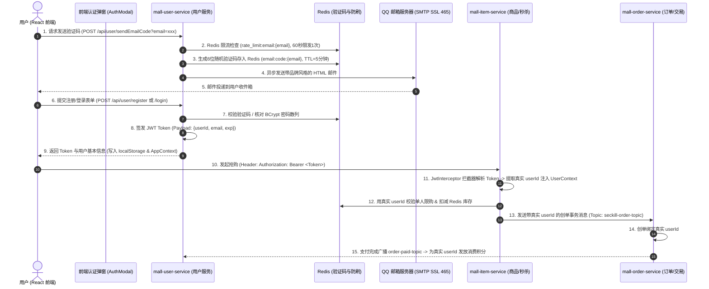
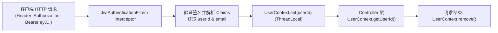
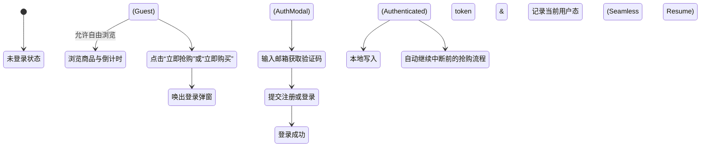
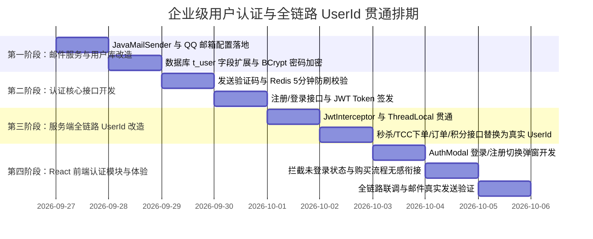

# 企业级用户认证、邮件验证码与全链路 UserId 贯通设计方案

---

## 1. 方案背景与改造定位

### 1.1 现状与痛点分析
当前系统虽然完成了核心的电商展示、秒杀预热、多级缓存以及消费返积分功能，但在**用户身份体系与交易鉴权**上仍存在典型的“压测开发原型”遗留痕迹：
1. **UserId 尚未真正打通**：
   - 秒杀下单（`SeckillController`）中若未传参数，使用了随机生成的模拟 `userId`；
   - TCC 普通下单（`TccOrderController`）中使用随机数生成 `userId`；
   - 导致真实用户登录后无法查询自己的专属订单、专享秒杀防刷限购失效、消费返积分无法精确累积到当前登录者的账户中。
2. **缺乏标准企业级认证与会话管理**：
   - 现仅有空壳的邮件发送接口，缺乏真实的邮件发送通道与验证码生成、校验、防刷机制；
   - 缺乏现代 Web 应用通用的无状态身份凭证机制（JWT Token），缺少前端自动携带鉴权 Header 与后端拦截器解析。

### 1.2 改造目标
1. **集成真实 QQ 企业级 SMTP 邮件服务**：利用提供的 QQ 邮箱配置（`1677345232@qq.com`，授权码：`mfjdzzbjxcabcgbd`，SSL 465端口），实现美观的 HTML 验证码邮件发送。
2. **构建标准用户鉴权中心**：支持“邮箱验证码一键注册”、“密码登录”与“验证码快捷免密登录”，密码采用 BCrypt 强哈希散列存储，登录签发高安全性的 JWT Token。
3. **全链路透传 UserId 真实身份**：
   - **前端**：统一在 `localStorage` 管理 JWT 与登录态；Axios/Fetch 请求拦截器统一注入 `Authorization: Bearer <token>`；未登录触发购买自动弹出登录弹窗（AuthModal）。
   - **服务端**：Spring MVC 统一鉴权拦截器解析 JWT，解构出真实 `userId` 绑定至 `ThreadLocal (UserContext)`。
   - **业务链路**：商品秒杀、普通 TCC 下单、订单支付、积分流水统一绑定当前真实登录者的 `userId`，形成商业级闭环。

---

## 2. 总体架构设计与身份流转全景



---

## 3. 邮件发送服务集成方案

### 3.1 邮件服务器配置 (基于提供的 QQ 邮箱凭据)

在 `mall-user-service/src/main/resources/application.yml` 中配置：

```yaml
spring:
  mail:
    host: smtp.qq.com
    port: 465
    username: 1677345232@qq.com
    password: mfjdzzbjxcabcgbd  # QQ 邮箱客户端授权码
    protocol: smtps
    default-encoding: UTF-8
    properties:
      mail:
        smtp:
          auth: true
          starttls:
            enable: true
            required: true
          ssl:
            enable: true
          socketFactory:
            port: 465
            class: javax.net.ssl.SSLSocketFactory
            fallback: false
```

### 3.2 邮件防刷与发送核心逻辑
1. **AOP 接口限流**：已有 `@SendCodeLimit(time = 60)`，保证同一邮箱 60 秒内只能调用一次发送接口，拦截刷接口行为。
2. **验证码生命周期**：
   - 存储 Key: `email:code:{email}`
   - 存储内容：6 位纯数字随机码
   - 有效期：300 秒（5 分钟）
3. **HTML 邮件视觉模板**：采用暗黑电竞/VALOR 专属品牌卡片风格（包含安全提醒：验证码 5 分钟内有效，请勿泄露）。

---

## 4. 用户认证领域与数据模型扩展

### 4.1 数据库结构更新 (`db_user`)

```sql
USE db_user;

-- 扩展用户表字段，增加昵称、头像与最后登录时间
ALTER TABLE `t_user` 
ADD COLUMN `nickname` varchar(64) DEFAULT 'VALOR特工' COMMENT '用户昵称',
ADD COLUMN `avatar_url` varchar(512) DEFAULT 'https://images.unsplash.com/photo-1535713875002-d1d0cf377fde?auto=format&fit=crop&w=200&q=80' COMMENT '用户头像',
ADD COLUMN `last_login_time` datetime DEFAULT NULL COMMENT '最后登录时间';
```

### 4.2 认证接口契约规范

#### 1. 发送邮箱验证码
- **URL**: `POST /api/user/sendEmailCode`
- **入参**: `email` (Query 或 JSON)
- **响应**: `{ "code": 200, "msg": "验证码已成功发送至邮箱" }`

#### 2. 邮箱验证码注册
- **URL**: `POST /api/user/register`
- **入参**:
```json
{
  "email": "user@example.com",
  "code": "829143",
  "password": "Password123"
}
```
- **核心逻辑**:
  1. 校验验证码与 Redis 是否一致，用后即焚（`redisTemplate.delete(...)`）；
  2. 检查邮箱是否已注册；
  3. 密码通过 `BCrypt.hashpw(password, BCrypt.gensalt())` 进行不可逆散列；
  4. 插入 `t_user` 并初始化其 `t_user_point` 积分账户（附赠新用户注册礼 **100 积分**）；
  5. 签发 JWT Token，响应用户实体与 Token。

#### 3. 密码登录 / 验证码快捷登录
- **URL**: `POST /api/user/login`
- **入参**:
```json
{
  "email": "user@example.com",
  "password": "Password123",  // 密码登录
  "code": "829143",           // 或验证码快捷登录 (二选一)
  "loginType": "PASSWORD"     // PASSWORD 或 CODE
}
```
- **响应体**:
```json
{
  "code": 200,
  "msg": "登录成功",
  "data": {
    "token": "eyJhbGciOiJIUzI1NiIsInR5cCI6IkpXVCJ9...",
    "user": {
      "id": 1,
      "email": "user@example.com",
      "nickname": "VALOR特工",
      "avatarUrl": "https://..."
    }
  }
}
```

#### 4. 获取当前已登录用户信息
- **URL**: `GET /api/user/info`
- **请求头**: `Authorization: Bearer <token>`
- **响应体**: 当前用户的基本信息及最新可用积分。

---

## 5. 全链路 UserId 贯通与身份透传方案

在真实企业电商中，用户在前端所有涉及资产和状态的操作（秒杀、买商品、查订单、看积分）都绝不能通过请求参数暴露或任意修改 `userId`，而必须**统一从认证 Token 中由服务端安全解析提取**。

### 5.1 服务端统一身份解析与 ThreadLocal 上下文

在每个微服务网关或 Web 服务中引入 `UserContextFilter` 与 `UserContext`：



```java
// 统一线程上下文
public class UserContext {
    private static final ThreadLocal<Long> CURRENT_USER = new ThreadLocal<>();

    public static void setUserId(Long userId) { CURRENT_USER.set(userId); }
    public static Long getUserId() { return CURRENT_USER.get(); }
    public static void clear() { CURRENT_USER.remove(); }
}
```

### 5.2 各业务链路“由随机生成改为真实 UserId”的落地改造点

| 链路位置 | 原先实现方式（原型阶段） | 企业级标准实现（重构后） |
| :--- | :--- | :--- |
| **秒杀获取 Token** (`/api/seckill/getPath`) | 允许外部传参或默认为 `1` | 优先从 `UserContext.getUserId()` 提取，未登录直接报 `401 Unauthorized` |
| **秒杀执行下单** (`/api/seckill/{path}/doSeckill`) | 使用 `ThreadLocalRandom` 假装海量并发用户 | 使用当前登录者的真实 `userId`；限购校验 `seckill:idempotent:{userId}:{itemId}` 真实生效；排队订单号生成 `ORD{time}{userId}` |
| **普通下单** (`/api/order/createTcc`) | 随机生成 1000~9999 假 ID | 从请求头解析真实 `userId`，生成的订单入库归属于该用户 |
| **订单列表查询** (`/api/order/list`) | 默认查 userId=1 | 仅查询当前登录者自己的历史订单 |
| **积分资产查看** (`/api/user/point/summary`) | 固定查 userId=1 | 依据当前登录者 `userId` 展示个人资产与动账明细 |
| **消费返积分** (`order-paid-topic`) | 依赖假消息字段 | 订单创建时已将真实 `userId` 封入消息体，消费端直接为该真实用户账户原子递增积分 |

---

## 6. React 前端认证状态与无感拦截体验

前端不仅支持正常浏览，在涉及资金、资产、购买等敏感操作时，提供平滑的**拦截式登录引导**：



### 6.1 前端核心组件扩展规划
1. **`src/components/auth/AuthModal.jsx`**：
   - 沉浸式暗黑霓虹风格模态框。
   - 支持 Tab 切换：`账号密码登录` 与 `邮箱验证码快捷登录 / 注册`。
   - 倒计时防刷按钮：点击获取验证码后进入 60 秒冷却（`重新获取 (59s)`）。
2. **`src/context/AppContext.jsx` 全局用户态**：
   - 维护 `currentUser`（包含 `userId`, `email`, `nickname`, `token`）。
   - 暴露 `login(token, user)` 与 `logout()` 方法。
   - 暴露 `requireAuth(actionCallback)` 守卫高阶函数：若未登录则自动弹窗，并在登录成功后自动回调原购买逻辑！
3. **`src/api/client.js` 请求拦截器**：
   - 统一从 `localStorage` 读取 `valor_token`，在每个发往后端的请求头部加上 `Authorization: Bearer <token>`。

---

## 7. 实施路线图



---

### 验收标准
1. **邮件真实可达**：输入 QQ 邮箱/网易邮箱后，用户收件箱能在 3 秒内收到带有 VALOR 品牌设计、包含 6 位随机验证码的真实邮件。
2. **全链路身份自洽**：用户登录后，所有秒杀下单、普通购买生成的订单均正确记录该用户的 `userId`；支付完成后，增加的消费积分精确沉淀至该用户的积分总表。
3. **安全性**：密码在数据库全为 BCrypt 密文存储，无明文泄露风险；Token 过期或伪造无法通过后端拦截器校验。
