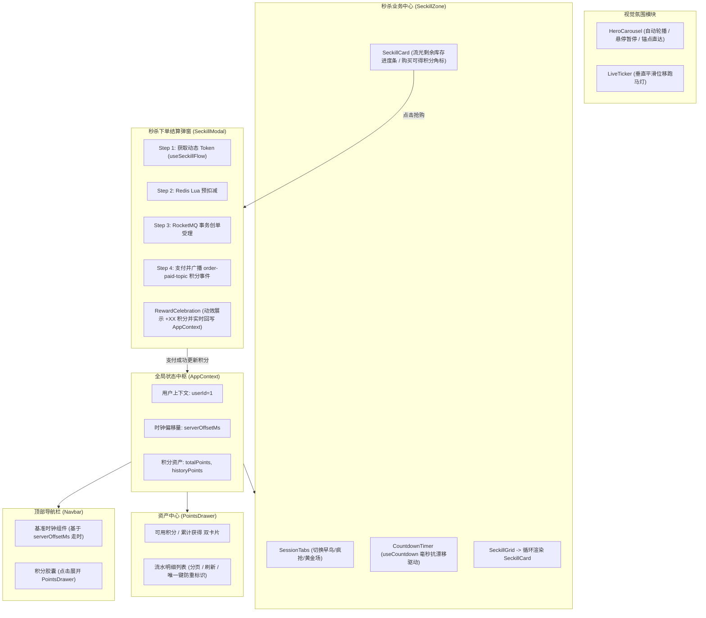
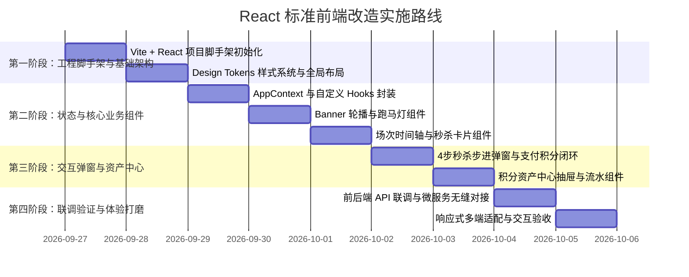

# 企业级 React 前端工程化设计方案
（VALOR CS:GO 高并发电商与秒杀大促平台）

---

## 1. 方案背景与重构定位

### 1.1 现状与升级诉求
原先的静态 HTML+CSS+JS 结构虽然具备了基础的展示和联调能力，但面临以下限制：
1. **代码内聚度与可维护性不足**：UI 模板与 DOM 操作强耦合在单个 JS 文件中，随着商品卡片交互、倒计时状态机、动态 Token 校验、积分实时变动等业务逻辑复杂化，状态维护变得脆弱。
2. **缺乏标准前端工程化体系**：缺少现代前端的模块化构建（Vite）、组件化复用（React 18 Component）、类型安全与状态管理、CSS 模块化及设计系统规范。
3. **交互体验与视觉表现力有待大幅提升**：企业级电商前端需要沉浸式的暗黑极客/电竞奢华美学，包含骨架屏加载、流畅的步进状态机弹窗、高精度抗漂移倒计时自定义 Hook、多维度筛选、平滑抽屉动效与支付积分庆祝粒子效果。

### 1.2 重构目标
采用 **Vite + React 18 + 标准组件化工程结构 + 响应式暗黑极客设计系统**，将 `mall-frontend` 重构成一个高内聚、易扩展、商业级表现力的现代化前端单页应用（SPA）。

---

## 2. 技术选型与架构规范

| 维度 | 选型 | 说明与技术优势 |
| :--- | :--- | :--- |
| **构建工具** | **Vite 5.x** | 秒级热更新（HMR）、Rollup 高性能生产打包 |
| **视图层框架** | **React 18 (Hooks + 函数组件)** | 并发渲染特性、组件化、声明式 UI 驱动 |
| **状态管理** | **React Context + useReducer / 状态 Hook** | 轻量级管理全局用户状态、积分余额、对齐时钟与当前选定场次 |
| **样式体系** | **Vanilla CSS Design Tokens + CSS Modules** | 原生最大灵活性与控制力，零运行时性能损耗，严格遵循暗黑电竞调色盘 |
| **网络请求** | **Fetch / Axios + 统一拦截器** | 统一处理 BaseURL、超时重试、RTT 网络耗时计算、错误 Toast 捕获 |
| **字体与图标** | **Google Fonts (Chakra Petch / Inter) + SVG** | 极客电竞机械风标题 + 极佳可读性的正文字体 |

---

## 3. 标准工程目录结构设计

```
mall-frontend/
├── public/
│   ├── favicon.ico
│   └── assets/
├── src/
│   ├── api/                     # 统一 API 请求封装
│   │   ├── client.js            # Fetch/Axios 基础封装 (支持 RTT 耗时计算)
│   │   ├── itemApi.js           # 商品、Banner、场次接口
│   │   ├── seckillApi.js        # 动态 Token、秒杀下单、排队轮询
│   │   ├── orderApi.js          # 订单查询、支付
│   │   └── userApi.js           # 积分总览、流水明细
│   │
│   ├── components/              # 业务组件树
│   │   ├── layout/              # 布局组件
│   │   │   ├── Navbar.jsx       # 顶部导航 (基准时钟、积分药丸、导航链接)
│   │   │   └── Footer.jsx       # 底部微服务架构技术标识
│   │   ├── home/                # 首页特有组件
│   │   │   ├── HeroCarousel.jsx # 3D 轮播海报 (自动轮播/手势/指示器)
│   │   │   └── LiveTicker.jsx   # 实时战报垂直循环跑马灯
│   │   ├── seckill/             # 秒杀核心模块
│   │   │   ├── SessionTabs.jsx  # 场次时间轴切换器 (预热中/疯抢中/已结束)
│   │   │   ├── CountdownTimer.jsx # 毫秒级抗漂移倒计时面板
│   │   │   ├── SeckillCard.jsx  # 秒杀饰品卡片 (流光进度条/角标/浮空悬停)
│   │   │   └── SeckillGrid.jsx  # 秒杀商品瀑布流网格
│   │   ├── catalog/             # 现货商城模块
│   │   │   ├── CategoryFilter.jsx # 饰品品类筛选 (匕首/枪械/手套/印花)
│   │   │   ├── CatalogCard.jsx  # 现货商品卡片 (普通购买 / Seata TCC)
│   │   │   └── CatalogGrid.jsx  # 现货商品列表
│   │   ├── modal/               # 交互弹窗模块
│   │   │   ├── SeckillModal.jsx # 秒杀 4 步可视化步进结算弹窗
│   │   │   └── RewardCelebration.jsx # 积分到账礼花特效卡片
│   │   └── drawer/              # 资产抽屉模块
│   │       └── PointsDrawer.jsx # 用户积分资产中心 (余额/流水/动账明细)
│   │
│   ├── hooks/                   # 自定义复合逻辑 Hook
│   │   ├── useServerTime.js     # 服务器授时对齐基准时钟 Hook
│   │   ├── useCountdown.js      # 基于 RAF / 高频时钟的毫秒倒计时 Hook
│   │   ├── useSeckillFlow.js    # 秒杀全链路状态机 (Token->扣减->创单->支付)
│   │   └── useUserPoints.js     # 用户可用积分与流水管理 Hook
│   │
│   ├── context/                 # 全局上下文
│   │   └── AppContext.jsx       # 全局用户态、时钟偏移量、积分资产共享
│   │
│   ├── styles/                  # 样式系统
│   │   ├── variables.css        # 全局设计规范 (颜色变量、阴影、圆角)
│   │   ├── reset.css            # 现代化 CSS Reset
│   │   └── global.css           # 全局公用工具类与动画关键帧
│   │
│   ├── utils/                   # 工具类函数
│   │   ├── formatTime.js        # 时间日期与倒计时格式化
│   │   └── formatNumber.js      # 金额与积分千分位格式化
│   │
│   ├── App.jsx                  # 根视图装配
│   └── main.jsx                 # Vite 应用入口
│
├── index.html                   # HTML 模板骨架 (预载 Google Fonts)
├── vite.config.js               # Vite 配置文件 (服务代理与端口配置)
└── package.json                 # 依赖管理配置
```

---

## 4. 核心组件与业务逻辑深度设计



---

### 4.1 核心 Hook 设计规范

#### 1. `useServerTime` (时钟校准与防篡改)
- **目标**：解决客户端篡改电脑本地时间、或者本地时钟不准导致秒杀提前/推迟的问题。
- **机制**：
  1. 向后端 `GET /api/system/time` 请求。
  2. 记录请求往返时延 $\text{RTT} = t_{\text{end}} - t_{\text{start}}$。
  3. 计算时间偏移量 $\text{offset} = (t_{\text{server}} + \text{RTT}/2) - t_{\text{end}}$。
  4. 对外暴露 `getStandardTime()` 方法与格式化的实时时钟字符串。

#### 2. `useCountdown` (抗漂移高性能倒计时)
- **目标**：不使用简单的 `setInterval(() => count--, 1000)`，防止浏览器后台休眠导致倒计时滞后。
- **机制**：
  1. 接收目标时间戳 `targetTimestamp`。
  2. 每次刷新均使用实时计算：
     $$\text{diff} = \max(0, \text{targetTimestamp} - \text{getStandardTime}())$$
  3. 解析为 `{ hours, minutes, seconds, millis, isFinished }`。
  4. 采用 100ms 刷新节拍，平滑更新毫秒视图。

#### 3. `useSeckillFlow` (企业级秒杀链路状态机)
- **状态流转**：`IDLE` $\to$ `TOKEN_FETCHING` $\to$ `STOCK_RESERVING` $\to$ `MQ_ENQUEUEING` $\to$ `PAYING` $\to$ `SUCCESS` / `ERROR`。
- **错误捕获**：针对 400（令牌过期）、410（已售罄）、429（重复抢购防刷）提供针对性友好 UI 提示与重试机制。
- **积分联动**：秒杀支付完成后，自动触发 `AppContext` 中的积分更新，并向积分流水列表插入新记录。

---

### 4.2 视觉与交互规范设计（暗黑电竞科技美学）

1. **色彩调色盘 (Curated Palette)**：
   - 背景主色：`#0b0e14`（黑曜曜石暗黑底）
   - 卡片表面：`rgba(18, 24, 36, 0.85)` + `backdrop-filter: blur(16px)`
   - 品牌主渐变（烈焰红）：`linear-gradient(135deg, #ff334b 0%, #ff6b3d 100%)`
   - 资产尊享金（积分）：`linear-gradient(135deg, #f5a623 0%, #ffd000 100%)`
   - 科技霓虹蓝（数据）：`linear-gradient(135deg, #00e5ff 0%, #00a8ff 100%)`
2. **微交互体系 (Micro-Interactions)**：
   - 饰品展示图片悬浮时进行轻微 3D 悬浮缩放（Scale 1.06 + Rotate -2deg）。
   - 库存进度条具备条纹流光呼吸动效（Striped Shimmering Animation）。
   - 抽屉与弹窗使用贝塞尔缓动曲线（`cubic-bezier(0.16, 1, 0.3, 1)`），杜绝生硬突变。

---

## 5. 实施路线图



---

### 验收标准
1. **工程化交付**：具有清晰的 `src/components`, `src/hooks`, `src/api` 标准模块划分，支持 `npm run dev` / `npm run build`。
2. **功能完整度**：完整覆盖轮播图、跑马灯、秒杀场次切换、毫秒倒计时、动态 Token 防刷秒杀、以及“消费 X 元增加 X 积分”的即时结算和资产抽屉展示。
3. **视觉品质**：符合顶级商业化电竞饰品大促门户的视觉质感与交互流畅度。
