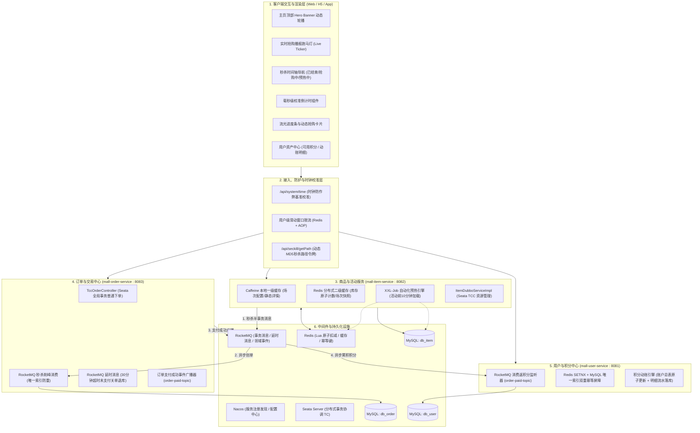
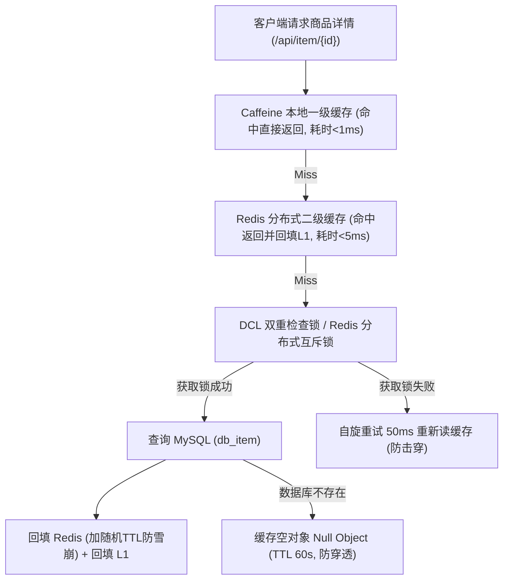
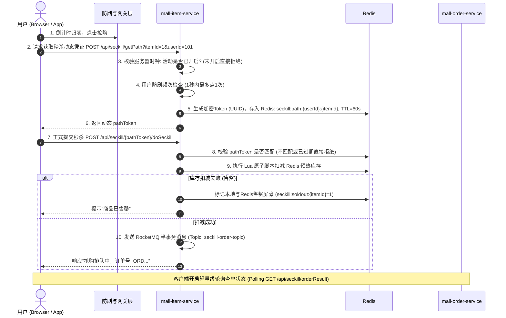
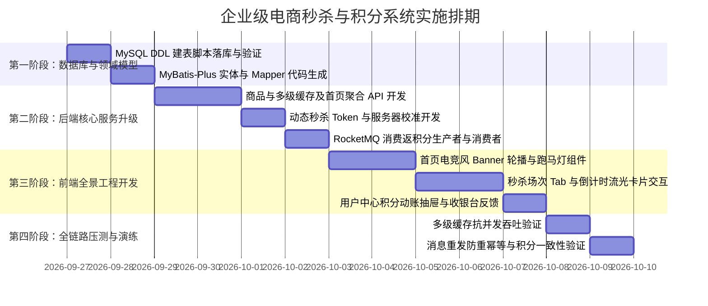

# 企业级高并发电商与秒杀系统全链路设计方案
（含商品中心、秒杀预热倒计时、动态轮播、风控防刷与消费积分闭环）

---

## 1. 项目背景与系统定位

### 1.1 现状与痛点剖析
当前 `mall-parent` 项目已在微服务基础设施上实现了较强的技术纵深（集成 Spring Boot 3、Nacos 注册配置中心、Dubbo RPC、Seata TCC 分布式事务、RocketMQ 事务消息削峰、XXL-Job 分布式调度、Redis Lua 原子扣减），并具备了秒杀下单与普通下单链路的原型。

然而，从**商业化企业级产品**维度来看，系统存在以下关键缺失：
1. **缺少商品展示门面**：缺乏面向 C 端的商品展示体系（轮播图、分类、属性参数、图文详情、多级缓存支撑）。
2. **缺乏活动运营体系与氛围渲染**：秒杀缺乏场次概念（如 10:00、14:00、20:00 场），缺少“活动前倒计时预热”、“主页 Banner 滚动”、“实时抢购播报跑马灯”等电商大促核心视觉与交互。
3. **缺少秒杀时钟对齐与防刷机制**：客户端本地时钟易被篡改作弊；秒杀接口未做隐藏，缺乏动态 Token 校验，易被黑产脚本提前爬取接口暴力轰炸。
4. **缺乏用户激励与资产闭环**：缺少“消费 X 元增加 X 积分”的积分资产体系，未完成交易域到用户域的业务闭环。

### 1.2 系统演进目标
- **业务维度**：构建集“商品陈列、多场次秒杀预热倒计时、全景主页轮播展示、电竞饰品视觉、消费返积分资产变动”于一体的企业级 C 端电商门户。
- **架构维度**：践行“大促前充分预热、读链路多级缓存动静分离、写链路异步削峰与限流、核心业务与衍生业务（积分）事件解耦、全链路绝对防重幂等”的设计哲学。

---

## 2. 系统总体架构全景



---

## 3. 数据模型设计 (Database & Cache Schema)

### 3.1 关系型数据库 DDL 方案

#### A. 商品库 (`db_item`) 扩展设计
```sql
USE db_item;

-- 1. 扩充原 t_item 表（丰富商品展示属性与状态）
ALTER TABLE `t_item` 
ADD COLUMN `category_id` bigint(20) DEFAULT 1 COMMENT '分类ID (1:武器箱 2:手套 3:匕首 4:枪械)',
ADD COLUMN `sub_title` varchar(255) DEFAULT '' COMMENT '商品副标题/磨损特征描述',
ADD COLUMN `image_url` varchar(512) DEFAULT '' COMMENT '商品主展示图URL',
ADD COLUMN `detail_html` text COMMENT '商品图文详情',
ADD COLUMN `status` tinyint(4) NOT NULL DEFAULT 1 COMMENT '商品状态: 1-上架, 0-下架';

-- 2. 秒杀活动场次表 (支撑多场次时间轴与轮播切换)
CREATE TABLE `t_seckill_session` (
    `id` bigint(20) NOT NULL AUTO_INCREMENT COMMENT '场次主键ID',
    `session_name` varchar(64) NOT NULL COMMENT '场次名称(如: 10:00早鸟专场, 20:00黄金秒杀场)',
    `start_time` datetime NOT NULL COMMENT '场次开始时间',
    `end_time` datetime NOT NULL COMMENT '场次结束时间',
    `status` tinyint(4) NOT NULL DEFAULT 0 COMMENT '场次状态: 0-预告/预热中, 1-进行中, 2-已下线/已结束',
    `create_time` datetime NOT NULL DEFAULT CURRENT_TIMESTAMP,
    PRIMARY KEY (`id`),
    KEY `idx_session_time` (`start_time`, `end_time`)
) ENGINE=InnoDB DEFAULT CHARSET=utf8mb4 COMMENT='秒杀活动场次表';

-- 3. 秒杀活动商品关联配置表
CREATE TABLE `t_seckill_item` (
    `id` bigint(20) NOT NULL AUTO_INCREMENT COMMENT '主键ID',
    `session_id` bigint(20) NOT NULL COMMENT '所属场次ID',
    `item_id` bigint(20) NOT NULL COMMENT '关联基础商品ID',
    `seckill_price` decimal(10,2) NOT NULL COMMENT '秒杀专享价',
    `seckill_stock` int(11) NOT NULL DEFAULT 0 COMMENT '秒杀配额总库存',
    `remain_stock` int(11) NOT NULL DEFAULT 0 COMMENT '秒杀剩余库存',
    `limit_per_user` int(11) NOT NULL DEFAULT 1 COMMENT '单用户限购数量',
    `sort_order` int(11) NOT NULL DEFAULT 0 COMMENT '首页展示排序权重',
    `create_time` datetime NOT NULL DEFAULT CURRENT_TIMESTAMP,
    PRIMARY KEY (`id`),
    UNIQUE KEY `uk_session_item` (`session_id`, `item_id`),
    KEY `idx_item_id` (`item_id`)
) ENGINE=InnoDB DEFAULT CHARSET=utf8mb4 COMMENT='秒杀商品关系配置表';

-- 4. 首页轮播 Banner 表 (支撑主页海报视觉滚动)
CREATE TABLE `t_banner` (
    `id` bigint(20) NOT NULL AUTO_INCREMENT,
    `title` varchar(128) NOT NULL COMMENT 'Banner标题',
    `image_url` varchar(512) NOT NULL COMMENT '海报图片URL',
    `target_url` varchar(512) DEFAULT NULL COMMENT '点击跳转地址(如对应商品详情页或活动页)',
    `badge_text` varchar(32) DEFAULT NULL COMMENT '左上角角标(如: 镇场爆款 / 限量5折)',
    `sort_order` int(11) NOT NULL DEFAULT 0 COMMENT '排序权重',
    `is_active` tinyint(4) NOT NULL DEFAULT 1 COMMENT '是否展示: 1-启用, 0-禁用',
    `create_time` datetime NOT NULL DEFAULT CURRENT_TIMESTAMP,
    PRIMARY KEY (`id`)
) ENGINE=InnoDB DEFAULT CHARSET=utf8mb4 COMMENT='首页轮播配置表';
```

#### B. 用户库 (`db_user`) 积分资产体系设计
```sql
USE db_user;

-- 1. 用户积分账户总表 (资产主表)
CREATE TABLE `t_user_point` (
    `user_id` bigint(20) NOT NULL COMMENT '用户主键ID',
    `total_points` int(11) NOT NULL DEFAULT 0 COMMENT '当前有效可用积分',
    `history_earned_points` int(11) NOT NULL DEFAULT 0 COMMENT '历史累计获得积分',
    `version` int(11) NOT NULL DEFAULT 0 COMMENT '乐观锁版本控制',
    `create_time` datetime NOT NULL DEFAULT CURRENT_TIMESTAMP,
    `update_time` datetime NOT NULL DEFAULT CURRENT_TIMESTAMP ON UPDATE CURRENT_TIMESTAMP,
    PRIMARY KEY (`user_id`)
) ENGINE=InnoDB DEFAULT CHARSET=utf8mb4 COMMENT='用户积分账户资产表';

-- 2. 积分动账明细流水表 (简历核心亮点：唯一键防重与财务合规审计)
CREATE TABLE `t_point_record` (
    `id` bigint(20) NOT NULL AUTO_INCREMENT COMMENT '明细主键ID',
    `user_id` bigint(20) NOT NULL COMMENT '用户ID',
    `order_no` varchar(64) NOT NULL COMMENT '关联业务订单号',
    `change_points` int(11) NOT NULL COMMENT '本次变动积分值(正数增加，负数扣除)',
    `balance_after` int(11) NOT NULL COMMENT '变动后的账户总可用积分',
    `change_type` tinyint(4) NOT NULL COMMENT '动账业务类型: 1-订单消费返利, 2-退款撤销扣减, 3-积分商城兑换消耗, 4-系统运营调账',
    `remark` varchar(255) DEFAULT '' COMMENT '动账业务说明(如: 订单ORD2026092601消费99元赠送99积分)',
    `create_time` datetime NOT NULL DEFAULT CURRENT_TIMESTAMP,
    PRIMARY KEY (`id`),
    UNIQUE KEY `uk_order_type` (`order_no`, `change_type`), -- 绝对防御：同一订单的同种动账只能发生一次
    KEY `idx_user_time` (`user_id`, `create_time`)
) ENGINE=InnoDB DEFAULT CHARSET=utf8mb4 COMMENT='用户积分动账流水表';
```

---

### 3.2 Redis 键结构设计与缓存拓扑

| Redis Key | 数据类型 | 典型 TTL | 作用与业务场景 |
| :--- | :--- | :--- | :--- |
| `item:detail:{itemId}` | String (JSON) | 30m ± 5m | 商品基础信息静态缓存（采用随机过期防雪崩） |
| `seckill:session:current` | String (JSON) | 60s | 首页秒杀聚合场次与首屏推荐列表快照缓存 |
| `seckill:stock:{itemId}` | String (Long) | 活动时长 + 2h | Redis 秒杀实时库存，供 Lua 脚本做超高速原子递减 |
| `seckill:soldout:{itemId}` | String ("1") | 活动结束清空 | 内存屏障，当库存归零时写入，拦截后续请求直接返回已售罄 |
| `seckill:path:{userId}:{itemId}`| String (UUID)| 60s | 动态生成的临时秒杀加密 Token，一次性使用校验 |
| `seckill:idempotent:{userId}:{itemId}` | String ("1") | 5m | 秒杀排重标记，防止同一用户快速并发多点创单 |
| `point:dedup:{orderNo}` | String ("1") | 24h | 积分增加前置轻量级防重过滤器，抵挡 MQ 瞬时重发 |

---

## 4. 关键业务全链路实现方案

### 4.1 商品中心与多级缓存读链路（读并发优化）
大促期间，商品详情与首页的读请求比写请求高出几个数量级（典型 100:1），采用 **Caffeine + Redis + DB** 多级缓存：



---

### 4.2 秒杀活动场次与倒计时时钟校准机制
为防止用户修改本地操作系统时钟导致倒计时紊乱或提前发包，系统建立统一基准时钟对齐机制：

1. **时钟校准接口**：
   - 提供 `GET /api/system/time`，返回服务器当前纳秒级时间戳。
   - 前端页面初次加载时记录：
     $$\Delta t = \text{ServerTime} - \text{LocalTime}$$
   - 本地倒计时驱动核心逻辑：
     $$\text{CurrentStandardTime} = \text{LocalNow}() + \Delta t$$
2. **场次生命周期自动流转**：
   - **预热中 (Not Started)**：$\text{CurrentStandardTime} < \text{StartTime}$
     - 倒计时：“距开抢还有 HH:mm:ss”。
     - 抢购按钮置灰显示“敬请期待”，隐藏秒杀真实下单入口。
   - **进行中 (In Progress)**：$\text{StartTime} \le \text{CurrentStandardTime} \le \text{EndTime}$
     - 倒计时：“距结束仅剩 HH:mm:ss”。
     - 抢购按钮点亮为高光渐变，展示“已抢 XX%，剩余 XX 件”动态进度条。
   - **已结束 (Ended)**：$\text{CurrentStandardTime} > \text{EndTime}$ 或库存售罄
     - 按钮变灰显示“已抢光”或“活动结束”。

---

### 4.3 首页视觉滚动与电竞氛围渲染设计
主页面采用沉浸式**暗黑电竞/饰品交易风格（Dark Tech & Esports Theme）**：
1. **顶部 Hero Banner 轮播**：
   - 自动切换 3~5 款当日顶级爆款饰品（例如“咆哮 M4A4”、“巨龙传说 AWP”、“爪子刀 | 渐变之色”）。
   - 带有呼吸灯辉光、全息微倾斜视差投影，支持点击直接锚定至该商品的抢购卡片。
2. **实时战报滚动跑马灯（Live Ticker）**：
   - 顶部/侧边悬浮通告条，以平滑上浮动画循环播报真实/脱敏抢购喜报：
     - *“🎉 恭喜 玩家 139****5821 成功抢购 [咆哮 M4A4] (秒杀价 ¥99.00)”*
     - *“🔥 当前场次 [20:00 黄金场] 剩余库存告急，抢购进度已达 92%！”*
3. **横向场次时间轴导航栏（Session Timeline Bar）**：
   - 采用类似大促专场的 Tab 滑块：
     `[ 10:00 已开抢 ]`  |  `[ 14:00 疯抢中 🔥 ]`  |  `[ 20:00 即将开抢 ⏰ ]`  |  `[ 明日预热 ]`
   - 支持动态自动定位到“当前进行中”的场次卡片。

---

### 4.4 秒杀安全风控与防刷动态 Token 闭环
为彻底杜绝脚本挂机刷单，设计动态接口隐藏与防刷防护：



---

### 4.5 消费返积分资产闭环（RocketMQ 异步削峰 + 最终一致性）
用户支付成功后，按照“消费 1 元积 1 分”自动增加可用积分与历史累计积分。

#### A. 核心设计要点
1. **领域驱动异步解耦**：
   - 订单支付成功属于高优先级的核心主链路，积分属于衍生次级链路。
   - 在 `mall-order-service` 支付成功事务提交后，向 RocketMQ 投递 `order-paid-topic` 事件消息，携带 `{orderNo, userId, payAmount}`。
2. **绝对防重幂等保障（双重拦截）**：
   - **第一道防线（Redis SETNX）**：消费端前置检查 `point:dedup:{orderNo}`，拦截网络抖动导致的 99% 瞬时重复消息。
   - **第二道防线（MySQL 唯一索引）**：`t_point_record` 表建立唯一键 `uk_order_type(order_no, change_type)`。若消息再次重试，底层直接触发 `DuplicateKeyException`，消费端优雅记录日志并直接返回 `CONSUME_SUCCESS`，彻底避免多赠送积分。
3. **账户金额原子累加（防并发写覆盖）**：
   - 使用原子累加 SQL：
     ```sql
     UPDATE t_user_point 
     SET total_points = total_points + #{earnedPoints}, 
         history_earned_points = history_earned_points + #{earnedPoints} 
     WHERE user_id = #{userId};
     ```
   - 若用户无积分账户记录，则通过 `INSERT ... ON DUPLICATE KEY UPDATE` 或初始化账户保证安全性。

---

## 5. API 接口契约规范

### 5.1 C 端展示与聚合接口

#### 1. 首页综合聚合看板
- **URL**: `GET /api/home/overview`
- **说明**: 一次性聚合首页海报、中奖广播、当前进行中场次及秒杀商品，减少首屏网络往返（RTT）。
- **响应体示例**:
```json
{
  "code": 200,
  "msg": "success",
  "data": {
    "serverTime": 1727330000000,
    "banners": [
      {
        "id": 1,
        "title": "AWP | 巨龙传说 (纪念品级) 20:00 镇场开抢",
        "imageUrl": "https://img.example.com/banner_dragon_lore.png",
        "targetUrl": "/item/1",
        "badgeText": "限量1折"
      }
    ],
    "tickers": [
      "🎉 恭喜用户 138****9988 成功以 ¥99 抢到【蝴蝶刀 | 渐变大理石】！",
      "🔥 20:00 黄金场次预约人数已突破 10,000 人！"
    ],
    "activeSession": {
      "sessionId": 101,
      "sessionName": "20:00 黄金爆款专场",
      "startTime": 1727330400000,
      "endTime": 1727334000000,
      "status": 0,
      "countDownMs": 400000
    }
  }
}
```

#### 2. 秒杀场次与商品列表
- **URL**: `GET /api/seckill/sessions`
- **参数**: `sessionId`（可选，未传时默认返回当天全部场次及当前选中场次列表）
- **响应数据字段**:
  - `sessions`: 当日场次列表（含状态、时间段标签）。
  - `items`: 该场次关联的秒杀商品清单（含 `itemId`, `itemName`, `imageUrl`, `subTitle`, `originalPrice`, `seckillPrice`, `totalStock`, `remainStock`, `progressPercent`, `isSoldOut`）。

#### 3. 服务器授时对齐接口
- **URL**: `GET /api/system/time`
- **响应体**:
```json
{
  "code": 200,
  "serverTime": 1727330123456
}
```

---

### 5.2 秒杀与交易接口

#### 1. 获取秒杀加密动态路径 Token
- **URL**: `POST /api/seckill/getPath`
- **请求体**:
```json
{
  "itemId": 1,
  "userId": 10001
}
```
- **响应体**:
```json
{
  "code": 200,
  "pathToken": "e9b88cf4-9c02-4f3d-9d41-7a5df2633bf1"
}
```

#### 2. 执行秒杀下单
- **URL**: `POST /api/seckill/{pathToken}/doSeckill`
- **请求体**:
```json
{
  "itemId": 1,
  "userId": 10001
}
```
- **响应体**:
```json
{
  "code": 200,
  "msg": "抢购请求已受理，正在排队中",
  "orderNo": "ORD202609260010001"
}
```

#### 3. 轮询秒杀排队结果
- **URL**: `GET /api/seckill/orderResult?orderNo=ORD202609260010001`
- **响应状态**:
  - `status = 0`: 排队处理中
  - `status = 1`: 创单成功，返回真实订单 ID 与待支付金额，引导前往收银台
  - `status = -1`: 下单失败（库存售罄或排队超时）

---

### 5.3 用户积分与资产接口

#### 1. 查询用户积分账户概览
- **URL**: `GET /api/user/point/summary?userId=10001`
- **响应体**:
```json
{
  "code": 200,
  "data": {
    "userId": 10001,
    "totalPoints": 2580,
    "historyEarnedPoints": 4200
  }
}
```

#### 2. 分页查询积分流水明细
- **URL**: `GET /api/user/point/records?userId=10001&page=1&pageSize=10`
- **响应体**:
```json
{
  "code": 200,
  "data": {
    "total": 35,
    "list": [
      {
        "id": 101,
        "orderNo": "ORD202609260010001",
        "changePoints": 99,
        "balanceAfter": 2580,
        "changeType": 1,
        "remark": "购买【咆哮 M4A4】消费 ¥99 赠送 99 积分",
        "createTime": "2026-09-26 20:01:15"
      }
    ]
  }
}
```

---

## 6. 实施路线图与验收标准



### 验收与性能指标标准：
1. **商品详情读吞吐**：在 Caffeine + Redis 双级缓存保护下，单机商品查询 QPS 达到 5,000+，P99 延迟 $< 10\text{ms}$。
2. **秒杀极端并发**：在 Redis Lua + 售罄屏障保护下，秒杀预扣接口单机 TPS 稳定在 2,000+，零超卖，零少卖。
3. **积分一致性**：在 RocketMQ 极端网络异常重推消息情况下，`t_point_record` 依靠唯一索引绝对幂等，保证积分不出现多发、错发情况。
