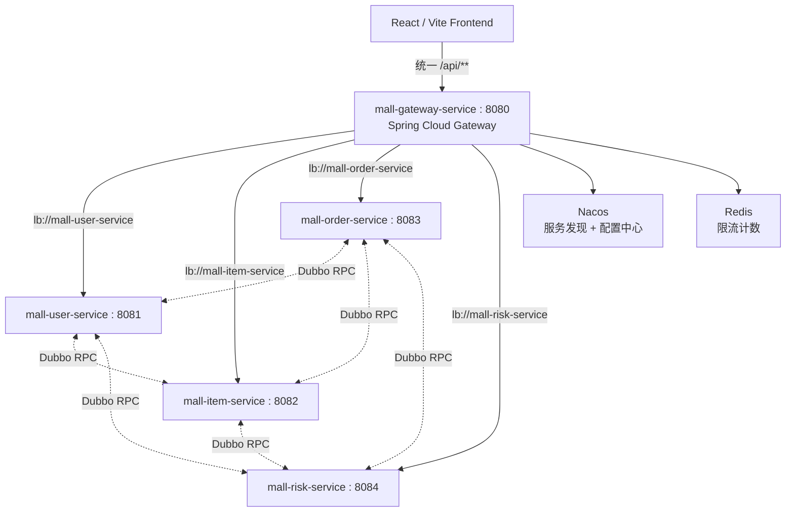
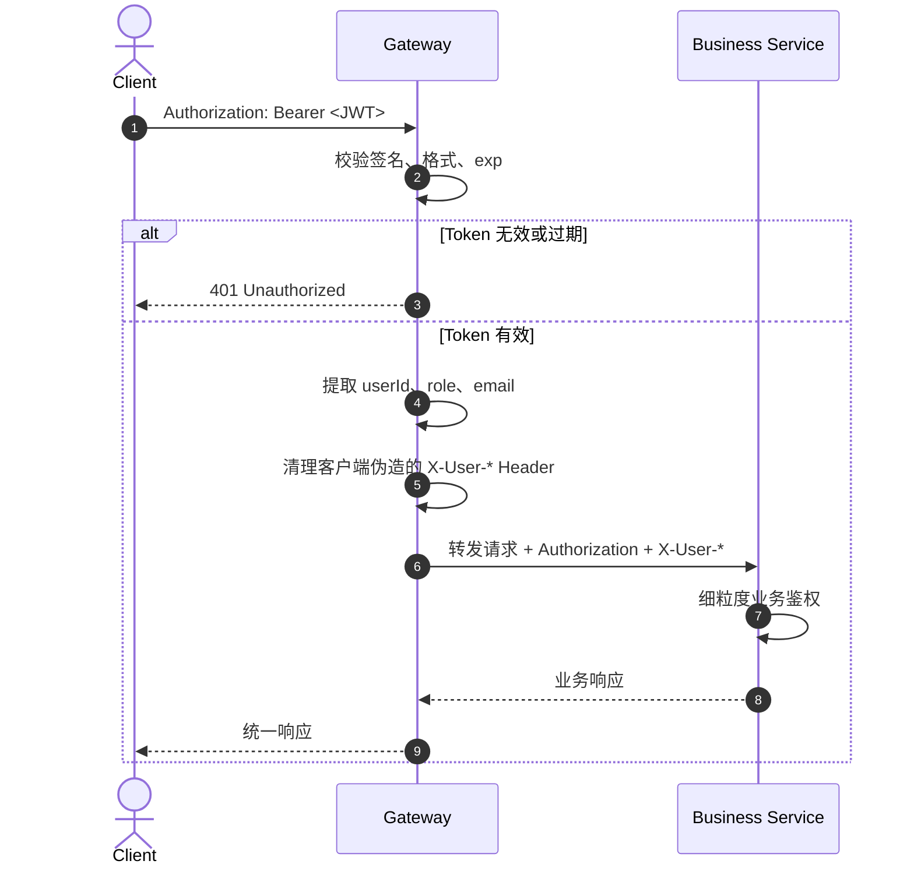

# Spring Cloud Gateway 统一接入层设计方案

版本：v1.1  
日期：2026-09-29  
状态：已落地  
范围：新增 `mall-gateway-service`，替代前端直连各微服务的接入方式；本文保留完整设计方案，并在文末补充当前落地结果。

---

## 1. 背景与目标

### 1.1 现状

当前项目没有独立网关模块，父工程只包含：

```text
mall-api
mall-user-service
mall-item-service
mall-order-service
mall-risk-service
```

外部请求链路是前端直连服务：

```text
React Frontend
  -> http://localhost:8081  mall-user-service
  -> http://localhost:8082  mall-item-service
  -> http://localhost:8083  mall-order-service
```

现有“类网关”能力分散在各服务内部：

| 能力 | 当前位置 | 问题 |
| --- | --- | --- |
| JWT 解析 | `mall-item-service`、`mall-order-service` 的 `UserContextInterceptor` | 各服务重复实现，无法统一拒绝未登录请求 |
| CORS | Controller 上的 `@CrossOrigin(origins = "*")` | 来源不可控，生产环境风险高 |
| 限流 | 用户服务验证码 AOP，Redis `SETNX` | 只覆盖邮件验证码，没有全局与秒杀专用限流 |
| 秒杀防刷 | 商品服务动态 `pathToken` | 有业务防刷，但入口缺少统一频控 |
| 时钟校准 | 商品服务 `/api/system/time` | 可用，但入口能力分散 |
| 服务路由 | 前端硬编码端口 | 前端感知服务拓扑，无法统一发布和容灾 |

### 1.2 目标

1. 新增 Spring Cloud Gateway 作为唯一 HTTP 入口。
2. 使用 Nacos 服务发现转发到 `mall-user-service`、`mall-item-service`、`mall-order-service`、`mall-risk-service`。
3. 后端接口路径保持不变，采用零重写路由，降低迁移成本。
4. 统一处理 JWT 认证、角色粗粒度鉴权、CORS、限流、超时、错误响应和观测。
5. 前端只需要访问网关域名，不再感知 `8081/8082/8083/8084`。
6. 为后续服务鉴权改造、灰度发布、熔断降级和链路追踪预留扩展点。

### 1.3 非目标

本方案不负责：

1. 支付网关业务逻辑；项目中的 Mock 支付网关仍属于订单域。
2. 精确资源授权，例如“用户只能查看自己的订单”。网关只判断是否登录、角色是否匹配，资源归属仍由业务服务校验。
3. 替换 Dubbo 服务间通信；服务间东西向调用继续使用 Dubbo + Nacos。
4. 立即删除现有 Controller 和拦截器；迁移需要分阶段完成。

---

## 2. 总体架构

### 2.1 目标链路



### 2.2 模块规划

新增模块：

```text
mall-gateway-service
```

建议端口：

| 服务 | 端口 | 说明 |
| --- | ---: | --- |
| mall-gateway-service | 8080 | 唯一外部 HTTP 入口 |
| mall-user-service | 8081 | 仅内网可访问 |
| mall-item-service | 8082 | 仅内网可访问 |
| mall-order-service | 8083 | 仅内网可访问 |
| mall-risk-service | 8084 | 仅内网可访问 |

网关模块依赖建议：

| 依赖 | 目的 |
| --- | --- |
| `spring-cloud-starter-gateway` | Reactive Gateway 核心 |
| `spring-cloud-starter-alibaba-nacos-discovery` | 服务发现 |
| `spring-cloud-starter-loadbalancer` | `lb://` 负载均衡 |
| `spring-boot-starter-data-redis-reactive` | Reactive Redis 限流 |
| `spring-boot-starter-actuator` | 健康检查与指标 |
| `spring-cloud-starter-circuitbreaker-reactor-resilience4j` | 可选熔断降级 |

注意：Spring Cloud Gateway 基于 WebFlux。网关模块不要引入 `spring-boot-starter-web`，否则会和 Netty/Reactive 配置冲突。自定义过滤器也应保持非阻塞，避免在请求线程中执行长时间同步 IO。

---

## 3. 路由设计

### 3.1 设计原则：后端路径零重写

现有后端接口已经是领域化的 `/api/**` 路径，因此网关不做路径改写：

```text
客户端请求 /api/user/info
  -> 网关匹配 /api/user/**
  -> 转发 lb://mall-user-service/api/user/info
```

这样可以避免第一版迁移同时修改：

1. Controller 的 `@RequestMapping`；
2. 前端 `API_BASE` 与所有 API 调用；
3. 测试脚本、压测脚本和文档接口契约。

后续如需要引入 `/api/{service}/**` 前缀，可通过 `RewritePath` 二期演进，但不作为本次迁移的必要条件。

### 3.2 服务路由表

| 路由 ID | 匹配路径 | 目标服务 | 主要能力 |
| --- | --- | --- | --- |
| `mall-user-route` | `/api/user/**`、`/api/account/**`、`/api/merchant/**`、`/api/withdraw/**` | `lb://mall-user-service` | 注册登录、用户信息、账户、商家、提现、积分 |
| `mall-item-route` | `/api/home/**`、`/api/item/**`、`/api/seckill/**`、`/api/asset/**`、`/api/system/time` | `lb://mall-item-service` | 首页、商品、秒杀、资产发布、授时 |
| `mall-order-route` | `/api/order/**`、`/api/trade/**`、`/api/payment/**`、`/api/audit/**` | `lb://mall-order-service` | 订单、担保交易、Mock 支付、审计 |
| `mall-risk-route` | `/api/admin/risk/**` | `lb://mall-risk-service` | 风控案件后台 |

### 3.3 示例配置

以下配置为设计样例，实际落地时建议放入 Nacos 配置中心：

```yaml
server:
  port: 8080

spring:
  application:
    name: mall-gateway-service
  cloud:
    nacos:
      discovery:
        server-addr: ${NACOS_SERVER_ADDR}
      config:
        server-addr: ${NACOS_SERVER_ADDR}
    gateway:
      discovery:
        locator:
          enabled: false
      httpclient:
        connect-timeout: 2000
        response-timeout: 5s
      routes:
        - id: mall-user-route
          uri: lb://mall-user-service
          predicates:
            - Path=/api/user/**,/api/account/**,/api/merchant/**,/api/withdraw/**
          metadata:
            auth:
              required: true
              public-paths:
                - /api/user/sendEmailCode
                - /api/user/register
                - /api/user/login
              admin-paths:
                - /api/merchant/admin/**
                - /api/withdraw/admin/**

        - id: mall-item-route
          uri: lb://mall-item-service
          predicates:
            - Path=/api/home/**,/api/item/**,/api/seckill/**,/api/asset/**,/api/system/time
          metadata:
            auth:
              required: true
              public-paths:
                - /api/home/overview
                - /api/item/list
                - /api/item/**
                - /api/seckill/sessions
                - /api/system/time
              admin-paths:
                - /api/asset/admin/**
                - /api/seckill/preheat

        - id: mall-order-route
          uri: lb://mall-order-service
          predicates:
            - Path=/api/order/**,/api/trade/**,/api/payment/**,/api/audit/**
          metadata:
            auth:
              required: true
              public-paths:
                - /api/payment/callback
              admin-paths:
                - /api/trade/admin/**
                - /api/audit/**

        - id: mall-risk-route
          uri: lb://mall-risk-service
          predicates:
            - Path=/api/admin/risk/**
          metadata:
            auth:
              required: true
              roles:
                - ADMIN
```

说明：

1. `discovery.locator.enabled=false` 是刻意设计，避免 Nacos 自动暴露所有服务。
2. `metadata.auth` 是自定义认证过滤器的配置模型，Spring Cloud Gateway 不会自动识别，需要后续实现 `AuthGlobalFilter` 读取。
3. `/api/item/**` 属于公开浏览路径；但 `/api/asset/**` 和 `/api/seckill/**` 中除公开场次查询外应要求登录。
4. `/api/audit/**` 当前包含测试和 benchmark 接口，生产环境建议默认不暴露，或限制为内网管理员专用。

---

## 4. 认证与鉴权设计

### 4.1 总体策略

网关负责粗粒度准入：

1. 判断请求是否属于公开接口。
2. 校验 JWT 签名、格式和过期时间。
3. 对管理员路径校验 `role=ADMIN`。
4. 限制明显异常的请求频次。

业务服务负责细粒度授权：

1. 订单是否属于当前用户。
2. 商家是否只能处理自己的资产。
3. 管理员是否可以处理指定案件。
4. 秒杀是否满足限购、库存和活动时间。

分层边界必须保持清晰：网关不能为了做资源归属判断去查询订单库或用户库，否则会把网关变成业务耦合点。

### 4.2 公开接口白名单

建议第一阶段白名单：

| 路径 | 原因 |
| --- | --- |
| `OPTIONS /**` | CORS 预检请求 |
| `GET /api/home/overview` | 首页公开数据 |
| `GET /api/seckill/sessions` | 秒杀场次与倒计时 |
| `GET /api/item/list` | 商品列表 |
| `GET /api/item/{id}` | 商品详情 |
| `GET /api/system/time` | 服务器授时 |
| `POST /api/user/sendEmailCode` | 登录前验证码 |
| `POST /api/user/register` | 注册 |
| `POST /api/user/login` | 登录 |
| `POST /api/payment/callback` | Mock 支付回调，后续必须增加签名校验 |

其余 `/api/**` 默认要求 JWT。

### 4.3 角色矩阵

| 路径 | 要求 |
| --- | --- |
| `/api/user/info`、`/api/account/**`、`/api/user/point/**` | 登录用户 |
| `/api/merchant/me`、`/api/merchant/apply` | 登录用户 |
| `/api/merchant/admin/**` | `ADMIN` |
| `/api/withdraw/list`、`/api/withdraw/apply` | 登录用户 |
| `/api/withdraw/admin/**` | `ADMIN` |
| `/api/asset/item/**` | 登录用户，服务内继续校验商家归属 |
| `/api/asset/admin/**` | `ADMIN` |
| `/api/seckill/getPath`、`/api/seckill/{pathToken}/doSeckill` | 登录用户 |
| `/api/seckill/preheat` | `ADMIN`，生产可改为内网任务触发 |
| `/api/order/**`、`/api/trade/**` | 登录用户，服务内校验订单归属 |
| `/api/trade/admin/**` | `ADMIN` |
| `/api/payment/**` | 登录用户，`callback` 除外 |
| `/api/audit/**` | `ADMIN` 或内网专用 |
| `/api/admin/risk/**` | `ADMIN` |

### 4.4 JWT 处理流程



### 4.5 下游身份透传

目标状态下，网关向下游传递：

```text
Authorization: Bearer <原JWT>
X-User-Id: 101
X-User-Email: user@example.com
X-User-Role: USER
X-Request-Id: <traceId>
```

安全要求：

1. 网关必须先移除客户端传入的 `X-User-Id`、`X-User-Email`、`X-User-Role`，再写入可信值。
2. 业务服务端口只能允许网关和内网运维访问，不能暴露公网。
3. 二期建议增加内部签名或 mTLS，防止内网横向伪造 Header。
4. 若继续使用 `Authorization` 原样透传，各服务现有 `JwtUtil` 可作为过渡兼容，不必一次性删除。

### 4.6 JWT 密钥治理

当前 JWT 工具中存在硬编码密钥，这在网关化后风险更高。落地时必须调整：

1. 网关和用户服务统一从环境变量或 Nacos 加密配置读取 JWT 密钥。
2. 本地、测试、生产使用不同密钥。
3. 密钥支持轮换，建议支持 `kid` 和多密钥列表。
4. 日志与访问日志中禁止输出完整 Token。

---

## 5. 过滤器设计

### 5.1 全局过滤器顺序

建议处理顺序如下：

```text
1. RequestId / TraceId Filter
2. CORS Filter
3. Trusted Remote Address Resolver
4. JWT Parse Filter
5. Rate Limit Filter
6. Auth Authorization Filter
7. Role Authorization Filter
8. Identity Header Sanitizer
9. Route To Service
10. Response Wrapper / Error Handler
```

CORS 与 OPTIONS 预检必须在认证前处理，否则预检请求会被误判为未登录。

### 5.2 JWT 过滤器

职责：

1. 解析 `Authorization: Bearer <token>`。
2. 验证签名与 `exp`。
3. 提取 `userId`、`email`、`role` 并放入网关 Exchange 上下文。
4. 对公开接口允许无 Token。
5. 对受保护接口无 Token 或 Token 无效时返回 `401`。

错误响应示例：

```json
{
  "code": 401,
  "msg": "登录已失效，请重新登录"
}
```

### 5.3 角色过滤器

职责：

1. 根据路由元数据判断请求路径是否属于管理员路径。
2. 校验 JWT `role` 是否为 `ADMIN`。
3. 返回：

```json
{
  "code": 403,
  "msg": "无权访问该资源"
}
```

网关只做角色粗校验，不负责具体业务对象归属。

### 5.4 CORS 过滤器

推荐生产架构使用同域部署：

```text
https://mall.example.com
  -> 静态前端
  -> /api/** 网关
```

同域后可以完全关闭跨域，安全性最好。

如果前端与网关不同域，则由网关统一配置：

```yaml
spring:
  cloud:
    gateway:
      globalcors:
        cors-configurations:
          '[/**]':
            allowedOriginPatterns:
              - ${FRONTEND_ORIGIN}
            allowedMethods:
              - GET
              - POST
              - PUT
              - DELETE
              - OPTIONS
            allowedHeaders:
              - Authorization
              - Content-Type
              - X-Requested-With
            allowCredentials: true
            maxAge: 3600
```

迁移时必须避免“网关 CORS + 服务 `@CrossOrigin("*")`”同时生效导致响应头重复。二期应删除或收紧服务端注解。

### 5.5 请求 ID 与链路追踪

网关为每个请求生成或透传：

1. `X-Request-Id`
2. `traceparent`，兼容 W3C Trace Context

要求：

1. 入口没有 `X-Request-Id` 时生成 UUID。
2. 入口已有该 Header 时需校验格式，避免日志注入。
3. 日志输出：请求时间、请求 ID、客户端 IP、用户 ID、方法、路径、路由 ID、状态码、耗时、异常类型。
4. 禁止记录完整 JWT、请求体、响应体中的敏感字段。

---

## 6. 限流设计

### 6.1 限流维度

| 场景 | Key | 说明 |
| --- | --- | --- |
| 已登录请求 | `user:{userId}` | 防止单账号刷接口 |
| 匿名请求 | `ip:{clientIp}` | 防止恶意爬虫和注册登录轰炸 |
| 验证码 | `email:{email}` + `ip:{clientIp}` | 邮箱维度防刷，IP 维度兜底 |
| 秒杀 | `seckill:{userId}:{itemId}` | 面向单用户单商品 |
| 管理接口 | `admin:{userId}` | 防误操作和异常脚本 |

客户端 IP 必须通过可信代理链解析。不能无条件信任客户端传入的 `X-Forwarded-For`，否则限流可被伪造绕过。

### 6.2 建议阈值

初始阈值如下，最终以压测结果调整：

| 路由 | 规则 | 响应 |
| --- | --- | --- |
| 公开浏览接口 | 120 次/分钟/IP | `429` |
| 登录/注册 | 10 次/分钟/IP | `429` |
| 发送验证码 | 1 次/分钟/邮箱，10 次/小时/IP | `429` |
| 秒杀 `getPath` | 2 次/秒/用户 | `429` |
| 秒杀 `doSeckill` | 5 次/10 秒/用户/商品 | `429` |
| 交易/支付接口 | 60 次/分钟/用户 | `429` |
| 管理接口 | 120 次/分钟/管理员 | `429` |

限流响应：

```json
{
  "code": 429,
  "msg": "请求过于频繁，请稍后再试"
}
```

### 6.3 实现方式

使用 Spring Cloud Gateway 内置 `RequestRateLimiter` + Reactive Redis：

```yaml
filters:
  - name: RequestRateLimiter
    args:
      redis-rate-limiter.replenishRate: 10
      redis-rate-limiter.burstCapacity: 20
      redis-rate-limiter.requestedTokens: 1
```

需要自定义 `KeyResolver`：

1. 有效 JWT 存在时使用 `userId`。
2. 匿名请求使用可信客户端 IP。
3. 验证码与秒杀路径使用专用复合 Key。

服务内现有验证码 Redis 限流可以保留，与网关限流形成两层防线。

---

## 7. 超时、重试与熔断

### 7.1 超时

| 类型 | 建议值 |
| --- | ---: |
| 连接超时 | 2 秒 |
| 普通接口响应超时 | 5 秒 |
| 管理查询响应超时 | 10 秒 |
| 秒杀接口响应超时 | 3 秒 |

超时响应：

```json
{
  "code": 504,
  "msg": "服务响应超时，请稍后重试"
}
```

### 7.2 重试

只对幂等请求开启：

1. `GET` 请求可重试。
2. `POST /api/user/login` 可谨慎配置低次数重试。
3. 下单、支付、提现、仲裁、审核等 `POST` 默认不重试。

可重试状态：

```text
502 Bad Gateway
503 Service Unavailable
```

避免对 `500` 直接重试，防止放大业务异常。

### 7.3 熔断降级

可选二期能力：

| 依赖 | 降级策略 |
| --- | --- |
| 商品服务不可用 | 返回缓存摘要或降级提示，保留倒计时 |
| 订单服务不可用 | 禁止下单，返回 503 |
| 用户服务不可用 | 登录注册失败，已登录浏览类接口可用网关身份继续转发 |
| 风控服务不可用 | 管理后台返回 503，核心交易按服务内风控策略决定 |

秒杀链路不建议简单熔断后自动重试，应优先让业务侧保持库存扣减和消息幂等。

---

## 8. 错误响应规范

网关统一返回 JSON，兼容前端当前 `request()` 读取 `msg` 的方式。

| 状态码 | 场景 | 响应 |
| --- | --- | --- |
| 400 | Token 格式错误、请求参数非法 | `{"code":400,"msg":"请求格式错误"}` |
| 401 | 未登录、Token 过期、签名错误 | `{"code":401,"msg":"登录已失效，请重新登录"}` |
| 403 | 角色不足 | `{"code":403,"msg":"无权访问该资源"}` |
| 404 | 无匹配路由 | `{"code":404,"msg":"接口不存在"}` |
| 429 | 限流 | `{"code":429,"msg":"请求过于频繁，请稍后再试"}` |
| 502 | 下游连接失败 | `{"code":502,"msg":"服务暂时不可用"}` |
| 504 | 下游超时 | `{"code":504,"msg":"服务响应超时"}` |

禁止向客户端暴露：

1. Java 堆栈；
2. 内网 IP 和端口；
3. 数据库、Redis、Nacos 连接细节；
4. 完整 JWT。

---

## 9. 配置与部署设计

### 9.1 配置管理

网关配置建议放入 Nacos：

```text
dataId: mall-gateway-service.yaml
group: DEFAULT_GROUP
```

配置内容：

1. 路由规则；
2. 认证白名单；
3. 限流阈值；
4. 超时参数；
5. CORS Origin；
6. 日志级别；
7. 熔断参数。

敏感配置使用环境变量或 Nacos 加密配置：

```text
NACOS_SERVER_ADDR
NACOS_NAMESPACE
JWT_SECRET
REDIS_HOST
REDIS_PORT
REDIS_PASSWORD
FRONTEND_ORIGIN
```

### 9.2 本地开发形态

推荐使用 Vite 代理，实现开发环境同源：

```text
Browser
  -> http://localhost:3000/api/**
  -> Vite proxy
  -> http://localhost:8080/api/**
```

这样可以同时避免 CORS 问题，并让前端代码只依赖相对路径 `/api`。

### 9.3 生产部署形态

```text
Internet
  -> LB / WAF
  -> mall-gateway-service 副本
  -> Nacos 服务发现
  -> mall-user/item/order/risk 内网实例
```

网络安全要求：

1. 只有网关暴露公网或接入层网段。
2. 业务服务端口 `8081-8084` 仅允许网关访问。
3. Redis、MySQL、Nacos、RocketMQ 不暴露公网。
4. Mock 支付回调如需外网访问，必须增加签名、时间戳、重放保护。
5. 管理后台建议再叠加独立认证或 VPN/零信任访问。

---

## 10. 迁移路线

### 阶段 0：冻结基线

1. 梳理现有 HTTP 接口契约并记录请求/响应示例。
2. 标记测试接口、压测接口、Mock 回调和管理接口。
3. 确认生产必须暴露的接口集合。
4. 建立回归测试清单。

交付物：接口契约清单、网关路由矩阵、回滚方案。

### 阶段 1：纯路由灰度

1. 新增 `mall-gateway-service`。
2. 配置 Nacos 服务发现和零重写路由。
3. 暂不启用网关认证和 CORS，只透传请求。
4. 用网关地址全量回归现有接口。

验收：

```text
GET http://localhost:8080/api/system/time
GET http://localhost:8080/api/home/overview
POST http://localhost:8080/api/user/login
```

均应返回与直连服务一致的结果。

### 阶段 2：认证与限流启用

1. 启用 JWT 校验。
2. 启用公开接口白名单。
3. 启用角色粗鉴权。
4. 启用 Redis 限流。
5. 启用统一错误响应。

验收：

1. 未登录访问受保护接口返回 `401`。
2. 普通用户访问管理员接口返回 `403`。
3. 超频访问验证码或秒杀接口返回 `429`。
4. 公开浏览接口无需登录可用。

### 阶段 3：前端切换

1. 前端 `API_BASE` 从多服务直连改为网关相对路径。
2. 本地使用 Vite proxy 转发 `/api` 到 `8080`。
3. 保留旧直连配置一个开发周期，便于回滚。
4. 通过网关完成登录、浏览、秒杀、下单、支付、提现、后台审核全链路测试。

### 阶段 4：安全收紧

1. 删除或限制服务端 `@CrossOrigin("*")`。
2. 移除敏感接口的 `userId` query 回退，身份只来自 JWT 或网关可信 Header。
3. 服务端口从公网和办公网入口下线。
4. JWT 密钥迁入配置中心或环境变量。
5. 增加内部 Header 签名或 mTLS。

### 阶段 5：可观测性与高可用

1. 接入 Micrometer / Prometheus。
2. 接入集中式日志和 Trace。
3. 增加网关健康检查和多副本部署。
4. 增加熔断、降级和灰度路由。
5. 根据压测数据调整连接池、限流阈值和超时。

---

## 11. 测试与验收标准

### 11.1 路由测试

| 用例 | 预期 |
| --- | --- |
| `GET /api/system/time` | 转发商品服务，返回 `serverTime` |
| `GET /api/home/overview` | 转发商品服务，返回首页聚合数据 |
| `POST /api/user/login` | 转发用户服务，返回 Token |
| `GET /api/user/info` 带有效 Token | 转发用户服务，返回用户信息 |
| `POST /api/trade/orders` 带有效 Token | 转发订单服务 |
| `GET /api/admin/risk/cases` 管理员 Token | 转发风控服务 |
| 访问未知 `/api/xxx` | 网关返回 `404`，不转发 |

### 11.2 认证测试

| 用例 | 预期 |
| --- | --- |
| 无 Token 访问 `/api/user/info` | `401` |
| 伪造签名 Token | `401` |
| 过期 Token | `401` |
| 普通用户访问 `/api/admin/risk/cases` | `403` |
| 管理员访问 `/api/admin/risk/cases` | 放行 |
| 客户端伪造 `X-User-Id` | 网关清除后重写，业务侧看到 JWT 身份 |

### 11.3 限流测试

| 用例 | 预期 |
| --- | --- |
| 1 分钟内同一邮箱连续请求验证码 | 第二次 `429` |
| 同一用户高频请求 `seckill/getPath` | 超阈值后 `429` |
| 同一 IP 高频匿名浏览 | 超阈值后 `429` |
| 限流期间换正常用户 | 不受旧 Key 影响 |

### 11.4 性能验收

1. 网关自身转发开销 P95 建议小于 10ms。
2. 秒杀入口在目标 QPS 下无明显长尾。
3. Redis 限流故障时网关应有明确降级策略，不能无限制放行。
4. 网关日志与指标不成为主要瓶颈。

---

## 12. 关键风险与决策

| 风险 | 影响 | 设计决策 |
| --- | --- | --- |
| 直连服务端口仍可访问 | 绕过网关认证和限流 | 阶段 4 必须关闭外网与办公网直连入口 |
| 服务端 `@CrossOrigin("*")` | 与网关 CORS 冲突或暴露任意来源 | 网关统一 CORS，服务端注解后续删除 |
| `userId` query 回退 | 身份可被伪造 | 过渡期保留但必须以 JWT 优先，阶段 4 移除 |
| JWT 密钥硬编码 | 密钥泄露后可伪造任意用户 | 迁移到环境变量/Nacos，并支持轮换 |
| `/api/audit/**` 测试接口 | 压测和异常接口暴露 | 生产默认不暴露或仅内网管理员可用 |
| 网关单点 | 入口不可用影响全站 | 多副本 + LB + 健康检查 |
| 限流 Key 伪造 | 攻击者绕过 IP 限制 | 只信任固定代理链的 `X-Forwarded-For` |
| WebFlux 误用同步阻塞 | 高并发下线程耗尽 | 过滤器保持非阻塞，同步逻辑异步包装 |

---

## 13. 推荐实施顺序

建议按以下顺序落地：

1. 新建 `mall-gateway-service` 模块，只做 Nacos 路由转发。
2. 补齐网关配置中心和健康检查。
3. 实现 JWT 认证过滤器与公开路径白名单。
4. 实现角色过滤器和统一错误响应。
5. 接入 Redis 限流。
6. 前端切换到 `/api` 相对路径和 Vite proxy。
7. 回归全链路并压测秒杀入口。
8. 收紧 CORS、直连端口、JWT 密钥和 `userId` query 回退。
9. 接入完整观测和告警。

这个顺序可以在每一步都有可回滚点，避免“网关、认证、前端切换、安全收紧”一次性混合上线。

---

## 14. 当前落地结果

### 14.1 代码结构

网关已作为独立 Maven 模块落地：

```text
mall-gateway-service
  src/main/java/com/example/gateway
    config/                 # 安全、限流、可信代理配置模型
    exception/              # 网关业务异常
    ratelimit/              # Redis Lua 令牌桶与限流 Key 生成
    security/               # JWT 校验、认证、角色粗鉴权、身份 Header 清理
    web/                    # Trace、访问日志、统一错误响应、请求匹配
  src/main/resources/application.yml
```

父工程 `pom.xml` 已加入该模块，并通过 `pluginManagement` 统一 Spring Boot Maven 插件版本。网关只依赖 `spring-cloud-starter-gateway`，未引入 `spring-boot-starter-web`，保持 Reactive WebFlux 模型。

### 14.2 已实现能力

| 能力 | 当前实现 |
| --- | --- |
| 服务路由 | Nacos 服务发现 + `lb://` 转发，后端路径零重写 |
| 认证 | HS256 JWT 签名、格式、过期时间校验；公开路径白名单 |
| 授权 | 管理路径 `ADMIN` 粗鉴权；资源归属仍由业务服务校验 |
| 身份透传 | 先清理客户端伪造的 `X-User-Id`、`X-User-Email`、`X-User-Role`，再写入 JWT 身份 |
| 限流 | Redis Lua 令牌桶；支持用户、IP、邮箱、秒杀复合维度 |
| CORS | 网关统一配置 `FRONTEND_ORIGIN`，业务 Controller 已移除 `@CrossOrigin(origins = "*")` |
| 错误响应 | 统一 JSON：`401`、`403`、`429`、`502`、`503`、`504` 等，不暴露堆栈 |
| Trace | 清洗并透传 `X-Request-Id`、`traceparent`，响应带回 `X-Request-Id` |
| 观测 | 网关访问日志输出 requestId、userId、方法、路径、状态和耗时；Actuator 暴露 `health,info` |
| 前端接入 | `API_BASE` 统一为空默认值，Vite 将 `/api` 代理到网关 `8080` |

认证、角色与白名单实际通过 `mall.gateway.security` 全局配置模型加载，不使用路由 `metadata.auth`，避免路由配置和认证配置分散。

### 14.3 本地启动

后端业务服务按原有方式启动后，启动网关：

```bash
mvn -pl mall-gateway-service spring-boot:run
```

前端开发服务器：

```bash
cd mall-frontend
npm run dev
```

本地请求链路：

```text
Browser http://localhost:3000/api/**
  -> Vite proxy
  -> mall-gateway-service http://localhost:8080/api/**
  -> Nacos lb://mall-{user,item,order,risk}-service
```

### 14.4 配置项

| 环境变量 | 默认值 | 说明 |
| --- | --- | --- |
| `NACOS_SERVER_ADDR` | `100.121.74.115:8848` | 与现有业务模块保持一致的 Nacos 地址 |
| `JWT_SECRET` | 项目本地默认密钥 | 用户服务与网关必须一致；生产必须显式配置 |
| `REDIS_HOST` | `100.121.74.115` | 限流 Redis 地址 |
| `REDIS_PORT` | `6379` | 限流 Redis 端口 |
| `REDIS_PASSWORD` | 空 | 当前环境 Redis 有密码时必须配置 |
| `FRONTEND_ORIGIN` | `http://localhost:3000` | 允许跨域的前端 Origin |
| `VITE_API_BASE_URL` | 空，即相对路径 | 前端 API 前缀 |
| `VITE_GATEWAY_URL` | `http://localhost:8080` | Vite 开发代理目标 |

网关当前与业务模块一样在 `application.yml` 中配置 Nacos 服务发现地址，并使用环境变量覆盖；未额外引入 Nacos Config Starter，避免改变现有配置加载方式。

### 14.5 验证结果

```bash
mvn -pl mall-gateway-service package
mvn test
npm run build
npm run lint
git diff --check
```

当前验证结果：

1. 网关模块打包成功，生成 Spring Boot 可执行 Jar。
2. 后端 7 个 Maven 模块全部测试通过，总计 87 个测试通过。
3. 网关模块单测覆盖 JWT 校验、认证白名单、管理员鉴权、身份 Header 清理、限流 Key、请求匹配和统一错误响应。
4. 前端构建通过；lint 退出码为 0，但存在项目原有的 React `set-state-in-effect` 警告。

### 14.6 注册冲突排障

现象：网关偶发返回 `500`，日志中出现 `R:/x.x.x.x:20881` 或 `R:/x.x.x.x:20882`，并抛出 `invalid version format: UNSUPPORTED`。

原因：业务服务的 Spring Cloud HTTP 实例与 Dubbo 应用级实例使用了同一个 Nacos 服务名。`lb://mall-user-service` 等路由会在两类实例之间随机负载均衡，一旦选中 Dubbo 端口，网关就会用 HTTP 协议访问 Dubbo 协议端口。

处理：业务服务统一配置 `dubbo.application.register-mode: interface`，Dubbo 只保留接口级注册，HTTP 服务名下只保留 Spring Cloud 注册的 `8081-8084` 实例。重启业务服务后，需要确认 Nacos 中对应服务不再出现 `20881/20882/20884` 实例；如旧实例仍在，等待心跳过期或在 Nacos 控制台手动下线。

### 14.7 上线前边界

以下事项不是本次代码变更范围，但生产上线前必须完成：

1. 用户服务和网关设置同一个强随机 `JWT_SECRET`，不要依赖源码默认值。
2. `8081-8084` 业务端口只允许网关和内网运维网段访问，不能公网直达。
3. Redis、MySQL、Nacos、RocketMQ 不暴露公网，并为网关配置真实 Redis 密码。
4. Mock 支付回调如需公网访问，必须补充签名、时间戳和重放防护。
5. 移除敏感接口的 `userId` query 回退，业务身份只接受 JWT 或网关可信 Header。
6. 增加内部 Header 签名或 mTLS，防止内网横向伪造身份 Header。
7. `/api/audit/**` 中的测试和 benchmark 接口生产环境默认不暴露。
