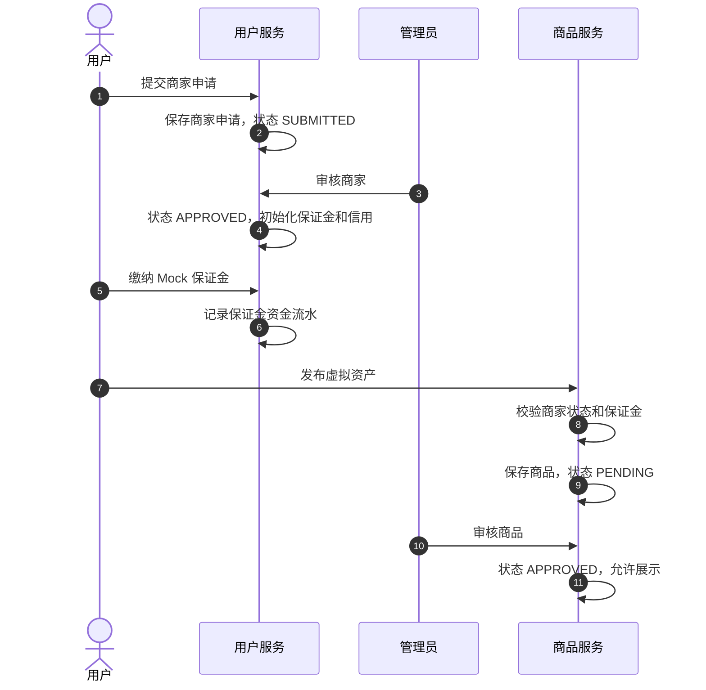
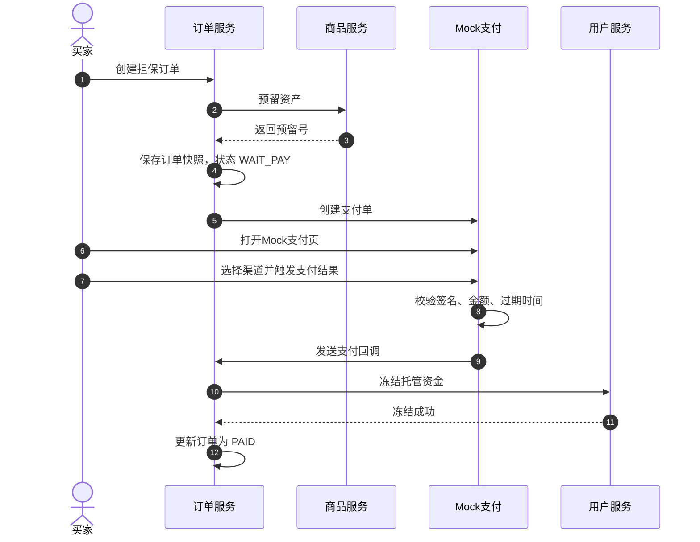
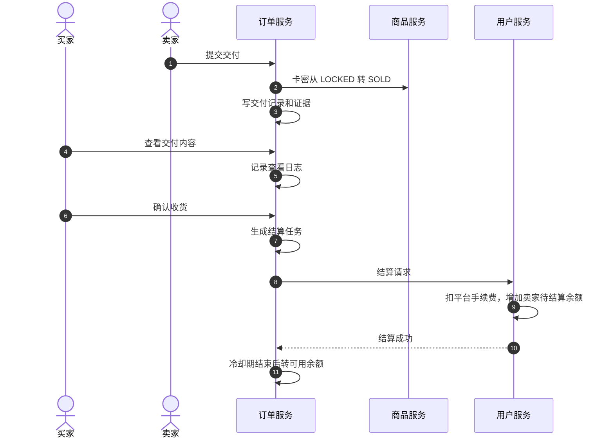
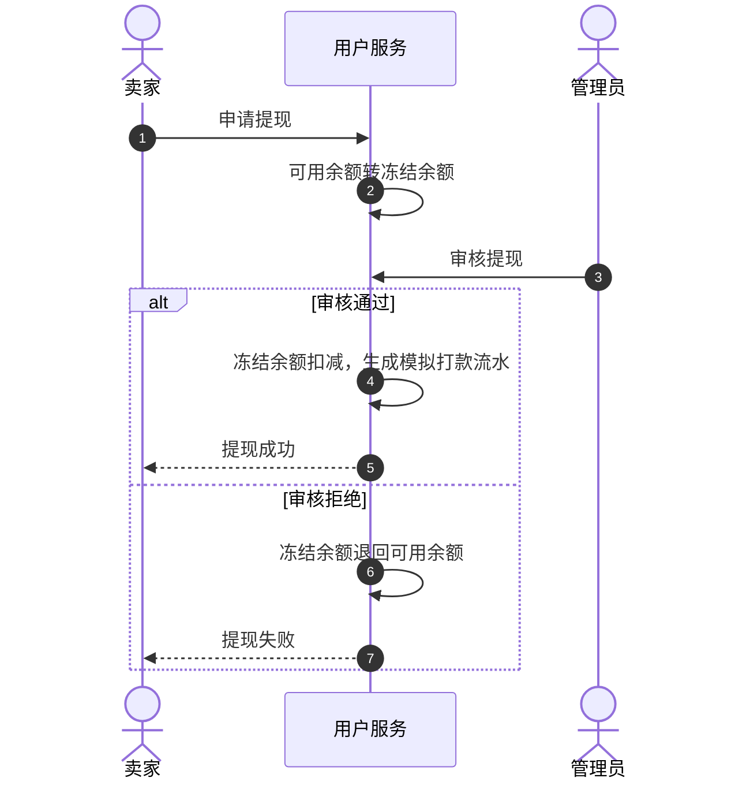
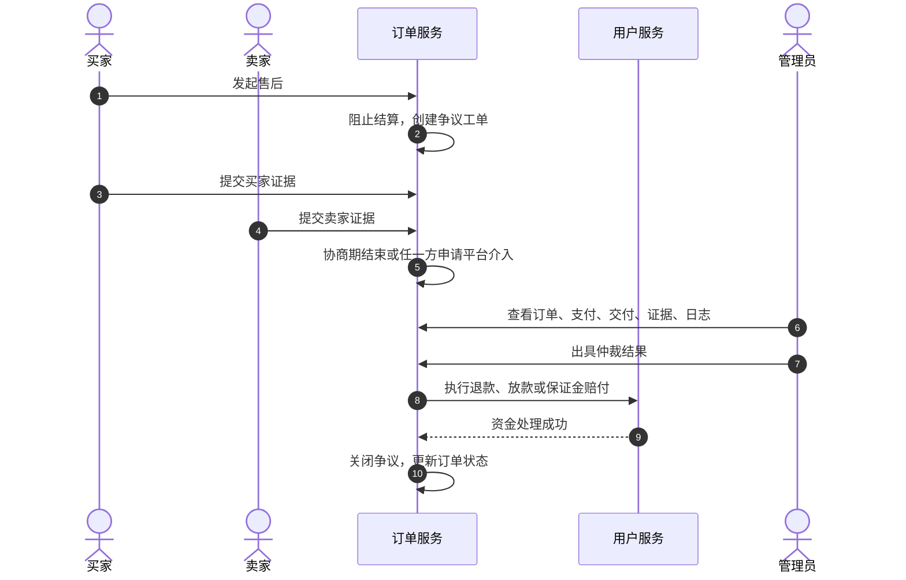

# 虚拟资产商城阶段一设计开发文档

> 文档性质：阶段一增量设计与开发指引  
> 项目定位：学习型虚拟资产 C2C 担保交易平台  
> 核心目标：在不接真实支付、短信、KYC、银行卡提现的前提下，完整实现可演示、可测试、可扩展的担保交易业务闭环。

---

## 1. 设计范围

### 1.1 本阶段只设计新功能

本阶段不重复设计已经实现的功能，已有能力直接复用。

### 1.2 已有能力盘点

| 模块 | 当前已有能力 | 阶段一处理方式 |
|---|---|---|
| 用户认证 | 邮箱验证码、注册、登录、JWT、密码加密 | 复用，不重构 |
| 用户上下文 | JWT 解析、`UserContext`、登录态透传 | 复用，并补充角色权限 |
| 商品展示 | 商品列表、商品详情、类目字段、首页展示 | 复用，扩展虚拟资产字段 |
| 秒杀能力 | 场次、动态 Token、Redis 扣减、MQ 削峰 | 保留，不作为担保交易主链路 |
| 普通订单 | TCC 创建订单、支付状态原型、订单查询 | 保留为旧链路，新担保交易使用新订单表 |
| 分布式事务 | Seata TCC、库存预留、回滚、防悬挂 | 复用思想，扩展资产预留能力 |
| 消息队列 | RocketMQ 事务消息、异步消费、削峰 | 复用，用于支付、结算、通知等事件 |
| 定时任务 | XXL-Job 配置与任务处理 | 复用，新增担保交易状态推进任务 |
| 审计日志 | AOP、同步/异步落库、操作留痕 | 复用，所有后台审核和资金操作必须接入 |
| 积分体系 | 积分账户、动账流水、幂等 | 保留，不作为资金账本使用 |

### 1.3 阶段一新增能力

阶段一新增以下能力：

1. 商家申请、审核、保证金。
2. 虚拟资产挂售、审核、卡密库存。
3. 担保交易订单。
4. Mock 支付网关。
5. 平台内部资金账本。
6. 卖家交付与交付证据。
7. 买家确认与自动确认。
8. 手续费结算与冷却期。
9. 卖家提现与提现审核。
10. 售后争议与人工仲裁。
11. 交易评价与商家基础信用。
12. 管理后台运营能力。

### 1.4 阶段一明确不做

| 不做项 | 原因 |
|---|---|
| 真实微信支付 / 支付宝 | 学习项目无法申请商户资质 |
| 真实银行卡提现 | 无真实资金通道 |
| 真实 KYC | 用资料提交和后台审核模拟 |
| 复杂风控规则引擎 | 阶段二实现 |
| 关系图谱 / 黑产识别 | 阶段二实现 |
| Agent 智能客服 / 仲裁助手 | 阶段三实现 |
| 拍卖、竞价、报价 | 不属于阶段一主链路 |
| NFT、区块链、虚拟货币 | 业务边界过宽，风险叙事不佳 |
| 复杂 IM | 用订单消息和售后留言替代 |
| 推荐算法 | 数据不足，阶段一价值低 |

---

## 2. 业务目标与验收问题

### 2.1 核心业务链路

阶段一必须跑通：

```text
商家提交申请
  -> 管理员审核商家
  -> 商家缴纳保证金
  -> 商家发布虚拟资产
  -> 管理员审核商品
  -> 买家创建担保订单
  -> 买家完成 Mock 支付
  -> 平台冻结交易资金
  -> 卖家交付资产
  -> 买家确认收货
  -> 平台计算手续费
  -> 卖家资金进入待结算
  -> 冷却期结束
  -> 卖家资金进入可用余额
  -> 卖家申请提现
  -> 管理员审核提现
  -> 模拟打款
```

### 2.2 系统必须回答的问题

每笔订单必须能回答：

1. 订单当前处于什么状态？
2. 支付是否成功？
3. 资金当前在哪个账户？
4. 卖家是否已经交付？
5. 买家是否已经查看和确认？
6. 平台手续费是多少？
7. 卖家实际应得多少？
8. 什么时候可以结算？
9. 卖家可以提现多少？
10. 如果发生纠纷，资金如何处理？
11. 每一步操作是谁做的？
12. 每一步证据是否可追溯？

---

## 3. 总体架构设计

### 3.1 服务边界

阶段一不新增微服务模块，优先在现有四个模块中扩展，避免为了架构而架构。

```text
mall-parent
├── mall-api
│   ├── trade DTO
│   ├── account Dubbo API
│   ├── asset reservation Dubbo API
│   └── merchant Dubbo API
├── mall-user-service
│   ├── merchant
│   ├── account
│   ├── deposit
│   ├── withdraw
│   └── merchant credit
├── mall-item-service
│   ├── asset listing
│   ├── item audit
│   ├── card secret
│   └── asset reservation
└── mall-order-service
    ├── trade order
    ├── mock payment
    ├── delivery
    ├── settlement
    ├── dispute
    └── arbitration
```

### 3.2 服务职责

| 服务 | 新增职责 | 不负责 |
|---|---|---|
| `mall-user-service` | 商家、保证金、账户、资金流水、提现、商家信用 | 商品审核、订单状态机 |
| `mall-item-service` | 商品发布、商品审核、卡密库存、资产预留 | 资金操作 |
| `mall-order-service` | 担保订单、Mock 支付、交付、结算、售后、仲裁 | 直接修改商品库存和用户余额 |
| `mall-api` | 跨服务 DTO 与 Dubbo 接口 | 业务实现 |

### 3.3 跨服务调用原则

1. 订单服务不得直连 `db_user`、`db_item`。
2. 商品服务不得直连 `db_order`、`db_user`。
3. 用户服务不得直连 `db_order`、`db_item`。
4. 所有跨服务资金操作必须通过 Dubbo 接口。
5. 所有跨服务操作必须带幂等键。
6. 所有跨服务失败必须有补偿任务或重试机制。

---

## 4. 数据库设计

阶段一采用三个数据库：

- `db_user`：用户、商家、账户、资金流水、提现。
- `db_item`：商品、类目、卡密、资产预留。
- `db_order`：担保订单、支付、交付、售后、仲裁。

### 4.1 用户与商家库 `db_user`

#### 4.1.1 用户表扩展

已有 `t_user` 保留，只增加角色字段。

```sql
USE db_user;

ALTER TABLE `t_user`
ADD COLUMN `role` varchar(16) NOT NULL DEFAULT 'USER' COMMENT '用户角色: USER-普通用户, ADMIN-管理员';
```

说明：

- `USER`：普通买家或潜在卖家。
- `ADMIN`：后台管理员。
- 商家不是独立角色，而是通过 `t_merchant` 表表达，同一个用户可以既买又卖。

#### 4.1.2 商家表

```sql
CREATE TABLE `t_merchant` (
    `id` bigint unsigned NOT NULL AUTO_INCREMENT COMMENT '商家ID',
    `user_id` bigint unsigned NOT NULL COMMENT '关联用户ID',
    `merchant_name` varchar(64) NOT NULL COMMENT '商家名称',
    `contact_email` varchar(128) NOT NULL COMMENT '联系邮箱',
    `introduction` varchar(512) DEFAULT NULL COMMENT '商家介绍',
    `status` varchar(16) NOT NULL DEFAULT 'SUBMITTED' COMMENT '状态: SUBMITTED-待审核, APPROVED-已通过, REJECTED-已拒绝, FROZEN-已冻结, CLOSED-已关闭',
    `level` tinyint NOT NULL DEFAULT 1 COMMENT '商家等级',
    `reject_reason` varchar(255) DEFAULT NULL COMMENT '拒绝原因',
    `created_time` datetime(3) NOT NULL DEFAULT CURRENT_TIMESTAMP(3),
    `updated_time` datetime(3) NOT NULL DEFAULT CURRENT_TIMESTAMP(3) ON UPDATE CURRENT_TIMESTAMP(3),
    PRIMARY KEY (`id`),
    UNIQUE KEY `uk_user_id` (`user_id`),
    UNIQUE KEY `uk_merchant_name` (`merchant_name`),
    KEY `idx_status` (`status`)
) ENGINE=InnoDB DEFAULT CHARSET=utf8mb4 COMMENT='虚拟资产商家表';
```

#### 4.1.3 商家审核记录表

```sql
CREATE TABLE `t_merchant_audit` (
    `id` bigint unsigned NOT NULL AUTO_INCREMENT,
    `merchant_id` bigint unsigned NOT NULL,
    `action` varchar(16) NOT NULL COMMENT '动作: SUBMIT, APPROVE, REJECT, FREEZE, UNFREEZE',
    `auditor_id` bigint unsigned DEFAULT NULL COMMENT '审核人ID',
    `reason` varchar(255) DEFAULT NULL,
    `created_time` datetime(3) NOT NULL DEFAULT CURRENT_TIMESTAMP(3),
    PRIMARY KEY (`id`),
    KEY `idx_merchant_id` (`merchant_id`),
    KEY `idx_created_time` (`created_time`)
) ENGINE=InnoDB DEFAULT CHARSET=utf8mb4 COMMENT='商家审核记录表';
```

#### 4.1.4 商家保证金表

```sql
CREATE TABLE `t_merchant_deposit` (
    `id` bigint unsigned NOT NULL AUTO_INCREMENT,
    `merchant_id` bigint unsigned NOT NULL COMMENT '商家ID',
    `total_amount` decimal(18,2) NOT NULL DEFAULT 0.00 COMMENT '累计缴纳保证金',
    `frozen_amount` decimal(18,2) NOT NULL DEFAULT 0.00 COMMENT '仲裁冻结金额',
    `deducted_amount` decimal(18,2) NOT NULL DEFAULT 0.00 COMMENT '已扣除赔付金额',
    `updated_time` datetime(3) NOT NULL DEFAULT CURRENT_TIMESTAMP(3) ON UPDATE CURRENT_TIMESTAMP(3),
    `created_time` datetime(3) NOT NULL DEFAULT CURRENT_TIMESTAMP(3),
    PRIMARY KEY (`id`),
    UNIQUE KEY `uk_merchant_id` (`merchant_id`)
) ENGINE=InnoDB DEFAULT CHARSET=utf8mb4 COMMENT='商家保证金账户表';
```

可用保证金不单独存字段，统一计算：

```text
available_deposit = total_amount - frozen_amount - deducted_amount
```

#### 4.1.5 用户资金账户表

```sql
CREATE TABLE `t_user_account` (
    `user_id` bigint unsigned NOT NULL COMMENT '用户ID',
    `available_amount` decimal(18,2) NOT NULL DEFAULT 0.00 COMMENT '可提现余额',
    `pending_settle_amount` decimal(18,2) NOT NULL DEFAULT 0.00 COMMENT '待结算余额',
    `frozen_amount` decimal(18,2) NOT NULL DEFAULT 0.00 COMMENT '提现冻结或争议冻结金额',
    `version` int NOT NULL DEFAULT 0 COMMENT '乐观锁版本',
    `created_time` datetime(3) NOT NULL DEFAULT CURRENT_TIMESTAMP(3),
    `updated_time` datetime(3) NOT NULL DEFAULT CURRENT_TIMESTAMP(3) ON UPDATE CURRENT_TIMESTAMP(3),
    PRIMARY KEY (`user_id`)
) ENGINE=InnoDB DEFAULT CHARSET=utf8mb4 COMMENT='用户内部资金账户表';
```

说明：

- 买家通过 Mock 支付付款，不要求买家先充值到平台余额。
- 买家账户主要用于接收可能的选择性退款，也可以在后续扩展中支持余额支付。
- 卖家账户是阶段一的核心，用于待结算、可用余额和提现。

#### 4.1.6 平台账户表

```sql
CREATE TABLE `t_platform_account` (
    `id` bigint unsigned NOT NULL AUTO_INCREMENT,
    `account_code` varchar(32) NOT NULL COMMENT '账户编码: PLATFORM_MAIN',
    `escrow_amount` decimal(18,2) NOT NULL DEFAULT 0.00 COMMENT '担保交易冻结总额',
    `revenue_amount` decimal(18,2) NOT NULL DEFAULT 0.00 COMMENT '平台手续费收入',
    `withdraw_pending_amount` decimal(18,2) NOT NULL DEFAULT 0.00 COMMENT '提现处理中金额',
    `deposit_amount` decimal(18,2) NOT NULL DEFAULT 0.00 COMMENT '商家保证金总额',
    `version` int NOT NULL DEFAULT 0,
    `updated_time` datetime(3) NOT NULL DEFAULT CURRENT_TIMESTAMP(3) ON UPDATE CURRENT_TIMESTAMP(3),
    `created_time` datetime(3) NOT NULL DEFAULT CURRENT_TIMESTAMP(3),
    PRIMARY KEY (`id`),
    UNIQUE KEY `uk_account_code` (`account_code`)
) ENGINE=InnoDB DEFAULT CHARSET=utf8mb4 COMMENT='平台内部账户表';
```

#### 4.1.7 资金交易头表

```sql
CREATE TABLE `t_fund_transaction` (
    `id` bigint unsigned NOT NULL AUTO_INCREMENT,
    `transaction_no` varchar(64) NOT NULL COMMENT '资金交易号',
    `business_type` varchar(32) NOT NULL COMMENT '业务类型: PAY_FREEZE, REFUND, SETTLE, FEE, DEPOSIT_PAY, DEPOSIT_DEDUCT, WITHDRAW_FREEZE, WITHDRAW_PAYOUT, WITHDRAW_REJECT',
    `order_no` varchar(64) DEFAULT NULL COMMENT '关联交易订单号',
    `withdraw_no` varchar(64) DEFAULT NULL COMMENT '关联提现单号',
    `merchant_id` bigint unsigned DEFAULT NULL,
    `user_id` bigint unsigned DEFAULT NULL,
    `amount` decimal(18,2) NOT NULL COMMENT '交易总金额',
    `status` varchar(16) NOT NULL DEFAULT 'SUCCESS' COMMENT '状态: SUCCESS, FAILED',
    `idempotency_key` varchar(128) NOT NULL COMMENT '幂等键',
    `remark` varchar(255) DEFAULT NULL,
    `created_time` datetime(3) NOT NULL DEFAULT CURRENT_TIMESTAMP(3),
    PRIMARY KEY (`id`),
    UNIQUE KEY `uk_transaction_no` (`transaction_no`),
    UNIQUE KEY `uk_idempotency_key` (`idempotency_key`),
    KEY `idx_order_no` (`order_no`),
    KEY `idx_withdraw_no` (`withdraw_no`),
    KEY `idx_user_id` (`user_id`)
) ENGINE=InnoDB DEFAULT CHARSET=utf8mb4 COMMENT='资金交易头表';
```

#### 4.1.8 资金流水明细表

```sql
CREATE TABLE `t_fund_flow` (
    `id` bigint unsigned NOT NULL AUTO_INCREMENT,
    `transaction_no` varchar(64) NOT NULL COMMENT '资金交易号',
    `owner_type` varchar(16) NOT NULL COMMENT '账户归属: USER, MERCHANT, PLATFORM, EXTERNAL',
    `owner_id` bigint unsigned DEFAULT NULL COMMENT '归属ID，平台账户可为空',
    `account_type` varchar(32) NOT NULL COMMENT '账户类型: AVAILABLE, PENDING_SETTLE, FROZEN, DEPOSIT, ESCROW, REVENUE, WITHDRAW_PENDING, EXTERNAL_CHANNEL',
    `direction` varchar(8) NOT NULL COMMENT '方向: DEBIT, CREDIT',
    `amount` decimal(18,2) NOT NULL,
    `balance_after` decimal(18,2) DEFAULT NULL COMMENT '记账后余额，外部账户可为空',
    `memo` varchar(255) DEFAULT NULL,
    `created_time` datetime(3) NOT NULL DEFAULT CURRENT_TIMESTAMP(3),
    PRIMARY KEY (`id`),
    UNIQUE KEY `uk_tx_owner_account_direction` (`transaction_no`, `owner_type`, `owner_id`, `account_type`, `direction`),
    KEY `idx_owner` (`owner_type`, `owner_id`, `account_type`),
    KEY `idx_created_time` (`created_time`)
) ENGINE=InnoDB DEFAULT CHARSET=utf8mb4 COMMENT='资金流水明细表';
```

账务设计采用交易头表 + 明细流水：

- `t_fund_transaction` 表示一次业务资金动作。
- `t_fund_flow` 表示该动作影响的一个或多个账户。
- 所有资金变动必须同时写头表和流水。
- 不允许只更新余额不写流水。

#### 4.1.9 提现申请表

```sql
CREATE TABLE `t_withdraw_request` (
    `id` bigint unsigned NOT NULL AUTO_INCREMENT,
    `withdraw_no` varchar(64) NOT NULL COMMENT '提现单号',
    `merchant_id` bigint unsigned NOT NULL,
    `user_id` bigint unsigned NOT NULL,
    `amount` decimal(18,2) NOT NULL COMMENT '提现金额',
    `mock_account` varchar(128) NOT NULL COMMENT '模拟收款账户，展示时脱敏',
    `status` varchar(24) NOT NULL DEFAULT 'SUBMITTED' COMMENT '状态: SUBMITTED, AUDITING, APPROVED, REJECTED, PAYOUT_SUCCESS, PAYOUT_FAILED',
    `audit_admin_id` bigint unsigned DEFAULT NULL,
    `audit_reason` varchar(255) DEFAULT NULL,
    `mock_payout_no` varchar(64) DEFAULT NULL COMMENT '模拟打款流水号',
    `created_time` datetime(3) NOT NULL DEFAULT CURRENT_TIMESTAMP(3),
    `updated_time` datetime(3) NOT NULL DEFAULT CURRENT_TIMESTAMP(3) ON UPDATE CURRENT_TIMESTAMP(3),
    PRIMARY KEY (`id`),
    UNIQUE KEY `uk_withdraw_no` (`withdraw_no`),
    KEY `idx_user_id` (`user_id`),
    KEY `idx_merchant_id` (`merchant_id`),
    KEY `idx_status_time` (`status`, `created_time`)
) ENGINE=InnoDB DEFAULT CHARSET=utf8mb4 COMMENT='卖家提现申请表';
```

#### 4.1.10 手续费配置表

```sql
CREATE TABLE `t_fee_config` (
    `id` bigint unsigned NOT NULL AUTO_INCREMENT,
    `category_id` bigint unsigned NOT NULL COMMENT '类目ID',
    `merchant_level` tinyint NOT NULL DEFAULT 1 COMMENT '商家等级',
    `fee_rate` decimal(6,4) NOT NULL COMMENT '费率，例如0.0200表示2%',
    `min_fee` decimal(10,2) NOT NULL DEFAULT 0.01,
    `max_fee` decimal(10,2) NOT NULL DEFAULT 100.00,
    `enabled` tinyint NOT NULL DEFAULT 1,
    `created_time` datetime(3) NOT NULL DEFAULT CURRENT_TIMESTAMP(3),
    `updated_time` datetime(3) NOT NULL DEFAULT CURRENT_TIMESTAMP(3) ON UPDATE CURRENT_TIMESTAMP(3),
    PRIMARY KEY (`id`),
    UNIQUE KEY `uk_category_level` (`category_id`, `merchant_level`)
) ENGINE=InnoDB DEFAULT CHARSET=utf8mb4 COMMENT='交易手续费配置表';
```

#### 4.1.11 商家信用表

```sql
CREATE TABLE `t_merchant_credit` (
    `merchant_id` bigint unsigned NOT NULL,
    `total_order_count` int NOT NULL DEFAULT 0 COMMENT '总订单数',
    `completed_order_count` int NOT NULL DEFAULT 0 COMMENT '完成订单数',
    `refund_order_count` int NOT NULL DEFAULT 0 COMMENT '退款订单数',
    `dispute_order_count` int NOT NULL DEFAULT 0 COMMENT '争议订单数',
    `avg_score` decimal(3,2) NOT NULL DEFAULT 5.00 COMMENT '平均评分',
    `credit_score` int NOT NULL DEFAULT 80 COMMENT '信用分',
    `updated_time` datetime(3) NOT NULL DEFAULT CURRENT_TIMESTAMP(3) ON UPDATE CURRENT_TIMESTAMP(3),
    `created_time` datetime(3) NOT NULL DEFAULT CURRENT_TIMESTAMP(3),
    PRIMARY KEY (`merchant_id`)
) ENGINE=InnoDB DEFAULT CHARSET=utf8mb4 COMMENT='商家信用统计表';
```

---

### 4.2 商品与资产库 `db_item`

#### 4.2.1 商品类目表

```sql
USE db_item;

CREATE TABLE `t_item_category` (
    `id` bigint unsigned NOT NULL AUTO_INCREMENT,
    `category_name` varchar(64) NOT NULL,
    `parent_id` bigint unsigned DEFAULT NULL,
    `asset_type` varchar(32) NOT NULL COMMENT '资产类型: VIRTUAL_SKIN, CARD, GAME_ITEM',
    `delivery_mode` varchar(32) NOT NULL COMMENT '交付方式: AUTO_CARD, MANUAL_DELIVERY',
    `required_deposit` decimal(18,2) NOT NULL DEFAULT 100.00 COMMENT '该类目最低保证金',
    `sort_order` int NOT NULL DEFAULT 0,
    `enabled` tinyint NOT NULL DEFAULT 1,
    `created_time` datetime(3) NOT NULL DEFAULT CURRENT_TIMESTAMP(3),
    `updated_time` datetime(3) NOT NULL DEFAULT CURRENT_TIMESTAMP(3) ON UPDATE CURRENT_TIMESTAMP(3),
    PRIMARY KEY (`id`),
    KEY `idx_parent_id` (`parent_id`),
    KEY `idx_asset_type` (`asset_type`)
) ENGINE=InnoDB DEFAULT CHARSET=utf8mb4 COMMENT='虚拟资产类目表';
```

#### 4.2.2 商品表扩展

```sql
ALTER TABLE `t_item`
ADD COLUMN `merchant_id` bigint unsigned NOT NULL COMMENT '商家ID',
ADD COLUMN `asset_type` varchar(32) NOT NULL COMMENT '资产类型: VIRTUAL_SKIN, CARD, GAME_ITEM',
ADD COLUMN `delivery_mode` varchar(32) NOT NULL COMMENT '交付方式: AUTO_CARD, MANUAL_DELIVERY',
ADD COLUMN `source_description` varchar(512) DEFAULT NULL COMMENT '资产来源说明',
ADD COLUMN `risk_notice` varchar(1024) NOT NULL COMMENT '风险声明',
ADD COLUMN `audit_status` varchar(16) NOT NULL DEFAULT 'DRAFT' COMMENT '审核状态: DRAFT, PENDING, APPROVED, REJECTED',
ADD COLUMN `audit_remark` varchar(255) DEFAULT NULL COMMENT '审核备注';

ALTER TABLE `t_item`
ADD INDEX `idx_merchant_status` (`merchant_id`, `status`),
ADD INDEX `idx_audit_status` (`audit_status`),
ADD INDEX `idx_asset_type` (`asset_type`);
```

#### 4.2.3 商品审核记录表

```sql
CREATE TABLE `t_item_audit` (
    `id` bigint unsigned NOT NULL AUTO_INCREMENT,
    `item_id` bigint unsigned NOT NULL,
    `action` varchar(16) NOT NULL COMMENT '动作: SUBMIT, APPROVE, REJECT, OFFLINE',
    `auditor_id` bigint unsigned DEFAULT NULL,
    `reason` varchar(255) DEFAULT NULL,
    `created_time` datetime(3) NOT NULL DEFAULT CURRENT_TIMESTAMP(3),
    PRIMARY KEY (`id`),
    KEY `idx_item_id` (`item_id`),
    KEY `idx_created_time` (`created_time`)
) ENGINE=InnoDB DEFAULT CHARSET=utf8mb4 COMMENT='商品审核记录表';
```

#### 4.2.4 卡密库存表

```sql
CREATE TABLE `t_card_secret` (
    `id` bigint unsigned NOT NULL AUTO_INCREMENT,
    `item_id` bigint unsigned NOT NULL,
    `merchant_id` bigint unsigned NOT NULL,
    `secret_cipher` varbinary(1024) NOT NULL COMMENT '卡密AES-GCM加密密文',
    `secret_hash` char(64) NOT NULL COMMENT '卡密SHA-256哈希，用于查重',
    `secret_mask` varchar(64) NOT NULL COMMENT '脱敏展示值',
    `status` varchar(16) NOT NULL DEFAULT 'AVAILABLE' COMMENT '状态: AVAILABLE, LOCKED, SOLD, INVALID',
    `order_no` varchar(64) DEFAULT NULL COMMENT '锁定或售出的订单号',
    `reservation_no` varchar(64) DEFAULT NULL COMMENT '资产预留号',
    `locked_time` datetime(3) DEFAULT NULL,
    `sold_time` datetime(3) DEFAULT NULL,
    `created_time` datetime(3) NOT NULL DEFAULT CURRENT_TIMESTAMP(3),
    `updated_time` datetime(3) NOT NULL DEFAULT CURRENT_TIMESTAMP(3) ON UPDATE CURRENT_TIMESTAMP(3),
    PRIMARY KEY (`id`),
    UNIQUE KEY `uk_item_hash` (`item_id`, `secret_hash`),
    KEY `idx_item_status` (`item_id`, `status`),
    KEY `idx_order_no` (`order_no`),
    KEY `idx_reservation_no` (`reservation_no`)
) ENGINE=InnoDB DEFAULT CHARSET=utf8mb4 COMMENT='卡密库存表';
```

卡密安全要求：

1. 明文卡密只在卖家批量录入时短暂出现。
2. 入库前使用 AES-GCM 加密。
3. 数据库不保存明文。
4. 管理员审核只能看到 `secret_mask`。
5. 买家支付成功且订单进入可交付状态后才能解密查看。
6. 每次查看明文必须写入日志。

#### 4.2.5 资产预留表

```sql
CREATE TABLE `t_asset_reservation` (
    `id` bigint unsigned NOT NULL AUTO_INCREMENT,
    `reservation_no` varchar(64) NOT NULL COMMENT '资产预留号',
    `order_no` varchar(64) NOT NULL COMMENT '交易订单号',
    `item_id` bigint unsigned NOT NULL,
    `merchant_id` bigint unsigned NOT NULL,
    `asset_type` varchar(32) NOT NULL,
    `quantity` int NOT NULL DEFAULT 1,
    `card_secret_ids` json DEFAULT NULL COMMENT '预留的卡密ID列表',
    `status` varchar(16) NOT NULL DEFAULT 'RESERVED' COMMENT '状态: RESERVED, CONFIRMED, RELEASED, CONSUMED',
    `expire_time` datetime(3) NOT NULL COMMENT '预留过期时间',
    `created_time` datetime(3) NOT NULL DEFAULT CURRENT_TIMESTAMP(3),
    `updated_time` datetime(3) NOT NULL DEFAULT CURRENT_TIMESTAMP(3) ON UPDATE CURRENT_TIMESTAMP(3),
    PRIMARY KEY (`id`),
    UNIQUE KEY `uk_reservation_no` (`reservation_no`),
    UNIQUE KEY `uk_order_no` (`order_no`),
    KEY `idx_item_status` (`item_id`, `status`),
    KEY `idx_expire_time` (`expire_time`)
) ENGINE=InnoDB DEFAULT CHARSET=utf8mb4 COMMENT='交易资产预留表';
```

---

### 4.3 交易与售后库 `db_order`

#### 4.3.1 担保交易订单表

```sql
USE db_order;

CREATE TABLE `t_trade_order` (
    `id` bigint unsigned NOT NULL AUTO_INCREMENT,
    `order_no` varchar(64) NOT NULL COMMENT '担保交易订单号',
    `buyer_id` bigint unsigned NOT NULL,
    `seller_id` bigint unsigned NOT NULL,
    `merchant_id` bigint unsigned NOT NULL,
    `item_id` bigint unsigned NOT NULL,
    `item_snapshot` json NOT NULL COMMENT '交易时商品快照',
    `quantity` int NOT NULL DEFAULT 1,
    `order_amount` decimal(18,2) NOT NULL,
    `fee_amount` decimal(18,2) NOT NULL DEFAULT 0.00,
    `seller_income` decimal(18,2) NOT NULL DEFAULT 0.00,
    `order_status` varchar(24) NOT NULL DEFAULT 'CREATED' COMMENT '订单状态',
    `pay_status` varchar(24) NOT NULL DEFAULT 'INIT' COMMENT '支付状态',
    `delivery_status` varchar(24) NOT NULL DEFAULT 'WAIT_DELIVERY' COMMENT '交付状态',
    `escrow_status` varchar(24) NOT NULL DEFAULT 'NONE' COMMENT '资金托管状态',
    `dispute_status` varchar(24) NOT NULL DEFAULT 'NONE' COMMENT '售后状态',
    `payment_no` varchar(64) DEFAULT NULL,
    `pay_deadline` datetime(3) DEFAULT NULL,
    `delivery_deadline` datetime(3) DEFAULT NULL,
    `delivered_time` datetime(3) DEFAULT NULL,
    `confirmed_time` datetime(3) DEFAULT NULL,
    `auto_confirm_time` datetime(3) DEFAULT NULL,
    `settle_available_time` datetime(3) DEFAULT NULL,
    `settled_time` datetime(3) DEFAULT NULL,
    `version` int NOT NULL DEFAULT 0,
    `created_time` datetime(3) NOT NULL DEFAULT CURRENT_TIMESTAMP(3),
    `updated_time` datetime(3) NOT NULL DEFAULT CURRENT_TIMESTAMP(3) ON UPDATE CURRENT_TIMESTAMP(3),
    PRIMARY KEY (`id`),
    UNIQUE KEY `uk_order_no` (`order_no`),
    KEY `idx_buyer_status` (`buyer_id`, `order_status`),
    KEY `idx_seller_status` (`seller_id`, `order_status`),
    KEY `idx_merchant_status` (`merchant_id`, `order_status`),
    KEY `idx_item_id` (`item_id`),
    KEY `idx_auto_confirm` (`order_status`, `auto_confirm_time`),
    KEY `idx_settle_time` (`escrow_status`, `settle_available_time`)
    KEY `idx_pay_deadline` (`order_status`, `pay_deadline`)
) ENGINE=InnoDB DEFAULT CHARSET=utf8mb4 COMMENT='虚拟资产担保交易订单表';
```

#### 4.3.2 订单状态流转日志表

```sql
CREATE TABLE `t_trade_order_status_log` (
    `id` bigint unsigned NOT NULL AUTO_INCREMENT,
    `order_no` varchar(64) NOT NULL,
    `from_status` varchar(32) DEFAULT NULL,
    `to_status` varchar(32) NOT NULL,
    `status_type` varchar(32) NOT NULL COMMENT '状态维度: ORDER, PAY, DELIVERY, ESCROW, DISPUTE',
    `operator_type` varchar(16) NOT NULL COMMENT '操作者: BUYER, SELLER, ADMIN, SYSTEM',
    `operator_id` bigint unsigned DEFAULT NULL,
    `reason` varchar(255) DEFAULT NULL,
    `created_time` datetime(3) NOT NULL DEFAULT CURRENT_TIMESTAMP(3),
    PRIMARY KEY (`id`),
    KEY `idx_order_no` (`order_no`),
    KEY `idx_created_time` (`created_time`)
) ENGINE=InnoDB DEFAULT CHARSET=utf8mb4 COMMENT='担保订单状态流转日志表';
```

#### 4.3.3 Mock 支付单表

```sql
CREATE TABLE `t_payment_order` (
    `id` bigint unsigned NOT NULL AUTO_INCREMENT,
    `payment_no` varchar(64) NOT NULL COMMENT '支付单号',
    `order_no` varchar(64) NOT NULL,
    `channel` varchar(24) NOT NULL COMMENT '渠道: MOCK_WECHAT, MOCK_ALIPAY',
    `amount` decimal(18,2) NOT NULL,
    `status` varchar(24) NOT NULL DEFAULT 'INIT' COMMENT '状态: INIT, PAYING, SUCCESS, FAIL, TIMEOUT, REFUNDING, REFUNDED',
    `callback_token_hash` char(64) DEFAULT NULL COMMENT '回调签名Token哈希',
    `expire_time` datetime(3) NOT NULL,
    `created_time` datetime(3) NOT NULL DEFAULT CURRENT_TIMESTAMP(3),
    `updated_time` datetime(3) NOT NULL DEFAULT CURRENT_TIMESTAMP(3) ON UPDATE CURRENT_TIMESTAMP(3),
    PRIMARY KEY (`id`),
    UNIQUE KEY `uk_payment_no` (`payment_no`),
    UNIQUE KEY `uk_order_no` (`order_no`),
    KEY `idx_status_expire` (`status`, `expire_time`)
) ENGINE=InnoDB DEFAULT CHARSET=utf8mb4 COMMENT='Mock支付单表';
```

#### 4.3.4 Mock 支付回调表

```sql
CREATE TABLE `t_payment_callback` (
    `id` bigint unsigned NOT NULL AUTO_INCREMENT,
    `callback_no` varchar(64) NOT NULL,
    `payment_no` varchar(64) NOT NULL,
    `result` varchar(16) NOT NULL COMMENT '回调结果: SUCCESS, FAIL, TIMEOUT',
    `amount` decimal(18,2) NOT NULL,
    `signature` varchar(128) NOT NULL COMMENT 'Mock签名',
    `raw_payload` text NOT NULL,
    `received_time` datetime(3) NOT NULL DEFAULT CURRENT_TIMESTAMP(3),
    PRIMARY KEY (`id`),
    UNIQUE KEY `uk_callback_no` (`callback_no`),
    KEY `idx_payment_no` (`payment_no`)
) ENGINE=InnoDB DEFAULT CHARSET=utf8mb4 COMMENT='Mock支付回调记录表';
```

#### 4.3.5 交付记录表

```sql
CREATE TABLE `t_delivery_record` (
    `id` bigint unsigned NOT NULL AUTO_INCREMENT,
    `order_no` varchar(64) NOT NULL,
    `delivery_type` varchar(24) NOT NULL COMMENT '交付类型: AUTO_CARD, MANUAL_DELIVERY',
    `delivery_content` text DEFAULT NULL COMMENT '交付说明，不含卡密明文',
    `card_secret_ids` json DEFAULT NULL,
    `status` varchar(24) NOT NULL DEFAULT 'DELIVERED' COMMENT '状态: DELIVERED, VIEWED, CONFIRMED, FAILED',
    `delivered_time` datetime(3) NOT NULL DEFAULT CURRENT_TIMESTAMP(3),
    `first_view_time` datetime(3) DEFAULT NULL,
    `confirmed_time` datetime(3) DEFAULT NULL,
    PRIMARY KEY (`id`),
    UNIQUE KEY `uk_order_no` (`order_no`)
) ENGINE=InnoDB DEFAULT CHARSET=utf8mb4 COMMENT='交易交付记录表';
```

#### 4.3.6 交付证据表

```sql
CREATE TABLE `t_delivery_evidence` (
    `id` bigint unsigned NOT NULL AUTO_INCREMENT,
    `order_no` varchar(64) NOT NULL,
    `evidence_type` varchar(16) NOT NULL COMMENT '类型: IMAGE, VIDEO, TEXT',
    `file_url` varchar(512) DEFAULT NULL,
    `content` text DEFAULT NULL,
    `file_hash` char(64) DEFAULT NULL,
    `uploader_type` varchar(16) NOT NULL COMMENT '上传者: BUYER, SELLER, ADMIN, SYSTEM',
    `uploader_id` bigint unsigned DEFAULT NULL,
    `created_time` datetime(3) NOT NULL DEFAULT CURRENT_TIMESTAMP(3),
    PRIMARY KEY (`id`),
    KEY `idx_order_no` (`order_no`),
    KEY `idx_created_time` (`created_time`)
) ENGINE=InnoDB DEFAULT CHARSET=utf8mb4 COMMENT='交付证据表';
```

#### 4.3.7 售后争议表

```sql
CREATE TABLE `t_dispute` (
    `id` bigint unsigned NOT NULL AUTO_INCREMENT,
    `dispute_no` varchar(64) NOT NULL,
    `order_no` varchar(64) NOT NULL,
    `buyer_id` bigint unsigned NOT NULL,
    `seller_id` bigint unsigned NOT NULL,
    `dispute_type` varchar(32) NOT NULL COMMENT '类型: NOT_DELIVERED, INVALID_CARD, NOT_AS_DESCRIBED, DELIVERY_TIMEOUT, MALICIOUS_REFUND',
    `reason` varchar(1024) NOT NULL,
    `proposed_refund_amount` decimal(18,2) NOT NULL DEFAULT 0.00,
    `status` varchar(24) NOT NULL DEFAULT 'OPEN' COMMENT '状态: OPEN, NEGOTIATING, ARBITRATING, RESOLVED, APPEALED, CLOSED',
    `deadline_time` datetime(3) DEFAULT NULL,
    `created_time` datetime(3) NOT NULL DEFAULT CURRENT_TIMESTAMP(3),
    `updated_time` datetime(3) NOT NULL DEFAULT CURRENT_TIMESTAMP(3) ON UPDATE CURRENT_TIMESTAMP(3),
    PRIMARY KEY (`id`),
    UNIQUE KEY `uk_dispute_no` (`dispute_no`),
    UNIQUE KEY `uk_order_no` (`order_no`),
    KEY `idx_status_deadline` (`status`, `deadline_time`)
) ENGINE=InnoDB DEFAULT CHARSET=utf8mb4 COMMENT='交易售后争议表';
```

#### 4.3.8 售后留言表

```sql
CREATE TABLE `t_dispute_message` (
    `id` bigint unsigned NOT NULL AUTO_INCREMENT,
    `dispute_no` varchar(64) NOT NULL,
    `sender_type` varchar(16) NOT NULL COMMENT '发送者: BUYER, SELLER, ADMIN, SYSTEM',
    `sender_id` bigint unsigned DEFAULT NULL,
    `message` varchar(2048) NOT NULL,
    `attachment_url` varchar(512) DEFAULT NULL,
    `created_time` datetime(3) NOT NULL DEFAULT CURRENT_TIMESTAMP(3),
    PRIMARY KEY (`id`),
    KEY `idx_dispute_no` (`dispute_no`),
    KEY `idx_created_time` (`created_time`)
) ENGINE=InnoDB DEFAULT CHARSET=utf8mb4 COMMENT='售后争议留言表';
```

#### 4.3.9 仲裁结果表

```sql
CREATE TABLE `t_arbitration` (
    `id` bigint unsigned NOT NULL AUTO_INCREMENT,
    `dispute_no` varchar(64) NOT NULL,
    `order_no` varchar(64) NOT NULL,
    `result` varchar(32) NOT NULL COMMENT '结果: REFUND_ALL, RELEASE_ALL, PARTIAL_REFUND, DEPOSIT_COMPENSATE, CLOSE_WITHOUT_FAULT',
    `refund_amount` decimal(18,2) NOT NULL DEFAULT 0.00,
    `release_amount` decimal(18,2) NOT NULL DEFAULT 0.00,
    `deposit_deduct_amount` decimal(18,2) NOT NULL DEFAULT 0.00,
    `reason` varchar(1024) NOT NULL,
    `arbitrator_id` bigint unsigned NOT NULL,
    `appeal_status` varchar(16) NOT NULL DEFAULT 'NONE' COMMENT '申诉状态: NONE, SUBMITTED, PROCESSED',
    `created_time` datetime(3) NOT NULL DEFAULT CURRENT_TIMESTAMP(3),
    PRIMARY KEY (`id`),
    UNIQUE KEY `uk_dispute_no` (`dispute_no`),
    KEY `idx_order_no` (`order_no`)
) ENGINE=InnoDB DEFAULT CHARSET=utf8mb4 COMMENT='售后仲裁结果表';
```

#### 4.3.10 订单结算表

```sql
CREATE TABLE `t_order_settlement` (
    `id` bigint unsigned NOT NULL AUTO_INCREMENT,
    `order_no` varchar(64) NOT NULL,
    `order_amount` decimal(18,2) NOT NULL,
    `fee_amount` decimal(18,2) NOT NULL,
    `seller_income` decimal(18,2) NOT NULL,
    `status` varchar(24) NOT NULL DEFAULT 'PENDING' COMMENT '状态: PENDING, SUCCESS, FAILED',
    `fund_transaction_no` varchar(64) DEFAULT NULL,
    `settled_time` datetime(3) DEFAULT NULL,
    `created_time` datetime(3) NOT NULL DEFAULT CURRENT_TIMESTAMP(3),
    `updated_time` datetime(3) NOT NULL DEFAULT CURRENT_TIMESTAMP(3) ON UPDATE CURRENT_TIMESTAMP(3),
    PRIMARY KEY (`id`),
    UNIQUE KEY `uk_order_no` (`order_no`),
    KEY `idx_status` (`status`)
) ENGINE=InnoDB DEFAULT CHARSET=utf8mb4 COMMENT='订单结算表';
```

#### 4.3.11 订单评价表

```sql
CREATE TABLE `t_order_review` (
    `id` bigint unsigned NOT NULL AUTO_INCREMENT,
    `order_no` varchar(64) NOT NULL,
    `buyer_id` bigint unsigned NOT NULL,
    `merchant_id` bigint unsigned NOT NULL,
    `score` tinyint NOT NULL COMMENT '评分1-5',
    `content` varchar(1024) DEFAULT NULL,
    `created_time` datetime(3) NOT NULL DEFAULT CURRENT_TIMESTAMP(3),
    PRIMARY KEY (`id`),
    UNIQUE KEY `uk_order_no` (`order_no`),
    KEY `idx_merchant_score` (`merchant_id`, `score`)
) ENGINE=InnoDB DEFAULT CHARSET=utf8mb4 COMMENT='订单评价表';
```

#### 4.3.12 交易配置表

```sql
CREATE TABLE `t_trade_config` (
    `config_key` varchar(64) NOT NULL,
    `config_value` varchar(255) NOT NULL,
    `description` varchar(255) DEFAULT NULL,
    `updated_time` datetime(3) NOT NULL DEFAULT CURRENT_TIMESTAMP(3) ON UPDATE CURRENT_TIMESTAMP(3),
    PRIMARY KEY (`config_key`)
) ENGINE=InnoDB DEFAULT CHARSET=utf8mb4 COMMENT='担保交易配置表';
```

推荐初始配置：

```sql
INSERT INTO `t_trade_config` (`config_key`, `config_value`, `description`) VALUES
('payment.expire.minutes', '15', '支付超时时间'),
('delivery.timeout.minutes', '30', '卖家发货超时时间'),
('auto.confirm.hours', '24', '买家自动确认时间'),
('settle.cooldown.hours', '24', '确认后结算冷却期'),
('withdraw.min.amount', '10.00', '最低提现金额'),
('withdraw.daily.limit', '5000.00', '单日最高提现金额'),
('dispute.negotiate.hours', '24', '售后协商时长');
```

---

## 5. 核心状态机设计

### 5.1 状态枚举

#### 订单状态 `order_status`

```text
CREATED          订单创建中
WAIT_PAY         待支付
PAID             已支付，等待卖家交付
DELIVERED        已交付，等待买家确认
CONFIRMED        买家已确认
SETTLING         结算处理中
SETTLED          已结算，卖家资金可提现
COMPLETED        交易完成
CANCELLING       关单处理中，等待释放资产和支付单关闭
CANCELLED        买家或系统取消
REFUNDED         已全额退款
CLOSED           交易关闭
```

#### 支付状态 `pay_status`

```text
INIT             初始化
PAYING           支付中
SUCCESS          支付成功
FAIL             支付失败
TIMEOUT          支付超时
REFUNDING        退款中
REFUNDED         已退款
LATE_SUCCESS     支付超时后到账，需人工或异常流程处理
```

#### 交付状态 `delivery_status`

```text
WAIT_DELIVERY    等待卖家交付
DELIVERED        卖家已交付
VIEWED           买家已查看
CONFIRMED        买家已确认
FAILED           交付失败
```

#### 托管状态 `escrow_status`

```text
NONE             未托管
FREEZE_PENDING   支付成功，等待资金冻结确认
FROZEN           资金冻结中
SETTLE_PENDING   已确认，等待结算
SETTLED          已结算
REFUNDING        退款中
REFUNDED         已退款
PARTIAL_REFUNDED 部分退款
```

#### 售后状态 `dispute_status`

```text
NONE             无售后
OPEN             售后已发起
NEGOTIATING      双方协商中
ARBITRATING      平台仲裁中
RESOLVED         已处理
APPEALED         已申诉
CLOSED           已关闭
```

### 5.2 主状态流转表

| 当前状态 | 目标状态 | 触发动作 | 前置条件 | 主要副作用 |
|---|---|---|---|---|
| `CREATED` | `WAIT_PAY` | 创建订单成功 | 资产预留成功、订单落库 | 生成支付单 |
| `WAIT_PAY` | `PAID` | 支付成功回调 | 金额一致、未过期、签名正确 | 托管资金、通知卖家 |
| `WAIT_PAY` | `CANCELLING` | 买家取消 / 支付超时 | 尚未支付成功，通过条件更新抢占订单 | 关闭支付单、释放资产预留 |
| `CANCELLING` | `CANCELLED` | 资产释放和支付单关闭成功 | 关单副作用全部完成 | 订单进入取消终态 |
| `PAID` | `DELIVERED` | 卖家交付 | 资金已冻结、无未处理售后 | 写交付记录和证据 |
| `DELIVERED` | `CONFIRMED` | 买家确认 / 自动确认 | 支付成功、资金冻结中 | 生成结算任务 |
| `CONFIRMED` | `SETTLING` | 结算任务执行 | 冷却期结束 | 计算手续费、更新待结算余额 |
| `SETTLING` | `SETTLED` | 结算成功 | 账务流水成功 | 资金进入卖家可用余额 |
| `SETTLED` | `COMPLETED` | 评价完成或评价窗口结束 | 无未完成售后 | 更新商家信用 |
| `PAID` / `DELIVERED` | `REFUNDED` | 仲裁全额退款 | 售后成立 | 释放资产或标记无效、退款 |
| 任意未终态 | `CLOSED` | 管理员关闭 | 有明确原因 | 记录审计日志 |

### 5.3 托管状态流转表

| 当前状态 | 目标状态 | 触发动作 | 说明 |
|---|---|---|---|
| `NONE` | `FREEZE_PENDING` | 支付成功 | 表示平台已收到外部 Mock 支付，但账务冻结未完成 |
| `FREEZE_PENDING` | `FROZEN` | 账务冻结成功 | 允许卖家交付 |
| `FREEZE_PENDING` | `NONE` | 冻结失败并退款 | 支付成功但托管失败，进入异常处理 |
| `FROZEN` | `SETTLE_PENDING` | 买家确认 | 资金等待冷却期结算 |
| `SETTLE_PENDING` | `SETTLED` | 结算成功 | 卖家待结算余额增加 |
| `FROZEN` | `REFUNDING` | 发起退款 | 交易资金停止释放 |
| `REFUNDING` | `REFUNDED` | 退款成功 | 释放托管资金并调用 Mock 退款 |
| `FROZEN` | `PARTIAL_REFUNDED` | 部分退款成功 | 剩余部分继续结算给卖家 |

### 5.4 动作权限矩阵

| 动作 | 买家 | 卖家 | 管理员 | 系统 |
|---|---:|---:|---:|---:|
| 创建订单 | 是 | 否 | 否 | 否 |
| 取消未支付订单 | 是 | 否 | 是 | 是 |
| Mock 支付 | 是 | 否 | 否 | 否 |
| 卖家交付 | 否 | 是 | 否 | 是，卡密自动交付 |
| 查看卡密明文 | 是 | 否 | 否 | 否 |
| 确认收货 | 是 | 否 | 是 | 是，超时自动确认 |
| 发起售后 | 是 | 是 | 是 | 否 |
| 提交证据 | 是 | 是 | 是 | 否 |
| 仲裁 | 否 | 否 | 是 | 否 |
| 申请提现 | 否 | 是 | 否 | 否 |
| 审核提现 | 否 | 否 | 是 | 否 |
| 评价 | 是 | 否 | 否 | 否 |

---

## 6. 核心业务流程设计

### 6.1 商家入驻与商品审核流程



关键规则：

1. 商家审核通过后才能发布商品。
2. 商品审核通过前，前台不可见。
3. 卡密类商品必须先录入库存再提交审核。
4. 商品审核通过后，卖家不得修改价格、库存和卡密内容；如需修改必须重新审核。
5. 下架商品不影响已创建订单。

### 6.2 创建订单与支付流程



关键规则：

1. 创建订单必须生成商品快照。
2. 支付金额必须等于订单金额。
3. 支付回调必须幂等。
4. 支付超时后不能再支付成功。
5. 资金未冻结成功前，卖家不能交付。

### 6.3 交付、确认与结算流程



关键规则：

1. 卡密交付必须绑定订单号。
2. 买家查看卡密明文必须记录日志。
3. 买家确认后不能随意撤销。
4. 确认后进入冷却期。
5. 冷却期结束前资金不能提现。

### 6.4 提现流程



关键规则：

1. 只有可用余额可以提现。
2. 提现申请成功后先冻结可用余额。
3. 审核拒绝后余额必须退回。
4. 提现成功必须生成模拟打款流水。
5. 提现操作必须写资金流水和审计日志。

### 6.5 售后仲裁流程



仲裁结果：

| 结果 | 资金动作 | 资产动作 |
|---|---|---|
| `REFUND_ALL` | 全额退款给买家 | 释放或标记卡密无效 |
| `RELEASE_ALL` | 全额放款给卖家 | 资产归买家 |
| `PARTIAL_REFUND` | 部分退款，剩余给卖家 | 按仲裁结论处理 |
| `DEPOSIT_COMPENSATE` | 卖家收入不足时扣保证金赔付 | 资产归买家 |
| `CLOSE_WITHOUT_FAULT` | 双方免责关闭 | 保持当前状态 |

---

## 7. Mock 支付网关设计

### 7.1 目标

Mock 支付不是为了模拟“点击支付成功”这么简单，而是为了还原真实支付网关的状态机、幂等、签名、回调、退款和对账能力。

### 7.2 支付单生命周期

```text
INIT
  -> PAYING
  -> SUCCESS
  -> REFUNDING
  -> REFUNDED

INIT
  -> FAIL

INIT
  -> TIMEOUT

TIMEOUT
  -> LATE_SUCCESS
```

### 7.3 Mock 支付页

页面展示：

- 订单号。
- 商品名称。
- 支付金额。
- 买家信息。
- 支付渠道。
- 剩余支付时间。

可选操作：

1. 模拟微信支付。
2. 模拟支付宝支付。
3. 支付成功。
4. 支付失败。
5. 支付超时。
6. 模拟回调延迟 1 秒。

### 7.4 回调安全设计

即使是 Mock 支付，也要模拟真实回调校验。

回调参数：

```json
{
  "callbackNo": "CB20260928000001",
  "paymentNo": "PAY20260928000001",
  "orderNo": "TRADE20260928000001",
  "channel": "MOCK_WECHAT",
  "result": "SUCCESS",
  "amount": "199.00",
  "timestamp": 1760000000000,
  "signature": "hmac-sha256-signature"
}
```

签名规则：

```text
raw = callbackNo + paymentNo + orderNo + channel + result + amount + timestamp
signature = HMAC_SHA256(raw, mockPaymentSecret)
```

回调校验：

1. 签名正确。
2. 支付单存在。
3. 支付单未终态。
4. 订单未取消。
5. 金额一致。
6. 未超过支付有效期。
7. `callbackNo` 未处理过。

### 7.5 Mock 退款

退款由订单服务发起，Mock 支付服务处理。

规则：

1. 只有支付成功的订单可以退款。
2. 退款金额不能超过支付金额。
3. 同一支付单的多次退款总额不能超过支付金额。
4. 退款必须生成退款流水。
5. 退款成功后更新支付状态为 `REFUNDED` 或保持部分退款状态。

---

## 8. 资金账本设计

### 8.1 账户类型

| 账户 | 归属 | 说明 |
|---|---|---|
| `AVAILABLE` | 用户 | 可提现余额 |
| `PENDING_SETTLE` | 用户 | 待结算余额 |
| `FROZEN` | 用户 | 提现冻结或争议冻结 |
| `DEPOSIT` | 商家 | 保证金 |
| `ESCROW` | 平台 | 担保交易托管资金 |
| `REVENUE` | 平台 | 平台手续费收入 |
| `WITHDRAW_PENDING` | 平台 | 提现处理中资金 |
| `EXTERNAL_CHANNEL` | 外部 | Mock 支付和打款通道 |

### 8.2 典型记账场景

#### 支付成功并冻结托管资金

| 账户 | 方向 | 金额 | 说明 |
|---|---|---:|---|
| `EXTERNAL_CHANNEL` | CREDIT | 订单金额 | 买家通过 Mock 支付付款 |
| `ESCROW` | CREDIT | 订单金额 | 平台托管资金增加 |

#### 买家确认后结算

| 账户 | 方向 | 金额 | 说明 |
|---|---|---:|---|
| `ESCROW` | DEBIT | 订单金额 | 托管资金减少 |
| `REVENUE` | CREDIT | 手续费 | 平台收入增加 |
| 卖家 `PENDING_SETTLE` | CREDIT | 卖家应得金额 | 待结算余额增加 |

#### 冷却期结束

| 账户 | 方向 | 金额 | 说明 |
|---|---|---:|---|
| 卖家 `PENDING_SETTLE` | DEBIT | 卖家应得金额 | 待结算余额减少 |
| 卖家 `AVAILABLE` | CREDIT | 卖家应得金额 | 可提现余额增加 |

#### 全额退款

| 账户 | 方向 | 金额 | 说明 |
|---|---|---:|---|
| `ESCROW` | DEBIT | 订单金额 | 托管资金减少 |
| `EXTERNAL_CHANNEL` | DEBIT | 订单金额 | Mock 渠道退款 |

#### 卖家申请提现

| 账户 | 方向 | 金额 | 说明 |
|---|---|---:|---|
| 卖家 `AVAILABLE` | DEBIT | 提现金额 | 可用余额减少 |
| 卖家 `FROZEN` | CREDIT | 提现金额 | 提现冻结增加 |

#### 提现审核通过

| 账户 | 方向 | 金额 | 说明 |
|---|---|---:|---|
| 卖家 `FROZEN` | DEBIT | 提现金额 | 提现冻结减少 |
| `WITHDRAW_PENDING` | CREDIT | 提现金额 | 平台待打款金额增加 |
| `WITHDRAW_PENDING` | DEBIT | 提现金额 | Mock 打款完成 |
| `EXTERNAL_CHANNEL` | DEBIT | 提现金额 | 资金流出平台 |

### 8.3 手续费计算

```java
fee = orderAmount
        .multiply(feeRate)
        .setScale(2, RoundingMode.HALF_UP);

if (fee.compareTo(minFee) < 0) {
    fee = minFee;
}
if (fee.compareTo(maxFee) > 0) {
    fee = maxFee;
}
if (fee.compareTo(orderAmount) > 0) {
    fee = orderAmount;
}

sellerIncome = orderAmount.subtract(fee);
```

要求：

1. 金额全部使用 `BigDecimal`。
2. 数据库使用 `decimal(18,2)`。
3. 禁止使用 `float` 或 `double`。
4. 手续费在订单确认时计算并固化到订单表。
5. 后续修改费率不影响历史订单。

### 8.4 资金安全规则

1. 余额更新必须带条件。
2. 账户更新必须使用乐观锁或行锁。
3. 资金流水必须与余额更新在同一本地事务内完成。
4. 每个资金动作必须使用唯一幂等键。
5. 禁止先更新余额后补流水。
6. 禁止删除资金流水。
7. 定时任务必须做余额与流水一致性校验。

示例 SQL：

```sql
UPDATE t_user_account
SET available_amount = available_amount - #{amount},
    frozen_amount = frozen_amount + #{amount},
    version = version + 1
WHERE user_id = #{userId}
  AND available_amount >= #{amount}
  AND version = #{version};
```

---

## 9. 卡密交付与安全设计

### 9.1 卡密录入

卖家批量录入卡密：

```json
{
  "itemId": 10001,
  "secrets": [
    "ABCD-1234-EFGH-5678",
    "IJKL-9012-MNOP-3456"
  ]
}
```

处理规则：

1. 商品必须是 `CARD` 类型。
2. 商品必须属于当前商家。
3. 卡密不能为空。
4. 同一商品下卡密不能重复。
5. 入库前加密。
6. 生成 SHA-256 哈希。
7. 生成脱敏展示值。
8. 商品可售库存等于 `AVAILABLE` 状态卡密数量。

### 9.2 卡密预留

买家创建订单时：

1. 查询该商品下 `AVAILABLE` 状态卡密。
2. 按 `id` 升序锁定。
3. 更新状态为 `LOCKED`。
4. 绑定 `order_no` 和 `reservation_no`。
5. 写入资产预留表。

### 9.3 卡密交付

支付成功后，卖家确认交付或系统自动交付：

1. 校验订单支付成功。
2. 校验资金已冻结。
3. 校验预留卡密仍属于该订单。
4. 卡密状态从 `LOCKED` 更新为 `SOLD`。
5. 写入交付记录。

### 9.4 买家查看明文

权限条件：

1. 当前用户是订单买家。
2. 订单支付状态为 `SUCCESS`。
3. 托管状态为 `FROZEN` 或后续合法状态。
4. 卡密状态为 `SOLD`。
5. 订单不存在未处理售后。

查看动作：

1. 解密卡密。
2. 返回明文。
3. 更新首次查看时间。
4. 写入审计日志。

### 9.5 异常处理

| 场景 | 处理 |
|---|---|
| 支付超时 | 卡密从 `LOCKED` 释放为 `AVAILABLE` |
| 买家取消订单 | 释放卡密预留 |
| 卖家发货超时 | 卡密释放，订单退款 |
| 仲裁卡密无效 | 卡密标记 `INVALID`，退款或扣保证金 |
| 商品下架 | 已创建订单继续交付，新订单禁止创建 |

---

## 10. 接口设计

### 10.1 统一响应格式

新增接口统一返回：

```json
{
  "code": 200,
  "msg": "success",
  "data": {},
  "traceId": "trace-id"
}
```

常用错误码：

| code | 含义 |
|---|---|
| 200 | 成功 |
| 400 | 参数错误 |
| 401 | 未登录 |
| 403 | 无权限 |
| 404 | 资源不存在 |
| 409 | 状态冲突 |
| 422 | 业务校验失败 |
| 429 | 请求过于频繁 |
| 500 | 系统异常 |

### 10.2 商家接口

| 方法 | 路径 | 角色 | 说明 |
|---|---|---|---|
| POST | `/api/merchant/apply` | 登录用户 | 提交商家申请 |
| GET | `/api/merchant/me` | 登录用户 | 查询我的商家信息 |
| POST | `/api/merchant/{merchantId}/deposit` | 已审核商家 | Mock 缴纳保证金，请求需携带 `depositNo` |
| GET | `/api/merchant/deposit` | 已审核商家 | 查询保证金 |
| GET | `/api/merchant/orders` | 商家 | 查询卖家订单 |
| GET | `/api/merchant/credit` | 商家 | 查询信用概要 |

商家申请请求：

```json
{
  "merchantName": "Valor Assets",
  "contactEmail": "seller@example.com",
  "introduction": "主营虚拟饰品和卡密"
}
```

### 10.3 管理端商家接口

| 方法 | 路径 | 角色 | 说明 |
|---|---|---|---|
| GET | `/api/admin/merchant/pending` | ADMIN | 查询待审核商家 |
| POST | `/api/admin/merchant/{id}/approve` | ADMIN | 审核通过 |
| POST | `/api/admin/merchant/{id}/reject` | ADMIN | 审核拒绝 |
| POST | `/api/admin/merchant/{id}/freeze` | ADMIN | 冻结商家 |
| POST | `/api/admin/merchant/{id}/unfreeze` | ADMIN | 解冻商家 |

### 10.4 商品接口

| 方法 | 路径 | 角色 | 说明 |
|---|---|---|---|
| POST | `/api/asset/item` | 商家 | 保存商品草稿 |
| POST | `/api/asset/item/{id}/submit` | 商家 | 提交审核 |
| GET | `/api/asset/item/list` | 商家 | 查询我的商品 |
| POST | `/api/item/{id}/offline` | 商家 | 下架商品 |
| POST | `/api/asset/item/{id}/cards` | 商家 | 批量录入卡密 |
| GET | `/api/item/{id}/card-secrets` | 商家 | 查询卡密库存，只返回脱敏值 |

商品发布请求：

```json
{
  "itemName": "Valor AK47 Skin",
  "categoryId": 1,
  "price": "199.00",
  "stock": 0,
  "imageUrl": "https://example.com/skin.png",
  "detailHtml": "<p>商品详情</p>",
  "sourceDescription": "个人库存",
  "riskNotice": "虚拟资产一经交付，不支持无理由退款。"
}
```

### 10.5 管理端商品接口

| 方法 | 路径 | 角色 | 说明 |
|---|---|---|---|
| GET | `/api/admin/item/pending` | ADMIN | 查询待审核商品 |
| POST | `/api/admin/item/{id}/approve` | ADMIN | 审核通过 |
| POST | `/api/admin/item/{id}/reject` | ADMIN | 审核拒绝 |
| POST | `/api/admin/item/{id}/offline` | ADMIN | 强制下架 |

### 10.6 担保交易接口

| 方法 | 路径 | 角色 | 说明 |
|---|---|---|---|
| POST | `/api/trade/order` | 买家 | 创建担保订单 |
| POST | `/api/trade/order/{orderNo}/cancel` | 买家 | 取消未支付订单 |
| GET | `/api/trade/order/{orderNo}` | 买卖双方 | 查询订单详情 |
| GET | `/api/trade/orders` | 登录用户 | 查询我的订单 |
| POST | `/api/trade/order/{orderNo}/deliver` | 卖家 | 卖家交付 |
| GET | `/api/trade/order/{orderNo}/delivery` | 买家 | 查询交付信息 |
| POST | `/api/trade/order/{orderNo}/view-secrets` | 买家 | 查看卡密明文 |
| POST | `/api/trade/order/{orderNo}/confirm` | 买家 | 确认收货 |
| POST | `/api/trade/order/{orderNo}/review` | 买家 | 评价订单 |

创建订单请求：

```json
{
  "itemId": 10001,
  "quantity": 1
}
```

### 10.7 Mock 支付接口

| 方法 | 路径 | 角色 | 说明 |
|---|---|---|---|
| GET | `/api/payment/{paymentNo}` | 买家 | 查询 Mock 支付单 |
| POST | `/api/payment/{paymentNo}/mock-pay` | 买家 | 触发 Mock 支付结果 |
| POST | `/api/payment/callback` | Mock 网关 | 支付回调 |
| POST | `/api/payment/{paymentNo}/refund` | 系统 | Mock 退款 |

### 10.8 账户与提现接口

| 方法 | 路径 | 角色 | 说明 |
|---|---|---|---|
| GET | `/api/account/me` | 登录用户 | 查询资金账户 |
| GET | `/api/account/transactions` | 登录用户 | 查询资金流水 |
| POST | `/api/withdraw` | 商家 | 申请提现 |
| GET | `/api/withdraw/records` | 商家 | 查询提现记录 |

提现请求：

```json
{
  "amount": "100.00",
  "mockAccount": "MOCK-BANK-8888"
}
```

### 10.9 管理端提现接口

| 方法 | 路径 | 角色 | 说明 |
|---|---|---|---|
| GET | `/api/admin/withdraw/pending` | ADMIN | 查询待审核提现 |
| POST | `/api/admin/withdraw/{id}/approve` | ADMIN | 审核通过并模拟打款 |
| POST | `/api/admin/withdraw/{id}/reject` | ADMIN | 审核拒绝并退回余额 |

### 10.10 售后接口

| 方法 | 路径 | 角色 | 说明 |
|---|---|---|---|
| POST | `/api/dispute` | 买家 | 发起售后 |
| GET | `/api/dispute/{disputeNo}` | 买卖双方 | 查询售后详情 |
| POST | `/api/dispute/{disputeNo}/messages` | 买卖双方 | 提交留言 |
| POST | `/api/dispute/{disputeNo}/evidence` | 买卖双方 | 上传证据 |
| POST | `/api/dispute/{disputeNo}/appeal` | 买卖双方 | 发起一次申诉 |

### 10.11 管理端仲裁接口

| 方法 | 路径 | 角色 | 说明 |
|---|---|---|---|
| GET | `/api/trade/admin/disputes/pending` | ADMIN | 查询待仲裁售后 |
| GET | `/api/trade/admin/disputes/{disputeNo}/evidence` | ADMIN | 查看完整证据链 |
| POST | `/api/trade/admin/disputes/{disputeNo}/arbitrate` | ADMIN | 出具仲裁结果 |

仲裁请求：

```json
{
  "result": "REFUND_ALL",
  "reason": "卡密不可用，判定全额退款。"
}
```

阶段一仲裁仅支持 `REFUND_ALL` 和 `RELEASE_ALL`，部分退款、申诉和保证金扣减放到后续阶段。

---

## 11. 权限设计

### 11.1 角色模型

| 角色 | 说明 |
|---|---|
| `USER` | 普通用户，可以浏览和购买 |
| `ADMIN` | 管理员，可以审核和仲裁 |
| 商家 | 不是独立角色，而是通过 `t_merchant.status = APPROVED` 表达 |

### 11.2 权限校验原则

1. 所有新接口必须从 `UserContext` 获取用户 ID。
2. 禁止信任请求参数中的 `userId`。
3. 买家只能访问自己的订单。
4. 卖家只能访问自己商户的订单和商品。
5. 管理员接口必须校验 `role = ADMIN`。
6. 所有后台操作必须写审计日志。

### 11.3 建议注解

```java
@RequireLogin
@RequireAdmin
@RequireApprovedMerchant
```

实现方式：

- `@RequireLogin`：校验 `UserContext.getUserId() != null`。
- `@RequireAdmin`：查询用户角色或解析 JWT role。
- `@RequireApprovedMerchant`：查询当前用户对应商家状态。

---

## 12. 幂等与并发设计

### 12.1 幂等键规则

| 动作 | 幂等键 |
|---|---|
| 创建订单 | `trade:create:{buyerId}:{itemId}:{clientToken}` |
| 支付回调 | `payment:callback:{callbackNo}` |
| 资金冻结 | `fund:pay-freeze:{orderNo}` |
| 卖家交付 | `trade:deliver:{orderNo}` |
| 买家确认 | `trade:confirm:{orderNo}` |
| 结算 | `fund:settle:{orderNo}` |
| 退款 | `fund:refund:{orderNo}:{refundNo}` |
| 提现申请 | `withdraw:apply:{userId}:{clientToken}` |
| 提现审核 | `withdraw:audit:{withdrawNo}:{result}` |
| 仲裁 | `dispute:arbitrate:{disputeNo}` |

### 12.2 数据库幂等

除 Redis 幂等外，必须依赖数据库唯一键兜底：

- `t_trade_order.uk_order_no`
- `t_payment_order.uk_order_no`
- `t_payment_callback.uk_callback_no`
- `t_fund_transaction.uk_idempotency_key`
- `t_order_settlement.uk_order_no`
- `t_dispute.uk_order_no`
- `t_order_review.uk_order_no`

### 12.3 状态机并发控制

订单状态更新必须使用乐观锁：

```sql
UPDATE t_trade_order
SET order_status = #{toStatus},
    version = version + 1,
    updated_time = NOW(3)
WHERE order_no = #{orderNo}
  AND order_status = #{fromStatus}
  AND version = #{version};
```

更新失败说明并发冲突或状态不合法，必须拒绝当前请求。

### 12.4 资产预留并发控制

普通资产使用库存条件更新：

```sql
UPDATE t_item
SET stock = stock - #{quantity},
    frozen_stock = frozen_stock + #{quantity},
    version = version + 1
WHERE id = #{itemId}
  AND stock >= #{quantity}
  AND status = 1
  AND audit_status = 'APPROVED';
```

卡密使用状态条件更新：

```sql
UPDATE t_card_secret
SET status = 'LOCKED',
    order_no = #{orderNo},
    reservation_no = #{reservationNo},
    locked_time = NOW(3)
WHERE id = #{cardSecretId}
  AND item_id = #{itemId}
  AND status = 'AVAILABLE';
```

---

## 13. 定时任务设计

阶段一复用 XXL-Job。

### 13.1 支付超时关单任务

阶段一采用“主动关单 + 被动关单”的组合方案，不能只依赖定时任务。

设计目标：

1. 支付未超时前，不干扰正常支付。
2. 支付一旦超时，及时取消订单并释放资产。
3. 定时任务漏扫、延迟或执行失败时，支付链路仍能自行拦截过期订单。
4. 关单和支付回调并发时，系统只能有一个最终结果。

#### 主动关单

触发频率：每分钟。

处理逻辑：

1. 查询 `WAIT_PAY` 且支付单已过期的订单。
2. 使用条件更新抢占订单，只允许将 `WAIT_PAY` 更新为 `CANCELLING`。
3. 抢占成功后，更新支付状态为 `TIMEOUT`。
4. 调用商品服务释放资产预留。
5. 释放成功后，将订单更新为 `CANCELLED`。
6. 写状态日志和审计日志。
7. 如果释放资产失败，订单停留在 `CANCELLING`，由补偿任务重试。

示例 SQL：

```sql
UPDATE t_trade_order
SET order_status = 'CANCELLING',
    updated_at = NOW()
WHERE order_no = #{orderNo}
  AND order_status = 'WAIT_PAY'
  AND pay_deadline < NOW();
```

只有更新影响行数为 `1` 的任务才继续执行释放资产和关闭支付单，避免多个任务重复处理同一订单。

#### 被动关单

被动关单发生在支付链路上，至少包含两个检查点。

第一个检查点：买家进入或刷新 Mock 支付页，以及点击确认支付时。

1. 查询订单当前状态。
2. 判断 `pay_deadline` 是否已过期。
3. 未过期，正常展示支付页。
4. 点击确认支付时未过期，才允许将支付单从 `INIT` 更新为 `PAYING`。
5. 已过期，不创建支付请求，直接触发被动关单流程。

第二个检查点：Mock 支付回调处理时。

1. 校验签名、金额、订单号、回调号。
2. 查询订单状态和 `pay_deadline`。
3. 如果订单仍是 `WAIT_PAY` 且未过期，继续支付成功处理。
4. 如果订单仍是 `WAIT_PAY` 但已过期，不确认支付成功，先执行被动关单，再返回支付过期。
5. 如果订单已经是 `CANCELLED`、`CANCELLING` 或其他终态，拒绝处理支付成功回调。

示例判断：

```java
if (!OrderStatus.WAIT_PAY.equals(order.getOrderStatus())) {
    return PayCallbackResult.DUPLICATED_OR_INVALID;
}

if (order.getPayDeadline().isBefore(now)) {
    passiveCloseService.closeExpiredOrder(order.getOrderNo(), "PAY_EXPIRED");
    return PayCallbackResult.EXPIRED;
}
```

注意：Mock 支付页上的倒计时只能作为体验优化，服务端必须以数据库中的 `pay_deadline` 为准，不能信任前端时间。

#### 并发与一致性规则

1. 主动关单和被动关单必须走同一个关单服务。
2. 关单服务必须先用条件更新抢占订单状态，再释放资产和关闭支付单。
3. 支付成功回调也必须用条件更新抢占订单状态，例如只允许从 `WAIT_PAY` 更新为 `PAID`。
4. 谁先抢占成功，谁的结果生效。
5. 主动关单抢占成功后，后到的支付成功回调只能记录为“支付超时后到账”，并进入异常处理，不允许把订单改回已支付。
6. 支付回调抢占成功后，后到的关单任务不能取消订单。
7. 支付超时后到账属于需要运营介入的异常场景，阶段一可以先记录异常表和审计日志，不自动将资金转给卖家。

推荐处理结果：

| 场景 | 抢占结果 | 最终订单状态 | 支付单处理 | 资产处理 |
|---|---|---|---|---|
| 主动关单先成功 | 订单进入 `CANCELLING` | `CANCELLED` | `TIMEOUT` | 释放预留 |
| 支付回调先成功 | 订单进入 `PAID` | 继续担保交易 | `SUCCESS` | 保持锁定 |
| 支付在关单后到账 | 关单已抢占 | `CANCELLED` | `LATE_SUCCESS`，记录延迟到账异常 | 保持释放 |
| 关单任务漏扫 | 支付链路被动拦截 | `CANCELLED` | `TIMEOUT` | 释放预留 |

### 13.2 发货超时处理任务

触发频率：每分钟。

处理逻辑：

1. 查询 `PAID` 且超过交付截止时间的订单。
2. 创建系统售后工单。
3. 托管资金进入退款中。
4. 执行全额退款。
5. 释放或标记资产。

### 13.3 自动确认收货任务

触发频率：每分钟。

处理逻辑：

1. 查询 `DELIVERED` 且超过自动确认时间的订单。
2. 校验无未处理售后。
3. 系统确认收货。
4. 生成结算任务。

### 13.4 结算任务

触发频率：每分钟。

处理逻辑：

1. 查询 `SETTLE_PENDING` 且冷却期结束的订单。
2. 计算或读取固化手续费。
3. 调用账户服务结算。
4. 成功后更新订单和结算表。
5. 失败后保留任务并重试。

### 13.5 资金对账任务

触发频率：每 5 分钟。

校验内容：

1. 订单金额、手续费、卖家收入是否一致。
2. 托管账户总额与冻结订单总额是否一致。
3. 用户余额与资金流水是否一致。
4. 结算表与资金交易是否一致。
5. 提现状态与资金流水是否一致。

发现差异时：

1. 写入差异记录。
2. 发送告警日志。
3. 不自动修正资金。
4. 等待人工处理。

---

## 14. 前端页面设计

### 14.1 买家页面

| 页面 | 核心功能 |
|---|---|
| 商品列表 | 浏览已审核通过商品 |
| 商品详情 | 查看商品快照、风险声明、商家信息 |
| 订单确认页 | 确认数量、价格、风险提示 |
| Mock 支付页 | 选择渠道，触发支付成功 / 失败 / 超时 |
| 我的订单 | 查看订单状态、支付、交付、售后 |
| 订单详情 | 查看交付内容、卡密、资金状态 |
| 售后页 | 发起售后、上传证据、查看仲裁 |
| 评价页 | 交易完成后评分和评价 |

### 14.2 卖家页面

| 页面 | 核心功能 |
|---|---|
| 商家入驻页 | 提交申请，查看审核状态 |
| 保证金页 | Mock 缴纳、查看冻结和扣除 |
| 商品管理 | 草稿、提交审核、上下架 |
| 卡密管理 | 批量录入、查看脱敏库存 |
| 卖家订单 | 待发货、已发货、待结算、已完成 |
| 交付页 | 提交交付说明和证据 |
| 资金页 | 待结算、可用余额、资金流水 |
| 提现页 | 申请提现、查看审核状态 |

### 14.3 管理后台页面

| 页面 | 核心功能 |
|---|---|
| 商家审核 | 查看资料、通过、拒绝、冻结 |
| 商品审核 | 查看商品、风险声明、卡密脱敏库存 |
| 订单管理 | 查询订单、状态、支付、交付、售后 |
| 售后仲裁 | 查看证据链，输出仲裁结果 |
| 提现审核 | 查看提现申请，审核通过或拒绝 |
| 资金流水 | 查询平台和用户资金流水 |
| 审计日志 | 查询后台操作日志 |

---

## 15. 测试设计

### 15.1 状态机单元测试

必须覆盖：

1. 待支付订单取消成功。
2. 已支付订单取消失败。
3. 未冻结资金时交付失败。
4. 未支付时查看卡密失败。
5. 重复支付回调只生效一次。
6. 重复确认收货只生效一次。
7. 存在售后时禁止结算。
8. 冷却期未到时禁止提现。
9. 仲裁后资金状态正确。
10. 状态并发更新冲突。

### 15.2 资金账本测试

必须覆盖：

1. 支付成功后托管资金增加。
2. 确认后手续费正确。
3. 卖家收入等于订单金额减手续费。
4. 冷却期后待结算转可用余额。
5. 提现申请冻结可用余额。
6. 提现拒绝退回可用余额。
7. 全额退款减少托管资金。
8. 部分退款资金分配正确。
9. 保证金扣除流水正确。
10. 余额和流水对账一致。

### 15.3 卡密安全测试

必须覆盖：

1. 支付前无法查看明文。
2. 非买家无法查看明文。
3. 管理员只能查看脱敏值。
4. 卡密入库后不保存明文。
5. 同一商品卡密不能重复。
6. 支付超时释放卡密。
7. 订单取消释放卡密。
8. 交付后卡密状态变为 `SOLD`。
9. 买家查看明文写日志。
10. 仲裁无效卡密标记 `INVALID`。

### 15.4 权限测试

必须覆盖：

1. 未登录不能创建订单。
2. 买家不能访问他人订单。
3. 卖家不能交付他人订单。
4. 非管理员不能审核。
5. 非管理员不能仲裁。
6. 非商家不能发布商品。
7. 未审核商家不能发布商品。
8. 保证金不足不能发布对应类目商品。

### 15.5 并发测试

必须覆盖：

1. 同一商品并发下单不超卖。
2. 同一批卡密并发锁定不重复分配。
3. 同一订单并发支付回调。
4. 同一订单并发确认。
5. 同一账户并发提现不超余额。
6. 同一订单并发仲裁。

---

## 16. 开发排期

### 第 1 周：领域建模与商家商品能力

任务：

1. 新增数据库表和实体。
2. 扩展用户角色。
3. 实现商家申请、审核、保证金。
4. 实现商品草稿、提交审核、后台审核。
5. 实现卡密批量录入和脱敏展示。

交付验收：

- 管理员可以审核商家。
- 商家可以缴纳 Mock 保证金。
- 商家可以发布商品。
- 管理员可以审核商品。
- 卡密支付前不可见明文。

### 第 2 周：担保订单与 Mock 支付

任务：

1. 实现资产预留和释放。
2. 实现担保订单创建。
3. 实现订单状态机和状态日志。
4. 实现 Mock 支付单。
5. 实现支付回调、签名、幂等。
6. 实现支付超时关单。
7. 实现资金冻结。

交付验收：

- 买家可以创建订单。
- Mock 支付成功后资金进入托管。
- 支付超时自动取消并释放资产。
- 重复回调不会重复记账。

### 第 3 周：交付、确认、结算与提现

任务：

1. 实现卖家交付。
2. 实现卡密解密查看。
3. 实现买家确认和自动确认。
4. 实现手续费计算。
5. 实现结算和冷却期。
6. 实现提现申请、审核和模拟打款。

交付验收：

- 卖家可以交付资产。
- 买家可以查看卡密并确认。
- 确认后正确生成手续费和卖家收入。
- 冷却期后可提现。
- 提现审核通过后生成模拟打款流水。

### 第 4 周：售后、后台、测试与演示

任务：

1. 实现售后工单。
2. 实现双方证据提交。
3. 实现管理员仲裁。
4. 实现部分退款和全额退款。
5. 实现订单评价和商家信用。
6. 完成管理后台页面。
7. 完成自动化测试。
8. 准备演示数据。

交付验收：

- 买家可以发起售后。
- 双方可以提交证据。
- 管理员可以仲裁。
- 仲裁能正确执行退款或放款。
- 全链路演示流畅。

---

## 17. 验收标准

### 17.1 功能验收

阶段一完成后，必须完成以下演示：

1. 用户注册登录。
2. 提交商家申请。
3. 管理员审核商家。
4. 商家缴纳保证金。
5. 商家发布卡密商品。
6. 管理员审核商品。
7. 买家创建担保订单。
8. 买家完成 Mock 支付。
9. 系统冻结托管资金。
10. 卖家交付卡密。
11. 买家查看卡密明文。
12. 买家确认收货。
13. 系统计算手续费。
14. 卖家资金进入待结算。
15. 冷却期后进入可用余额。
16. 卖家申请提现。
17. 管理员审核提现。
18. 系统生成模拟打款流水。
19. 买家发起售后。
20. 管理员完成仲裁。
21. 查看完整订单状态日志。
22. 查看资金流水。
23. 查看审计日志。

### 17.2 技术验收

1. 订单、支付、交付、托管、售后状态分离。
2. 所有状态变化有日志。
3. 支付回调幂等。
4. 结算幂等。
5. 提现幂等。
6. 资金流水完整。
7. 余额与流水可对账。
8. 卡密明文支付前不可见。
9. 卡密入库加密。
10. 后台操作有权限控制。
11. 后台操作有审计日志。
12. 核心状态机有自动化测试。

---

## 18. 关键风险与处理

| 风险 | 影响 | 处理方案 |
|---|---|---|
| 订单状态混杂 | 后续售后和结算无法扩展 | 严格拆分六个状态维度 |
| 资金只改余额不写流水 | 无法对账，面试价值低 | 强制交易头表 + 流水明细 |
| Mock 支付无幂等 | 无法体现支付工程能力 | callbackNo 唯一 + 签名 + 状态条件更新 |
| 卡密明文泄露 | 安全设计失败 | AES-GCM 加密、哈希查重、权限控制、查看日志 |
| 跨服务状态不一致 | 订单和资产或资金不一致 | 幂等键、补偿任务、状态日志、对账任务 |
| 功能范围膨胀 | 阶段一无法交付 | 严格禁止接入阶段二风控和阶段三 Agent |
| 只做页面不做状态机 | 项目退化为普通 CRUD | 验收以状态流转和账务一致性为核心 |

---

## 19. 阶段一完成定义

阶段一完成的定义不是“页面能点通”，而是：

> 系统能够在无真实支付和真实 KYC 的条件下，完整、幂等、可审计地完成一笔虚拟资产担保交易，并在支付、交付、确认、结算、提现、售后仲裁各环节留下正确的状态记录和资金流水。

达到该标准后，阶段二才具备接入风控体系的基础。
