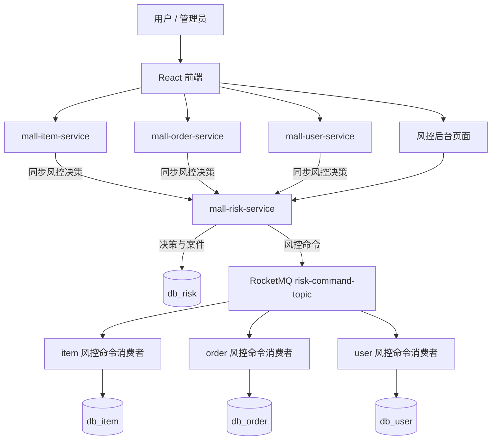

# 虚拟资产商城阶段二风控与反黑产设计文档

> 文档状态：设计稿，未开始实现。  
> 前置条件：阶段一担保交易闭环已完成，包括商家准入、保证金、挂售审核、库存预留、Mock 支付、担保资金、交付、确认、结算、提现、售后仲裁和基础对账。  
> 阶段目标：把“业务能跑”升级为“业务敢跑”，用可解释的规则引擎、关系图谱和人工案件流程识别刷单、自买自卖、恶意退款、异常提现和站外切客风险。

---

## 1. 阶段定位

### 1.1 核心目标

阶段二不是把系统做成一个通用风控中台，而是围绕虚拟资产交易的真实风险点补齐平台级防线：

1. **交易前拦截**：识别高风险商品、异常价格、禁售内容、新商家高额交易。
2. **交易中控制**：识别自买自卖、高频下单、秒发货秒确认等刷单特征。
3. **资金侧控制**：识别新商家大额提现、快进快出、同账户多商家等资金风险。
4. **关系侧识别**：通过 IP、设备、提现账号和交易关系识别关联账号。
5. **人工闭环**：高风险事件生成风控案件，人工可查看证据、处理、释放或拒绝。
6. **可解释性**：每次拦截必须能回答“命中了哪条规则、证据是什么、谁处理的”。

### 1.2 设计原则

1. **规则优先，模型后置**：阶段二只做规则引擎和加权评分，不做机器学习模型。
2. **可解释优先**：所有决策保存规则快照、命中指标和证据。
3. **业务强校验留在业务服务**：余额、库存、状态机、权限、买家卖家同 ID 等核心不变量仍由业务服务本地保证。
4. **风控服务不直接动钱**：风控只返回决策或发布风控命令，退款、放款、提现仍由业务服务执行。
5. **风控故障不阻断主链路**：同步风控调用失败时降级放行，但记录降级日志；显式违法内容和自买自卖等本地硬规则仍直接拦截。
6. **不做深度图计算**：关系图谱只查一度、二度关系，最多返回 100 个节点。

### 1.3 明确不做

| 不做项 | 原因 |
|---|---|
| 真实设备指纹供应商 | 学习项目无法接入真实设备风控厂商 |
| 真实 KYC / 人脸识别 | 阶段二只保留人工资料审核和 Mock 场景 |
| Neo4j / JanusGraph | 一度、二度关系用关系表足够 |
| 复杂机器学习模型 | 缺乏真实样本，规则可解释性和可测试性更好 |
| 风控自动退款 / 自动放款 / 自动扣保证金 | 资金动作必须由业务服务和人工流程执行 |
| 全链路强一致的分布式事务 | 风控事件允许短暂延迟，不做 Seata/TCC 扩展 |
| 多 Agent 协作 | 属于阶段三，不在阶段二实现 |

---

## 2. 总体架构

### 2.1 服务拓扑

阶段二新增 `mall-risk-service` 和独立数据库 `db_risk`。



### 2.2 服务职责

| 服务 | 阶段二新增职责 | 明确不负责 |
|---|---|---|
| `mall-risk-service` | 规则配置、事件采集、指标计算、规则执行、风险评分、决策记录、关系图谱、敏感词库、风控案件 | 直接修改订单、商品、商家、资金表 |
| `mall-item-service` | 挂售前风控、商品内容扫描、商品风险状态维护、执行商品风控命令 | 维护风控规则和案件 |
| `mall-order-service` | 下单、支付、交付、确认、售后前风控，订单风险状态维护，执行订单风控命令 | 直接查询 `db_risk` |
| `mall-user-service` | 商家申请、提现申请前风控，商家和提现风险状态维护，执行用户域风控命令 | 直接查询 `db_risk` |
| `mall-api` | 风控 DTO、Dubbo 接口、公共枚举 | 业务实现 |
| `mall-frontend` | 风控后台、用户侧风险状态展示 | 直接调用数据库 |

### 2.3 跨服务调用原则

1. `mall-risk-service` 只访问 `db_risk`。
2. 商品、订单、用户服务不直连 `db_risk`。
3. 阻断型节点通过 `RiskDubboService.evaluate()` 同步调用风控。
4. 非阻断型事件通过 `RiskDubboService.recordEvent()` 记录观察事件。
5. 风控案件人工处理后的动作通过 `risk-command-topic` 异步下发。
6. 风控命令由各业务服务消费，并用条件 SQL 更新自己的表。
7. 风控服务不得引用 `FundDubboService`，不得发起任何资金动账。

### 2.4 同步决策链路

```text
业务请求
  -> 本地强校验：登录、权限、状态、库存、余额、买家卖家同 ID
  -> 组装 RiskEvaluateRequest
  -> 调用 RiskDubboService.evaluate()
  -> 风控服务：
       1. eventNo 幂等检查
       2. 保存 PRECHECK 风控事件
       3. 计算指标
       4. 执行规则
       5. 保存决策
       6. 必要时创建案件
       7. 返回 action
  -> 业务服务根据 action 放行、观察、人工审核、限制、拒绝或冻结
  -> 业务本地事务提交
  -> 调用 confirmEvent(eventNo)
  -> 风控服务将事件标记为 CONFIRMED 并更新指标 / 关系
```

### 2.5 事件阶段与数据污染控制

阻断型风控调用发生在业务事务提交前。如果业务事务最终失败，事件不应该进入长期指标，否则会造成误判。

因此事件分三个阶段：

| 阶段 | 说明 |
|---|---|
| `PRECHECK` | 同步评估时先落事件和决策，但不参与长期指标计算 |
| `CONFIRMED` | 业务事务提交成功后确认，才参与指标和关系计算 |
| `INVALID` | 业务失败或超过 10 分钟未确认，标记无效 |

处理规则：

1. 当前 `PRECHECK` 请求本身的字段可以参与本次决策，例如金额、买家、卖家、商品信息。
2. 历史指标只统计 `CONFIRMED` 事件。
3. 业务提交成功后调用 `confirmEvent(eventNo)`。
4. 业务提交失败则不确认，定时任务将过期 `PRECHECK` 标记为 `INVALID`。
5. 决策记录永久保留，即使事件后来变成 `INVALID`，便于排查风控误判。
6. `confirmEvent` 失败只记录告警，不回滚业务；阶段二允许指标短暂缺失，P1 再引入本地确认 outbox。

---

## 3. 业务接入点

### 3.1 接入点总表

| 业务节点 | 所属服务 | 调用时机 | 是否阻断 | 主要动作 |
|---|---|---|---|---|
| 用户注册 | user | 注册成功后记录事件 | 否 | 识别同 IP / 同设备批量注册 |
| 用户登录 | user | 登录成功前 | 是 | 识别暴力登录、异常设备 |
| 商家申请 | user | 申请落库前 | 是 | 拒绝高风险申请或转人工 |
| 挂售提交 | item | 状态改为待审核前 | 是 | 拦截禁售词、异常价格、高风险类目 |
| 卡密导入 | item | 导入成功后记录事件 | 否 | 识别重复卡密、批量导入异常 |
| 创建订单 | order | 库存预留前 | 是 | 拦截自买自卖、高频下单、高额新买家 |
| 发起支付 / Mock 回调 | order | `markPaid` 前 | 是 | 阻止高风险订单支付 |
| 卖家交付 | order | 交付记录插入前 | 是 | 阻止冻结订单交付，识别异常交付 |
| 买家确认收货 | order | 确认状态更新前 | 是 | 高风险时延长结算冷却期 |
| 开启售后争议 | order | 争议插入前 | 是 | 识别恶意退款和重复争议 |
| 提现申请 | user | 资金冻结前 | 是 | 识别大额、新商家、快进快出提现 |
| 提现审核 | user | 审核通过前 | 是 | 高风险提现转人工或拒绝 |
| 结算放款 | order | `settle` 前 | 是 | 冻结订单禁止放款 |
| 商品 / 交付 / 争议内容 | item / order | 内容落库前 | 是 | 拦截站外联系方式和违禁内容 |

### 3.2 动作语义

| 动作 | 含义 | 业务效果 |
|---|---|---|
| `PASS` | 无风险或风险很低 | 正常继续 |
| `WATCH` | 记录观察 | 正常继续，业务表 `risk_status = WATCH` |
| `VERIFY` | 要求补充验证 | 阶段二仅返回提示，P1 再做补充资料流程 |
| `LIMIT` | 限制交易 | 可限制数量、延长结算冷却期、限制提现额度 |
| `MANUAL_REVIEW` | 人工审核 | 阻断下一步，创建风控案件 |
| `REJECT` | 拒绝 | 直接返回业务失败，不落业务主记录或标记拒绝 |
| `FREEZE` | 冻结 | 冻结商品、订单、商家或提现，并创建案件 |

动作优先级从高到低：

```text
REJECT > FREEZE > MANUAL_REVIEW > LIMIT > VERIFY > WATCH > PASS
```

如果多条弱规则叠加导致风险评分达到 80 分以上，即使单条动作只是 `WATCH`，最终动作升级为 `MANUAL_REVIEW`。

### 3.3 订单链路联动

订单不新增复杂业务状态，风险状态独立于订单状态：

```text
WAIT_PAY + risk_status = NORMAL          -> 可支付
WAIT_PAY + risk_status = MANUAL_REVIEW   -> 禁止支付，等待案件处理
WAIT_PAY + risk_status = FROZEN          -> 禁止支付和交付
DELIVERED + risk_status = FROZEN         -> 禁止确认和结算
CONFIRMED + risk_status = LIMITED        -> 延长 settle_available_time
```

这样做的价值：

1. 不破坏阶段一状态机。
2. 风险控制点清晰，支付、交付、确认、结算前都必须检查 `risk_status`。
3. 人工处理风控案件后，只需条件更新 `risk_status`，不需要回滚订单状态。

---

## 4. 风控事件与决策

### 4.1 风控事件

风控事件是阶段二的数据基础。事件只保存风控需要的字段，不复制全量业务数据。

核心字段：

| 字段 | 说明 |
|---|---|
| `event_no` | 风控事件号，调用方生成，重试时保持不变 |
| `scene` | 场景：REGISTER、LOGIN、MERCHANT、LISTING、ORDER、PAYMENT、DELIVERY、CONFIRM、DISPUTE、WITHDRAW、CONTENT |
| `event_type` | 具体动作：CREATE、SUBMIT、PAY、DELIVER、CONFIRM、APPLY 等 |
| `biz_type` / `biz_no` | 业务对象类型和编号 |
| `user_id` / `merchant_id` | 主体标识 |
| `item_id` / `order_no` / `withdraw_no` | 常用业务键 |
| `amount` | 交易、商品或提现金额 |
| `ip_hash` / `device_hash` | 匿名化身份标识 |
| `payload_json` | 风控指标所需的安全字段 |
| `request_hash` | 请求参数哈希，用于幂等参数一致性校验 |
| `event_phase` | PRECHECK、CONFIRMED、INVALID |

隐私约束：

1. 不允许把卡密明文、支付凭证、完整身份证信息放入 `payload_json`。
2. 手动交付内容只传内容哈希、长度和敏感词命中分类，不传全文。
3. IP 和设备 ID 使用 HMAC-SHA256 加盐哈希。
4. 原始事件建议保留 180 天，之后只保留聚合指标和决策摘要。

### 4.2 幂等规则

1. `event_no` 唯一。
2. 同一个 `event_no` 重试时：
   - 参数哈希一致：返回已有决策。
   - 参数哈希不一致：返回 `RISK_EVENT_CONFLICT`，不允许换参数复用事件号。
3. 一个事件只生成一条决策，`t_risk_decision.event_no` 唯一。
4. 风控命令由业务服务用条件更新保证幂等，不依赖消息队列 exactly once。

### 4.3 降级策略

| 异常 | 处理 |
|---|---|
| 风控服务超时 | 返回 `PASS` + `degraded = true`，业务继续 |
| 风控服务不可用 | 返回 `PASS` + `degraded = true`，写业务审计日志 |
| 规则表达式非法 | 该规则不命中，记录规则错误 |
| 指标缺失 | 该规则不命中，决策记录 `missing_metrics` |
| 决策结果反序列化失败 | 返回 `PASS` + `degraded = true`，记录告警 |

本地硬规则不依赖风控服务：

1. 买家和卖家为同一个用户：直接拒绝。
2. 商家不是 `APPROVED` 状态：直接拒绝。
3. 订单状态不满足支付 / 交付 / 确认条件：直接拒绝。
4. 提现金额大于可用余额：直接拒绝。
5. 敏感词字典本地缓存命中 `ILLEGAL_ASSET`：直接拒绝。

---

## 5. 规则引擎设计

### 5.1 规则模型

规则使用受限 JSON 表达式，不支持 SpEL、JavaScript 或任意 SQL 片段，避免把规则后台变成代码执行入口。

表达式支持：

```json
{
  "all": [
    { "metric": "MERCHANT_AGE_HOURS", "operator": "LT", "value": 72 },
    { "metric": "WITHDRAW_AMOUNT", "operator": "GTE", "value": 1000 }
  ]
}
```

也可以使用 `any` 表示任一条件命中：

```json
{
  "any": [
    { "metric": "BUYER_SELLER_RELATION", "operator": "IN", "value": ["SAME_USER", "SAME_DEVICE", "SAME_IP"] },
    { "metric": "SENSITIVE_WORD_CATEGORY", "operator": "IN", "value": ["PRIVATE_TRANSACTION"] }
  ]
}
```

支持操作符：

| 操作符 | 说明 |
|---|---|
| `EQ` / `NE` | 等于 / 不等于 |
| `GT` / `GTE` / `LT` / `LTE` | 数值比较 |
| `IN` / `NOT_IN` | 集合判断 |
| `BETWEEN` | 区间判断 |
| `IS_EMPTY` / `NOT_EMPTY` | 空值判断 |

限制：

1. 只允许 `all` 和 `any` 一层组合，不做任意深度嵌套。
2. 指标名必须在代码白名单中注册。
3. 未知指标不命中，并记录错误。
4. `value` 只允许数字、字符串、布尔值和数组。
5. 服务端保存规则前必须做表达式校验。

### 5.2 规则执行流程

```text
加载场景启用规则
  -> 计算本次请求指标
  -> 逐条执行表达式
  -> 记录命中规则、实际指标值、阈值
  -> 汇总风险评分
  -> 取最高优先级动作
  -> 弱信号叠加升级
  -> 保存决策和规则快照
  -> auto_case = true 时创建案件
```

### 5.3 风险评分

每条规则配置 `risk_score`，命中后累加，总分上限 100。

| 分数 | 风险等级 |
|---:|---|
| 0 - 39 | `LOW` |
| 40 - 69 | `MEDIUM` |
| 70 - 89 | `HIGH` |
| 90 - 100 | `CRITICAL` |

评分规则：

1. `REJECT` 类规则建议 80 分以上。
2. `FREEZE` 类规则建议 90 分。
3. `MANUAL_REVIEW` 类规则建议 50 - 80 分。
4. `WATCH` 类规则建议 10 - 40 分。
5. 总分达到 80 且动作低于 `MANUAL_REVIEW` 时，自动升级为 `MANUAL_REVIEW`。

### 5.4 初始规则清单

| 规则编码 | 场景 | 触发条件示例 | 动作 | 分数 | 自动建案 |
|---|---|---|---|---:|---|
| `REGISTER_SAME_IP_BATCH` | REGISTER | 同 IP 10 分钟注册 >= 5 个账号 | MANUAL_REVIEW | 70 | 是 |
| `REGISTER_SAME_DEVICE_BATCH` | REGISTER | 同设备 30 天关联 >= 3 个账号 | MANUAL_REVIEW | 80 | 是 |
| `LOGIN_FAIL_TOO_MANY` | LOGIN | 10 分钟失败 >= 5 次 | LIMIT | 50 | 否 |
| `MERCHANT_RISK_PROFILE` | MERCHANT | 申请信息命中高风险词或同设备已有拒绝商家 | MANUAL_REVIEW | 70 | 是 |
| `LISTING_ILLEGAL_ASSET` | LISTING | 命中 `ILLEGAL_ASSET` 敏感词 | REJECT | 100 | 否 |
| `LISTING_OFF_PLATFORM_CONTACT` | LISTING | 商品标题 / 描述命中站外联系方式 | REJECT | 90 | 否 |
| `LISTING_LOW_PRICE_NEW_MERCHANT` | LISTING | 价格低于类目中位数 50%，完成订单 < 3 | MANUAL_REVIEW | 70 | 是 |
| `LISTING_HIGH_PRICE_NEW_MERCHANT` | LISTING | 新商家挂售金额 >= 5000 或高于类目 P95 3 倍 | MANUAL_REVIEW | 70 | 是 |
| `ORDER_SELF_TRADE` | ORDER | 买卖双方同用户、同设备或强 IP 关联 | FREEZE | 90 | 是 |
| `ORDER_HIGH_AMOUNT_NEW_BUYER` | ORDER | 买家完成订单 < 3 且金额 >= 1000 | MANUAL_REVIEW | 70 | 是 |
| `ORDER_HIGH_FREQUENCY` | ORDER | 买家 10 分钟下单 >= 5 次 | REJECT | 80 | 否 |
| `ORDER_MERCHANT_REFUND_RATE` | ORDER | 商家 30 天退款率 >= 20% 且完成订单 >= 5 | LIMIT | 70 | 是 |
| `PAYMENT_BEFORE_REVIEW` | PAYMENT | `risk_status != NORMAL` 时发起支付 | REJECT | 80 | 否 |
| `DELIVERY_TOO_FAST_MANUAL` | DELIVERY | 手动交付且支付后 5 秒内交付 | WATCH | 30 | 否 |
| `CONFIRM_TOO_FAST` | CONFIRM | 买家首次查看后 30 秒内确认 | WATCH | 30 | 否 |
| `DISPUTE_BUYER_ABUSE` | DISPUTE | 买家 7 天争议 >= 3 次 | MANUAL_REVIEW | 70 | 是 |
| `WITHDRAW_NEW_MERCHANT_HIGH` | WITHDRAW | 商家账龄 < 72 小时且金额 >= 1000 | MANUAL_REVIEW | 70 | 是 |
| `WITHDRAW_FAST_OUT` | WITHDRAW | 结算可用后 60 分钟内提现且金额 >= 500 | MANUAL_REVIEW | 70 | 是 |
| `WITHDRAW_SAME_ACCOUNT` | WITHDRAW | 同 Mock 提现账号关联 >= 3 个商家 | FREEZE | 90 | 是 |
| `WITHDRAW_DAILY_LIMIT` | WITHDRAW | 单商家当日累计提现 >= 5000 | REJECT | 80 | 否 |

阈值全部写入规则配置，不硬编码在业务代码中。上述数值只是初始种子配置，后台可调整。

---

## 6. 风险指标设计

### 6.1 P0 指标

| 指标编码 | 主体 | 窗口 | 说明 |
|---|---|---|---|
| `CURRENT_AMOUNT` | 事件 | 当前 | 商品价、订单金额或提现金额 |
| `USER_AGE_HOURS` | 用户 | 当前 | 注册至现在的小时数 |
| `USER_ORDER_COUNT_10M` | 用户 | 10 分钟 | 下单次数 |
| `USER_ORDER_COUNT_24H` | 用户 | 24 小时 | 下单次数 |
| `USER_COMPLETED_COUNT` | 用户 | 累计 | 已完成订单数 |
| `USER_DISPUTE_COUNT_7D` | 用户 | 7 天 | 售后争议次数 |
| `USER_DEVICE_COUNT_30D` | 用户 | 30 天 | 关联设备数 |
| `USER_IP_COUNT_30D` | 用户 | 30 天 | 关联 IP 数 |
| `MERCHANT_AGE_HOURS` | 商家 | 当前 | 商家审核通过至现在的小时数 |
| `MERCHANT_COMPLETED_COUNT` | 商家 | 累计 | 已完成订单数 |
| `MERCHANT_REFUND_RATE_30D` | 商家 | 30 天 | 退款订单 / 完成订单 |
| `MERCHANT_DISPUTE_RATE_30D` | 商家 | 30 天 | 争议订单 / 完成订单 |
| `MERCHANT_WITHDRAW_AMOUNT_24H` | 商家 | 24 小时 | 已申请提现金额 |
| `WITHDRAW_ACCOUNT_MERCHANT_COUNT` | 提现账号 | 180 天 | 同账号关联商家数 |
| `ITEM_PRICE_DEVIATION` | 商品 | 当前 | 商品价 / 类目中位数 - 1 |
| `BUYER_SELLER_RELATION` | 订单 | 当前 | SAME_USER、SAME_DEVICE、SAME_IP、NONE |
| `SENSITIVE_WORD_CATEGORY` | 内容 | 当前 | 敏感词分类 |

### 6.2 P1 指标

| 指标编码 | 说明 |
|---|---|
| `MERCHANT_SETTLE_TO_WITHDRAW_MINUTES` | 结算可提到提现申请的时间差 |
| `ORDER_PAY_TO_DELIVER_SECONDS` | 支付到交付耗时 |
| `ORDER_VIEW_TO_CONFIRM_SECONDS` | 买家首次查看到确认耗时 |
| `MERCHANT_AVG_DELIVERY_MINUTES` | 商家平均交付时长 |
| `BUYER_REFUND_WIN_RATE_30D` | 买家仲裁胜诉率 |
| `RELATED_ACCOUNT_COUNT_2_DEGREE` | 二度关联账号数 |
| `CATEGORY_ACTIVE_SELLER_COUNT_7D` | 类目活跃卖家数 |

### 6.3 指标计算策略

阶段二优先采用简单、可测试的方式：

1. P0 指标基于 `CONFIRMED` 风控事件实时查询。
2. 查询必须带窗口时间和主体索引，避免全表扫描。
3. `t_risk_indicator` 作为 P1 物化表，由定时任务每 5 分钟刷新常用窗口。
4. 类目价格统计由商品服务在挂售事件中携带 `category_median_price` 和 `category_p95_price`，风控服务不直查 `db_item`。
5. 商家信用统计优先从已确认风控事件计算，避免为风控新增跨库查询。

---

## 7. 身份关系图谱

### 7.1 关系类型

| 关系类型 | 权重 | 说明 |
|---|---:|---|
| `SAME_USER` | 100 | 买卖双方为同一用户，本地硬规则直接拒绝 |
| `SAME_DEVICE` | 80 | 30 天内同设备登录或注册 |
| `SAME_WITHDRAW_ACCOUNT` | 70 | 多个商家绑定同一 Mock 提现账号 |
| `SAME_IP` | 40 | 30 天内同 IP 登录或注册，权重低于设备 |
| `REFUND` | 30 | 存在退款关系 |
| `TRADE` | 10 | 存在交易对手关系 |

权重仅用于辅助排序和评分，不作为唯一结论。

### 7.2 边构建规则

1. 每条边使用规范方向：`source_user_id < target_user_id`，避免同一关系存两条。
2. 同类型关系重复出现只增加 `hit_count` 和更新 `last_seen_time`，权重不无限累加。
3. `evidence_json` 保存首次证据、最近证据和关联事件号。
4. 只有 `CONFIRMED` 事件才构建关系。
5. `SAME_IP` 要求 30 天窗口，避免家庭宽带、校园网等共享 IP 造成过强误伤。
6. 同设备关系权重高于同 IP，但仍需要与金额、频控、退款率等指标叠加判断。

### 7.3 查询能力

后台支持：

1. 查询用户一度关联账号。
2. 查询用户二度关联路径。
3. 查看路径上的关系类型和证据。
4. 查看同提现账号商家。
5. 查看固定买卖双方历史交易和退款关系。

限制：

1. 最大深度为 2。
2. 单次最多返回 100 个节点、300 条边。
3. 不做社区发现、最短路径、图神经网络。
4. 前端用简化关系图展示，不引入图数据库。

---

## 8. 敏感信息与防切客

### 8.1 敏感词分类

| 分类 | 示例 | 动作 |
|---|---|---|
| `ILLEGAL_ASSET` | 虚拟货币、代充、外挂、盗号账号 | REJECT |
| `OFF_PLATFORM_CONTACT` | 微信、QQ、手机号、Telegram | REJECT |
| `PRIVATE_TRANSACTION` | 私下交易、绕过平台、平台外担保 | REJECT |
| `ACCOUNT_RECOVERY` | 找回账号、原始邮箱、身份证可改 | MANUAL_REVIEW |
| `FRAUD_HINT` | 稳赚、包过、洗黑产、代收 | MANUAL_REVIEW |

### 8.2 本地扫描策略

商品、交付内容、争议留言不应把全文发给风控服务，避免卡密和聊天内容二次扩散。

设计如下：

1. 风控服务提供敏感词库，业务服务本地缓存 60 秒。
2. 业务服务在内容落库前本地扫描。
3. 扫描结果只包含：
   - 命中分类。
   - 命中词编码。
   - 内容哈希。
   - 内容长度。
4. 风控事件携带扫描结果，不携带全文。
5. 全角转半角、去除空白和常见分隔符后再匹配。
6. 中国手机号、微信号、QQ、Telegram 使用内置白名单正则，不允许后台配置任意正则。

### 8.3 不同内容的处理

| 内容位置 | 处理 |
|---|---|
| 商品标题 / 描述 / 风险声明 | 命中 `ILLEGAL_ASSET`、`OFF_PLATFORM_CONTACT`、`PRIVATE_TRANSACTION` 直接拒绝 |
| 手动交付内容 | 先扫描再落库，命中站外联系方式时拒绝并提示修改 |
| 争议留言 | 高风险词转人工，不直接删除，保留证据 |
| 卡密内容 | 不进入敏感词扫描，也不进入风控 payload |

---

## 9. 风控案件

### 9.1 建案条件

满足以下任一条件时自动创建风控案件：

1. 决策动作为 `MANUAL_REVIEW`。
2. 决策动作为 `FREEZE`。
3. 决策动作为 `REJECT`，且规则配置 `auto_case = true`。
4. 风险等级为 `HIGH` 或 `CRITICAL`，且动作不是 `PASS`。

`PASS`、`WATCH`、`VERIFY`、`LIMIT` 默认不建案，只保存事件和决策。这样可以把人工注意力集中在必须处理的阻断型风险上，避免案件列表被低风险观察事件淹没。

### 9.2 案件去重

风控事件可能因为调用重试、业务重试或用户重复操作而重复出现，案件必须有稳定去重键。

| 场景 | 去重键 |
|---|---|
| 有业务编号 | `scene + ":" + biz_no` |
| 无业务编号 | `scene + ":" + subject_type + ":" + subject_id + ":" + 时间桶` |

时间桶按小时计算，格式为 `yyyyMMddHH`，只用于无业务编号的事件，例如批量注册、异常登录这类观察型风险。

处理规则：

1. `t_risk_case.dedup_key` 唯一。
2. 重复事件命中同一案件时，只追加事件编号和最新风险评分，不新建案件。
3. 案件已 `RESOLVED` 后再次出现同键高风险事件，允许重新打开为 `OPEN`，但必须记录重开原因。
4. 案件重开不删除原处理记录。

### 9.3 案件状态机

```text
OPEN -> PROCESSING -> RESOLVED -> CLOSED
```

| 状态 | 说明 |
|---|---|
| `OPEN` | 系统创建或人工重开，尚未认领 |
| `PROCESSING` | 已被管理员认领，正在处理 |
| `RESOLVED` | 管理员已给出处理结论，业务命令已准备下发 |
| `CLOSED` | 命令执行完成，或案件无需业务动作 |

限制：

1. 未认领案件不能直接处理。
2. `RESOLVED` 后不允许继续追加普通处理备注，只能执行关闭、重开或命令补偿。
3. `CLOSED` 是终态，只能通过重开生成新的处理周期。
4. 状态变更必须写 `t_risk_case_note`。

### 9.4 人工处理动作

| 人工动作 | 适用对象 | 业务效果 |
|---|---|---|
| `APPROVE` | 商品、订单、商家、提现 | 风险状态恢复为 `NORMAL` 或 `WATCH` |
| `REJECT` | 商品、商家申请、提现 | 标记为风控拒绝 |
| `FREEZE` | 商品、订单、商家、提现 | 标记为 `FROZEN` |
| `LIMIT` | 商家、订单、提现 | 标记为 `LIMITED`，可延长结算或提现等待时间 |
| `DELAY_SETTLE` | 订单、提现 | 设置延迟结算或延迟放款时间 |

明确边界：

1. 人工不能在风控后台直接改余额。
2. 人工不能直接发起退款、放款、提现打款或扣除保证金。
3. 涉及资金的最终动作仍由业务服务根据订单状态、售后结论和资金流水执行。
4. 风控后台只负责把对象风险状态和延迟时间写回业务服务。

### 9.5 风控命令链路

人工处理案件后，`mall-risk-service` 发布一条风控命令到 RocketMQ：

```json
{
  "commandNo": "RC202609290001",
  "decisionNo": "RD202609290001",
  "caseNo": "CASE202609290001",
  "scene": "ORDER",
  "bizNo": "T202609290001",
  "command": "FREEZE",
  "reason": "同设备关联账号存在自买自卖特征",
  "operatorId": 1,
  "actionParams": {
    "riskStatus": "FROZEN",
    "riskLevel": "HIGH"
  }
}
```

消费规则：

| 命令场景 | 消费服务 | 处理表 |
|---|---|---|
| `LISTING` | `mall-item-service` | `t_item` |
| `ORDER` | `mall-order-service` | `t_trade_order` |
| `PAYMENT` / `DELIVERY` / `CONFIRM` / `DISPUTE` | `mall-order-service` | `t_trade_order` 及售后相关表 |
| `MERCHANT` / `WITHDRAW` | `mall-user-service` | `t_merchant`、`t_withdraw_request` |

幂等规则：

1. `commandNo` 全局唯一，由风控服务生成。
2. 业务消费使用条件 SQL 更新，只有当前状态允许时才生效。
3. 重复消息再次消费时条件不满足，返回成功，不产生二次副作用。
4. 消费失败按 RocketMQ 重试策略重试。
5. 连续失败进入死信队列，同时把案件 `command_status` 标记为 `COMMAND_FAILED`。
6. `COMMAND_FAILED` 只允许管理员补偿重发，不允许自动无限重试。

条件更新示例：

```sql
UPDATE t_trade_order
SET risk_status = 'FROZEN',
    risk_level = 'HIGH',
    risk_decision_no = 'RD202609290001',
    risk_reason = '同设备关联账号存在自买自卖特征',
    version = version + 1
WHERE order_no = 'T202609290001'
  AND risk_status IN ('NORMAL', 'WATCH', 'MANUAL_REVIEW', 'LIMITED');
```

如果订单已经结算或关闭，该命令不再生效，案件只记录处理说明，不强行回滚业务状态。

---

## 10. 数据库设计

### 10.1 设计原则

1. 风控使用独立数据库 `db_risk`，不与业务库混用。
2. 风控服务只访问 `db_risk`。
3. 业务表只保存最新风险状态，完整历史保存在 `t_risk_decision` 和 `t_risk_case`。
4. 所有事件、决策、案件、规则变更都保留审计字段。
5. IP 和设备 ID 不保存明文。
6. 索引必须覆盖常用窗口查询和后台筛选。

### 10.2 `db_risk` 核心表

```sql
CREATE DATABASE IF NOT EXISTS `db_risk` DEFAULT CHARACTER SET utf8mb4;

USE `db_risk`;

CREATE TABLE `t_risk_subject` (
    `id` bigint unsigned NOT NULL AUTO_INCREMENT,
    `subject_type` varchar(16) NOT NULL COMMENT '主体类型: USER, MERCHANT, ITEM, ORDER, WITHDRAW',
    `subject_id` bigint unsigned NOT NULL,
    `risk_status` varchar(16) NOT NULL DEFAULT 'NORMAL' COMMENT 'NORMAL, WATCH, VERIFY, LIMITED, MANUAL_REVIEW, FROZEN',
    `risk_level` varchar(16) NOT NULL DEFAULT 'LOW',
    `risk_score` int NOT NULL DEFAULT 0,
    `last_decision_no` varchar(64) DEFAULT NULL,
    `risk_reason` varchar(255) DEFAULT NULL,
    `restricted_until` datetime(3) DEFAULT NULL,
    `created_time` datetime(3) NOT NULL DEFAULT CURRENT_TIMESTAMP(3),
    `updated_time` datetime(3) NOT NULL DEFAULT CURRENT_TIMESTAMP(3) ON UPDATE CURRENT_TIMESTAMP(3),
    PRIMARY KEY (`id`),
    UNIQUE KEY `uk_subject` (`subject_type`, `subject_id`),
    KEY `idx_risk_status` (`risk_status`, `updated_time`)
) ENGINE=InnoDB DEFAULT CHARSET=utf8mb4 COMMENT='风控主体最新状态表';

CREATE TABLE `t_risk_rule` (
    `id` bigint unsigned NOT NULL AUTO_INCREMENT,
    `rule_code` varchar(64) NOT NULL,
    `rule_name` varchar(128) NOT NULL,
    `scene` varchar(32) NOT NULL,
    `expression_json` json NOT NULL,
    `action` varchar(16) NOT NULL,
    `risk_score` int NOT NULL DEFAULT 0,
    `auto_case` tinyint NOT NULL DEFAULT 0,
    `enabled` tinyint NOT NULL DEFAULT 1,
    `version` int NOT NULL DEFAULT 1,
    `remark` varchar(255) DEFAULT NULL,
    `created_time` datetime(3) NOT NULL DEFAULT CURRENT_TIMESTAMP(3),
    `updated_time` datetime(3) NOT NULL DEFAULT CURRENT_TIMESTAMP(3) ON UPDATE CURRENT_TIMESTAMP(3),
    PRIMARY KEY (`id`),
    UNIQUE KEY `uk_rule_code` (`rule_code`),
    KEY `idx_scene_enabled` (`scene`, `enabled`)
) ENGINE=InnoDB DEFAULT CHARSET=utf8mb4 COMMENT='风控规则表';

CREATE TABLE `t_risk_rule_change_log` (
    `id` bigint unsigned NOT NULL AUTO_INCREMENT,
    `rule_id` bigint unsigned NOT NULL,
    `rule_code` varchar(64) NOT NULL,
    `change_type` varchar(16) NOT NULL COMMENT 'CREATE, UPDATE, ENABLE, DISABLE',
    `before_snapshot` json DEFAULT NULL,
    `after_snapshot` json DEFAULT NULL,
    `operator_id` bigint unsigned NOT NULL,
    `operator_name` varchar(64) NOT NULL,
    `reason` varchar(255) NOT NULL,
    `created_time` datetime(3) NOT NULL DEFAULT CURRENT_TIMESTAMP(3),
    PRIMARY KEY (`id`),
    KEY `idx_rule_id` (`rule_id`, `created_time`),
    KEY `idx_operator` (`operator_id`, `created_time`)
) ENGINE=InnoDB DEFAULT CHARSET=utf8mb4 COMMENT='风控规则变更日志表';

CREATE TABLE `t_risk_event` (
    `id` bigint unsigned NOT NULL AUTO_INCREMENT,
    `event_no` varchar(64) NOT NULL,
    `scene` varchar(32) NOT NULL,
    `event_type` varchar(32) NOT NULL,
    `event_phase` varchar(16) NOT NULL DEFAULT 'PRECHECK' COMMENT 'PRECHECK, CONFIRMED, INVALID',
    `biz_type` varchar(32) DEFAULT NULL,
    `biz_no` varchar(64) DEFAULT NULL,
    `user_id` bigint unsigned DEFAULT NULL,
    `merchant_id` bigint unsigned DEFAULT NULL,
    `item_id` bigint unsigned DEFAULT NULL,
    `order_no` varchar(64) DEFAULT NULL,
    `withdraw_no` varchar(64) DEFAULT NULL,
    `amount` decimal(18,2) DEFAULT NULL,
    `ip_hash` char(64) DEFAULT NULL,
    `device_hash` char(64) DEFAULT NULL,
    `payload_json` json DEFAULT NULL,
    `request_hash` char(64) NOT NULL,
    `occurred_time` datetime(3) NOT NULL,
    `confirmed_time` datetime(3) DEFAULT NULL,
    `invalidated_time` datetime(3) DEFAULT NULL,
    `created_time` datetime(3) NOT NULL DEFAULT CURRENT_TIMESTAMP(3),
    `updated_time` datetime(3) NOT NULL DEFAULT CURRENT_TIMESTAMP(3) ON UPDATE CURRENT_TIMESTAMP(3),
    PRIMARY KEY (`id`),
    UNIQUE KEY `uk_event_no` (`event_no`),
    KEY `idx_phase_scene_time` (`event_phase`, `scene`, `occurred_time`),
    KEY `idx_user_phase_time` (`user_id`, `event_phase`, `occurred_time`),
    KEY `idx_merchant_phase_time` (`merchant_id`, `event_phase`, `occurred_time`),
    KEY `idx_biz` (`biz_type`, `biz_no`),
    KEY `idx_ip_hash` (`ip_hash`, `event_phase`, `occurred_time`),
    KEY `idx_device_hash` (`device_hash`, `event_phase`, `occurred_time`),
    KEY `idx_invalid_expire` (`event_phase`, `occurred_time`)
) ENGINE=InnoDB DEFAULT CHARSET=utf8mb4 COMMENT='风控事件表';

CREATE TABLE `t_risk_decision` (
    `id` bigint unsigned NOT NULL AUTO_INCREMENT,
    `decision_no` varchar(64) NOT NULL,
    `event_no` varchar(64) NOT NULL,
    `scene` varchar(32) NOT NULL,
    `biz_type` varchar(32) DEFAULT NULL,
    `biz_no` varchar(64) DEFAULT NULL,
    `action` varchar(16) NOT NULL,
    `risk_score` int NOT NULL DEFAULT 0,
    `risk_level` varchar(16) NOT NULL,
    `hit_rules_json` json NOT NULL,
    `metric_snapshot_json` json NOT NULL,
    `evidence_json` json DEFAULT NULL,
    `missing_metrics_json` json DEFAULT NULL,
    `degraded` tinyint NOT NULL DEFAULT 0,
    `created_time` datetime(3) NOT NULL DEFAULT CURRENT_TIMESTAMP(3),
    PRIMARY KEY (`id`),
    UNIQUE KEY `uk_decision_no` (`decision_no`),
    UNIQUE KEY `uk_event_no` (`event_no`),
    KEY `idx_scene_action_time` (`scene`, `action`, `created_time`),
    KEY `idx_biz` (`biz_type`, `biz_no`)
) ENGINE=InnoDB DEFAULT CHARSET=utf8mb4 COMMENT='风控决策表';

CREATE TABLE `t_risk_case` (
    `id` bigint unsigned NOT NULL AUTO_INCREMENT,
    `case_no` varchar(64) NOT NULL,
    `dedup_key` varchar(128) NOT NULL,
    `decision_no` varchar(64) NOT NULL,
    `scene` varchar(32) NOT NULL,
    `biz_type` varchar(32) DEFAULT NULL,
    `biz_no` varchar(64) DEFAULT NULL,
    `subject_type` varchar(16) NOT NULL,
    `subject_id` bigint unsigned NOT NULL,
    `risk_level` varchar(16) NOT NULL,
    `risk_score` int NOT NULL DEFAULT 0,
    `status` varchar(16) NOT NULL DEFAULT 'OPEN',
    `assigned_to` bigint unsigned DEFAULT NULL,
    `resolved_action` varchar(32) DEFAULT NULL,
    `resolve_reason` varchar(255) DEFAULT NULL,
    `resolved_time` datetime(3) DEFAULT NULL,
    `last_command_no` varchar(64) DEFAULT NULL,
    `last_command_json` json DEFAULT NULL,
    `command_status` varchar(24) NOT NULL DEFAULT 'NONE' COMMENT 'NONE, SENT, SUCCESS, FAILED, COMMAND_FAILED',
    `command_retry_count` int NOT NULL DEFAULT 0,
    `reopen_count` int NOT NULL DEFAULT 0,
    `created_time` datetime(3) NOT NULL DEFAULT CURRENT_TIMESTAMP(3),
    `updated_time` datetime(3) NOT NULL DEFAULT CURRENT_TIMESTAMP(3) ON UPDATE CURRENT_TIMESTAMP(3),
    PRIMARY KEY (`id`),
    UNIQUE KEY `uk_case_no` (`case_no`),
    UNIQUE KEY `uk_dedup_key` (`dedup_key`),
    KEY `idx_status_scene_time` (`status`, `scene`, `created_time`),
    KEY `idx_biz` (`biz_type`, `biz_no`),
    KEY `idx_assigned` (`assigned_to`, `status`)
) ENGINE=InnoDB DEFAULT CHARSET=utf8mb4 COMMENT='风控案件表';

CREATE TABLE `t_risk_case_note` (
    `id` bigint unsigned NOT NULL AUTO_INCREMENT,
    `case_no` varchar(64) NOT NULL,
    `note_type` varchar(24) NOT NULL COMMENT 'CREATE, ASSIGN, PROCESS, RESOLVE, CLOSE, REOPEN, COMMAND',
    `operator_id` bigint unsigned NOT NULL,
    `operator_name` varchar(64) NOT NULL,
    `content` varchar(1024) NOT NULL,
    `before_status` varchar(16) DEFAULT NULL,
    `after_status` varchar(16) DEFAULT NULL,
    `evidence_json` json DEFAULT NULL,
    `created_time` datetime(3) NOT NULL DEFAULT CURRENT_TIMESTAMP(3),
    PRIMARY KEY (`id`),
    KEY `idx_case_no` (`case_no`, `created_time`)
) ENGINE=InnoDB DEFAULT CHARSET=utf8mb4 COMMENT='风控案件处理记录表';

CREATE TABLE `t_user_device` (
    `id` bigint unsigned NOT NULL AUTO_INCREMENT,
    `user_id` bigint unsigned NOT NULL,
    `device_hash` char(64) NOT NULL,
    `first_seen_time` datetime(3) NOT NULL,
    `last_seen_time` datetime(3) NOT NULL,
    `hit_count` int NOT NULL DEFAULT 1,
    PRIMARY KEY (`id`),
    UNIQUE KEY `uk_user_device` (`user_id`, `device_hash`),
    KEY `idx_device_time` (`device_hash`, `last_seen_time`)
) ENGINE=InnoDB DEFAULT CHARSET=utf8mb4 COMMENT='用户与设备哈希关系表';

CREATE TABLE `t_user_ip` (
    `id` bigint unsigned NOT NULL AUTO_INCREMENT,
    `user_id` bigint unsigned NOT NULL,
    `ip_hash` char(64) NOT NULL,
    `first_seen_time` datetime(3) NOT NULL,
    `last_seen_time` datetime(3) NOT NULL,
    `hit_count` int NOT NULL DEFAULT 1,
    PRIMARY KEY (`id`),
    UNIQUE KEY `uk_user_ip` (`user_id`, `ip_hash`),
    KEY `idx_ip_time` (`ip_hash`, `last_seen_time`)
) ENGINE=InnoDB DEFAULT CHARSET=utf8mb4 COMMENT='用户与IP哈希关系表';

CREATE TABLE `t_relation_edge` (
    `id` bigint unsigned NOT NULL AUTO_INCREMENT,
    `source_user_id` bigint unsigned NOT NULL,
    `target_user_id` bigint unsigned NOT NULL,
    `relation_type` varchar(32) NOT NULL,
    `weight` int NOT NULL DEFAULT 0,
    `hit_count` int NOT NULL DEFAULT 1,
    `first_seen_time` datetime(3) NOT NULL,
    `last_seen_time` datetime(3) NOT NULL,
    `evidence_json` json NOT NULL,
    PRIMARY KEY (`id`),
    UNIQUE KEY `uk_relation` (`source_user_id`, `target_user_id`, `relation_type`),
    KEY `idx_source_type_time` (`source_user_id`, `relation_type`, `last_seen_time`),
    KEY `idx_target_type_time` (`target_user_id`, `relation_type`, `last_seen_time`)
) ENGINE=InnoDB DEFAULT CHARSET=utf8mb4 COMMENT='用户关系边表';

CREATE TABLE `t_sensitive_word` (
    `id` bigint unsigned NOT NULL AUTO_INCREMENT,
    `word_code` varchar(64) NOT NULL,
    `category` varchar(32) NOT NULL,
    `word` varchar(64) NOT NULL,
    `enabled` tinyint NOT NULL DEFAULT 1,
    `created_time` datetime(3) NOT NULL DEFAULT CURRENT_TIMESTAMP(3),
    `updated_time` datetime(3) NOT NULL DEFAULT CURRENT_TIMESTAMP(3) ON UPDATE CURRENT_TIMESTAMP(3),
    PRIMARY KEY (`id`),
    UNIQUE KEY `uk_category_word` (`category`, `word`),
    KEY `idx_enabled_category` (`enabled`, `category`)
) ENGINE=InnoDB DEFAULT CHARSET=utf8mb4 COMMENT='敏感词表';

CREATE TABLE `t_risk_indicator` (
    `id` bigint unsigned NOT NULL AUTO_INCREMENT,
    `metric_code` varchar(64) NOT NULL,
    `subject_type` varchar(16) NOT NULL,
    `subject_id` bigint unsigned NOT NULL,
    `window_type` varchar(16) NOT NULL COMMENT 'REALTIME, 10M, 1H, 24H, 7D, 30D, TOTAL',
    `window_start` datetime(3) NOT NULL,
    `window_end` datetime(3) NOT NULL,
    `metric_value` decimal(18,4) NOT NULL,
    `updated_time` datetime(3) NOT NULL DEFAULT CURRENT_TIMESTAMP(3) ON UPDATE CURRENT_TIMESTAMP(3),
    PRIMARY KEY (`id`),
    UNIQUE KEY `uk_indicator` (`metric_code`, `subject_type`, `subject_id`, `window_type`, `window_start`),
    KEY `idx_subject_window` (`subject_type`, `subject_id`, `window_type`)
) ENGINE=InnoDB DEFAULT CHARSET=utf8mb4 COMMENT='风控指标物化表';
```

### 10.3 业务库增量表字段

风控状态不合并进业务状态，只做独立字段，避免破坏阶段一状态机。

```sql
USE `db_item`;

ALTER TABLE `t_item`
    ADD COLUMN `risk_status` varchar(16) NOT NULL DEFAULT 'NORMAL'
        COMMENT 'NORMAL, WATCH, VERIFY, LIMITED, MANUAL_REVIEW, FROZEN, REJECTED',
    ADD COLUMN `risk_level` varchar(16) NOT NULL DEFAULT 'LOW',
    ADD COLUMN `risk_decision_no` varchar(64) DEFAULT NULL,
    ADD COLUMN `risk_reason` varchar(255) DEFAULT NULL;

ALTER TABLE `t_item`
    ADD INDEX `idx_risk_status` (`risk_status`, `status`);

USE `db_order`;

ALTER TABLE `t_trade_order`
    ADD COLUMN `risk_status` varchar(16) NOT NULL DEFAULT 'NORMAL'
        COMMENT 'NORMAL, WATCH, VERIFY, LIMITED, MANUAL_REVIEW, FROZEN, REJECTED',
    ADD COLUMN `risk_level` varchar(16) NOT NULL DEFAULT 'LOW',
    ADD COLUMN `risk_decision_no` varchar(64) DEFAULT NULL,
    ADD COLUMN `risk_reason` varchar(255) DEFAULT NULL;

ALTER TABLE `t_trade_order`
    ADD INDEX `idx_risk_order_status` (`risk_status`, `order_status`);

USE `db_user`;

ALTER TABLE `t_withdraw_request`
    ADD COLUMN `risk_status` varchar(16) NOT NULL DEFAULT 'NORMAL'
        COMMENT 'NORMAL, WATCH, VERIFY, LIMITED, MANUAL_REVIEW, FROZEN, REJECTED',
    ADD COLUMN `risk_level` varchar(16) NOT NULL DEFAULT 'LOW',
    ADD COLUMN `risk_decision_no` varchar(64) DEFAULT NULL,
    ADD COLUMN `risk_reason` varchar(255) DEFAULT NULL,
    ADD COLUMN `payout_delay_until` datetime(3) DEFAULT NULL;

ALTER TABLE `t_merchant`
    ADD COLUMN `risk_status` varchar(16) NOT NULL DEFAULT 'NORMAL'
        COMMENT 'NORMAL, WATCH, VERIFY, LIMITED, MANUAL_REVIEW, FROZEN, REJECTED',
    ADD COLUMN `risk_level` varchar(16) NOT NULL DEFAULT 'LOW',
    ADD COLUMN `risk_decision_no` varchar(64) DEFAULT NULL,
    ADD COLUMN `risk_reason` varchar(255) DEFAULT NULL;
```

### 10.4 数据保留

| 数据 | 在线保留 | 说明 |
|---|---:|---|
| 风控事件 | 180 天 | 之后归档或删除明细，保留决策摘要 |
| 风控决策 | 长期保留 | 拦截依据必须可追溯 |
| 风控案件 | 长期保留 | 人工处理审计依据 |
| 规则变更日志 | 长期保留 | 解释历史决策使用的规则版本 |
| 用户设备 / IP 关系 | 180 天 | 满足关系识别，减少长期隐私存储 |
| 敏感词配置 | 长期保留 | 词本身不含用户隐私 |

学习项目可以先用定时任务做软删除或归档标记，不要求立即接入对象存储和冷热分离。

---

## 11. 接口设计

### 11.1 Dubbo 接口

新增接口：

```text
mall-api/src/main/java/api/risk/RiskDubboService.java
```

```java
public interface RiskDubboService {

    /**
     * 阻断型风控评估，返回动作。
     */
    RiskDecisionResult evaluate(RiskEvaluateRequest request);

    /**
     * 非阻断型事件记录，用于注册、登录、卡密导入等观察事件。
     */
    RiskDecisionResult recordEvent(RiskEvaluateRequest request);

    /**
     * 业务事务提交成功后确认事件。
     */
    void confirmEvent(String eventNo);

    /**
     * 查询主体最新风险状态。
     */
    SubjectRiskDTO getSubjectRisk(String subjectType, Long subjectId);

    /**
     * 查询用户一度或二度关系，最大 depth = 2。
     */
    RelationGraphDTO getRelations(Long userId, int depth);

    /**
     * 拉取启用的敏感词配置，供业务服务本地缓存。
     */
    List<SensitiveWordDTO> getSensitiveWords();
}
```

`recordEvent` 与 `evaluate` 的差别只在调用语义：`recordEvent` 不作为业务放行依据，失败也不阻断主流程。内部可以复用事件落库、规则执行和决策保存逻辑。

### 11.2 请求 DTO

`RiskEvaluateRequest` 核心字段：

| 字段 | 类型 | 说明 |
|---|---|---|
| `eventNo` | String | 调用方生成，重试保持不变 |
| `scene` | String | REGISTER、LOGIN、MERCHANT、LISTING、ORDER 等 |
| `eventType` | String | CREATE、SUBMIT、PAY、DELIVER 等 |
| `bizType` | String | 业务对象类型 |
| `bizNo` | String | 业务对象编号 |
| `userId` | Long | 操作用户 ID |
| `merchantId` | Long | 商家 ID，可为空 |
| `itemId` | Long | 商品 ID，可为空 |
| `orderNo` | String | 订单号，可为空 |
| `withdrawNo` | String | 提现单号，可为空 |
| `amount` | BigDecimal | 当前金额 |
| `ipHash` | String | IP HMAC 哈希 |
| `deviceHash` | String | 设备 ID HMAC 哈希 |
| `payload` | Map | 指标所需安全字段 |
| `sensitiveHits` | List | 敏感词命中结果 |

`payload` 只允许放指标白名单内字段，例如：

```json
{
  "categoryMedianPrice": 200.00,
  "categoryP95Price": 800.00,
  "deliveryMode": "MANUAL_DELIVERY",
  "contentHash": "4f9c...",
  "contentLength": 128,
  "payToDeliverSeconds": 3
}
```

禁止传入：

1. 卡密明文或密文。
2. 支付凭证。
3. 完整身份证、银行卡、真实提现账号。
4. 商品、交付、争议的完整原文。

`requestHash` 不由调用方传入，由风控服务对请求做规范化序列化后计算，用于同一个 `eventNo` 的参数一致性校验。

### 11.3 返回 DTO

`RiskDecisionResult` 核心字段：

| 字段 | 类型 | 说明 |
|---|---|---|
| `eventNo` | String | 风控事件号 |
| `decisionNo` | String | 风控决策号 |
| `action` | String | PASS、WATCH、VERIFY、LIMIT、MANUAL_REVIEW、REJECT、FREEZE |
| `riskScore` | Integer | 0 到 100 |
| `riskLevel` | String | LOW、MEDIUM、HIGH、CRITICAL |
| `degraded` | Boolean | 是否降级放行 |
| `message` | String | 用户可读的安全提示 |
| `hitRules` | List | 命中规则摘要 |

`RiskRuleHitDTO` 核心字段：

| 字段 | 类型 | 说明 |
|---|---|---|
| `ruleCode` | String | 规则编码 |
| `ruleName` | String | 规则名称 |
| `action` | String | 该规则动作 |
| `riskScore` | Integer | 该规则分数 |
| `actualValues` | Map | 规则涉及指标的实际值 |

面向用户的接口只返回 `message` 和简化的状态文案，不返回 `hitRules`、阈值、IP、设备哈希和关系路径。

### 11.4 管理后台 REST 接口

统一前缀：

```text
/api/admin/risk
```

| 方法 | 路径 | 说明 |
|---|---|---|
| GET | `/dashboard` | 风控总览 |
| GET | `/rules` | 规则分页列表 |
| POST | `/rules` | 新增规则 |
| PUT | `/rules/{id}` | 修改规则 |
| POST | `/rules/{id}/enable` | 启用规则 |
| POST | `/rules/{id}/disable` | 停用规则 |
| GET | `/events` | 事件查询 |
| GET | `/decisions` | 决策查询 |
| GET | `/cases` | 案件分页列表 |
| GET | `/cases/{caseNo}` | 案件详情 |
| POST | `/cases/{caseNo}/assign` | 认领案件 |
| POST | `/cases/{caseNo}/resolve` | 提交处理结论 |
| POST | `/cases/{caseNo}/close` | 关闭案件 |
| POST | `/cases/{caseNo}/reopen` | 重开案件 |
| POST | `/cases/{caseNo}/commands/{commandNo}/resend` | 补偿重发命令 |
| GET | `/relations/{userId}` | 用户关系图谱 |
| GET | `/indicators` | 指标查询 |
| GET | `/sensitive-words` | 敏感词分页列表 |

规则新增和修改请求必须包含：

1. 规则编码、名称、场景、表达式、动作、分数。
2. 变更原因。
3. 操作人信息，从登录态解析，不允许前端传 `operatorId`。

规则保存流程：

```text
ADMIN 登录校验
  -> 参数完整性校验
  -> 表达式白名单校验
  -> 事务保存规则
  -> 写规则变更日志
  -> 清理本地规则缓存
```

### 11.5 业务接入伪代码

以创建订单为例：

```java
RiskEvaluateRequest request = buildOrderRiskRequest(order);
RiskDecisionResult result;
try {
    result = riskDubboService.evaluate(request);
} catch (Exception ex) {
    log.warn("risk evaluate degraded, eventNo={}", request.getEventNo(), ex);
    result = RiskDecisionResult.degraded(request.getEventNo());
}

if (Objects.equals(result.getAction(), "REJECT")) {
    throw new BusinessException(result.getMessage());
}
if (Objects.equals(result.getAction(), "FREEZE")
        || Objects.equals(result.getAction(), "MANUAL_REVIEW")) {
    order.setRiskStatus(toRiskStatus(result.getAction()));
}

saveOrder(order);
try {
    riskDubboService.confirmEvent(request.getEventNo());
} catch (Exception ex) {
    log.warn("risk event confirm failed, eventNo={}", request.getEventNo(), ex);
}
```

这段伪代码说明边界，不作为固定实现模板。实际代码中应抽取 `RiskClient`，避免每个业务方法手写重复降级和序列化逻辑。

---

## 12. 前端设计

### 12.1 风控后台

阶段二只需要一个轻量风控控制台，不引入复杂 BI 平台。

| 页面 | 核心内容 | 操作 |
|---|---|---|
| 总览 | 今日事件、决策分布、待处理案件、降级次数、Top 命中规则 | 按场景和日期筛选 |
| 规则管理 | 规则列表、状态、场景、动作、分数、版本 | 新增、修改、启停 |
| 事件与决策 | 事件阶段、场景、动作、风险等级、命中规则 | 查看详情和指标快照 |
| 案件处理 | 案件状态、风险等级、业务编号、处理记录 | 认领、处理、关闭、重开 |
| 关系图谱 | 用户节点、一度和二度关系边、证据摘要 | 查询用户、展开节点 |
| 敏感词管理 | 分类、词、启停 | 新增、修改、启停 |

案件详情页必须能回答：

1. 这是什么风险。
2. 命中了哪些规则。
3. 当时的指标值是多少。
4. 用户之间有什么关系证据。
5. 之前谁处理过、结论是什么。

### 12.2 用户侧展示

用户侧不做风控教育页，也不展示规则细节，只在业务动作失败或等待时给简短状态。

| 场景 | 用户侧文案示例 |
|---|---|
| 商品命中禁售词 | 该商品包含平台不允许交易的虚拟资产，请修改后重新提交 |
| 商品包含站外联系方式 | 为保障交易安全，商品信息不能包含站外联系方式 |
| 订单转人工审核 | 订单进入安全审核，审核通过前暂不可支付 |
| 订单冻结 | 订单存在安全风险，平台正在核实 |
| 提现转人工审核 | 提现申请进入安全审核，请留意处理结果 |

用户侧不得展示：

1. 规则编码和阈值。
2. IP、设备哈希。
3. 关系图谱。
4. 风控评分明细。
5. 其他用户的关联信息。

### 12.3 图谱展示约束

1. 后台关系图最多展示 100 个节点、300 条边。
2. 节点按风险等级和关系权重排序，超过限制时优先展示高风险节点。
3. 一度关系默认展示，二度关系需要点击展开。
4. 边上展示关系类型，证据详情通过弹窗查看。
5. 前端使用轻量 SVG 或现有图表组件实现，不引入图数据库和重型图可视化平台。

---

## 13. 安全与权限

### 13.1 权限控制

1. 风控后台所有接口必须校验 JWT。
2. 只有 `ADMIN` 角色可访问 `/api/admin/risk/**`。
3. 案件认领、处理、关闭、重开必须记录操作人。
4. 操作人从服务端登录态解析，前端传入的操作人字段一律忽略。
5. 规则新增、修改、启停必须填写变更原因。

### 13.2 规则执行安全

风控表达式必须是受限 JSON 结构，不允许执行动态代码。

硬性限制：

1. 不支持 SpEL、JavaScript、Groovy、SQL 拼接。
2. 不支持反射调用。
3. 不支持文件和网络访问。
4. 指标名必须在代码白名单注册。
5. 操作符必须在枚举中定义。
6. 表达式最多一层 `all` / `any` 组合。
7. 数组和表达式长度限制必须配置上限。

敏感词配置同样不允许任意正则：

1. 普通敏感词按归一化文本匹配。
2. 手机号、微信号、QQ、Telegram 使用代码内置正则。
3. 后台只维护词和分类，不能配置表达式。

### 13.3 数据安全

1. IP 和设备 ID 使用 HMAC-SHA256 加盐哈希。
2. 盐值只放在服务配置或环境变量，不写入代码和前端。
3. 卡密、支付凭证、完整身份证、真实银行卡号不进入风控事件。
4. 内容扫描只上传分类、词编码、内容哈希和长度。
5. 风控后台详情默认脱敏，需要点击查看时记录审计。
6. 原始事件在线保留 180 天，之后只保留决策摘要和案件证据。

### 13.4 资金权限边界

风控服务不得具备以下能力：

1. 调用 `FundDubboService`。
2. 更新用户余额、平台账户、资金流水。
3. 直接发起退款、放款、提现打款。
4. 直接扣除保证金。
5. 直接修改订单资金托管状态。

风控只能返回决策或发送状态类命令。资金动作必须由业务服务在订单状态、售后结论和资金事务全部满足时执行。

---

## 14. 性能设计

### 14.1 同步链路目标

| 指标 | 目标 |
|---|---:|
| 风控同步调用 P99 | <= 800ms |
| Dubbo timeout | 800ms |
| Dubbo retries | 0 |
| 单次规则数量上限 | 100 条 |
| 单次指标数量上限 | 50 个 |
| 规则表达式解析结果缓存 | 30 秒 |

超过 800ms 仍未返回时业务降级放行，并记录 `degraded = true`。不做自动重试，避免下单接口被风控拖垮。

### 14.2 查询与索引

1. 事件窗口查询必须使用 `user_id / merchant_id / ip_hash / device_hash + event_phase + occurred_time` 索引。
2. 后台查询必须分页，默认 20 条，最大 100 条。
3. 列表接口不返回大 JSON 字段，详情接口单独查询。
4. 指标实时计算最多只查当前请求相关的主体，不允许扫全表。
5. 关系查询按用户查询边表，最大深度 2，最多 100 个节点。
6. 上线前用 `EXPLAIN` 检查核心查询，确保使用索引。

### 14.3 缓存策略

| 缓存对象 | TTL | 失效方式 |
|---|---:|---|
| 启用规则 | 30 秒 | 规则变更后主动失效 |
| 解析后的规则表达式 | 30 秒 | 随规则缓存失效 |
| 敏感词 | 60 秒 | 敏感词变更后主动失效 |
| 主体最新风险状态 | 10 秒 | 命令执行成功后主动失效 |

学习项目使用 JVM 本地缓存即可，不引入 Redis 作为阶段二硬依赖。如果后续多实例部署导致缓存不一致，再升级 Redis。

### 14.4 异步化

1. 风控命令通过 RocketMQ 异步下发。
2. 事件确认失败不回滚业务事务，只记录日志。
3. 关系边、指标物化、过期事件清理由定时任务处理。
4. 定时任务频率：
   - 过期 `PRECHECK` 事件：每分钟。
   - 关系边构建：每分钟。
   - 指标物化：每 5 分钟。
   - 历史数据归档：每天凌晨一次。

### 14.5 性能红线

阶段二验收前必须满足：

1. 创建订单、提交商品、提交提现链路不能因为风控出现明显卡顿。
2. 风控服务停止后，普通商品提交和普通订单创建仍可完成。
3. 后台案件列表和决策列表不能出现全表扫描。
4. 关系图谱不能一次查询无限制节点。
5. 禁止在规则执行中发起跨库 RPC 循环调用。

---

## 15. 测试与验收

### 15.1 单元测试

| 模块 | 必测点 |
|---|---|
| 表达式解析 | 合法 `all` / `any`、非法嵌套、非法操作符、未知指标、非法 value 类型 |
| 规则执行 | 命中、不命中、指标缺失、多规则叠加、动作优先级 |
| 风险评分 | 分数累加、上限 100、等级划分、80 分自动升级人工审核 |
| 事件幂等 | 同 `eventNo` 同参数返回原决策，同 `eventNo` 不同参数返回冲突 |
| 事件阶段 | `PRECHECK` 不进长期指标，`CONFIRMED` 进长期指标，超时转 `INVALID` |
| 案件去重 | 有业务编号去重、时间桶去重、已结案后重开 |
| 案件状态机 | 未认领不能处理，`RESOLVED` 不能普通备注，`CLOSED` 只能重开 |
| 风控命令 | 条件更新幂等、失败重试、死信后 `COMMAND_FAILED` |
| 关系边 | 规范方向、同边只累加 `hit_count`、只有 `CONFIRMED` 构建关系 |
| 敏感词扫描 | 全角转半角、去空白、命中分类、手机号识别、不扫描卡密 |
| 降级 | 超时、不可用、反序列化失败均返回 `PASS + degraded` |
| 权限 | 非 ADMIN 访问风控后台返回无权限 |

### 15.2 集成测试场景

| 场景 | 输入 | 期望结果 |
|---|---|---|
| 禁售商品 | 商品标题包含虚拟货币 | 商品提交被拒绝，生成 `REJECT` 决策，不创建待审核商品 |
| 站外联系方式 | 商品描述包含微信号或手机号 | 商品提交被拒绝，提示修改内容 |
| 私下交易诱导 | 风险声明包含“绕过平台交易” | 商品提交被拒绝，事件记录命中 `PRIVATE_TRANSACTION` |
| 新商家低价挂售 | 商家账龄 1 小时，价格低于类目中位数 50% | 商品转 `MANUAL_REVIEW`，自动建案 |
| 自买自卖 | 买卖双方同设备关联 | 订单转 `FROZEN`，禁止支付和交付 |
| 新买家高额下单 | 买家完成订单 0 笔，订单金额 1000 元 | 订单转 `MANUAL_REVIEW`，禁止支付 |
| 高频下单 | 买家 10 分钟内第 5 次创建订单 | 第 5 单被 `REJECT` |
| 审核中支付 | 订单 `risk_status = MANUAL_REVIEW` 时发起支付 | 支付被拒绝 |
| 快进快出提现 | 商家结算可用后 30 分钟申请提现 800 元 | 提现转 `MANUAL_REVIEW` |
| 新商家大额提现 | 商家账龄 24 小时，申请提现 2000 元 | 提现转 `MANUAL_REVIEW` |
| 同提现账号多商家 | 三个商家绑定同一 Mock 提现账号 | 第三个商家提现被 `FREEZE` |
| 人工放行 | 管理员处理高风险订单并选择 `APPROVE` | 命令消费后订单 `risk_status = NORMAL`，可继续支付 |
| 人工冻结 | 管理员处理高风险商家并选择 `FREEZE` | 商家 `risk_status = FROZEN`，禁止挂售和提现 |
| 风控降级 | 停止 `mall-risk-service` 后创建普通订单 | 订单创建成功，业务日志记录降级 |
| 事件重试 | 同一 `eventNo` 连续调用两次 | 只有一条事件和一条决策 |
| 隐私约束 | 提交带卡密的自动交付商品 | 事件 payload 中无卡密明文或密文 |
| 关系构建 | 两个用户 30 天内同 IP 登录 | 生成一条 `SAME_IP` 边，权重 40 |
| 图谱限制 | 用户二度关系超过 100 个节点 | 查询被截断并返回提示 |

### 15.3 演示数据

为便于面试展示和接口演示，初始化 8 组种子数据：

| 编号 | 演示主题 | 关键数据 |
|---|---|---|
| `DEMO_RISK_01` | 禁售虚拟货币 | 商品标题命中 `ILLEGAL_ASSET` |
| `DEMO_RISK_02` | 站外切客 | 商品描述命中微信号 |
| `DEMO_RISK_03` | 私下交易 | 风险声明命中“绕过平台” |
| `DEMO_RISK_04` | 新商家低价 | 商家账龄 1 小时，价格偏离中位数 60% |
| `DEMO_RISK_05` | 同设备自买自卖 | 两个用户同 `device_hash` |
| `DEMO_RISK_06` | 新买家高额 | 买家完成订单 0 笔，订单 1000 元 |
| `DEMO_RISK_07` | 新商家大额提现 | 商家账龄 24 小时，提现 2000 元 |
| `DEMO_RISK_08` | 同提现账号 | 三个商家绑定同一 Mock 提现账号 |

演示数据只使用 Mock 用户、Mock 设备 ID、Mock IP 和 Mock 提现账号，不引入真实个人信息。

### 15.4 阶段二完成定义

阶段二 P0 完成必须同时满足：

1. `mall-risk-service`、`db_risk`、`mall-api` 风控接口完成。
2. 商品提交、订单创建、支付、交付、确认、售后、提现核心节点完成风控接入。
3. 规则执行、评分、决策、案件、命令闭环可用。
4. 风控停机时普通主链路可降级运行。
5. 事件、决策、案件、规则变更均有审计记录。
6. 单元测试和集成测试通过。
7. 核心查询 `EXPLAIN` 使用索引，无明显全表扫描。
8. 风控服务没有任何资金动账代码。
9. 卡密、支付凭证、完整身份证、真实银行卡号未进入风控事件。
10. 演示数据可以完整展示拦截、转人工、冻结、放行四类结果。

---

## 16. 实施计划

### 第 1 周：风控基础与核心阻断

| 时间 | 任务 | 交付物 |
|---|---|---|
| Day 1 | 新建 `mall-risk-service`、`db_risk`、风控 DTO 和 Dubbo 接口 | 服务骨架、表结构、接口定义 |
| Day 2 | 实现事件落库、幂等、事件阶段、确认和失效任务 | 事件与决策基础能力 |
| Day 3 | 实现规则模型、表达式校验、表达式执行器 | 规则引擎核心 |
| Day 4 | 实现评分、等级、动作优先级、降级封装 | 决策返回能力 |
| Day 5 | 接入商品提交和订单创建 | 禁售、异常价格、自买自卖、高频下单拦截 |
| Day 6 | 接入提现申请和商家申请 | 新商家大额提现、高风险商家控制 |
| Day 7 | 补单元测试和阶段联调 | 第 1 周可演示链路 |

第 1 周验收重点：

1. 普通商品和普通订单不被误伤。
2. 高风险商品和订单能被阻断。
3. 风控停机后主链路仍能运行。
4. 同一事件重试不产生重复决策。

### 第 2 周：关系、敏感词、案件闭环

| 时间 | 任务 | 交付物 |
|---|---|---|
| Day 8 | 实现用户设备、IP 关系表和关系边构建 | 基础身份关系 |
| Day 9 | 实现一度、二度关系查询和数量限制 | 关系查询能力 |
| Day 10 | 实现敏感词种子库、本地扫描、缓存拉取 | 防切客和禁售扫描 |
| Day 11 | 实现自动建案、案件状态机、处理记录 | 人工案件基础 |
| Day 12 | 实现风控命令发布和业务消费者 | 人工处理回写业务状态 |
| Day 13 | 接入支付、交付、确认、售后、结算节点 | 交易全链路风险状态检查 |
| Day 14 | 实现指标实时查询和主体状态查询 | 指标基础能力 |

第 2 周验收重点：

1. 同设备、同 IP、同提现账号关系可解释。
2. 站外联系方式和私下交易内容可拦截。
3. 人工处理后商品、订单、商家、提现状态可恢复或冻结。
4. 命令重复消费不会产生二次副作用。

### 第 3 周：后台、测试和演示打磨

| 时间 | 任务 | 交付物 |
|---|---|---|
| Day 15 | 实现风控总览、规则管理、事件决策查询 | 最小后台 |
| Day 16 | 实现案件列表、案件详情、认领和处理 | 人工闭环页面 |
| Day 17 | 实现关系图谱页面和敏感词管理页面 | 可视化排查能力 |
| Day 18 | 初始化 8 组演示数据 | 面试演示脚本 |
| Day 19 | 补齐单元测试和集成测试 | 回归用例 |
| Day 20 | 执行 `EXPLAIN`、压测同步链路、检查降级 | 性能验证报告 |
| Day 21 | 整理 README、接口说明和面试讲解稿 | 阶段二交付文档 |

第 3 周验收重点：

1. 后台能回答“为什么被拦截”和“谁处理的”。
2. 演示路径稳定，不需要手工改数据库。
3. 核心链路满足 800ms 目标。
4. 代码边界清晰，没有风控直接动资金的实现。

---

## 17. 功能优先级清单

| 优先级 | 功能 | 说明 |
|---|---|---|
| P0 | `mall-risk-service` 服务骨架 | 独立风控服务，只访问 `db_risk` |
| P0 | `db_risk` 数据库 | 事件、决策、规则、案件、关系、敏感词核心表 |
| P0 | 风控 DTO 和 Dubbo 接口 | `evaluate`、`recordEvent`、`confirmEvent`、状态查询 |
| P0 | 事件与幂等 | `event_no` 唯一、参数哈希校验、事件阶段控制 |
| P0 | 规则引擎 | 受限 JSON 表达式、白名单指标、动作优先级 |
| P0 | 风险评分与决策 | 可解释命中规则、指标快照、决策记录 |
| P0 | 商品提交风控 | 禁售、站外联系方式、私下交易、异常价格 |
| P0 | 订单创建风控 | 自买自卖、新买家高额、高频下单 |
| P0 | 支付 / 交付 / 确认 / 结算风险检查 | 非正常风险状态禁止推进 |
| P0 | 提现申请风控 | 新商家大额、快进快出、单日限额 |
| P0 | 风控案件最小闭环 | 自动建案、人工处理、命令回写 |
| P0 | 风控命令消费者 | 商品、订单、商家、提现条件更新 |
| P0 | 降级策略 | 风控异常时普通主链路可继续 |
| P0 | 审计记录 | 规则变更、案件处理、命令执行可追溯 |
| P1 | 完整风控后台 | 总览、规则、事件、决策、案件、图谱页面 |
| P1 | 关系图谱 | 一度、二度关系、证据展示、数量限制 |
| P1 | 敏感词管理后台 | 词库维护、启停、命中统计 |
| P1 | 商家限制策略 | 挂售数量限制、提现额度限制 |
| P1 | 延迟结算与延迟放款 | 高风险订单延长资金释放时间 |
| P1 | 指标物化 | 常用窗口指标定时聚合，减少实时查询 |
| P1 | 事件确认 outbox | 业务本地确认表，降低指标缺失概率 |
| P1 | 数据归档任务 | 事件在线保留 180 天 |
| P2 | 高风险类目准入 | 特定类目要求更高保证金和资料 |
| P2 | 图数据库 | 关系规模扩大后再评估 Neo4j 等方案 |
| P2 | 机器学习模型 | 有真实样本和标注后再评估 |
| P2 | 真实设备指纹 | 需要真实厂商和合规授权 |
| P2 | 真实 KYC / 人脸识别 | 需要真实供应商和合规流程 |
| P2 | 风控 Agent | 阶段三实现，用于案件摘要、规则建议和辅助排查 |

阶段二的 P0 目标是形成可用的规则风控闭环，不追求大而全。P1 用于提升排查体验和查询效率，P2 全部后置，避免学习项目变成不可落地的“风控中台”。

---

## 18. 阶段二工程价值总结

### 18.1 必须能回答的问题

| 问题 | 阶段二答案 |
|---|---|
| 为什么这笔交易被拦截？ | 查看决策中的命中规则、指标快照和证据 |
| 为什么这个商家被限制？ | 查看主体风险状态、案件处理记录和关系证据 |
| 风控误伤怎么办？ | 人工认领案件，补充说明后放行并回写业务状态 |
| 风控挂了业务还能不能跑？ | 同步调用降级放行，本地硬规则仍拦截确定性风险 |
| 风控会不会乱动钱？ | 不会，风控无资金权限，资金动作仍在业务服务事务内 |
| 风控会不会泄露隐私？ | IP 和设备哈希化，内容只传分类和哈希，不传全文 |

### 18.2 工程取舍

阶段二的价值不在技术名词堆叠，而在四个工程判断：

1. **先做规则，不做模型**：没有真实样本时，规则比模型更可解释、可测试、可调参。
2. **先做证据，再做动作**：每次拦截都保留规则快照、指标值、关系证据和人工结论。
3. **先做闭环，再做规模**：自动建案、人工处理、命令回写比复杂的图算法更关键。
4. **先守边界，再谈智能**：风控不碰资金、不做动态代码执行、不保存敏感明文。

### 18.3 对阶段三的价值

阶段三的 Agent 能力建立在本阶段的数据基础上：

1. Agent 可以查询结构化案件、决策、规则命中和关系证据。
2. Agent 可以基于案件上下文生成摘要和处理建议。
3. Agent 可以解释规则命中原因，而不是凭空生成结论。
4. Agent 可以辅助管理员排查，但仍不直接执行资金动作。

因此阶段二的完成标准不是“拦截得多狠”，而是形成一套**可查询、可解释、可审计、可降级**的风控数据底座。做到这一点，阶段三的 Agent 才有可靠的上下文和安全的行动边界。
