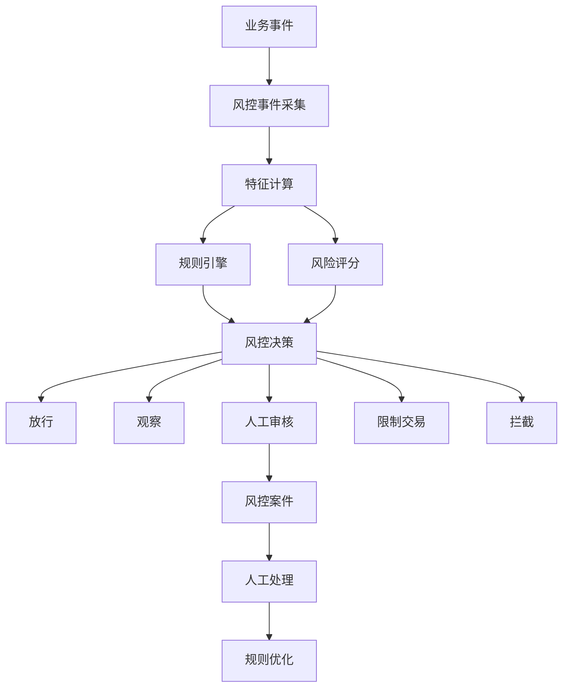
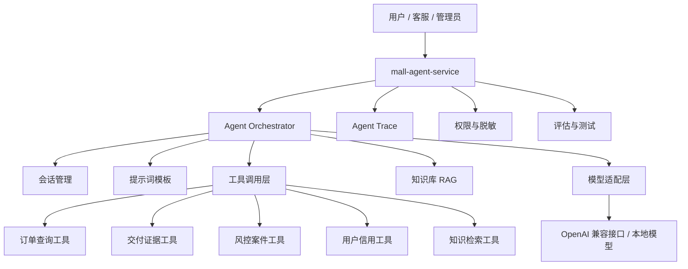

# 虚拟资产交易商城三阶段演进规划

> 项目定位：面向实习作品集的虚拟资产 C2C 担保交易平台。项目不接真实短信、真实 KYC、真实微信支付、真实支付宝和真实银行卡提现；外部能力全部使用 Mock 或本地可运行方案，但业务状态机、账务流水、幂等控制、审计日志和权限边界必须按真实平台标准实现。

---

## 1. 项目定位与边界

### 1.1 对外表述

建议将项目定义为：

> 一个面向虚拟饰品、卡密和游戏道具的 C2C 担保交易平台，支持资金托管、交付证据、售后仲裁、商家信用、风控规则引擎和 AI 辅助运营。

这个定位比“虚拟资产商城”更清晰，也更容易向面试官解释业务价值。

### 1.2 品类边界

| 品类 | 阶段 | 原因 |
|---|---|---|
| 虚拟饰品 | 阶段一 | 与当前项目定位一致，商品模型简单 |
| 卡密 / 激活码 | 阶段一 | 适合展示库存锁定、自动交付、脱敏和证据链 |
| 游戏道具 | 阶段一 | 适合展示半标准化交付和售后 |
| 游戏账号 | 阶段二 | 高风险品类，适合展示保证金和风控，不应进入 MVP |
| 服务类交易 | 阶段二 | 适合展示里程碑验收，但不是第一优先级 |
| 虚拟货币 / NFT / 代充值 | 不做 | 合规风险高，且会分散项目主线 |

### 1.3 Mock 原则

| 真实能力 | 学习项目替代方案 |
|---|---|
| 短信验证码 | 邮箱验证码或本地测试验证码 |
| 微信 / 支付宝 | Mock 支付网关、支付页、回调、退款 |
| KYC | 资料提交 + 后台人工审核状态 |
| 银行卡提现 | 提现申请 + 审核 + 模拟打款流水 |
| 资金托管 | 平台内部账户 + 冻结 / 待结算 / 可用余额 |
| 风控模型 | 规则引擎 + 风险评分 + 模拟黑产数据 |
| 智能客服 | Spring AI / LangChain4j + RAG + Tool Calling |

核心原则：外部服务可以假，状态机、幂等、一致性、审计和权限必须真。

---

## 2. 当前仓库能力评估

### 2.1 可以复用的能力

当前 `mall-parent` 已经具备：

- Spring Boot 3 多模块工程。
- Nacos、Dubbo、Seata TCC、RocketMQ、XXL-Job、Redis。
- 用户认证、邮箱验证码、JWT、UserId 上下文。
- 商品展示、秒杀场次、库存扣减。
- 订单创建、TCC 下单、MQ 削峰。
- 审计日志、对账差异表。
- 用户积分账户和动账流水。

这些能力应保留为技术底座。项目演进不是推翻重写，而是把业务主线从“秒杀商城”重构为“担保交易平台”。

### 2.2 核心缺口

| 缺口 | 影响 |
|---|---|
| 商品模型偏普通商品 | 无法表达资产类型、交付方式、风险声明和审核状态 |
| 订单模型过简 | 无法拆分支付、交付、托管、售后、风控状态 |
| 没有担保交易 | 无法解决买卖双方信任问题 |
| 没有资金账本 | 无法回答资金在哪里、能提现多少 |
| 没有交付证据链 | 售后仲裁缺乏依据 |
| 没有售后仲裁 | 虚拟交易的核心风险无法闭环 |
| 没有商家体系 | 卖家履约成本和信用无法沉淀 |
| 没有风控体系 | 无法展示平台级风险处理能力 |
| 没有 Agent 层 | 无法体现后端与 Agent 开发结合 |

---

## 3. 三阶段总览

| 阶段 | 建议周期 | 核心目标 | 关键交付 | 明确不做 |
|---|---:|---|---|---|
| 阶段一 | 4 周 | 跑通业务闭环 | 商品、订单、Mock 支付、托管、交付、结算、提现、售后、仲裁 | 真实支付、复杂风控、Agent |
| 阶段二 | 3 周 | 让业务敢跑 | 规则引擎、风险指标、关系图谱、风控案件、人工审核 | 大规模图计算、复杂机器学习 |
| 阶段三 | 3 周 | 提升运营效率 | 智能客服、仲裁助手、风控调查 Agent、RAG、Tool Calling | Agent 直接动钱、全自动处罚 |

推荐推进顺序：

```text
业务闭环 -> 风控体系 -> Agent 能力
```

不要倒过来。Agent 只有建立在完整业务数据和清晰权限边界之上，才有工程价值。

---

# 阶段一：业务闭环

## 1. 阶段目标

阶段一要跑通完整可信交易链路：

```text
商家认证
  -> 缴纳保证金
  -> 发布虚拟资产
  -> 商品审核
  -> 买家下单
  -> Mock 支付
  -> 资金冻结
  -> 卖家交付
  -> 买家确认
  -> 手续费结算
  -> 冷却期入账
  -> 卖家提现
  -> 评价信用
  -> 售后仲裁
```

阶段一完成后，系统必须能回答：

1. 这笔钱现在在哪里？
2. 谁在什么时候交付了什么？
3. 买家是否确认收到？
4. 平台扣了多少手续费？
5. 卖家能提现多少？
6. 发生纠纷后如何退款或放款？
7. 每一步是否有日志和证据？

---

## 2. 功能范围

### 2.1 用户与商家

- 注册、登录、JWT 鉴权。
- 角色区分：买家、卖家、管理员。
- 商家申请与审核。
- 商家状态：待审核、已通过、已拒绝、已冻结。
- 保证金缴纳、冻结、扣除、退还。
- 商家基础信用展示。

### 2.2 商品与库存

- 类目管理。
- 商品发布与审核。
- 商品属性：
  - 资产类型。
  - 交付方式。
  - 价格。
  - 库存。
  - 来源说明。
  - 风险声明。
  - 图片。
- 卡密库存：
  - 批量录入。
  - 下单锁定。
  - 支付后可见。
  - 后台审核时脱敏。

### 2.3 交易与资金

- 创建订单。
- 取消订单。
- Mock 支付。
- 支付回调。
- 支付超时关单。
- 资金冻结。
- 卖家交付。
- 买家确认。
- 自动确认。
- 发货超时退款。
- 手续费计算。
- 冷却期结算。
- 卖家提现。
- 提现审核。
- 模拟打款。

### 2.4 售后与管理后台

- 买家发起售后。
- 卖家响应。
- 双方提交证据。
- 管理员仲裁。
- 全额退款、全额放款、部分退款。
- 一次申诉。
- 后台管理用户、商家、商品、订单、资金、提现、售后和审计日志。

### 2.5 阶段一不做

- 真实微信 / 支付宝。
- 真实银行卡提现。
- 复杂风控模型。
- 拍卖系统。
- 复杂 IM。
- 推荐算法。
- NFT / 区块链。
- 多语言 / 多币种。
- Kubernetes。
- 智能客服。

---

## 3. 核心状态机

不要把所有状态塞进一个字段。订单至少拆成六个状态维度。

| 状态 | 枚举 |
|---|---|
| `order_status` | `CREATED, PAY_PENDING, PAID, DELIVERING, DELIVERED, CONFIRMED, SETTLING, SETTLED, COMPLETED, CLOSED` |
| `pay_status` | `INIT, PAYING, SUCCESS, FAIL, TIMEOUT, REFUNDING, REFUNDED` |
| `delivery_status` | `WAIT_DELIVERY, DELIVERED, VIEWED, CONFIRMED, FAILED` |
| `escrow_status` | `NONE, FROZEN, WAIT_SETTLE, SETTLED, REFUNDING, REFUNDED` |
| `dispute_status` | `NONE, OPEN, NEGOTIATING, ARBITRATING, RESOLVED, APPEALED` |
| `risk_status` | `NORMAL, WATCH, RESTRICTED, MANUAL_REVIEW, BLOCKED` |

状态拆分的意义：

- 支付成功不代表可以放款。
- 卖家发货不代表买家确认。
- 买家确认不代表资金立即可提现。
- 售后会阻断正常结算。
- 风控会改变放款节奏。

---

## 4. 服务与模块设计

建议模块结构：

```text
mall-parent
├── mall-api
├── mall-user-service       # 用户、商家、账户、保证金、信用、提现
├── mall-item-service       # 类目、商品、卡密库存、商品审核
├── mall-order-service      # 订单、交易编排、交付、售后、仲裁
├── mall-admin-service      # 后台运营、审核、仲裁、提现审核
├── mall-payment-service    # Mock 支付、支付单、回调、退款、对账
├── mall-risk-service       # 阶段二新增
└── mall-agent-service      # 阶段三新增
```

时间紧张时，阶段一可以先把 Mock 支付放在 `mall-order-service`，但账务能力必须有清晰领域边界，避免订单服务随意改余额。

服务职责：

| 服务 | 职责 |
|---|---|
| `mall-user-service` | 用户、商家、账户、保证金、信用、提现 |
| `mall-item-service` | 类目、商品、库存、审核、搜索 |
| `mall-order-service` | 订单状态机、交易编排、交付、售后、仲裁 |
| `mall-payment-service` | 支付单、回调、退款、对账 |
| `mall-admin-service` | 审核和后台运营 |

---

## 5. 数据模型

### 5.1 商家域

| 表 | 说明 |
|---|---|
| `t_merchant` | 商家主体、认证状态、等级 |
| `t_merchant_audit` | 商家审核记录 |
| `t_merchant_deposit` | 保证金账户 |
| `t_merchant_credit` | 商家信用、履约率、纠纷率 |

关键字段：

```text
t_merchant
- id
- user_id
- merchant_name
- auth_status: SUBMITTED / APPROVED / REJECTED / FROZEN
- level
- status: ACTIVE / FROZEN / CLOSED

t_merchant_deposit
- id
- merchant_id
- total_amount
- frozen_amount
- deducted_amount
- status
```

### 5.2 商品域

| 表 | 说明 |
|---|---|
| `t_item` | 虚拟资产商品主表 |
| `t_item_category` | 类目 |
| `t_item_attribute` | 商品属性 |
| `t_card_secret` | 卡密库存 |
| `t_item_audit` | 商品审核记录 |

建议扩展现有 `t_item`：

```text
- asset_type: VIRTUAL_SKIN / CARD / GAME_ITEM / ACCOUNT / SERVICE
- delivery_mode: AUTO_CARD / MANUAL_DELIVERY / ACCOUNT_TRANSFER
- merchant_id
- source_description
- risk_notice
- audit_status: DRAFT / PENDING / APPROVED / REJECTED
- stock
- frozen_stock
```

卡密表：

```text
t_card_secret
- id
- item_id
- secret_value
- secret_hash
- status: AVAILABLE / LOCKED / SOLD / INVALID
- order_no
- lock_time
- sold_time
```

卡密权限要求：

1. 支付前不可见明文。
2. 后台审核只展示哈希或脱敏值。
3. 支付成功后买家才可查看明文。
4. 查看明文必须写日志。
5. 卡密和订单必须唯一绑定。

### 5.3 订单域

| 表 | 说明 |
|---|---|
| `t_trade_order` | 交易订单主表 |
| `t_order_status_log` | 状态流转日志 |
| `t_delivery_record` | 交付记录 |
| `t_delivery_evidence` | 交付证据 |
| `t_dispute` | 售后争议 |
| `t_dispute_message` | 争议沟通 |
| `t_arbitration` | 仲裁结果 |

订单关键字段：

```text
t_trade_order
- order_no
- buyer_id
- seller_id
- item_id
- item_snapshot_json
- order_amount
- fee_amount
- seller_income
- order_status
- pay_status
- delivery_status
- escrow_status
- dispute_status
- risk_status
- auto_confirm_time
- settle_time
```

`item_snapshot_json` 必须保存交易发生时的商品快照，避免商品后续修改影响历史订单判断。

### 5.4 支付与账务域

| 表 | 说明 |
|---|---|
| `t_payment_order` | Mock 支付单 |
| `t_payment_callback` | 支付回调记录 |
| `t_account` | 用户内部账户 |
| `t_account_transaction` | 资金流水 |
| `t_escrow_record` | 托管记录 |
| `t_fee_config` | 手续费配置 |
| `t_withdraw_request` | 提现申请 |
| `t_withdraw_transaction` | 模拟提现流水 |

账户模型：

```text
t_account
- user_id
- available_amount
- frozen_amount
- pending_settle_amount
- deposit_amount
- version
```

资金流水模型：

```text
t_account_transaction
- transaction_no
- user_id
- order_no
- account_type: AVAILABLE / FROZEN / PENDING_SETTLE / DEPOSIT / PLATFORM
- amount
- balance_after
- direction: IN / OUT
- business_type: PAY / REFUND / SETTLE / FEE / DEPOSIT / WITHDRAW / COMPENSATE
- remark
```

账务原则：

1. 每笔资金变动都有流水。
2. 每笔流水都有唯一业务号。
3. 余额和流水可对账。
4. 不允许凭空更新余额。
5. 退款、结算、手续费、保证金扣减必须可追溯。

---

## 6. Mock 支付网关

流程：

```text
创建订单
  -> 创建支付单
  -> 跳转 Mock 支付页
  -> 选择模拟微信 / 模拟支付宝
  -> 触发成功 / 失败 / 超时
  -> 后端接收回调
  -> 幂等更新支付状态
  -> 更新订单支付状态
  -> 冻结资金
  -> 通知卖家发货
```

Mock 支付必须具备：

- 支付单号唯一。
- 回调编号唯一。
- 回调处理幂等。
- 支付成功只能触发一次资金冻结。
- 支付超时后不能再支付成功。
- 回调金额必须等于订单金额。
- 回调日志完整保存。

Mock 支付页建议支持：

- 展示订单号、商品名、金额、买家。
- 选择支付渠道。
- 手动触发成功、失败、超时。
- 模拟回调延迟。
- 展示回调结果。

---

## 7. 售后仲裁

售后类型：

| 类型 | 说明 |
|---|---|
| 未发货 | 卖家超时未交付 |
| 卡密无效 | 买家称卡密无法使用 |
| 货不对板 | 商品与描述不一致 |
| 交付超时 | 卖家延迟交付 |
| 恶意退款 | 买家已获取资产但申请退款 |
| 账号找回 | 阶段二高风险品类争议 |

流程：

```text
买家发起售后
  -> 资金保持冻结
  -> 双方提交证据
  -> 限时协商
  -> 协商失败进入仲裁
  -> 管理员查看订单、支付、交付、日志
  -> 出具仲裁结果
  -> 执行退款 / 放款 / 部分退款
  -> 允许一次申诉
```

仲裁结果：

- 全额放款给卖家。
- 全额退款给买家。
- 部分退款。
- 扣除商家保证金赔付。
- 双方免责关闭。
- 升级人工处理。

阶段一允许人工仲裁，但结果必须结构化落库，为阶段三 Agent 辅助仲裁打基础。

---

## 8. 阶段一验收标准

### 8.1 功能验收

- 买家可以注册、登录、浏览、下单、支付、查看交付、确认、评价。
- 卖家可以申请商家、缴纳保证金、发布商品、发货、查看收入、提现。
- 管理员可以审核商家、商品、提现、售后。
- 支付成功后资金进入冻结状态。
- 买家确认后扣除手续费并进入待结算。
- 冷却期后资金进入可用余额。
- 提现审核通过后生成模拟打款流水。
- 售后仲裁后能正确退款或放款。

### 8.2 技术验收

- 下单、支付回调、确认、结算、提现均幂等。
- 账户余额与资金流水一致。
- 关键操作有审计日志。
- 订单状态流转完整。
- 支付前不能看到卡密明文。
- 核心状态机有自动化测试。

### 8.3 5 分钟演示脚本

1. 商家发布虚拟饰品。
2. 管理员审核商品。
3. 买家下单并进入 Mock 支付。
4. 展示资金冻结。
5. 卖家交付卡密。
6. 买家确认收货。
7. 展示手续费、待结算、可用余额。
8. 卖家提现并展示审核。
9. 发起一次售后仲裁。
10. 展示完整审计日志。

---

# 阶段二：风控与反黑产

## 1. 阶段目标

阶段二的目标是把“业务能跑”升级为“业务敢跑”。

重点解决：

1. 刷单识别。
2. 恶意退款识别。
3. 异常价格识别。
4. 关联账号识别。
5. 异常提现识别。
6. 高风险商品拦截。
7. 敏感信息和私下交易识别。

阶段二优先做规则引擎和关系图谱，不做复杂机器学习。规则可解释、可配置、可测试，更适合实习项目展示。

---

## 2. 风控架构



风控动作：

| 动作 | 说明 |
|---|---|
| `PASS` | 正常放行 |
| `WATCH` | 记录观察，不阻断 |
| `VERIFY` | 要求补充资料或二次确认 |
| `LIMIT` | 限制金额、频率、库存或提现 |
| `MANUAL_REVIEW` | 进入人工审核 |
| `REJECT` | 拒绝交易 |
| `FREEZE` | 冻结订单、商家或提现 |

---

## 3. 风险规则

### 3.1 注册与登录

| 规则 | 触发条件 | 动作 |
|---|---|---|
| 批量注册 | 同 IP / 设备短时间注册多账号 | 标记关联，限制交易 |
| 异地登录 | 短时间跨地区登录 | 观察或要求验证 |
| 暴力登录 | 登录失败次数过高 | 临时锁定 |

### 3.2 商品

| 规则 | 触发条件 | 动作 |
|---|---|---|
| 低价异常 | 低于同类均价 30% | 人工审核 |
| 高价异常 | 新商家发布高价商品 | 人工审核 |
| 敏感品类 | 命中禁售词或高风险词 | 拦截或审核 |
| 重复商品 | 标题、图片、描述高度重复 | 审核或拒绝 |
| 新商家首发 | 新商家第一批商品 | 人工审核 |

### 3.3 交易

| 规则 | 触发条件 | 动作 |
|---|---|---|
| 高额新买家 | 新买家首次高额购买 | 延迟结算或人工审核 |
| 高频下单 | 单用户短时间大量下单 | 限流或拦截 |
| 自买自卖 | 买卖双方账号 / 设备 / IP 关联 | 冻结订单并生成案件 |
| 秒发货秒确认 | 无正常浏览和交付时间 | 标记刷单 |
| 频繁互买 | 固定买卖双方反复交易 | 降低信用并观察 |
| 退款率异常 | 商家退款率超过阈值 | 限制挂售 |
| 纠纷率异常 | 商家仲裁败诉率过高 | 冻结保证金或店铺 |

### 3.4 提现

| 规则 | 触发条件 | 动作 |
|---|---|---|
| 新商家大额提现 | 认证后短时间提现超阈值 | 人工审核 |
| 快进快出 | 资金入账后立即提现 | 延迟打款 |
| 多商家同收款账户 | 多个商家绑定同一提现账户 | 关联标记 |
| 高退款后提现 | 近期退款率高但申请提现 | 冻结审核 |

### 3.5 内容

| 规则 | 触发条件 | 动作 |
|---|---|---|
| 站外联系方式 | 微信、QQ、手机号、Telegram 等 | 拦截或提示 |
| 私下交易引导 | “私下交易”“绕过平台”等 | 告警 |
| 违禁资产 | 虚拟货币、代充、账号等禁售词 | 拦截 |

---

## 4. 关系图谱

阶段二不需要引入图数据库，可以先用关系表模拟图谱。

关系类型：

| 关系 | 说明 |
|---|---|
| `SAME_IP` | 相同 IP |
| `SAME_DEVICE` | 相同设备指纹 |
| `SAME_WITHDRAW_ACCOUNT` | 相同提现账户 |
| `TRADE` | 交易对手 |
| `REFUND` | 退款关系 |

表设计：

```text
t_user_device
- user_id
- device_id
- first_seen_time
- last_seen_time
- hit_count

t_user_ip
- user_id
- ip
- first_seen_time
- last_seen_time
- hit_count

t_relation_edge
- source_user_id
- target_user_id
- relation_type
- weight
- evidence_json
- created_time
```

后台能力：

1. 查询用户一度关联账号。
2. 查询二度关联路径。
3. 查询交易对手。
4. 查询同设备账号。
5. 查询同提现账户商家。
6. 手动标记风险团伙。

---

## 5. 风控数据模型

| 表 | 说明 |
|---|---|
| `t_risk_rule` | 规则配置 |
| `t_risk_event` | 风控事件 |
| `t_risk_indicator` | 用户 / 商家 / 订单风险指标 |
| `t_risk_decision` | 风控决策 |
| `t_risk_case` | 风控案件 |
| `t_risk_case_note` | 人工处理记录 |

关键字段：

```text
t_risk_rule
- rule_code
- rule_name
- scene: REGISTER / LISTING / ORDER / DELIVERY / WITHDRAW / CONTENT
- expression_json
- action
- threshold
- enabled
- priority

t_risk_case
- case_no
- scene
- user_id
- merchant_id
- order_no
- risk_level
- status: OPEN / PROCESSING / RESOLVED / CLOSED
- conclusion
```

风控必须与业务联动：

| 业务节点 | 可触发动作 |
|---|---|
| 商品发布 | 通过、拒绝、人工审核 |
| 下单 | 放行、拦截、限制金额 |
| 支付成功 | 延迟结算、冻结、人工审核 |
| 交付 | 允许交付、禁止交付、要求补充凭证 |
| 确认收货 | 正常放款、延迟放款 |
| 提现 | 放行、延迟、人工审核、冻结 |
| 售后 | 正常仲裁、升级人工 |

---

## 6. 模拟黑产数据

准备以下可复现场景：

1. 同 IP 批量注册 10 个账号。
2. 同设备注册买卖双方并自买自卖。
3. 新商家发布低价卡密。
4. 高额订单后立即提现。
5. 多个商家绑定同一提现账户。
6. 商家退款率异常。
7. 买家连续申请恶意退款。
8. 商品描述包含站外联系方式。

每个场景必须展示：

- 命中规则。
- 命中证据。
- 风险等级。
- 处理动作。
- 后台案件。

---

## 7. 阶段二验收标准

### 7.1 功能验收

- 商品发布、下单、支付、提现接入风控。
- 后台可以查看风控事件和决策。
- 后台可以查看用户关联关系。
- 高风险订单进入人工审核。
- 异常提现被延迟或冻结。
- 自买自卖被识别。
- 敏感词被拦截或提示。
- 风控案件可人工处理并关闭。

### 7.2 技术验收

- 规则可配置。
- 决策有记录。
- 风控动作与订单状态联动。
- 风控失败不阻断正常主链路。
- 有规则命中测试。
- 有误伤率统计。

### 7.3 演示脚本

1. 批量注册同 IP 账号。
2. 展示关联账号图谱。
3. 创建自买自卖订单。
4. 展示风控命中。
5. 展示订单进入人工审核。
6. 展示异常提现被冻结。
7. 管理员处理案件。
8. 展示风控决策日志。

---

# 阶段三：Agent 能力

## 1. 阶段目标

阶段三的目标是把 Agent 从“聊天玩具”升级为“业务系统能力”。

重点展示：

1. Agent 如何读取业务数据。
2. Agent 如何调用受限工具。
3. Agent 如何基于知识库回答。
4. Agent 如何生成可解释建议。
5. Agent 如何避免越权。
6. Agent 如何被观测和评估。

安全底线：Agent 不直接拥有资金操作权限。退款、放款、提现、处罚必须人工确认。

---

## 2. Agent 能力地图

| Agent | 使用者 | 核心能力 | 优先级 |
|---|---|---|---:|
| 仲裁助手 | 客服 / 管理员 | 证据汇总、责任分析、仲裁建议 | P0 |
| 风控调查助手 | 风控人员 | 关联分析、异常总结、案件报告 | P0 |
| 智能客服 | 买家 / 卖家 | 订单查询、规则解释、转人工 | P1 |
| 商品发布助手 | 卖家 | 标题、描述、风险声明生成 | P1 |
| 经营分析助手 | 商家 | 销售、退款、转化分析 | P2 |
| 平台运营助手 | 管理员 | 指标汇总、日报 | P2 |

推荐实现顺序：

1. 仲裁助手。
2. 风控调查助手。
3. 智能客服。
4. 商品发布助手。

仲裁助手最贴合交易业务；风控助手能和阶段二打通；智能客服用户价值明显但技术区分度稍低，可以后置。

---

## 3. Agent 架构



技术选型：

| 能力 | 建议方案 |
|---|---|
| Agent 框架 | Spring AI 或 LangChain4j |
| 模型接口 | OpenAI 兼容 API 或 Ollama |
| RAG | 文档切片 + Embedding + 向量检索 |
| 向量存储 | SimpleVectorStore / Redis，后续可换 Milvus |
| 工具调用 | Spring AI Tool Calling 或 LangChain4j Tools |
| 观测 | 自建 Agent Trace 表 + 日志 |
| 评估 | 固定测试集 + 人工评分 |

建议做统一模型适配层，避免代码强绑定某一家模型服务商。

---

## 4. 知识库 RAG

知识来源：

| 类型 | 内容 |
|---|---|
| 平台规则 | 交易流程、手续费、结算、提现 |
| 商品规则 | 类目准入、禁售清单、发布规范 |
| 交付规则 | 卡密交付、截图凭证、账号过户 |
| 售后规则 | 售后类型、证据要求、时效 |
| 风控规则 | 风险等级、处理动作、申诉 |
| 常见问题 | 登录、支付、退款、发货、提现 |

表设计：

```text
t_knowledge_document
- id
- doc_type: RULE / FAQ / POLICY / CASE
- title
- content
- status
- version

t_knowledge_chunk
- id
- document_id
- chunk_content
- embedding
- keywords
- token_count
```

检索策略：

1. 关键词检索。
2. 向量检索。
3. 业务上下文过滤。
4. TopK 重排。
5. 返回引用来源。

Agent 回答必须附带知识来源，降低幻觉风险。

---

## 5. 工具与权限

工具能力：

```text
queryOrder(orderNo)
queryDeliveryEvidence(orderNo)
queryDispute(disputeNo)
queryUserRisk(userId)
queryMerchantCredit(merchantId)
queryRiskCase(caseNo)
searchKnowledge(query)
queryTransactionHistory(orderNo)
```

权限矩阵：

| 工具 | 买家 | 卖家 | 客服 | 管理员 |
|---|---:|---:|---:|---:|
| 查询自己的订单 | 是 | 是 | 是 | 是 |
| 查询他人订单 | 否 | 否 | 是 | 是 |
| 查询交付证据 | 是 | 是 | 是 | 是 |
| 查询风控案件 | 否 | 否 | 是 | 是 |
| 查询信用记录 | 部分 | 部分 | 是 | 是 |
| 查询知识库 | 是 | 是 | 是 | 是 |
| 执行退款 | 否 | 否 | 否 | 人工确认 |
| 执行提现 | 否 | 否 | 否 | 人工确认 |
| 处罚账号 | 否 | 否 | 否 | 人工确认 |

工具必须做到：

- 校验当前用户权限。
- 限制返回字段。
- 记录调用日志。
- 限制调用频率。
- 不返回密码、完整身份证号、多余卡密等敏感信息。

---

## 6. 核心 Agent 场景

### 6.1 智能客服

输入示例：

```text
我的订单为什么还没放款？
```

Agent 执行：

1. 查询订单。
2. 判断 `escrow_status`。
3. 判断是否处于冷却期。
4. 判断是否存在售后。
5. 检索结算规则。
6. 返回原因和预计时间。

输出示例：

```text
订单 ORD20260928001 已确认收货，资金处于待结算状态。
根据平台规则，虚拟饰品交易确认后需要 24 小时冷却期。
预计 2026-09-29 14:30 后进入可用余额。
如果你没有发起售后，系统会自动结算。
```

### 6.2 仲裁助手

输入：

```text
请分析争议 DS20260928001。
```

输出结构：

```json
{
  "disputeNo": "DS20260928001",
  "summary": "买家称卡密无效，卖家已上传发货截图和卡密交付记录。",
  "evidence": [
    "订单支付成功",
    "卖家交付卡密",
    "买家已查看明文",
    "买家未在 10 分钟内提交错误提示截图"
  ],
  "rules": [
    "卡密交易确认后平台不承担二次转卖风险",
    "买家主张无效需提供错误提示截图"
  ],
  "suggestion": "建议倾向卖家放款，但需人工确认买家补充证据。",
  "risk": "买家存在连续退款记录。",
  "confidence": 0.72,
  "humanApprovalRequired": true
}
```

### 6.3 风控调查助手

输出示例：

```text
风险结论：疑似自买自卖团伙

证据：
1. 用户 A 和用户 B 使用同一设备 fingerprint-001。
2. 双方近 3 天完成 12 笔交易。
3. 交易平均确认时间 8 秒。
4. 资金入账后 5 分钟内申请提现。
5. 两个商家提现账户相同。

建议：
1. 冻结相关订单。
2. 暂停商家提现。
3. 转人工审核。
4. 保留完整证据链。
```

### 6.4 商品发布助手

能力：

1. 根据关键词生成标题。
2. 生成商品描述。
3. 生成风险声明。
4. 检查禁售词。
5. 建议类目和属性。

限制：只生成草稿，卖家确认后再提交审核，不能直接上架。

---

## 7. Agent 安全

必须遵守：

1. 权限隔离：普通用户只能查自己的数据。
2. 只读优先：默认只读，写操作只生成草稿或建议。
3. 人工确认：资金和处罚动作必须人工确认。
4. 敏感信息脱敏：不向模型发送密码、完整卡密、身份证号。
5. 可追溯：记录模型调用、工具调用、提示词版本和结果。
6. 可降级：模型不可用时业务系统仍可正常运行。

Guardrails：

| 风险 | 控制手段 |
|---|---|
| 幻觉 | RAG 引用来源 + 固定规则模板 |
| 越权 | 工具层强制 userId / role 校验 |
| 泄露敏感数据 | 字段脱敏和白名单 |
| 诱导越狱 | 系统提示词 + 输入过滤 |
| 错误操作 | 高危动作只生成建议 |
| 无限调用 | 工具次数和频率限制 |
| 成本失控 | Token 限额和模型分级 |

---

## 8. Agent 数据模型

| 表 | 说明 |
|---|---|
| `t_agent_session` | Agent 会话 |
| `t_agent_message` | 用户 / Agent 消息 |
| `t_agent_tool_call` | 工具调用记录 |
| `t_agent_trace` | 全链路调用记录 |
| `t_agent_draft` | Agent 生成草稿 |
| `t_agent_eval_case` | 评估用例 |
| `t_agent_eval_result` | 评估结果 |

关键字段：

```text
t_agent_session
- session_no
- user_id
- role
- agent_type: CUSTOMER_SERVICE / ARBITRATION / RISK_INVESTIGATION
- status
- context_json

t_agent_tool_call
- id
- session_no
- tool_name
- input_json
- output_json
- cost_ms
- success
- error_message

t_agent_trace
- trace_id
- session_no
- prompt_version
- model_name
- input_tokens
- output_tokens
- cost_ms
- finish_reason
```

---

## 9. Agent 评估

指标：

| 指标 | 说明 |
|---|---|
| 回答准确率 | 是否正确解释订单状态和规则 |
| 工具调用成功率 | 工具是否调用成功 |
| 工具选择准确率 | 是否调用正确工具 |
| 幻觉率 | 是否编造订单、规则或状态 |
| 越权拦截率 | 是否阻止越权请求 |
| 平均响应时间 | 端到端耗时 |
| 人工接管率 | 多少会话转人工 |
| 用户满意度 | 会话评分 |

准备至少 30 个固定测试问题：

- 10 个订单状态问题。
- 10 个平台规则问题。
- 5 个售后流程问题。
- 3 个权限边界问题。
- 2 个异常输入问题。

每个用例包含：

- 用户身份。
- 输入问题。
- 期望调用的工具。
- 期望回答要点。
- 不允许出现的内容。

---

## 10. 阶段三验收标准

### 10.1 功能验收

- 智能客服能查询当前用户自己的订单。
- 智能客服能解释交易规则并引用来源。
- 仲裁助手能汇总证据并输出结构化建议。
- 风控助手能生成关联风险报告。
- Agent 无法查询无权限数据。
- Agent 不能直接退款、放款、提现、处罚。
- 管理员可以查看调用链路。
- 模型失败时系统可降级。

### 10.2 技术验收

- 工具调用有日志。
- 提示词有版本管理。
- 会话有上下文控制。
- 回答记录来源。
- 有固定评估集。
- 有 Token 和调用次数限制。
- 有权限校验测试。

### 10.3 演示脚本

1. 买家询问订单为什么未放款。
2. Agent 查询订单并解释结算规则。
3. 客服打开仲裁助手。
4. Agent 汇总买卖双方证据。
5. Agent 给出建议但要求人工确认。
6. 风控人员打开案件。
7. Agent 输出关联账号和异常交易结论。
8. 展示工具调用链路和权限拦截日志。

---

# 三阶段落地优先级清单

| 阶段 | 优先级 | 模块 | 核心功能 | 说明 |
|---|---|---|---|---|
| 阶段一 | P0 | 用户体系 | 注册、登录、JWT、角色 | 复用现有能力 |
| 阶段一 | P0 | 商家体系 | 申请、审核、状态管理 | 先支持个人商家 |
| 阶段一 | P0 | 保证金 | 缴纳、冻结、扣除、退还 | 与商家资格绑定 |
| 阶段一 | P0 | 商品体系 | 类目、属性、发布、审核 | 先做饰品、卡密、道具 |
| 阶段一 | P0 | 卡密库存 | 录入、锁定、脱敏、发货 | 支付前不可见明文 |
| 阶段一 | P0 | 订单系统 | 下单、取消、支付、发货、确认 | 核心中的核心 |
| 阶段一 | P0 | Mock 支付 | 支付单、支付页、回调、退款 | 假支付，真状态机 |
| 阶段一 | P0 | 资金托管 | 冻结、待结算、可用余额 | 必须有账本 |
| 阶段一 | P0 | 手续费 | 品类费率、结算明细 | 商业化基础 |
| 阶段一 | P0 | 交付体系 | 卡密交付、凭证、查看日志 | 证据链基础 |
| 阶段一 | P0 | 售后仲裁 | 争议、证据、仲裁结果 | 交易信任核心 |
| 阶段一 | P0 | 提现系统 | 申请、审核、模拟打款 | 资金闭环 |
| 阶段一 | P0 | 管理后台 | 审核、订单、仲裁、提现、日志 | 必做 |
| 阶段一 | P1 | 评价信用 | 评价、履约率、纠纷率 | 阶段一末完成 |
| 阶段一 | P1 | 站内消息 | 订单通知、系统通知 | 不做复杂 IM |
| 阶段一 | P1 | 搜索筛选 | 类目、关键词、价格排序 | 数据库查询即可 |
| 阶段一 | P2 | 商家店铺 | 店铺主页、商品聚合 | 后置 |
| 阶段一 | P2 | 拍卖 | 起拍、出价、保证金 | 后置 |
| 阶段二 | P0 | 风控规则引擎 | 规则配置、命中、动作 | 优先做 |
| 阶段二 | P0 | 风控事件 | 注册、登录、商品、订单、提现事件 | 全链路采集 |
| 阶段二 | P0 | 风险指标 | 退款率、纠纷率、频率、金额分布 | 支撑规则 |
| 阶段二 | P0 | 关系图谱 | 同 IP、同设备、同提现账户、交易关系 | 一度二度即可 |
| 阶段二 | P0 | 风控案件 | 案件、处理、结论、申诉 | 展示人工协同 |
| 阶段二 | P0 | 提现风控 | 大额、新商家、快进快出 | 重点风险 |
| 阶段二 | P0 | 敏感词 | 商品、聊天、售后识别 | 防切客和违规 |
| 阶段二 | P1 | 风险评分 | 规则加权评分 | 不必上复杂模型 |
| 阶段二 | P1 | 延迟结算 | 高风险订单延长冷却期 | 与托管联动 |
| 阶段二 | P1 | 商家限制 | 限售、冻结、降级 | 与信用联动 |
| 阶段二 | P2 | 图数据库 | Neo4j / JanusGraph | 初期不必要 |
| 阶段二 | P2 | 机器学习模型 | 异常检测模型 | 可作扩展 |
| 阶段三 | P0 | Agent 基础设施 | 会话、消息、工具、Trace | 必做 |
| 阶段三 | P0 | 权限控制 | 用户隔离、角色隔离、脱敏 | 必做 |
| 阶段三 | P0 | 知识库 RAG | 规则、流程、政策、FAQ | 必做 |
| 阶段三 | P0 | 仲裁助手 | 证据汇总、责任分析、建议 | 最贴合业务 |
| 阶段三 | P0 | 风控调查助手 | 关联分析、案件报告 | 与阶段二打通 |
| 阶段三 | P1 | 智能客服 | 订单查询、规则解释、转人工 | 用户价值明显 |
| 阶段三 | P1 | 商品发布助手 | 标题、描述、风险声明 | 只生成草稿 |
| 阶段三 | P1 | Agent 评估 | 固定测试集、指标统计 | 面试加分 |
| 阶段三 | P1 | Agent Trace | 模型调用、工具调用、Token | 可观测性 |
| 阶段三 | P2 | 经营分析助手 | 销售、退款、转化分析 | 可选 |
| 阶段三 | P2 | 平台运营助手 | 日报、风控报告 | 可选 |
| 阶段三 | P2 | 多 Agent 协作 | 客服、仲裁、风控协同 | 不建议过早做 |

---

# 面试叙事

## 1. 一句话介绍

> 我做了一个虚拟资产 C2C 担保交易平台，重点实现担保交易状态机、内部账本、交付证据链、售后仲裁、风控规则引擎和 Agent 辅助运营。

## 2. 技术亮点排序

1. 担保交易状态机：订单、支付、交付、托管、售后、风控状态分离。
2. 内部账本：可用余额、冻结余额、待结算余额、保证金和资金流水。
3. Mock 支付网关：幂等回调、支付超时、失败、退款、对账。
4. 交付证据链：卡密托管、明文权限、查看日志、交付凭证。
5. 售后仲裁：争议工单、证据提交、部分退款、仲裁结论。
6. 风控规则引擎：多场景规则、风险动作、案件处理、关系图谱。
7. Agent 工程：RAG、Tool Calling、权限控制、Trace、评估。

## 3. 主动讲架构取舍

- 不接真实支付，用 Mock 支付网关还原真实支付状态机。
- 不做复杂风控模型，先做可解释的规则引擎和关系图谱。
- Agent 不直接动钱，只做数据读取、证据汇总和建议。
- 不追求微服务数量，服务边界贴合业务域。
- 不做 NFT、虚拟货币和代充值，避免业务边界失控。

---

# 里程碑计划

## 阶段一：4 周

| 周次 | 目标 |
|---|---|
| 第 1 周 | 业务建模、表设计、订单状态机、商家体系 |
| 第 2 周 | 商品发布、卡密库存、Mock 支付、资金冻结 |
| 第 3 周 | 交付、确认、手续费、结算、提现 |
| 第 4 周 | 售后仲裁、管理后台、测试、演示数据 |

## 阶段二：3 周

| 周次 | 目标 |
|---|---|
| 第 1 周 | 风控事件、规则引擎、基础规则 |
| 第 2 周 | 关系图谱、风险指标、提现风控 |
| 第 3 周 | 风控案件、后台可视化、模拟黑产数据 |

## 阶段三：3 周

| 周次 | 目标 |
|---|---|
| 第 1 周 | Agent 服务、会话、工具调用、权限控制 |
| 第 2 周 | 知识库 RAG、智能客服、仲裁助手 |
| 第 3 周 | 风控调查 Agent、Trace、评估、演示脚本 |

---

# 最终建议

这个项目的竞争力不是功能数量，而是完整解决交易平台的信任问题：

> 我把虚拟资产交易平台的信任问题拆成状态机、账本、证据链、风控和 Agent 辅助决策五个工程问题，并用可运行系统逐层解决。

因此必须克制开发顺序：

1. 先保证交易闭环正确。
2. 再保证风险可控。
3. 最后用 Agent 提升效率。

不要一开始就追求 Agent 炫技。Agent 只有建立在完整业务数据和清晰权限边界之上，才会体现真正的工程价值。
